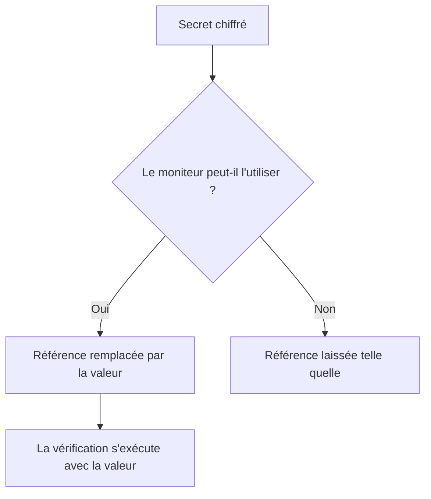

# Secrets de surveillance

Les secrets de moniteur gardent les mots de passe, clés d'API et jetons dont vos moniteurs ont besoin en dehors du moniteur lui-même. Vous enregistrez une valeur une fois, chiffrée, vous choisissez quels moniteurs peuvent l'utiliser, et vous y faites référence avec `{{monitorSecrets.NAME}}` là où le moniteur en a besoin.

:::cards
- [Ajouter un secret](#ajouter-un-secret): Enregistrer une valeur et choisir qui peut l'utiliser.
- [Choisir l'accès](#choisir-quels-moniteurs-peuvent-utiliser-un-secret): Tous les moniteurs, des moniteurs précis, ou les moniteurs qui ont certaines étiquettes.
- [Utiliser un secret](#utiliser-un-secret): Où `{{monitorSecrets.NAME}}` fonctionne.
:::

## Comment les secrets parviennent à un moniteur

Un secret est enregistré chiffré et n'est plus jamais affiché après son enregistrement. Avant de confier un moniteur à une sonde, OneUptime remplace chaque référence que le moniteur peut utiliser par la valeur déchiffrée ; une référence que le moniteur ne peut pas utiliser reste telle qu'elle est écrite.

La sonde qui exécute la vérification reçoit la valeur, donc un moniteur qui utilise un secret doit s'exécuter sur des sondes de confiance : celles de OneUptime, ou une [sonde personnalisée](/docs/probe/custom-probe) que vous exploitez vous-même.

## Avant de commencer

- **Le forfait Growth ou supérieur**, sur OneUptime Cloud. Les installations auto-hébergées n'ont pas de forfaits.
- **Un rôle qui peut gérer les secrets** : Project Owner, Project Admin, ou un rôle personnalisé avec l'autorisation Create Monitor Secret.

## Travailler avec les secrets

### Ajouter un secret

:::steps
1. Allez dans **Moniteurs → Paramètres → Secrets** et cliquez sur **Créer : Secret de moniteur**.
2. Saisissez un **Nom** et la **Valeur du secret**. Le nom est ce à quoi vous faites référence, par exemple `ApiKey`. Il ne peut contenir que des lettres, des chiffres, des traits d'union (`-`) et des traits de soulignement (`_`), et deux secrets d'un même projet ne peuvent pas avoir le même.
3. À l'étape **Accès**, choisissez quels moniteurs peuvent l'utiliser (voir la section suivante), puis cliquez sur **Créer : Secret de moniteur**.
:::

> [!IMPORTANT]
> Les secrets sont chiffrés et stockés de manière sécurisée. La valeur du secret n'est plus jamais affichée après son enregistrement — ni dans le tableau, ni dans le formulaire de modification, ni par l'API. Si vous perdez la valeur, vous devrez la récupérer là d'où elle vient et la définir de nouveau. Pour faire tourner un secret, utilisez le bouton **Mettre à jour la valeur secrète** sur sa ligne ; vous n'avez pas besoin de le supprimer et de le recréer.

### Choisir quels moniteurs peuvent utiliser un secret

Chaque secret a l'une de trois options d'accès :

| Option | Quels moniteurs peuvent utiliser le secret | À utiliser pour |
| --- | --- | --- |
| **Tous les moniteurs** | Chaque moniteur du projet, y compris ceux que vous créez plus tard. | Un identifiant que beaucoup de moniteurs partagent. |
| **Moniteurs spécifiques** | Seulement les moniteurs que vous choisissez. C'est la valeur par défaut, et les secrets créés avant ces options fonctionnent ainsi. | Un identifiant pour un ou quelques moniteurs. |
| **Moniteurs avec des étiquettes** | Les moniteurs qui ont au moins une des étiquettes que vous choisissez. Ajouter l'une de ces étiquettes à un moniteur lui donne l'accès, et retirer l'étiquette le lui retire à la prochaine exécution du moniteur. | Un identifiant pour un groupe de moniteurs qui évolue dans le temps. |

Vous pouvez changer l'option à tout moment avec **Modifier** sur la ligne du secret. Seule la liste de l'option choisie est conservée : passer à **Tous les moniteurs** vide les listes de moniteurs et d'étiquettes du secret, et passer de **Moniteurs spécifiques** à **Moniteurs avec des étiquettes**, ou l'inverse, vide la liste que vous quittez.

Un secret n'est jamais disponible pour les moniteurs d'un autre projet.

> [!WARNING]
> Quiconque peut modifier un moniteur qui peut utiliser un secret peut envoyer ce secret partout où le moniteur se connecte. Avec **Tous les moniteurs**, c'est quiconque peut créer ou modifier des moniteurs dans le projet. Avec **Moniteurs avec des étiquettes**, cela inclut aussi quiconque peut ajouter l'une de ces étiquettes à un moniteur.

Par l'API, l'option d'accès est le champ `monitorAccess` : `All Monitors`, `Specific Monitors` ou `Monitors With Labels`. Les champs `monitors` et `labels` contiennent les listes. Un secret créé sans `monitorAccess` reçoit `Specific Monitors`.

### Utiliser un secret

Pour utiliser un secret, écrivez `{{monitorSecrets.SECRET_NAME}}` dans un champ qui accepte les secrets. Par exemple, un en-tête de requête `Authorization: Bearer {{monitorSecrets.ApiKey}}` envoie la valeur du secret `ApiKey`.

Ces types de moniteurs et ces champs acceptent les secrets :

| Type de moniteur | Champs |
| --- | --- |
| API | L'URL, les en-têtes et le corps de la requête, et le certificat client, la clé privée et la phrase secrète (mTLS) |
| Site web | L'URL, et le certificat client, la clé privée et la phrase secrète (mTLS) |
| Ping, IP, Port, NTP, SSL Certificate | L'hôte ou l'URL à vérifier |
| DNS | Le nom de domaine et le serveur DNS |
| DNSSEC, Domaine | Le nom de domaine |
| SQL Query | L'hôte, le nom de la base de données, le nom d'utilisateur, le mot de passe et la requête |
| Santé de la base de données | L'hôte, le nom de la base de données, le nom d'utilisateur et le mot de passe |
| Page de statut externe | L'URL de la page de statut |
| Synthetic Monitor, Custom JavaScript Code | Le script |
| Équipement réseau | La chaîne de communauté SNMP, et les clés d'authentification et de confidentialité SNMPv3 |

Les secrets sont remplis avant l'exécution du script d'un moniteur Synthetic Monitor ou Custom JavaScript Code, donc une référence comme `{{monitorSecrets.ApiKey}}` dans le script vaut la valeur déchiffrée au moment de l'exécution.

Si un moniteur fait référence à un secret qu'il ne peut pas utiliser, la référence reste telle quelle et n'est pas remplacée par la valeur.

Quand vous testez un moniteur avant de l'enregistrer, seuls les secrets disponibles pour **Tous les moniteurs** sont remplis, car un nouveau moniteur ne figure sur aucune liste et n'a pas encore d'étiquettes. Une fois le moniteur enregistré, les tests utilisent chaque secret que le moniteur peut utiliser.

## Dépannage

:::details `{{monitorSecrets.NAME}}` est envoyé littéralement
Le moniteur ne peut pas utiliser le secret, ou le nom ne correspond pas. Vérifiez l'option d'accès du secret avec **Modifier** sur sa ligne, et que le nom dans la référence est exactement le nom du secret.
:::

:::details Tester un nouveau moniteur ne remplit pas le secret
Avant qu'un moniteur soit enregistré, seuls les secrets disponibles pour **Tous les moniteurs** sont remplis. Enregistrez le moniteur, puis testez-le de nouveau.
:::

:::details Un champ ignore le secret
Seuls les champs du tableau ci-dessus acceptent les secrets. Dans tout autre champ, `{{monitorSecrets.NAME}}` est envoyé tel qu'il est écrit.
:::

## Étapes suivantes

:::cards
- [Surveillance d'API](/docs/monitor/api-monitor): Envoyer un secret dans un en-tête de requête.
- [Surveillance synthétique](/docs/monitor/synthetic-monitor): Utiliser un secret dans un script de navigateur.
- [Surveillance de requêtes SQL](/docs/monitor/sql-monitor): Garder chiffré le mot de passe d'une base de données.
:::
