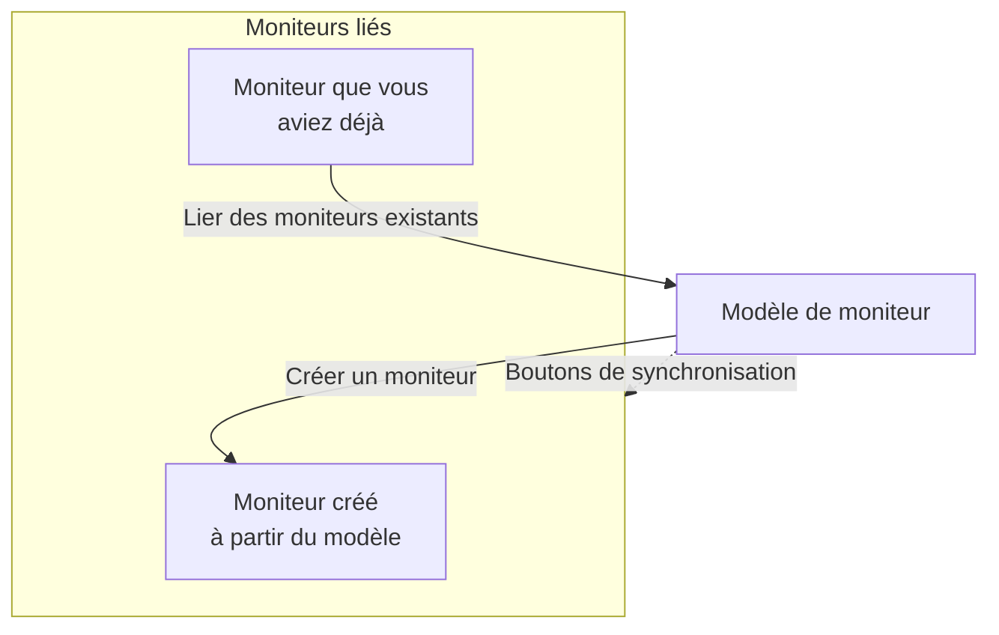

# Modèles de moniteur

Un modèle de moniteur est une configuration de moniteur enregistrée (un type, des critères, un intervalle, des étiquettes et des valeurs par défaut de champs personnalisés) à partir de laquelle vous créez des moniteurs en un clic. Les moniteurs créés à partir de lui, ou liés à lui, restent connectés : modifiez le modèle, puis synchronisez la modification sur tous. Utilisez des modèles quand de nombreux moniteurs doivent se comporter de la même façon, comme la même vérification de santé sur chaque service, ou les mêmes vérifications d'API en production et en préproduction.

:::cards
- [Créer un modèle](#créer-un-modèle): Quatre étapes, comme Créer un moniteur.
- [Créer des moniteurs à partir de lui](#créer-des-moniteurs-à-partir-dun-modèle): Un clic, ou liez des moniteurs que vous avez déjà.
- [Synchroniser les modifications](#synchroniser-les-modifications-vers-les-moniteurs-liés): Ce que copie chaque bouton de synchronisation.
- [Garder des valeurs propres à chaque moniteur](#garder-des-valeurs-propres-à-chaque-moniteur): Protéger une destination ou des en-têtes d'une synchronisation.
:::

## Comment fonctionnent les modèles

Un modèle ne surveille rien lui-même. Des moniteurs sont créés à partir de lui, ou liés à lui, et la page du modèle les liste comme **Moniteurs liés**. Quand vous modifiez le modèle, rien ne change sur ces moniteurs tant que vous ne synchronisez pas : chaque bouton de synchronisation copie une partie du modèle sur chaque moniteur lié, et les champs que vous protégez gardent la valeur propre à chaque moniteur.



## Avant de commencer

- **Un rôle qui peut créer des modèles** : Project Owner, Project Admin, Project Member, Monitor Admin ou Monitor Member, ou un rôle personnalisé avec l'autorisation Create Monitor Template. Modifier un modèle demande les mêmes rôles, ou l'autorisation Edit Monitor Template.
- **L'autorisation de mettre à jour les moniteurs liés.** Une synchronisation écrit dans chaque moniteur lié en votre nom, et ignore les moniteurs que vos autorisations ne couvrent pas.

## Créer un modèle

:::steps
### Ouvrir les modèles

Allez dans **Moniteurs → Paramètres → Modèles** et cliquez sur **Créer : Modèle de moniteur**.

### Nommer le modèle

Dans **Informations du modèle**, saisissez un **Nom du modèle**, comme `Production API Health`, et une **Description du modèle**, puis cliquez sur **Suivant**.

### Définir les valeurs par défaut du moniteur

Dans **Valeurs par défaut du moniteur**, choisissez le **Type de moniteur**, avec le même sélecteur que Créer un moniteur. Saisissez éventuellement un **Nom du moniteur par défaut** ; s'il reste vide, chaque moniteur est nommé d'après la ressource qu'il surveille. **Description du moniteur par défaut** et **Étiquettes** attendent sous **Plus de champs**. Cliquez sur **Suivant**.

### Définir les critères et l'intervalle

Dans **Critères**, renseignez ce qu'il faut vérifier et les critères, comme dans [Créer un moniteur](/docs/monitor/create-monitor#critères). La carte **Template sync settings** en haut vous permet de protéger des champs des synchronisations (voir [Garder des valeurs propres à chaque moniteur](#garder-des-valeurs-propres-à-chaque-moniteur)). Pour un type de moniteur que des sondes vérifient, la dernière étape, **Intervalle**, demande l'**Intervalle de surveillance**. Cliquez sur **Créer : Modèle de moniteur** à la dernière étape.
:::

Le modèle est ajouté à la liste. Ouvrez-le pour voir sa page, avec une carte pour chaque partie : **Informations du modèle**, **Valeurs par défaut du moniteur**, **Critères de surveillance**, **Intervalle de surveillance** (avec **Accord minimum des sondes**), **Étiquettes**, **Valeurs par défaut des champs personnalisés** (quand le projet a des champs personnalisés de moniteur) et **Moniteurs liés**. Vous modifiez chaque partie sur sa propre carte, par exemple avec **Modifier les critères** ou **Modifier l'intervalle**.

## Créer des moniteurs à partir d'un modèle

- **Nouveau moniteur.** Cliquez sur **Créer un moniteur** sur la ligne du modèle dans la liste, ou sur **Créer un moniteur à partir d'un modèle** sur sa page. **Créer un moniteur** s'ouvre avec le type et les réglages du modèle remplis ; changez ce dont vous avez besoin, puis créez-le. Le nouveau moniteur est lié au modèle.
- **Moniteurs que vous avez déjà.** Dans **Moniteurs liés**, cliquez sur **Lier des moniteurs existants** et choisissez-les. Ils gardent leurs réglages jusqu'à ce que vous synchronisiez.

Les valeurs définies sous **Valeurs par défaut des champs personnalisés** sont écrites sur chaque moniteur créé à partir du modèle, y compris les moniteurs que les règles d'import automatique et les politiques d'alerte créent à partir de lui.

## Synchroniser les modifications vers les moniteurs liés

Modifier un modèle ne change que le modèle. Pour copier une modification sur les moniteurs liés, utilisez le bouton de synchronisation de la carte que vous avez modifiée. Chaque bouton indique combien de moniteurs il atteint, comme **Sync Criteria to 3 Linked Monitors**, et il est grisé tant que rien n'est lié. Une synchronisation ne peut pas être annulée.

| Bouton | Copie sur chaque moniteur lié | Laisse intact |
| --- | --- | --- |
| **Synchroniser les critères vers les moniteurs liés** | Les critères et les réglages d'étape, comme les destinations et les options de requête, sauf les champs protégés | L'intervalle de surveillance, l'accord minimum des sondes, le nom, la description, les étiquettes et les valeurs des champs personnalisés |
| **Synchroniser l'intervalle vers les moniteurs liés** | L'intervalle de surveillance et l'accord minimum des sondes | Les critères, le nom, la description, les étiquettes et les valeurs des champs personnalisés |
| **Synchroniser les étiquettes vers les moniteurs liés** | Les étiquettes, et rien d'autre | Tout le reste |
| **Sync Custom Fields to Linked Monitors** | Les champs personnalisés pour lesquels le modèle a une valeur par défaut, à la place de ce que chaque moniteur avait | Les champs personnalisés que le modèle laisse vides, et tout le reste |

Pour synchroniser un seul moniteur, cliquez sur **Synchroniser depuis le modèle** sur sa ligne dans **Moniteurs liés**. Cela copie les critères et les réglages d'étape (sauf les champs protégés), l'intervalle de surveillance, l'accord minimum des sondes et les étiquettes, et laisse intacts le nom, la description et les valeurs des champs personnalisés du moniteur. **Dissocier du modèle** déconnecte un moniteur ; il garde ses réglages.

Après une synchronisation, un résumé indique combien de moniteurs ont été mis à jour. **Synchronisé partiellement** signifie que certains moniteurs liés ont encore la configuration précédente, généralement parce que vos autorisations ne les couvrent pas.

## Garder des valeurs propres à chaque moniteur

Une synchronisation des critères copie aussi les réglages d'étape comme les destinations, les en-têtes de requête et les délais d'expiration, sauf si vous protégez ces champs. Protégez un champ pour que chaque moniteur lié garde sa propre valeur.

:::steps
### Ouvrir le modèle

Allez dans **Moniteurs → Paramètres → Modèles** et ouvrez le modèle.

### Modifier ses critères

Sur la carte **Critères de surveillance**, cliquez sur **Modifier les critères**.

### Protéger les champs

Dans **Template sync settings**, cochez **Ne pas synchroniser ce champ** à côté de chaque champ que vous voulez garder sur les moniteurs liés.

### Enregistrer

Enregistrez vos modifications. La carte **Critères de surveillance**, et la confirmation des deux synchronisations ci-dessous, listent les champs protégés.

### Synchroniser

Utilisez **Synchroniser les critères vers les moniteurs liés**, ou **Synchroniser depuis le modèle** sur un moniteur lié en particulier.
:::

Par exemple, protégez **Monitor destination** et **Request headers** sur un modèle d'API. Les moniteurs de production et de préproduction gardent leurs propres URL et en-têtes, tandis que tous deux reçoivent les critères mis à jour du modèle et ses autres réglages non protégés.

Les options disponibles dépendent du type de moniteur. Elles comprennent les destinations et les ports, les options de requête HTTP, les connexions aux bases de données, les réglages DNS, les sélecteurs d'infrastructure et les requêtes de télémétrie. Les identifiants liés, comme un certificat client et sa clé privée, sont gardés ensemble.

### Comment se comportent les exclusions

- Les champs cochés gardent la valeur actuelle de chaque moniteur existant, y compris une valeur vide ou non définie. Les en-têtes de requête et les autres collections sont préservés en entier.
- Les champs non cochés continuent d'être synchronisés depuis le modèle. Décochez un champ protégé et enregistrez pour copier sa valeur de modèle à la prochaine synchronisation.
- Les exclusions s'appliquent aux synchronisations groupées et individuelles. Elles sont enregistrées sur le modèle, pas choisies séparément pour chaque synchronisation.
- Les nouveaux moniteurs commencent toujours avec les valeurs de champ du modèle. Les exclusions n'affectent que la synchronisation des moniteurs existants.
- Les critères sont toujours synchronisés. Une synchronisation des critères seuls laisse intacts l'intervalle de surveillance, les étiquettes et les autres réglages au niveau du moniteur.
- Les modèles existants n'ont aucune exclusion de champ tant que vous n'en configurez pas. Les moniteurs d'équipement réseau continuent de garder automatiquement leur propre liaison à l'équipement.

Pour les modèles à plusieurs étapes, les valeurs protégées sont associées par les ID d'étape. Des moniteurs à une seule étape créés indépendamment peuvent aussi recevoir un modèle à une seule étape. Si une étape protégée ne peut pas être associée, la synchronisation est refusée avant toute mise à jour de moniteur, pour qu'une étape nouvelle ou réordonnée ne puisse pas copier par accident la destination ou les identifiants d'une autre étape.

> [!IMPORTANT]
> Avant de changer le type de moniteur d'un modèle enregistré (avec **Modifier les valeurs par défaut du moniteur**), retirez dans **Modifier les critères** les exclusions qui ne s'appliquent pas au nouveau type. Toutes les exclusions d'un modèle doivent exister pour son type de moniteur.

## Configuration par l'API

Chaque étape de modèle accepte un tableau `doNotSyncFields` dans son objet `MonitorStep.value`. Pour un moniteur d'API, protégez sa destination et toute sa collection d'en-têtes avec :

```json title="monitorSteps (excerpt)"
{
  "_type": "MonitorSteps",
  "value": {
    "monitorStepsInstanceArray": [
      {
        "_type": "MonitorStep",
        "value": {
          "id": "<step id>",
          "doNotSyncFields": ["monitorDestination", "requestHeaders"]
        }
      }
    ]
  }
}
```

Omettez le tableau ou mettez-le à `[]` pour synchroniser chaque réglage d'étape pris en charge. Les noms de champ non pris en charge et les champs qui ne s'appliquent pas au type de moniteur du modèle sont refusés. Le tableau du modèle commande la synchronisation ; de telles métadonnées sur un moniteur lié ne le remplacent pas.

:::details Noms de champ pour doNotSyncFields, par type de moniteur
| Type de moniteur | Noms de champ |
| --- | --- |
| Site web, API, Ping, IP, Port, SSL Certificate, NTP | `monitorDestination`, `requestTimeoutInMs`, `retryCount` |
| API seulement | `requestHeaders`, `requestType`, `requestBody` |
| Site web et API | `doNotFollowRedirects`, `allowSelfSignedCertificates`, `tlsClientAuthentication` (le certificat client, la clé et la phrase secrète ensemble) |
| Port, NTP | `monitorDestinationPort` |
| Synthetic Monitor, Custom JavaScript Code | `customCode` |
| Synthetic Monitor | `browserTypes`, `screenSizeTypes`, `retryCountOnError` |
| DNS | `dnsMonitor.queryName`, `dnsMonitor.recordType`, `dnsMonitor.resolver` (le serveur DNS et le port ensemble), `dnsMonitor.timeout`, `dnsMonitor.retries` |
| Domaine | `domainMonitor.domainName`, `domainMonitor.lookupMethod`, `domainMonitor.timeout`, `domainMonitor.retries` |
| DNSSEC | `dnssecMonitor.domainName`, `dnssecMonitor.resolvers`, `dnssecMonitor.checkNameserverConsistency`, `dnssecMonitor.signatureExpiryWarningDays`, `dnssecMonitor.timeout`, `dnssecMonitor.retries` |
| SQL Query | `sqlMonitor.connection`, `sqlMonitor.connectionTimeoutInMs`, `sqlMonitor.statementTimeoutInMs`, `sqlMonitor.query`, `sqlMonitor.maxRows` |
| Santé de la base de données | `databaseMonitor.connection`, `databaseMonitor.connectionTimeoutInMs`, `databaseMonitor.statementTimeoutInMs`, `databaseMonitor.enabledMetricGroups` |
| Page de statut externe | `externalStatusPageMonitor.statusPageUrl`, `externalStatusPageMonitor.provider`, `externalStatusPageMonitor.components`, `externalStatusPageMonitor.timeout`, `externalStatusPageMonitor.retries` |
| Journaux, Événements de sécurité, Traces, IA / LLM, Métriques, Exceptions | `logMonitor`, `securityEventsMonitor`, `traceMonitor`, `llmMonitor`, `metricMonitor`, `exceptionMonitor` (toute la configuration du moniteur) |

Les moniteurs d'infrastructure (Kubernetes, Docker Container, Hôte, Podman Container, Proxmox, Docker Swarm, Ceph, Baie de stockage, Appareil IoT) proposent leur sélecteur de ressources, leurs filtres (tous sauf Hôte), leurs requêtes de métriques et leur fenêtre de requête. Leurs noms sont listés dans **Template sync settings** sur un modèle de ce type.
:::

## Dépannage

:::details Une synchronisation indique « Synchronisé partiellement »
Certains moniteurs liés n'ont pas été mis à jour, généralement parce que vos autorisations ne les couvrent pas. Demandez à quelqu'un qui peut mettre à jour chaque moniteur lié de relancer la synchronisation.
:::

:::details Une synchronisation échoue avec « a template step cannot be matched to an existing monitor step »
Un champ protégé n'a pas pu être associé à une étape de l'un des moniteurs, donc la synchronisation s'est arrêtée avant de changer l'un d'eux. Donnez aux étapes du modèle les mêmes ID que les étapes des moniteurs, ou utilisez un modèle à une seule étape avec des moniteurs à une seule étape.
:::

:::details Les boutons de synchronisation sont grisés
Aucun moniteur n'est encore lié au modèle. Créez un moniteur à partir de lui, ou cliquez sur **Lier des moniteurs existants** dans **Moniteurs liés**.
:::

:::details L'enregistrement échoue avec « Unsupported do not sync field »
Un nom dans `doNotSyncFields` n'est pas un champ du type de moniteur du modèle. Comparez-le aux noms de champ ci-dessus.
:::

## Étapes suivantes

:::cards
- [Créer un moniteur](/docs/monitor/create-monitor): Le formulaire qu'un modèle remplit.
- [Surveillance d'API](/docs/monitor/api-monitor): Les réglages qu'un modèle d'API transporte.
- [Secrets de surveillance](/docs/monitor/monitor-secrets): Partager des identifiants entre moniteurs sans les copier.
- [Étapes de moniteur Terraform](/docs/terraform/monitor-steps): Gérer les moniteurs et leurs étapes sous forme de code.
:::
