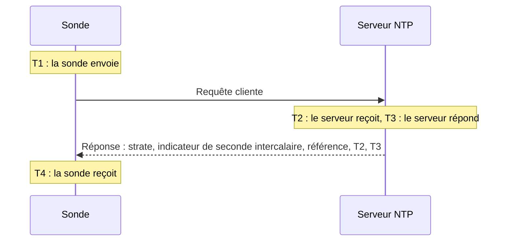

# Surveillance NTP

Un moniteur NTP vérifie qu'un serveur de temps répond sur le port UDP 123 et fournit une heure fiable : qu'il est synchronisé, à une strate raisonnable, et que son horloge concorde avec celle de la sonde. Utilisez-le pour les serveurs de temps que vous exploitez, comme une horloge GPS dans le centre de données ou les serveurs internes sur lesquels votre parc se synchronise, et pour les serveurs publics dont vous dépendez.

:::cards
- [Créer le moniteur](#créer-un-moniteur-ntp) : six étapes dans le tableau de bord.
- [Ce que lit la vérification](#ce-que-lit-la-vérification) : strate, décalage d'horloge, indicateur de seconde intercalaire et le reste de la réponse.
- [Critères de surveillance](#critères-de-surveillance) : joignabilité, synchronisation, strate et décalage.
- [Dépannage](#dépannage) : quand le serveur fonctionne mais que le moniteur dit le contraire.
:::

## Fonctionnement

À chaque vérification, une sonde envoie une requête cliente SNTP (NTP version 4, mode client) depuis un port local aléatoire vers le port UDP du serveur, puis attend la réponse. Seule une vraie réponse à cette requête compte : la sonde place 64 bits aléatoires dans l'horodatage d'émission de la requête et ignore tout paquet qui ne les renvoie pas, qui est plus court qu'un paquet NTP ou qui n'est pas en mode serveur. Une réponse périmée à une vérification précédente, ou une réponse falsifiée, ne peut donc jamais faire paraître vivant un serveur en panne.

À partir des quatre horodatages, la sonde calcule le **décalage d'horloge**, ((T2 − T1) + (T3 − T4)) / 2 : l'écart entre l'horloge du serveur et celle de la sonde. Un décalage positif signifie que le serveur est en avance. La formule suppose que la requête et la réponse mettent autant de temps l'une que l'autre ; un chemin nettement plus lent dans un sens peut donc fausser le décalage jusqu'à la moitié de l'aller-retour.

> [!NOTE]
> Le décalage est mesuré par rapport à l'horloge de la sonde elle-même. Les sondes de OneUptime Cloud gardent leur horloge synchronisée. Sur une [sonde personnalisée](/docs/probe/custom-probe), gardez aussi l'horloge de l'hôte synchronisée, avec chrony ou systemd-timesyncd, sinon une alerte de décalage peut concerner la sonde plutôt que le serveur.

Un serveur qui répond n'est pas interrogé à nouveau, même s'il répond sans fournir une heure fiable. L'absence de réponse, un port refusé et une recherche DNS échouée sont réessayés avec une nouvelle requête. Lorsque le serveur ne répond pas du tout, la sonde trace aussi la route jusqu'à lui et joint le résultat sous **Chemin réseau au moment de l'échec**. Une sonde qui a perdu sa propre connexion réseau ne rapporte aucun résultat ; elle ne peut donc pas marquer votre serveur hors ligne.

## Avant de commencer

- **Un rôle autorisé à créer des moniteurs** : Project Owner, Project Admin, Project Member, Monitor Admin ou Monitor Member, ou un rôle personnalisé disposant de l'autorisation Create Monitor.
- **Une sonde qui joint le port UDP 123 du serveur.** N'importe quelle sonde peut vérifier un serveur de temps public. Pour un serveur sur un réseau privé, utilisez une [sonde personnalisée](/docs/probe/custom-probe) dans ce réseau. Un pare-feu devant le serveur doit laisser passer l'UDP, pas seulement le TCP, depuis les [adresses IP des sondes de OneUptime Cloud](/docs/configuration/ip-addresses) ou depuis votre sonde personnalisée.

## Créer un moniteur NTP

:::steps
### Commencer un nouveau moniteur

Allez dans **Moniteurs** et cliquez sur **Créer un moniteur**. Sous **Type de moniteur**, tapez `ntp` dans la zone de recherche et choisissez **NTP**. Le type figure aussi sous **Plus de types de moniteurs**, dans le groupe Réseau.

### Le nommer

Saisissez un **Nom**, par exemple `Serveur de temps GPS`, puis cliquez sur **Suivant**.

### Saisir le serveur

Dans **Serveur NTP**, saisissez le nom d'hôte ou l'adresse IP du serveur, par exemple `time.example.com` ou `192.168.1.10`. La requête part vers le port 123. Pour utiliser un autre port, ouvrez **Plus de champs** et renseignez **Port**.

### Le tester

Cliquez sur **Tester le moniteur**, choisissez une sonde sous **Sélectionner la sonde** et cliquez sur **Exécuter le test**. **Résultat du test du moniteur** indique si le serveur a répondu, s'il est synchronisé, sa strate et l'écart de son horloge.

### Vérifier les critères

**Critères du moniteur** commence par les [critères par défaut](#critères-par-défaut) : hors ligne quand le serveur ne fournit pas une heure fiable, en ligne quand il en fournit une. Modifiez-les si besoin, puis cliquez sur **Suivant**.

### Choisir les sondes et créer

Gardez ou modifiez les **Sondes** et l'**Intervalle de surveillance** (il commence à **Toutes les 5 minutes**), puis cliquez sur **Créer un moniteur**. La page du moniteur s'ouvre.
:::

## Options de configuration

| Champ | Par défaut | Ce qu'il faut saisir |
| --- | --- | --- |
| **Serveur NTP** | Aucun | Le serveur, par exemple `time.example.com`, `192.168.1.10` ou `2001:db8::123`. Saisissez uniquement l'hôte, sans `udp://`. Un port écrit après l'hôte, comme `time.example.com:1123`, est utilisé à la place de **Port**. |
| **Port** (sous **Plus de champs**) | `123` | Le port UDP sur lequel le serveur répond en NTP, de `1` à `65535`. Laissez vide pour `123`. |
| **Délai d'expiration de la requête (secondes)** (sous **Plus de champs**) | `5` | Combien de temps une tentative attend la réponse, recherche DNS comprise. Le maximum est de 60 secondes. |
| **Tentatives en cas d'échec** (sous **Plus de champs**) | Valeur par défaut de la sonde, généralement `3` | Combien de fois réessayer une tentative restée sans réponse. Le maximum est de 3. |

**Tentatives en cas d'échec** compte les nouvelles tentatives _après_ la première : `0` exécute la vérification une fois et `2` jusqu'à trois fois, avec une pause d'une seconde entre les tentatives. Laissé vide, il prend la valeur par défaut de la sonde : 3, sauf si `PROBE_MONITOR_RETRY_LIMIT` de la sonde en décide autrement.

## Ce que lit la vérification

La page du moniteur affiche la dernière vérification de chaque sonde :

| Champ | Ce qu'il signifie |
| --- | --- |
| **Synchronisé** | Si le serveur a répondu avec une strate de 1 à 15, sans l'alarme de son indicateur de seconde intercalaire, et avec de vrais horodatages dans sa réponse. |
| **Décalage d'horloge** | L'écart entre l'horloge du serveur et celle de la sonde, et dans quel sens. Un serveur en bonne santé est à quelques millisecondes près. |
| **Strate** | Le nombre de sauts entre le serveur et une horloge de référence : 1 pour un serveur doté de sa propre source GPS ou atomique, 2 pour un serveur synchronisé sur un serveur de strate 1, et ainsi de suite. 16 signifie non synchronisé. |
| **Référence** | Ce sur quoi le serveur se synchronise : un nom de source comme `GPS`, `PPS` ou `NIST` en strate 1, l'adresse du serveur amont à partir de la strate 2. |
| **Indicateur de seconde intercalaire** | 0 quand aucune seconde intercalaire n'est prévue, 1 ou 2 quand une seconde sera ajoutée ou retirée en fin de journée, 3 quand le serveur déclare son horloge non synchronisée. |
| **Dispersion racine** | L'estimation, par le serveur lui-même, de l'écart possible entre son heure et l'heure exacte. Elle augmente tant que le serveur ne joint pas sa source. ntpd cesse de faire confiance à un serveur dès que la moitié de son délai racine plus cette valeur dépasse 1,5 seconde. |
| **Délai racine** | L'aller-retour entre le serveur et son horloge de référence. |
| **Temps de réponse** | De l'envoi de la requête par la sonde à la réception de la réponse, sans la recherche DNS. |
| **Heure du serveur** | L'horloge du serveur au moment où il a envoyé la réponse. |

Un serveur qui refuse de donner l'heure envoie à la place un **kiss-o'-death** : une réponse en strate 0 avec un code de quatre lettres. Les codes les plus courants sont `RATE` (le serveur limite le débit de la sonde), `DENY` et `RSTR` (ses règles d'accès refusent la sonde) et `INIT` (il n'est pas encore synchronisé). La vérification affiche le code et considère que le serveur répond, mais n'est pas synchronisé.

## Critères de surveillance

Les critères déterminent quand le serveur est considéré en ligne, dégradé ou hors ligne, et si cela déclare un incident ou crée une alerte. Chaque critère vérifie un ou plusieurs filtres :

| Filtre | Conditions | Ce qu'il vérifie |
| --- | --- | --- |
| **NTP Is Online** | **Vrai**, **Faux** | Si le serveur a répondu à la requête de la sonde par une réponse NTP. Un kiss-o'-death est une réponse. |
| **NTP Is Synchronized** | **Vrai**, **Faux** | Si le serveur qui a répondu fournit une heure synchronisée. Quand le serveur ne répond pas, ce filtre n'est pas évalué ; utilisez **NTP Is Online** pour cela. |
| **NTP Stratum** | **Greater Than**, **Greater Than Or Equal To**, **Less Than**, **Less Than Or Equal To**, **Equal To**, **Not Equal To** | La strate du serveur. Le 0 d'un kiss-o'-death compte comme 16, non synchronisé. |
| **NTP Clock Offset (in ms)** | **Greater Than**, **Less Than**, **Greater Than Or Equal To**, **Less Than Or Equal To** | L'écart entre l'horloge du serveur et celle de la sonde, dans un sens comme dans l'autre. |
| **NTP Response Time (in ms)** | **Greater Than**, **Less Than**, **Greater Than Or Equal To**, **Less Than Or Equal To** | De la requête à la réponse. |
| **NTP Root Dispersion (in ms)** | **Greater Than**, **Less Than**, **Greater Than Or Equal To**, **Less Than Or Equal To** | L'estimation, par le serveur lui-même, de son erreur maximale. |

Avec deux filtres ou plus, **Condition de correspondance** décide si **Tous** doivent correspondre ou si **Tout** filtre suffit. Les **Actions** d'un critère décident de ce qu'il fait : changer le statut du moniteur, créer une alerte, déclarer un incident, ou une combinaison des trois.

### Critères par défaut

Un nouveau moniteur NTP commence avec deux critères :

- **Hors ligne** — le serveur ne répond pas, n'est pas synchronisé, ou son horloge est à `1000` ms ou plus de celle de la sonde. Le moniteur est marqué **Hors ligne** et un incident nommé « _nom du moniteur_ is not serving good time » est créé. Il se résout de lui-même quand le serveur fournit de nouveau une heure fiable.
- **En ligne** — le serveur répond, est synchronisé et son horloge est à moins de `1000` ms de celle de la sonde. Le moniteur est marqué **Opérationnel**.

Les critères sont évalués de haut en bas, et le premier qui correspond décide de ce qui se passe. Un serveur qui répond avec une mauvaise heure est volontairement considéré comme en panne : chaque client qui le suit prendrait cette heure à son tour.

### Évaluer sur une période

**Évaluer ce critère sur une période donnée** est une case à cocher sous chaque filtre NTP. Activez-la pour juger une fenêtre de vérifications passées au lieu de la dernière seule : choisissez une agrégation sous **Évaluer** et une fenêtre de 2 à 60 minutes sous **Pour les dernières (en minutes)**. Seules les vérifications auxquelles le serveur a répondu ont une strate, un décalage et une dispersion racine ; une fenêtre sans réponse n'a donc pas de données pour ces filtres, et **En l'absence de données** décide de ce qui se passe.

### Exemples de critères

| Objectif | Filtre | Condition | Valeur |
| --- | --- | --- | --- |
| Alerter quand un serveur GPS se replie sur une source réseau | **NTP Stratum** | **Greater Than** | `1` |
| Alerter quand l'horloge dérive | **NTP Clock Offset (in ms)** | **Greater Than** | `100` |
| Alerter quand la marge d'erreur du serveur augmente | **NTP Root Dispersion (in ms)** | **Greater Than** | `500` |
| Alerter quand les réponses ralentissent | **NTP Response Time (in ms)** | **Greater Than** | `1000` |

## Dépannage

:::details Le serveur fonctionne, mais le moniteur dit qu'il n'a pas répondu
La requête ou la réponse a été perdue en chemin. Un pare-feu qui autorise le TCP mais pas l'UDP, une règle `restrict` de ntpd ou `allow` de chrony qui oublie l'adresse de la sonde, ou un serveur qui n'écoute que sur une interface interne produisent tous ce symptôme. **Chemin réseau au moment de l'échec** montre jusqu'où la route est allée. Laissez passer la sonde, ou vérifiez le serveur depuis une [sonde personnalisée](/docs/probe/custom-probe) à l'intérieur du réseau.
:::

:::details Le moniteur dit que le serveur a refusé la requête
L'hôte a répondu que rien n'écoute sur ce port UDP (ICMP port unreachable) : le service NTP est arrêté, ou il écoute sur un autre port. Démarrez le service, ou réglez **Port** sur celui qu'il utilise.
:::

:::details Le serveur répond par un kiss-o'-death
`RATE` signifie que le serveur limite le débit de la sonde. La sonde interroge une fois par vérification : un **Intervalle de surveillance** plus long, ou une exception pour les adresses de la sonde dans la limitation du serveur, y met fin. `DENY` et `RSTR` signifient que les règles d'accès du serveur refusent la sonde. `INIT` et `STEP` signifient que le serveur n'est pas encore synchronisé, ce qui est normal pendant quelques minutes après son démarrage.
:::

:::details Tous les moniteurs NTP d'une même sonde montrent un décalage similaire
C'est l'horloge de la sonde qui est décalée, pas celle des serveurs. Vérifiez que l'hôte de la sonde garde son horloge synchronisée, ou exécutez les moniteurs sur une autre sonde.
:::

:::details Le décalage saute d'une vérification à l'autre
La sonde est loin du serveur, ou le chemin est plus lent dans un sens que dans l'autre. Utilisez une sonde plus proche du serveur, ou jugez le décalage sur quelques minutes avec **Évaluer ce critère sur une période donnée** et **Moyenne**.
:::

## Étapes suivantes

:::cards
- [Moniteur Ping](/docs/monitor/ping-monitor) : vérifier que l'hôte lui-même est joignable.
- [Moniteur de port](/docs/monitor/port-monitor) : vérifier les services TCP du même hôte.
- [Sondes personnalisées](/docs/probe/custom-probe) : vérifier les serveurs de temps de votre propre réseau.
- [Modèles d'incident et d'alerte](/docs/monitor/incident-alert-templating) : mettre la strate et le décalage dans le titre d'un incident.
:::
