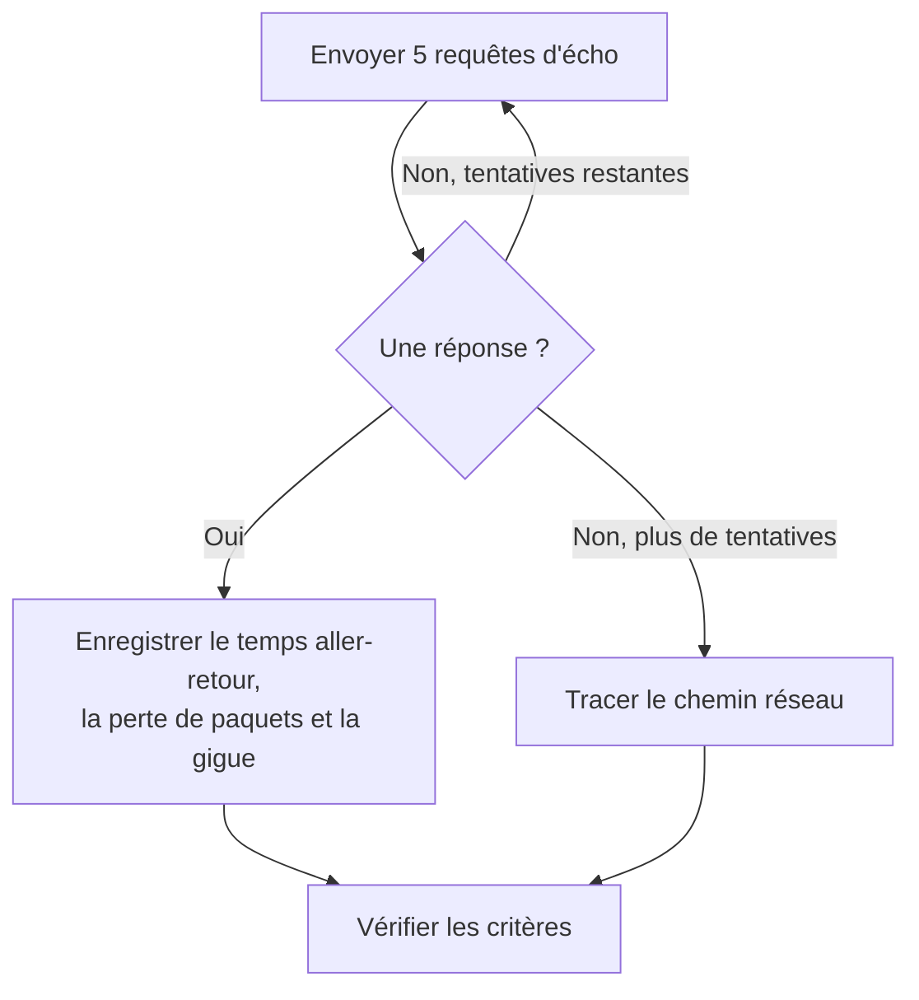

# Surveillance par ping

Un moniteur ping vérifie qu'un hôte répond au ping (requêtes d'écho ICMP), et mesure le temps aller-retour, la perte de paquets et la gigue. Utilisez-le pour les serveurs, les routeurs, les pare-feu et les autres équipements que vous joignez par nom d'hôte ou adresse IP.

:::cards
- [Créer le moniteur](#créer-un-moniteur-ping): Six étapes dans le tableau de bord.
- [Options de configuration](#options-de-configuration): L'hôte, le délai d'expiration et les nouvelles tentatives.
- [Critères de surveillance](#critères-de-surveillance): Joignabilité, latence, perte de paquets et gigue.
- [Dépannage](#dépannage): Quand l'hôte fonctionne mais que le moniteur le dit hors ligne.
:::

## Fonctionnement

À chaque vérification, une sonde envoie cinq requêtes d'écho à l'hôte. Si au moins une réponse revient, l'hôte est en ligne, et la sonde enregistre le temps aller-retour moyen comme temps de réponse, avec la perte de paquets, la gigue et les réponses la plus rapide et la plus lente. Si aucune réponse ne revient, la sonde réessaie, jusqu'au nombre de nouvelles tentatives que vous autorisez. OneUptime passe ensuite le résultat dans les critères du moniteur.

Quand une vérification échoue, la sonde trace aussi la route vers l'hôte et recherche son nom, puis joint ce qu'elle a trouvé au résultat sous **Chemin réseau au moment de l'échec**, pour que vous voyiez où la route s'est interrompue.

> [!NOTE]
> Certains hébergeurs bloquent l'ICMP sur les machines où tourne une sonde. Une sonde qui ne peut pas du tout envoyer de pings vérifie à la place le port TCP `80` de l'hôte, pour que le moniteur dise quand même si l'hôte est joignable. La perte de paquets et la gigue ne sont alors pas mesurées.

Une sonde qui a perdu sa propre connexion réseau ne rapporte aucun résultat, elle ne peut donc pas marquer votre hôte hors ligne.

## Avant de commencer

- **Un rôle qui peut créer des moniteurs** : Project Owner, Project Admin, Project Member, Monitor Admin ou Monitor Member, ou un rôle personnalisé avec l'autorisation Create Monitor.
- **Une sonde qui peut joindre l'hôte**, avec l'ICMP autorisé sur le chemin. Les sondes par défaut de votre projet sont choisies pour chaque nouveau moniteur. Si un pare-feu protège l'hôte, autorisez les requêtes d'écho ICMP depuis les [adresses IP des sondes de OneUptime Cloud](/docs/configuration/ip-addresses). Un hôte sur un réseau privé a besoin d'une [sonde personnalisée](/docs/probe/custom-probe) dans ce réseau.

## Créer un moniteur ping

:::steps
### Commencer un nouveau moniteur

Allez dans **Moniteurs** et cliquez sur **Créer un moniteur**. Sous **Type de moniteur**, choisissez **Ping**.

### Le nommer

Saisissez un **Nom**, comme `Core router`, puis cliquez sur **Suivant**.

### Saisir l'hôte

Dans **Nom d'hôte ou adresse IP**, saisissez le nom d'hôte ou l'adresse IPv4 ou IPv6 à pinger, comme `example.com` ou `192.168.1.1`. Saisissez seulement l'hôte, sans `http://` ni port.

### Le tester

Cliquez sur **Tester le moniteur**, choisissez une sonde sous **Sélectionner la sonde** et cliquez sur **Exécuter le test**. **Résultat du test du moniteur** montre les temps aller-retour et la perte de paquets que la sonde a constatés.

### Passer en revue les critères

**Critères du moniteur** commence avec les [critères par défaut](#critères-par-défaut) : hors ligne quand l'hôte ne répond pas, en ligne quand il répond. Modifiez-les si besoin, puis cliquez sur **Suivant**.

### Choisir les sondes et créer

Gardez ou changez les **Sondes** et l'**Intervalle de surveillance** (il commence à **Toutes les 5 minutes**), puis cliquez sur **Créer un moniteur**. La page du moniteur s'ouvre.
:::

## Options de configuration

| Champ | Par défaut | Ce qu'il faut saisir |
| --- | --- | --- |
| **Nom d'hôte ou adresse IP** | Aucun | L'hôte à pinger, comme `example.com`, `192.168.1.1` ou `2001:db8::1`. Un nom d'hôte est résolu à chaque vérification, donc le moniteur suit les changements DNS. |
| **Délai d'expiration de la requête (secondes)** (sous **Plus de champs**) | `60` | Combien de temps attendre une réponse à chaque tentative. Le maximum est de 60 secondes. |
| **Tentatives en cas d'échec** (sous **Plus de champs**) | Valeur par défaut de la sonde, généralement `3` | Combien de fois retenter une tentative échouée. Le maximum est 3. |

**Tentatives en cas d'échec** compte les nouvelles tentatives _après_ la première, donc `0` exécute la vérification une fois et `2` jusqu'à trois fois. Laissé vide, il utilise la valeur par défaut de la sonde : 3, sauf si `PROBE_MONITOR_RETRY_LIMIT` de la sonde indique autre chose. Chaque échec est retenté, expirations comprises, avec une pause d'une seconde entre les tentatives. Une vérification réussie dont les réponses ont pris plus de 10 secondes est aussi vérifiée à nouveau.

Pour surveiller une adresse IP fixe et jamais un nom d'hôte, vous pouvez utiliser plutôt un [moniteur IP](/docs/monitor/ip-monitor). Il exécute la même vérification.

## Critères de surveillance

Les critères décident quand l'hôte compte comme en ligne, dégradé ou hors ligne, et si cela déclare un incident ou crée une alerte. Chaque critère vérifie un ou plusieurs filtres :

| Filtre | Conditions | Ce qu'il vérifie |
| --- | --- | --- |
| **Is Online** | **Vrai**, **Faux** | Si au moins une requête d'écho a reçu une réponse. |
| **Temps de réponse (en ms)** | **Greater Than**, **Less Than**, **Greater Than Or Equal To**, **Less Than Or Equal To** | Le temps aller-retour moyen des réponses. |
| **Packet Loss (in %)** | **Greater Than**, **Less Than**, **Greater Than Or Equal To**, **Less Than Or Equal To** | La part des cinq requêtes d'écho restées sans réponse. |
| **Jitter (in ms)** | **Greater Than**, **Less Than**, **Greater Than Or Equal To**, **Less Than Or Equal To** | L'écart type des temps aller-retour sur les paquets envoyés lors d'une vérification. |
| **Is Request Timeout** | **Vrai**, **Faux** | Si le ping a expiré à chaque tentative. |

Avec deux filtres ou plus, **Condition de correspondance** décide si **Tous** doivent correspondre ou si **Tout** filtre suffit. Les **Actions** d'un critère décident de ce qu'il fait : changer l'état du moniteur, créer une alerte, déclarer un incident, ou plusieurs de ces actions.

### Critères par défaut

Un nouveau moniteur ping commence avec deux critères :

- **Hors ligne** — l'hôte ne répond à aucune des requêtes d'écho, ou n'est pas joignable du tout, après chaque nouvelle tentative. Le moniteur est marqué **Hors ligne** et un incident appelé « _monitor name_ is offline » est créé. L'incident se résout de lui-même quand l'hôte répond de nouveau.
- **En ligne** — l'hôte répond. Le moniteur est marqué **Opérationnel**.

Les critères sont vérifiés de haut en bas, et le premier qui correspond décide de ce qui se passe. Quand aucun ne correspond, le moniteur affiche son état par défaut : **Opérationnel**, sauf si vous en choisissez un autre sous **Plus de champs**, sous les critères.

### Évaluer sur une période

**Évaluer ce critère sur une période donnée** est une case à cocher sous un filtre, proposée pour **Is Online**, **Temps de réponse (en ms)**, **Packet Loss (in %)** et **Jitter (in ms)**. Activez-la pour juger une fenêtre de vérifications passées au lieu de la dernière : choisissez une agrégation sous **Évaluer** et une fenêtre, de 2 à 60 minutes, sous **Pour les dernières (en minutes)**.

| Agrégation | Correspond quand |
| --- | --- |
| **Moyenne**, **Somme**, **Maximum Value**, **Minimum Value** | Cette valeur, sur la fenêtre, remplit la condition. Filtres numériques seulement. |
| **All Values** | Chaque vérification de la fenêtre remplit la condition. |
| **Any Value** | Au moins une vérification de la fenêtre remplit la condition. |

**All Values** ne correspond qu'une fois la fenêtre réellement couverte par des données. Un moniteur qui vient d'être créé, ou dont les vérifications ont cessé d'être enregistrées, n'a pas assez d'historique pour dire quoi que ce soit des N dernières minutes, donc le critère attend au lieu de correspondre sur la seule mesure qu'il possède. **Any Value** est le réglage pour « prévenez-moi dès qu'une seule vérification dépasse le seuil » et se déclenche toujours immédiatement.

**En l'absence de données** décide de ce qui se passe tant que la fenêtre ne peut pas étayer le critère :

| Option | Ce qui se passe | À utiliser pour |
| --- | --- | --- |
| **Ignore** (par défaut) | Le critère ne correspond pas. | Les alertes de seuil ordinaires. |
| **Déclencheur** | Les données manquantes comptent comme le problème. | Les vérifications où le silence est lui-même une panne. |
| **Treat As Zero** | La fenêtre est comparée comme un seul zéro. | Les compteurs où l'absence d'événements signifie vraiment zéro. |

### Exemples de critères

| Objectif | Filtre | Condition | Valeur |
| --- | --- | --- | --- |
| Hors ligne quand l'hôte est injoignable | **Is Online** | **Faux** | — |
| Alerter quand la latence est élevée | **Temps de réponse (en ms)** | **Greater Than** | `200` |
| Marquer l'hôte dégradé sur un lien qui perd des paquets | **Packet Loss (in %)** | **Greater Than** | `20` |
| Alerter sur une connexion instable | **Jitter (in ms)** | **Greater Than** | `30` |

Pour n'alerter que lorsque la latence reste élevée, activez **Évaluer ce critère sur une période donnée** pour le filtre de temps de réponse et choisissez **All Values** sur **5** minutes.

## Dépannage

:::details L'hôte fonctionne, mais le moniteur le dit hors ligne
L'hôte, ou un pare-feu devant lui, ne répond pas aux requêtes d'écho ICMP de la sonde. Beaucoup de serveurs et de réseaux cloud ignorent le ping par défaut. Autorisez les requêtes d'écho ICMP depuis les sondes, ou surveillez plutôt un service sur l'hôte avec un [moniteur de port](/docs/monitor/port-monitor). **Chemin réseau au moment de l'échec**, sur la vérification échouée, montre jusqu'où la route est allée.
:::

:::details La vérification échoue avec « This probe could not resolve » pour l'hôte
Le serveur DNS de la sonde ne connaît pas le nom d'hôte. Vérifiez le nom, ou saisissez plutôt l'adresse IP. Un nom qui ne se résout qu'à l'intérieur de votre réseau a besoin d'une [sonde personnalisée](/docs/probe/custom-probe) sur place.
:::

:::details La perte de paquets et la gigue sont vides
La sonde qui a exécuté la vérification ne peut pas envoyer de pings, donc elle a vérifié à la place le port TCP `80`, qui ne mesure ni l'une ni l'autre. Exécutez le moniteur sur une sonde autorisée à envoyer de l'ICMP.
:::

## Étapes suivantes

:::cards
- [Surveillance IP](/docs/monitor/ip-monitor): Surveiller une adresse IPv4 ou IPv6 fixe.
- [Surveillance de port](/docs/monitor/port-monitor): Vérifier un service sur l'hôte, pas seulement l'hôte.
- [Sondes personnalisées](/docs/probe/custom-probe): Pinger des hôtes sur votre propre réseau.
- [Incidents](/docs/incidents/index): Ce qui se passe après que le moniteur en a déclaré un.
:::
