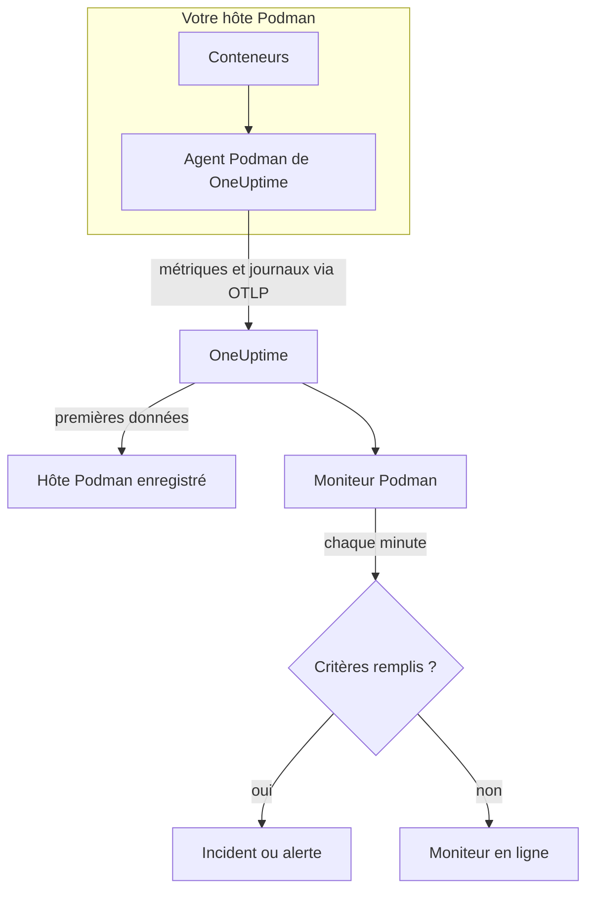

# Surveillance Podman

Un moniteur Podman surveille les conteneurs d'un hôte Podman et vous prévient quand un conteneur chauffe, manque de mémoire ou redémarre sans cesse. Il lit les métriques que l'agent Podman de OneUptime envoie depuis l'hôte, si bien que rien n'est sondé depuis l'extérieur : installez l'agent, puis créez le moniteur à partir d'un modèle ou de votre propre requête.

:::cards
- [Créer le moniteur](#créer-un-moniteur-podman): Six étapes dans le tableau de bord.
- [Modèles](#modèles-dalerte-prêts-à-lemploi): Cinq alertes prêtes à l'emploi, un incident par conteneur.
- [Métriques](#métriques-collectées): Ce que collecte l'agent, et ce que signifie chaque métrique.
- [Journaux](#journaux-collectés): Les journaux des conteneurs, et le pilote de journalisation dont ils ont besoin.
:::

## Fonctionnement

L'agent Podman de OneUptime s'exécute comme conteneur sur l'hôte. Toutes les 30 secondes, il lit les statistiques des conteneurs via le socket d'API compatible Docker de Podman, suit les fichiers journaux des conteneurs et envoie les deux à OneUptime via OTLP. Les premières données d'un hôte l'enregistrent dans OneUptime.

Un moniteur Podman est lié à un hôte. Chaque minute, il exécute sa requête sur les métriques des conteneurs de cet hôte et compare le résultat à ses critères.



## Avant de commencer

- **Installez l'agent Podman** sur l'hôte. Le [guide de l'agent Podman](/docs/telemetry/podman-host) couvre son installation, sa mise à jour et sa vérification. L'agent a besoin du socket d'API de Podman à `/run/podman/podman.sock`.
- **Vérifiez que l'hôte est enregistré.** Il apparaît sous **Produits → Infrastructure → Podman → Tous les hôtes**, nommé d'après le `PODMAN_HOST_NAME` de l'agent, dès l'arrivée de ses premières données.
- **Pour les journaux des conteneurs**, exécutez les conteneurs avec le pilote de journalisation `k8s-file`. Voir [Pilote de journalisation requis](#pilote-de-journalisation-requis).

## Créer un moniteur Podman

:::steps
### Commencer un nouveau moniteur

Allez dans **Moniteurs** et cliquez sur **Créer un moniteur**.

### Choisir Podman Container

Sous **Type de moniteur**, cliquez sur **Plus de types de moniteurs** et choisissez **Podman Container** sous **Infrastructure**, ou tapez `podman` dans le champ de recherche. Saisissez un **Nom** – il est utilisé dans les titres des incidents et des alertes – et cliquez sur **Suivant**.

### Choisir l'hôte

Sous **Podman Monitor Configuration**, choisissez l'hôte dans **Hôte Podman**. Chaque hôte qui a envoyé des données figure dans la liste.

### Choisir ce qu'il faut surveiller

Choisissez l'un des trois onglets :

- **Quick Setup** – cliquez sur un [modèle](#modèles-dalerte-prêts-à-lemploi). Il définit la métrique, l'agrégation, la plage temporelle et les seuils, et remplace les critères plus bas par les siens. Vous pouvez toujours changer la **Plage temporelle**.
- **Custom Metric** – choisissez une métrique dans **Podman Metric**, puis définissez l'**Agrégation** et la **Plage temporelle**. **Nom du conteneur** et **Image du conteneur** la restreignent à certains conteneurs.
- **Avancé** – construisez vous-même des requêtes et des formules sous **Sélectionner les métriques**. Utilisez **Regrouper par** `resource.container.name` pour juger chaque conteneur séparément.

### Vérifier les critères

Ouvrez chaque critère sous **Critères du moniteur** et vérifiez sa **Métrique**, son **Agrégation**, sa **Condition** et son **Threshold**. Un modèle les remplit. Avec **Custom Metric** ou **Avancé**, le moniteur commence avec les [critères par défaut](#critères-par-défaut), qui ne remarquent qu'une métrique tombant à zéro ; définissez donc votre propre seuil.

### Créer le moniteur

Cliquez sur **Créer un moniteur**. OneUptime ouvre la page du moniteur et l'évalue chaque minute. Les incidents et alertes qu'il déclenche sont aussi listés sur les pages **Incidents** et **Alertes** de l'hôte.
:::

> [!TIP]
> Pour configurer plusieurs modèles à la fois, ouvrez l'hôte depuis **Produits → Infrastructure → Podman** et allez dans **Recommendations**. Choisissez les modèles voulus, choisissez qui est alerté, et OneUptime crée un moniteur par modèle.

## Paramètres du moniteur

| Champ | Onglet | Ce qu'il fait |
| --- | --- | --- |
| **Hôte Podman** | Tous | Obligatoire. Limite chaque requête au `resource.host.name` de l'hôte. OneUptime ajoute aussi `resource.container.runtime = podman` à chaque requête. |
| **Podman Metric** | Custom Metric | Une métrique du catalogue de l'agent, regroupée en CPU, mémoire, réseau, E/S de bloc et conteneur. |
| **Nom du conteneur** | Custom Metric, Avancé | Facultatif. Correspondance exacte sur `resource.container.name`, par exemple `my-container`. |
| **Image du conteneur** | Custom Metric, Avancé | Facultatif. Correspondance exacte sur `resource.container.image.name`, par exemple `nginx:latest`. |
| **Agrégation** | Custom Metric | Comment les mesures sont combinées : **Moyenne**, **Maximum**, **Minimum**, **Somme** ou **Comptage**. Commence à l'agrégation habituelle de la métrique. |
| **Plage temporelle** | Tous | La fenêtre glissante que lit la requête, de **Past 1 Minute** à **Past 365 Days**. Un nouveau moniteur commence à **Past 1 Minute** ; les modèles définissent la leur. |
| **Sélectionner les métriques** | Avancé | Le constructeur de requêtes : **Métrique**, **Agréger par**, **Filtrer par attributs**, **Regrouper par**, plus **Ajouter une métrique** et **Ajouter une formule** pour combiner des requêtes. |

## Modèles d'alerte prêts à l'emploi

**Quick Setup** propose cinq modèles. Chacun construit un moniteur complet : une requête regroupée par `resource.container.name`, un critère qui se déclenche et un autre qui rétablit. Chaque conteneur est jugé séparément et reçoit son propre incident et sa propre alerte. Les seuils sont des points de départ que vous pouvez modifier.

Un critère ne se déclenche que si la condition est remplie à chaque minute de sa fenêtre, et il se rétablit 10 % au-delà du seuil pour qu'une valeur qui oscille autour de la limite ne bascule pas sans cesse.

| Modèle | Gravité | Surveille | Se déclenche quand | Se rétablit quand |
| --- | --- | --- | --- | --- |
| High Container CPU Usage | Warning | `container.cpu.utilization`, Avg par conteneur, 5 dernières minutes | Au-dessus de 80 (% d'un cœur) | À 72 ou moins |
| High Container Memory Usage | Warning | `container.memory.percent`, Avg par conteneur, 5 dernières minutes | Au-dessus de 85 % | À 76,5 % ou moins |
| High Container Restart Count | Critique | `container.restarts`, Max par conteneur, 5 dernières minutes | Au-dessus de 5 redémarrages au total | 4,5 ou moins |
| High Container Process Count | Warning | `container.pids.count`, Max par conteneur, 5 dernières minutes | Au-dessus de 500 | À 450 ou moins |
| Container Restarted (Low Uptime) | Critique | `container.uptime`, Min par conteneur, dernière 1 minute | Sous 120 secondes | À 132 secondes ou plus |

**Gravité** est le libellé qu'affiche le sélecteur. L'incident et l'alerte qu'un modèle crée commencent avec la gravité d'incident et d'alerte la plus élevée de votre projet ; changez-les dans les critères.

Les deux modèles en pourcentage utilisent **Moyenne** : leurs métriques sont déjà des pourcentages par conteneur, donc la moyenne d'une minute est la valeur soutenue. Le nombre de redémarrages et le nombre de processus utilisent **Maximum**, pour lesquels une seule mesure au-dessus du seuil est le signal.

> [!NOTE]
> `container.cpu.utilization` est le nombre qu'affiche `podman stats` : 100 % correspond à un cœur de CPU complet, et non à toute l'allocation de CPU du conteneur. Un conteneur doté de plusieurs cœurs affiche bien plus de 100 en bonne santé ; relevez donc le seuil pour ceux-là.

> [!NOTE]
> `container.restarts` est un total cumulé tenu par Podman, et non un nombre de redémarrages dans la fenêtre. **High Container Restart Count** reste donc ouvert jusqu'à ce que le conteneur soit recréé, ce qui remet le compteur à zéro.

> [!CAUTION]
> `container.uptime` n'existe que pour les conteneurs en cours d'exécution. Un conteneur qui s'arrête et reste arrêté n'envoie aucune donnée, donc **Container Restarted (Low Uptime)** détecte les redémarrages et les redéploiements, pas un arrêt définitif. Un conteneur prévu pour tourner moins de deux minutes reste en état d'alerte pendant toute sa vie.

Il n'existe pas de modèle de bridage du CPU. Les métriques de bridage que collecte l'agent ne font que croître, et une alerte « bridé ne serait-ce qu'une fois » se déclencherait une fois sans jamais se rétablir. Les deux sont tout de même collectées, vous pouvez donc les tracer.

## Métriques collectées

L'agent utilise le récepteur OpenTelemetry `docker_stats` pointé sur le socket compatible Docker de Podman, `/run/podman/podman.sock`, toutes les 30 secondes. Les métriques de chaque conteneur portent son identité comme attributs de ressource : `resource.container.name`, `resource.container.image.name`, `resource.container.id`, `resource.container.runtime` (`podman`) et `resource.host.name`.

### CPU

| Métrique | Description |
| --- | --- |
| `container.cpu.utilization` | Utilisation du CPU du conteneur, où 100 % correspond à un cœur de CPU complet. |
| `container.cpu.usage.total` | Temps CPU utilisé depuis le démarrage du conteneur, en nanosecondes. Un compteur sur toute la durée de vie. |
| `container.cpu.throttling_data.throttled_time` | Nanosecondes pendant lesquelles le conteneur a été bridé par sa limite de CPU. Un compteur sur toute la durée de vie. |
| `container.cpu.throttling_data.throttled_periods` | Périodes de bridage depuis le démarrage du conteneur. Un compteur sur toute la durée de vie. |

### Mémoire

| Métrique | Description |
| --- | --- |
| `container.memory.usage.total` | Mémoire utilisée, en octets. |
| `container.memory.usage.limit` | Limite de mémoire, en octets. |
| `container.memory.percent` | Utilisation de la mémoire en pourcentage de la limite du conteneur, ou de la mémoire de l'hôte quand le conteneur n'a pas de limite. |

### Réseau

| Métrique | Description |
| --- | --- |
| `container.network.io.usage.rx_bytes` | Octets reçus. Un compteur sur toute la durée de vie. |
| `container.network.io.usage.tx_bytes` | Octets envoyés. Un compteur sur toute la durée de vie. |

### E/S de bloc

| Métrique | Description |
| --- | --- |
| `container.blockio.io_service_bytes_recursive.read` | Octets lus sur les périphériques de bloc. |
| `container.blockio.io_service_bytes_recursive.write` | Octets écrits sur les périphériques de bloc. |

### Conteneur

| Métrique | Description |
| --- | --- |
| `container.uptime` | Secondes écoulées depuis le démarrage du conteneur. Seuls les conteneurs en cours d'exécution la remontent. |
| `container.restarts` | Nombre de redémarrages du conteneur. Un total cumulé. |
| `container.pids.count` | Tâches dans le conteneur. Le contrôleur pids du cgroup compte les threads aussi bien que les processus. |

La liste **Podman Metric** propose aussi `container.cpu.usage.percpu`, `container.memory.rss`, `container.memory.cache` et les compteurs de paquets réseau. La configuration de l'agent fournie ne les active pas ; vérifiez donc la page **Métriques** de l'hôte avant de vous appuyer dessus. `container.cpu.throttling_data.throttled_periods` n'est pas dans la liste ; interrogez-la depuis **Avancé**.

## Critères de surveillance

Un critère compare l'une des requêtes ou formules du moniteur à un seuil. Les critères d'un moniteur Podman n'ont pas de **Type de filtre** : chaque règle vérifie la valeur de la métrique, avec ces champs.

| Champ | Ce qu'il fait |
| --- | --- |
| **Métrique** | La requête ou la formule à vérifier, par son nom de variable. |
| **Agrégation** | Comment les valeurs de la fenêtre deviennent une seule réponse : **Moyenne**, **Somme**, **Maximum Value**, **Minimum Value**, **All Values** (chaque valeur doit correspondre) ou **Any Value** (une seule suffit). |
| **Condition** | **Greater Than**, **Less Than**, **Greater Than Or Equal To**, **Less Than Or Equal To** ou **Equal To** – ou une condition d'anomalie : **Anomalously High**, **Anomalously Low** ou **Anomalous**. |
| **Threshold** | La valeur de comparaison. Une liste d'unités se trouve à côté quand la métrique a une unité. Non affiché pour les conditions d'anomalie. |
| **Sensibilité** | Conditions d'anomalie uniquement. **Faible** (4σ), **Moyen** (3σ, la valeur par défaut) ou **Élevé** (2σ). |
| **Fenêtre de référence** | Conditions d'anomalie uniquement. 14 jours (la valeur par défaut), 28, 60 ou 90 jours d'historique. |
| **En l'absence de données** | Sous **Plus de champs**. Ce qui se passe quand la fenêtre n'a aucune mesure : **Ignore** (par défaut), **Treat As Zero** ou **Déclencheur**. |

Les conditions d'anomalie comparent chaque valeur à la même heure de la semaine dans la référence. Elles restent dans un état « Learning », et ne déclenchent rien, tant que la fenêtre de référence ne contient pas assez d'historique.

Chaque critère indique aussi quoi faire quand il correspond : changer le statut du moniteur, créer une alerte ou déclarer un incident. Les critères sont vérifiés de haut en bas, et le premier qui correspond l'emporte.

### Critères par défaut

Un moniteur que vous ne créez pas à partir d'un modèle commence avec deux critères :

| Ordre | Critère | Correspond quand | Ensuite |
| --- | --- | --- | --- |
| 1 | Check if _monitor name_ is offline | Une valeur quelconque de la première requête vaut `0` | Marque le moniteur **Hors ligne** et déclare l'incident « _monitor name_ is offline », qui se résout de lui-même quand le moniteur se rétablit. |
| 2 | Check if _monitor name_ is online | Une valeur quelconque est au-dessus de `0` | Marque le moniteur **Opérationnel**. |

> [!IMPORTANT]
> Le silence ne correspond à aucun des deux critères : un hôte qui cesse d'envoyer des données laisse le moniteur tel qu'il était. Pour être prévenu quand les données s'arrêtent, réglez **En l'absence de données** sur **Déclencheur** dans un critère. Le temps pendant lequel OneUptime lui-même ne recevait pas de données n'est jamais une absence de données : une vérification dont la fenêtre en contient attend à la place, comme l'explique [Quand OneUptime ne reçoit pas de données](/docs/monitor/when-oneuptime-is-not-receiving).

## Journaux collectés

L'agent suit aussi le fichier `ctr.log` de chaque conteneur et envoie chaque ligne comme enregistrement de journal OpenTelemetry avec :

| Champ | Valeur |
| --- | --- |
| `resource.host.name` | L'hôte, d'après `PODMAN_HOST_NAME`. |
| `resource.container.id` | L'ID complet du conteneur. |
| `resource.container.runtime` | Toujours `podman`. |
| `attributes["log.iostream"]` | `stdout` ou `stderr`. |
| `severityText` / `severityNumber` | Lu à partir d'un mot-clé de niveau là où un niveau figure dans la ligne (`[ERROR]`, `app.INFO:`, `{"level":"warn"}`, `level=error`). Une ligne sans niveau se rabat sur son flux : `stderr` donne `ERROR`, `stdout` donne `INFO`. |
| `body` | La ligne que le conteneur a écrite. Les lignes qui commencent par un espace ou un crochet fermant, comme les lignes d'une trace de pile, sont rattachées à la ligne précédente. |
| `time` | L'horodatage de Podman pour la ligne. |

Les journaux apparaissent sur la page **Journaux** de l'hôte et sur la page de chaque conteneur.

### Pilote de journalisation requis

L'agent lit les fichiers qu'écrit le pilote de journalisation `k8s-file` de Podman, à `/var/lib/containers/storage/overlay-containers/*/userdata/ctr.log`. Podman en mode rootful utilise par défaut `journald`, qui écrit plutôt dans le journal systemd, si bien qu'il n'y a aucun fichier à lire :

| Pilote | Ce que voit l'agent |
| --- | --- |
| `k8s-file` (ou `json-file`, que Podman traite de la même façon) | Chaque ligne. |
| `journald` | Rien : les journaux sont dans le journal systemd. |
| `none` | Rien : les journaux sont supprimés. |

Les métriques ne dépendent pas du pilote de journalisation : un hôte dont les conteneurs utilisent `journald` remonte toujours ses métriques, seule sa page **Journaux** reste vide.

Vérifiez le pilote d'un conteneur, et celui de Podman par défaut :

```bash
podman inspect <container> --format '{{.HostConfig.LogConfig.Type}}'
podman info --format '{{.Host.LogDriver}}'
```

Passez à `k8s-file`. Podman fixe le pilote de journalisation d'un conteneur à sa création ; recréez donc chaque conteneur après le changement – un redémarrage conserve l'ancien pilote.

:::tabs
@tab podman run
Démarrez le conteneur avec le pilote :

```bash
podman run --log-driver k8s-file ... <image>
```

Pour basculer un conteneur existant, supprimez-le et relancez-le :

```bash
podman rm -f <container>
podman run --log-driver k8s-file ... <image>
```
@tab Podman Compose
Définissez le pilote sur chaque service :

```yaml title="docker-compose.yml"
services:
  my-app:
    image: my-app:latest
    logging:
      driver: "k8s-file"
      options:
        max-size: "100m"
```

Puis recréez le service :

```bash
podman compose up -d --force-recreate <service>
```
@tab containers.conf
Faites de `k8s-file` le pilote par défaut de chaque conteneur créé ensuite, dans `/etc/containers/containers.conf` (rootful) ou `~/.config/containers/containers.conf` (rootless) :

```toml title="containers.conf"
[containers]
log_driver = "k8s-file"
```

Puis supprimez et recréez chaque conteneur.
:::

## Dépannage

:::details L'hôte n'est pas dans la liste Hôte Podman
Les hôtes s'enregistrent eux-mêmes à partir des données de l'agent. Vérifiez que le conteneur de l'agent tourne, que le socket d'API de Podman est activé et que l'hôte figure sous **Produits → Infrastructure → Podman → Tous les hôtes**. Le [guide de l'agent Podman](/docs/telemetry/podman-host) contient les vérifications à exécuter sur l'hôte.
:::

:::details Les métriques arrivent mais la page Journaux est vide
Les conteneurs utilisent presque certainement `journald`. Basculez ceux dont vous voulez les journaux sur `k8s-file` (voir [Pilote de journalisation requis](#pilote-de-journalisation-requis)) et recréez-les.
:::

:::details L'agent journalise « no files match the configured criteria »
L'agent cherche `/var/lib/containers/storage/overlay-containers/*/userdata/ctr.log` et n'a rien trouvé. Soit aucun conteneur de l'hôte n'utilise `k8s-file`, soit le montage de `/var/lib/containers/storage` de l'agent est absent ou vide, soit l'agent et les conteneurs tournent dans des modes différents – les conteneurs rootless gardent leur stockage à un endroit que le chemin rootful ne couvre pas, et inversement.
:::

:::details Les données arrivent sous le mauvais nom d'hôte
OneUptime identifie un hôte par `resource.host.name`, que l'agent tire de `PODMAN_HOST_NAME`. Changer `PODMAN_HOST_NAME` après les premières données crée un second hôte au lieu de renommer le premier, et un moniteur reste lié au nom avec lequel il a été créé.
:::

:::details Une alerte CPU ne se déclenche jamais
Regroupez la requête par `resource.container.name`, comme le fait le modèle **High Container CPU Usage**, pour que chaque conteneur soit jugé séparément. Une moyenne sur tous les conteneurs d'un hôte chargé est tirée vers le bas par les conteneurs inactifs. N'oubliez pas que 100 % correspond à un cœur complet, donc un conteneur autorisé à utiliser plusieurs cœurs a besoin d'un seuil plus élevé.
:::

:::details L'alerte sur le nombre de redémarrages ne se rétablit jamais
`container.restarts` est un total cumulé, il ne redescend donc pas de lui-même sous le seuil. Corrigez la cause, puis recréez le conteneur pour remettre le compteur à zéro, ou relevez le seuil.
:::

## Étapes suivantes

:::cards
- [Agent Podman](/docs/telemetry/podman-host): Installer, mettre à jour et dépanner l'agent que lit ce moniteur.
- [Surveillance Docker](/docs/monitor/docker-monitor): Le même moniteur pour les hôtes Docker.
- [Vue d'ensemble des incidents](/docs/incidents/index): Ce qui se passe après qu'un critère a déclaré un incident.
- [Plannings d'astreinte](/docs/on-call/schedules): Décider qui est alerté quand un conteneur tombe en panne.
:::
