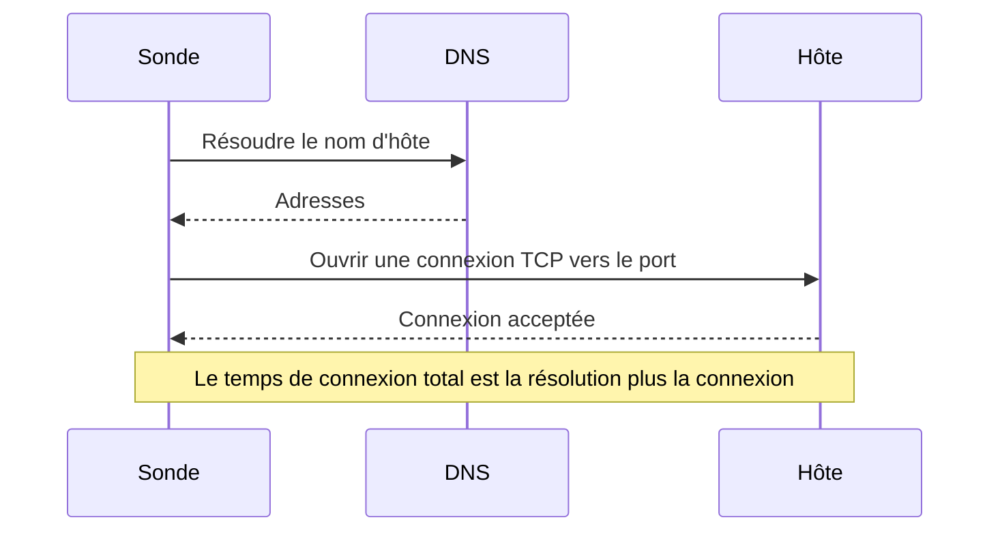

# Surveillance de port

Un moniteur de port vérifie qu'un hôte accepte les connexions TCP sur un port, et mesure le temps que prend la connexion. Utilisez-le pour les services qui ne parlent pas HTTP, ou dont vous ne voulez pas vérifier le HTTP : bases de données, serveurs de messagerie, SSH, courtiers de messages et autres.

:::cards
- [Créer le moniteur](#créer-un-moniteur-de-port): Six étapes dans le tableau de bord.
- [Temps de connexion](#temps-de-connexion): Ce que mesurent les temps DNS, TCP et total.
- [Critères de surveillance](#critères-de-surveillance): Joignabilité et temps de connexion.
- [Dépannage](#dépannage): Quand le service fonctionne mais que le moniteur le dit hors ligne.
:::

## Fonctionnement

À chaque vérification, une sonde résout le nom d'hôte, si vous en avez donné un, et ouvre une connexion TCP vers le port. Le port est en ligne dès que la connexion est acceptée ; la sonde la ferme alors sans rien envoyer. Une connexion refusée ou qui expire est retentée, jusqu'au nombre de nouvelles tentatives que vous autorisez. OneUptime passe ensuite le résultat dans les critères du moniteur.

La sonde n'ouvre que des connexions TCP : un service qui n'écoute qu'en UDP, comme un agent SNMP, ne peut pas être vérifié avec un moniteur de port.

Quand une vérification échoue, la sonde trace aussi la route vers l'hôte et recherche son nom, puis joint ce qu'elle a trouvé au résultat sous **Chemin réseau au moment de l'échec**, pour que vous voyiez où la route s'est interrompue. Une sonde qui a perdu sa propre connexion réseau ne rapporte aucun résultat, elle ne peut donc pas marquer votre service hors ligne.

## Avant de commencer

- **Un rôle qui peut créer des moniteurs** : Project Owner, Project Admin, Project Member, Monitor Admin ou Monitor Member, ou un rôle personnalisé avec l'autorisation Create Monitor.
- **Une sonde qui peut joindre le port.** Les sondes par défaut de votre projet sont choisies pour chaque nouveau moniteur. Si un pare-feu protège le service, autorisez les [adresses IP des sondes de OneUptime Cloud](/docs/configuration/ip-addresses) à se connecter au port. Un service sur un réseau privé, comme une base de données, a besoin d'une [sonde personnalisée](/docs/probe/custom-probe) dans ce réseau.

## Créer un moniteur de port

:::steps
### Commencer un nouveau moniteur

Allez dans **Moniteurs** et cliquez sur **Créer un moniteur**. Sous **Type de moniteur**, choisissez **Port**.

### Le nommer

Saisissez un **Nom**, comme `Orders database`, puis cliquez sur **Suivant**.

### Saisir l'hôte et le port

Dans **Nom d'hôte ou adresse IP**, saisissez l'hôte sur lequel se trouve le port, comme `db.example.com` ou `10.0.0.12`. Dans **Port**, saisissez le numéro de port, comme `5432`.

### Le tester

Cliquez sur **Tester le moniteur**, choisissez une sonde sous **Sélectionner la sonde** et cliquez sur **Exécuter le test**. **Résultat du test du moniteur** montre si la connexion s'est ouverte, et combien de temps chaque partie a pris.

### Passer en revue les critères

**Critères du moniteur** commence avec les [critères par défaut](#critères-par-défaut) : hors ligne quand le port n'accepte pas de connexion, en ligne quand il en accepte une. Modifiez-les si besoin, puis cliquez sur **Suivant**.

### Choisir les sondes et créer

Gardez ou changez les **Sondes** et l'**Intervalle de surveillance** (il commence à **Toutes les 5 minutes**), puis cliquez sur **Créer un moniteur**. La page du moniteur s'ouvre.
:::

## Options de configuration

| Champ | Par défaut | Ce qu'il faut saisir |
| --- | --- | --- |
| **Nom d'hôte ou adresse IP** | Aucun | L'hôte, comme `example.com`, `192.168.1.1` ou `2001:db8::1`. Saisissez seulement l'hôte, sans `http://`. |
| **Port** | Aucun | Le port TCP auquel se connecter, de `1` à `65535`. |
| **Délai d'expiration de la requête (secondes)** (sous **Plus de champs**) | `60` | Combien de temps une tentative peut prendre, la résolution DNS et la connexion TCP ensemble. Le maximum est de 60 secondes. |
| **Tentatives en cas d'échec** (sous **Plus de champs**) | Valeur par défaut de la sonde, généralement `3` | Combien de fois retenter une tentative échouée. Le maximum est 3. |

**Tentatives en cas d'échec** compte les nouvelles tentatives _après_ la première, donc `0` exécute la vérification une fois et `2` jusqu'à trois fois. Laissé vide, il utilise la valeur par défaut de la sonde : 3, sauf si `PROBE_MONITOR_RETRY_LIMIT` de la sonde indique autre chose. Chaque échec est retenté, expirations comprises, avec une pause d'une seconde entre les tentatives. Une connexion réussie qui a pris plus de 10 secondes est aussi vérifiée à nouveau.

Ports courants :

| Port | Service |
| --- | --- |
| `22` | SSH |
| `25` | SMTP |
| `80` | HTTP |
| `443` | HTTPS |
| `3306` | MySQL |
| `5432` | PostgreSQL |
| `6379` | Redis |
| `27017` | MongoDB |

> [!NOTE]
> Beaucoup d'hébergeurs bloquent le SMTP sortant. Sur une sonde qui ne peut pas envoyer de pings, ce qui permet à une sonde de remarquer qu'elle tourne chez un tel hébergeur, une vérification du port `25` qui expire compte comme en ligne. Pour vérifier de façon fiable le port `25` d'un serveur de messagerie, exécutez le moniteur sur une [sonde personnalisée](/docs/probe/custom-probe) autorisée à s'y connecter.

## Temps de connexion

Pour un nom d'hôte, la sonde mesure la vérification en deux phases :

| Phase | De | À |
| --- | --- | --- |
| **Résolution DNS** | Le début de la vérification | La première tentative de connexion TCP |
| **Connexion TCP** | La première tentative de connexion TCP | L'acceptation de la connexion, y compris le temps passé à basculer entre adresses IPv6 et IPv4 |

**Total Connection Time (DNS + TCP)** va du début de la vérification jusqu'à l'acceptation de la connexion. C'est aussi le temps de réponse du moniteur de port, donc les critères, les alertes et les graphiques existants qui utilisent le temps de réponse continuent de fonctionner.

Quand la cible est une adresse IP, il n'y a pas de résolution DNS, donc cette phase est omise. Les résultats de vérification antérieurs à la mesure par phase ne montrent que le temps de connexion total.

## Critères de surveillance

Les critères décident quand le port compte comme en ligne, dégradé ou hors ligne, et si cela déclare un incident ou crée une alerte. Chaque critère vérifie un ou plusieurs filtres :

| Filtre | Conditions | Ce qu'il vérifie |
| --- | --- | --- |
| **Is Online** | **Vrai**, **Faux** | Si le port a accepté une connexion. |
| **Total Connection Time (DNS + TCP) (in ms)** | **Greater Than**, **Less Than**, **Greater Than Or Equal To**, **Less Than Or Equal To** | Le temps de connexion complet, y compris la résolution DNS pour un nom d'hôte. |
| **Port DNS Lookup Time (in ms)** | **Greater Than**, **Less Than**, **Greater Than Or Equal To**, **Less Than Or Equal To** | La résolution DNS avant la première tentative TCP. Elle n'a pas de valeur quand la cible est une adresse IP. |
| **Port TCP Connect Time (in ms)** | **Greater Than**, **Less Than**, **Greater Than Or Equal To**, **Less Than Or Equal To** | De la première tentative TCP jusqu'à l'acceptation de la connexion, y compris le basculement entre IPv6 et IPv4. |
| **Is Request Timeout** | **Vrai**, **Faux** | Si la résolution DNS ou la connexion TCP a dépassé le délai, à chaque tentative. |

Un critère sur la résolution DNS n'a rien à évaluer quand la cible est une adresse IP. Pour des critères qui doivent fonctionner aussi bien avec des noms d'hôte qu'avec des adresses IP, utilisez le temps total ou le temps de connexion TCP.

Avec deux filtres ou plus, **Condition de correspondance** décide si **Tous** doivent correspondre ou si **Tout** filtre suffit. Les **Actions** d'un critère décident de ce qu'il fait : changer l'état du moniteur, créer une alerte, déclarer un incident, ou plusieurs de ces actions.

### Critères par défaut

Un nouveau moniteur de port commence avec deux critères :

- **Hors ligne** — le port n'accepte pas de connexion, après chaque nouvelle tentative. Le moniteur est marqué **Hors ligne** et un incident appelé « _monitor name_ is offline » est créé. L'incident se résout de lui-même quand le port accepte de nouveau des connexions.
- **En ligne** — le port accepte une connexion. Le moniteur est marqué **Opérationnel**.

Les critères sont vérifiés de haut en bas, et le premier qui correspond décide de ce qui se passe. Quand aucun ne correspond, le moniteur affiche son état par défaut : **Opérationnel**, sauf si vous en choisissez un autre sous **Plus de champs**, sous les critères.

### Évaluer sur une période

**Évaluer ce critère sur une période donnée** est une case à cocher sous un filtre, proposée pour **Is Online**, **Total Connection Time (DNS + TCP) (in ms)**, **Port DNS Lookup Time (in ms)** et **Port TCP Connect Time (in ms)**. Activez-la pour juger une fenêtre de vérifications passées au lieu de la dernière : choisissez une agrégation sous **Évaluer** et une fenêtre, de 2 à 60 minutes, sous **Pour les dernières (en minutes)**.

| Agrégation | Correspond quand |
| --- | --- |
| **Moyenne**, **Somme**, **Maximum Value**, **Minimum Value** | Cette valeur, sur la fenêtre, remplit la condition. Filtres numériques seulement. |
| **All Values** | Chaque vérification de la fenêtre remplit la condition. |
| **Any Value** | Au moins une vérification de la fenêtre remplit la condition. |

**All Values** ne correspond qu'une fois la fenêtre réellement couverte par des données. Un moniteur qui vient d'être créé, ou dont les vérifications ont cessé d'être enregistrées, n'a pas assez d'historique pour dire quoi que ce soit des N dernières minutes, donc le critère attend au lieu de correspondre sur la seule mesure qu'il possède. **Any Value** est le réglage pour « prévenez-moi dès qu'une seule vérification dépasse le seuil » et se déclenche toujours immédiatement.

**En l'absence de données** décide de ce qui se passe tant que la fenêtre ne peut pas étayer le critère :

| Option | Ce qui se passe | À utiliser pour |
| --- | --- | --- |
| **Ignore** (par défaut) | Le critère ne correspond pas. | Les alertes de seuil ordinaires. |
| **Déclencheur** | Les données manquantes comptent comme le problème. | Les vérifications où le silence est lui-même une panne. |
| **Treat As Zero** | La fenêtre est comparée comme un seul zéro. | Les compteurs où l'absence d'événements signifie vraiment zéro. |

### Exemples de critères

| Objectif | Filtre | Condition | Valeur |
| --- | --- | --- | --- |
| Hors ligne quand le port est fermé | **Is Online** | **Faux** | — |
| Alerter quand la connexion est lente | **Total Connection Time (DNS + TCP) (in ms)** | **Greater Than** | `500` |
| Marquer le service dégradé quand il est lent à se connecter | **Total Connection Time (DNS + TCP) (in ms)** | **Greater Than** | `200` |
| Alerter quand le DNS est lent | **Port DNS Lookup Time (in ms)** | **Greater Than** | `100` |
| Alerter quand la poignée de main TCP est lente | **Port TCP Connect Time (in ms)** | **Greater Than** | `250` |

## Dépannage

:::details Le service fonctionne, mais le moniteur le dit hors ligne
La sonde n'a pas pu ouvrir de connexion : un pare-feu la rejette, le service n'écoute que sur une interface privée, ou le port est faux. La cause racine de l'incident, et **Journaux de surveillance** sur le moniteur, montrent l'erreur, et **Chemin réseau au moment de l'échec** montre jusqu'où la route est allée. Laissez passer les sondes à travers le pare-feu, ou utilisez une [sonde personnalisée](/docs/probe/custom-probe) à l'intérieur du réseau.
:::

:::details Le temps de résolution DNS est toujours vide
La cible est une adresse IP, donc il n'y a rien à résoudre. Utilisez plutôt **Total Connection Time (DNS + TCP) (in ms)** ou **Port TCP Connect Time (in ms)**.
:::

:::details Je dois vérifier un service UDP
Les moniteurs de port n'ouvrent que des connexions TCP. Pour un serveur DNS, utilisez un [moniteur DNS](/docs/monitor/dns-monitor), et pour un serveur de temps sur le port UDP 123, un [moniteur NTP](/docs/monitor/ntp-monitor). Tous deux envoient de vraies requêtes.
:::

## Étapes suivantes

:::cards
- [Surveillance par ping](/docs/monitor/ping-monitor): Vérifier que l'hôte lui-même est joignable.
- [Surveillance de certificat SSL](/docs/monitor/ssl-certificate-monitor): Vérifier le certificat sur un port TLS.
- [Surveillance de la santé des bases de données](/docs/monitor/database-health-monitor): Aller au-delà d'un port ouvert et suivre la santé d'une base de données.
- [Sondes personnalisées](/docs/probe/custom-probe): Vérifier des ports sur votre propre réseau.
:::
