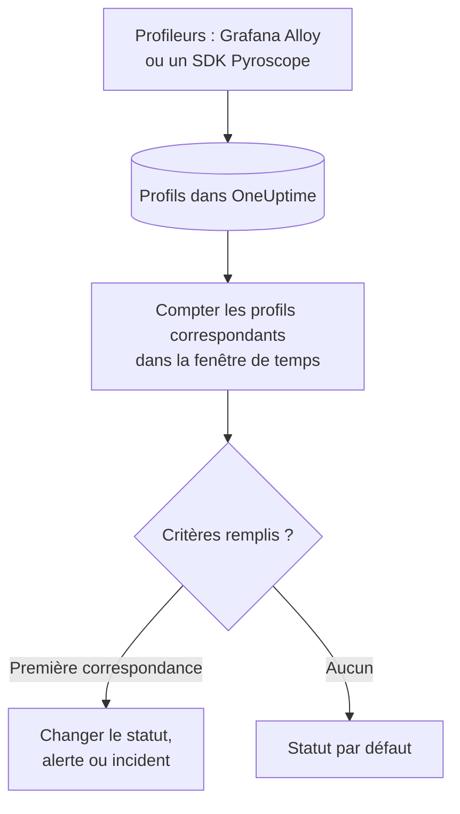

# Surveillance des profils

Un moniteur de profils compte, sur une fenêtre de temps, les profils continus que vos services envoient à OneUptime et qui correspondent à vos filtres – type de profil, service, attributs. Quand ce nombre remplit vos critères, il change le statut du moniteur, crée une alerte ou déclare un incident. Son usage principal est de remarquer quand les données de profilage cessent d'arriver d'un service.

> [!IMPORTANT]
> **Créer un moniteur** dans le tableau de bord ne propose pas Profiles : il n'existe pas encore de formulaire pour ses filtres. Créez un moniteur de profils via l'[API](/docs/api-reference/api-reference) ou [Terraform](/docs/terraform/monitor-steps), comme décrit ci-dessous. Une fois qu'il existe, vous pouvez consulter et modifier ses critères sur la page **Critères** du moniteur dans le tableau de bord ; ses filtres ne peuvent être modifiés que via l'API ou Terraform.

:::cards
- [Créer le moniteur](#créer-un-moniteur-de-profils): La configuration à envoyer via l'API ou Terraform.
- [Ce qu'il interroge](#ce-quil-interroge): Types de profils, services, attributs et la fenêtre.
- [Critères](#critères): Les conditions que vous pouvez utiliser.
- [Exemple](#exemple-les-profils-cessent-darriver): Savoir quand un service cesse d'envoyer des profils.
:::

## Fonctionnement



Chaque minute, OneUptime compte les profils qui correspondent aux filtres du moniteur et ont commencé dans sa fenêtre de temps. Il compare ce nombre aux critères du moniteur de haut en bas, et le premier critère qui correspond décide de ce qui se passe. Si aucun ne correspond, le moniteur revient à son statut par défaut.

## Avant de commencer

- Vos services envoient des données de profilage continu à OneUptime, via Grafana Alloy (eBPF) ou un SDK Pyroscope. Voir [Profilage continu](/docs/telemetry/profiles).
- Vous avez soit une clé d'API autorisée à créer des moniteurs, soit le fournisseur Terraform d'OneUptime configuré.
- Vous connaissez l'ID de chaque service de télémétrie à surveiller, et les types de profils qu'il envoie, comme `cpu`, `wall`, `alloc_objects`, `alloc_space` ou `goroutine`.

## Créer un moniteur de profils

:::steps
### Choisir ce qu'il faut compter

Rédigez la configuration `profileMonitor` de l'étape. Celle-ci compte les profils CPU d'un service sur les cinq dernières minutes :

```json
{
  "profileMonitor": {
    "telemetryServiceIds": [],
    "profileTypes": ["cpu"],
    "profileType": "",
    "attributes": {},
    "lastXSecondsOfProfiles": 300
  }
}
```

Mettez l'ID du service dans `telemetryServiceIds`, ou laissez la liste vide pour compter les profils de tous les services. [Ce qu'il interroge](#ce-quil-interroge) décrit chaque champ.

### Créer le moniteur

Créez, via l'[API](/docs/api-reference/api-reference) ou [Terraform](/docs/terraform/monitor-steps), un moniteur de type `Profiles` avec une étape contenant cette configuration et au moins un critère. Dans Terraform, passez la configuration dans l'attribut `profile_monitor` de l'étape, écrite avec `jsonencode()`.

### Le vérifier dans le tableau de bord

Ouvrez le moniteur depuis **Moniteurs**. Sa première évaluation a lieu dans la minute, et son statut change dès qu'un critère correspond.
:::

## Ce qu'il interroge

| Champ | Ce qu'il sélectionne | Par défaut |
| --- | --- | --- |
| `profileTypes` | Les profils de l'un de ces types, comparés exactement, comme `cpu`. | Vide : tous les types |
| `profileType` | Les profils dont le type contient ce texte, sans tenir compte de la casse. Quand il est défini, `profileTypes` est ignoré. | Vide |
| `telemetryServiceIds` | Les profils de l'un de ces services de télémétrie. | Vide : tous les services |
| `entityKeys` | Les profils de l'un de ces hôtes, pods, conteneurs et autres entités d'infrastructure. | Vide : toutes les entités |
| `attributes` | Les profils dont les attributs ont ces valeurs. | Vide : aucune condition |
| `lastXSecondsOfProfiles` | Les profils commencés dans ce nombre de secondes avant l'évaluation. | Aucune : définissez-le toujours, sinon chaque profil stocké est compté et le décompte ne tombe jamais à 0 |

Tous les filtres que vous définissez doivent correspondre pour qu'un profil soit compté.

## Comment il est évalué

- **Chaque minute.** Un moniteur de profils n'est pas vérifié par des sondes ; il n'a donc pas d'intervalle à régler ni de page **Sondes et intervalle**.
- **Un seul nombre par évaluation.** Le moniteur compte les profils qui correspondent à chaque filtre et ont commencé dans `lastXSecondsOfProfiles`. Un profileur envoie ses données à intervalle régulier ; laissez donc à la fenêtre la place pour plusieurs envois.
- **Aucun profil, c'est un décompte de 0.** Un service dont le profileur cesse d'envoyer produit 0.
- **L'indisponibilité d'OneUptime lui-même n'est pas un silence.** Tant que la fenêtre de temps contient une période où OneUptime lui-même ne recevait pas de données – il redémarrait, était mis à jour ou rattrapait un retard –, la vérification attend : le statut ne change pas, et aucun incident ni aucune alerte n'est ouvert ni résolu. Voir [Quand OneUptime ne reçoit pas de données](/docs/monitor/when-oneuptime-is-not-receiving).
- **Les critères de haut en bas.** Le premier critère qui correspond décide ; placez donc le plus grave en premier.

Chaque changement de statut est enregistré, avec sa raison, dans la **Chronologie de statut** du moniteur.

## Critères

Les critères d'un moniteur de profils ont un seul filtre, **Profile Count** : le nombre de profils qui ont correspondu dans la fenêtre. Comparez-le à une valeur :

| Condition de filtre | Correspond quand le nombre de profils est… |
| --- | --- |
| **Greater Than** | au-dessus de la valeur |
| **Greater Than Or Equal To** | égal ou supérieur à la valeur |
| **Less Than** | en dessous de la valeur |
| **Less Than Or Equal To** | égal ou inférieur à la valeur |
| **Equal To** | exactement la valeur |
| **Not Equal To** | tout sauf la valeur |

Les décomptes de profils n'ont pas de conditions d'anomalie : il n'existe pas de référence à laquelle les comparer.

## Exemple : les profils cessent d'arriver

Le service checkout exécute un SDK Pyroscope qui envoie des profils CPU. Vous voulez un incident quand ils s'arrêtent pendant cinq minutes :

- `profileTypes` : `["cpu"]`, `telemetryServiceIds` : le service checkout, `lastXSecondsOfProfiles` : `300`
- Critère 1 : **Profile Count** **Equal To** `0` – passer le moniteur hors ligne et déclarer un incident
- Critère 2 : **Profile Count** **Greater Than** `0` – passer le moniteur en ligne

Tant que le SDK envoie, chaque évaluation compte quelques profils et le critère 2 garde le moniteur en ligne. Quand le service est déployé sans le SDK, le décompte tombe à 0 cinq minutes après le dernier envoi, le critère 1 correspond et l'incident est déclaré. Le premier envoi après la correction ramène le décompte au-dessus de 0, et l'incident se résout de lui-même si **Résoudre automatiquement l'incident** est activé pour lui.

## Dépannage

:::details Le moniteur compte 0, mais des profils apparaissent dans OneUptime
Comparez les filtres aux profils que vous voyez : `profileTypes` doit correspondre exactement au type, et `telemetryServiceIds` doit contenir les bons ID de service. Un `lastXSecondsOfProfiles` court peut aussi tomber entre deux envois.
:::

:::details Profiles n'apparaît pas dans Créer un moniteur
C'est le comportement attendu : le tableau de bord n'a pas encore de formulaire pour les filtres d'un moniteur de profils. Créez-le via l'API ou Terraform, comme décrit dans [Créer un moniteur de profils](#créer-un-moniteur-de-profils).
:::

## Étapes suivantes

:::cards
- [Profilage continu](/docs/telemetry/profiles): Envoyer des profils depuis Grafana Alloy ou un SDK Pyroscope.
- [Étapes de moniteur](/docs/terraform/monitor-steps): Passer la configuration de l'étape depuis Terraform.
- [Surveillance des traces](/docs/monitor/traces-monitor): Alerter sur les spans en échec.
- [Surveillance des métriques](/docs/monitor/metrics-monitor): Alerter sur le CPU, la mémoire et d'autres métriques.
:::
