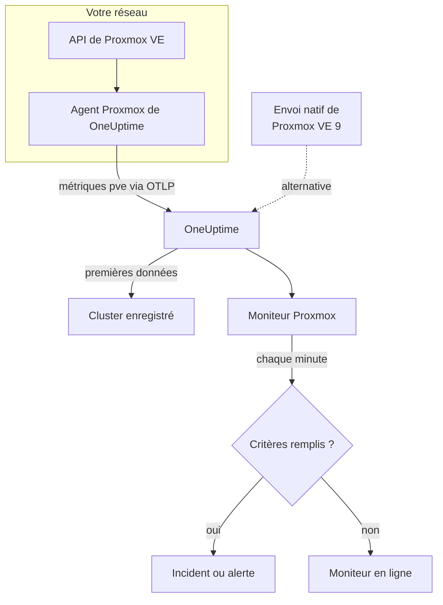

# Surveillance Proxmox

Un moniteur Proxmox surveille un cluster Proxmox VE – ses nœuds, ses VM et conteneurs LXC, son stockage, son état HA, la couverture par les tâches de sauvegarde et la réplication du stockage – et vous prévient quand un nœud passe hors ligne, qu'un invité s'arrête ou que le stockage se remplit. Il lit les métriques `pve_*` que collecte l'agent Proxmox de OneUptime, si bien que rien n'est sondé depuis l'extérieur.

:::cards
- [Créer le moniteur](#créer-un-moniteur-proxmox): Six étapes dans le tableau de bord.
- [Modèles](#modèles-dalerte-prêts-à-lemploi): Onze alertes prêtes à l'emploi, un incident par nœud, invité ou volume.
- [Identité des ressources](#identité-des-ressources): Comment cibler un seul nœud, invité ou volume de stockage.
- [Métriques](#métriques-collectées): Chaque série `pve_*` sur laquelle le moniteur peut alerter.
:::

## Fonctionnement

L'agent Proxmox de OneUptime s'exécute sur une machine qui peut joindre l'API de Proxmox VE. Toutes les 30 secondes, il interroge prometheus-pve-exporter avec les collecteurs de cluster et de nœud, étiquette chaque série avec la ressource qu'elle décrit et envoie les métriques à OneUptime via OTLP, marquées du nom du cluster, `proxmox.cluster.name`. Les premières données enregistrent le cluster. Proxmox VE 9 et les versions ultérieures peuvent aussi pousser les métriques nativement, sans rien installer ; voir [l'envoi natif](#lenvoi-natif-de-proxmox-ve).

Un moniteur Proxmox est lié à un cluster. Chaque minute, il exécute sa requête sur les métriques de ce cluster et compare le résultat à ses critères.

## Avant de commencer

- **Installez l'agent Proxmox** à un endroit qui peut joindre l'API de Proxmox VE, avec un jeton d'API en lecture seule. Le [guide de l'agent Proxmox](/docs/telemetry/proxmox) couvre le jeton, l'installation et l'envoi natif.
- **Vérifiez que le cluster est enregistré.** Il apparaît sous **Produits → Infrastructure → Proxmox → Tous les clusters**, nommé d'après le `PROXMOX_CLUSTER_NAME` de l'agent, environ une minute après la première collecte.

## Créer un moniteur Proxmox

:::steps
### Commencer un nouveau moniteur

Allez dans **Moniteurs** et cliquez sur **Créer un moniteur**.

### Choisir Proxmox

Sous **Type de moniteur**, cliquez sur **Plus de types de moniteurs** et choisissez **Proxmox** sous **Infrastructure**, ou tapez `proxmox` dans le champ de recherche. Saisissez un **Nom** – il est utilisé dans les titres des incidents et des alertes – et cliquez sur **Suivant**.

### Choisir le cluster

Sous **Proxmox Monitor Configuration**, choisissez le cluster dans **Cluster Proxmox**. Chaque cluster qui a envoyé des données figure dans la liste.

### Choisir ce qu'il faut surveiller

Choisissez l'un des trois onglets :

- **Quick Setup** – cliquez sur un [modèle](#modèles-dalerte-prêts-à-lemploi). Il définit les métriques, les filtres, l'agrégation, la plage temporelle et les seuils, et remplace les critères plus bas par les siens. Vous pouvez toujours changer la **Plage temporelle**.
- **Custom Metric** – choisissez une métrique dans **Proxmox Metric**, puis définissez l'**Agrégation** et la **Plage temporelle**. Les [filtres](#paramètres-du-moniteur) la restreignent à un type de ressource ou à une seule ressource.
- **Avancé** – construisez vous-même des requêtes et des formules sous **Sélectionner les métriques**, par exemple un pourcentage de mémoire à partir de `pve_memory_usage_bytes / pve_memory_size_bytes`. Utilisez **Regrouper par** `id` pour juger chaque ressource séparément.

### Vérifier les critères

Ouvrez chaque critère sous **Critères du moniteur** et vérifiez sa **Métrique**, son **Agrégation**, sa **Condition** et son **Threshold**. Un modèle les remplit. Avec **Custom Metric** ou **Avancé**, le moniteur commence avec les [critères par défaut](#critères-par-défaut), qui ne remarquent qu'une métrique tombant à zéro ; définissez donc votre propre seuil.

### Créer le moniteur

Cliquez sur **Créer un moniteur**. OneUptime ouvre la page du moniteur et l'évalue chaque minute. Les incidents et alertes qu'il déclenche sont aussi listés sur les pages **Incidents** et **Alertes** du cluster.
:::

> [!TIP]
> Pour configurer plusieurs modèles à la fois, ouvrez le cluster depuis **Produits → Infrastructure → Proxmox** et allez dans **Recommendations**. Choisissez les modèles voulus, choisissez qui est alerté, et OneUptime crée un moniteur par modèle.

## Paramètres du moniteur

| Champ | Onglet | Ce qu'il fait |
| --- | --- | --- |
| **Cluster Proxmox** | Tous | Obligatoire. Limite chaque requête à `resource.proxmox.cluster.name`. |
| **Portée de la ressource** | Custom Metric, Avancé | Facultatif. **Nœud**, **Invité (VM / conteneur)**, **Stockage** ou **Cluster** – une correspondance exacte sur `pve.scope`. |
| **PVE ID** | Custom Metric, Avancé | Facultatif. Correspondance exacte sur `pve.id` : un nom de nœud (`pve1`), un VMID (`100`) ou `<node>/<storage>` (`pve1/local`). Associez-le à une portée pour cibler une seule ressource. |
| **Nom du nœud** | Custom Metric, Avancé | Facultatif. Uniquement les propres séries d'un nœud (`pve.scope = node` et `pve.id`). Il ne peut pas sélectionner les invités ni le stockage de ce nœud. |
| **ID de l'invité** | Custom Metric, Avancé | Facultatif. Correspondance exacte sur l'étiquette brute `id`, comme `qemu/100` ou `lxc/101`. Quand il est défini, les autres filtres sont ignorés. |
| **Proxmox Metric** | Custom Metric | Une métrique du [catalogue](#métriques-collectées). |
| **Agrégation** | Custom Metric | Comment les mesures sont combinées : **Moyenne**, **Maximum**, **Minimum**, **Somme** ou **Comptage**. Commence à l'agrégation habituelle de la métrique. |
| **Plage temporelle** | Tous | La fenêtre glissante que lit la requête, de **Past 1 Minute** à **Past 365 Days**. Un nouveau moniteur commence à **Past 1 Minute** ; les modèles définissent la leur. |
| **Sélectionner les métriques** | Avancé | Le constructeur de requêtes : **Métrique**, **Agréger par**, **Filtrer par attributs**, **Regrouper par**, plus **Ajouter une métrique** et **Ajouter une formule** pour combiner des requêtes. |

## Identité des ressources

Chaque série porte une étiquette de point de données `id` qui nomme la ressource Proxmox à laquelle elle appartient :

| Valeur de `id` | Ressource |
| --- | --- |
| `node/<name>` | Un nœud du cluster, par exemple `node/pve1`. |
| `qemu/<vmid>` | Une machine virtuelle QEMU, par exemple `qemu/100`. |
| `lxc/<vmid>` | Un conteneur LXC, par exemple `lxc/101`. |
| `storage/<node>/<storage>` | Un volume de stockage sur un nœud, par exemple `storage/pve1/local`. |

Deux exceptions : les séries de réplication (`pve_replication_*`) portent l'identifiant de la **tâche** de réplication dans `id` (par exemple `100-0`), et `pve_not_backed_up_total`, à l'échelle du cluster, n'a pas d'`id` du tout.

Les filtres comparent par égalité, et non par préfixe ; l'agent découpe donc aussi `id` en trois attributs sur lesquels vous pouvez filtrer. Les modèles s'appuient dessus :

| Attribut | Valeurs | Pour `qemu/100` |
| --- | --- | --- |
| `pve.scope` | `node`, `guest`, `storage`, `cluster` (`qemu` et `lxc` sont tous deux `guest`) | `guest` |
| `pve.type` | `node`, `qemu`, `lxc`, `storage` | `qemu` |
| `pve.id` | Tout ce qui suit le premier `/` de `id` (`pve1`, `100`, `pve1/local`) | `100` |

Filtrez sur `pve.scope` ou `pve.type` pour un type de ressource, sur `pve.id` ou `id` pour une seule ressource, et regroupez par `id` pour juger chaque ressource séparément.

## Modèles d'alerte prêts à l'emploi

**Quick Setup** propose 11 modèles. Chacun construit un moniteur complet – requêtes, filtres d'attributs, un regroupement, un critère qui se déclenche et un autre qui rétablit. La plupart regroupent par `id`, si bien que chaque nœud, invité, volume ou tâche reçoit son propre incident et sa propre alerte. Les seuils sont des points de départ que vous pouvez modifier.

Les modèles lisent les 5 dernières minutes, sauf indication contraire dans le tableau. Un critère ne se déclenche que si la condition est remplie à chaque minute de sa fenêtre, et un critère à seuil se rétablit 10 % au-delà de son seuil pour qu'une valeur qui oscille autour de la limite ne bascule pas sans cesse.

| Modèle | Gravité | Surveille | Se déclenche quand | Se rétablit quand |
| --- | --- | --- | --- | --- |
| Node Offline | Critique | `pve_up` pour `pve.scope = node`, Min par `id` | Sous 1 | À 1 |
| Guest Down | Warning | `pve_up` et `pve_onboot_status` pour `pve.scope = guest`, Min par `id` | `pve_up` est sous 1 alors que `pve_onboot_status` vaut 1 | `pve_up` est revenu à 1, ou le démarrage au boot est désactivé |
| Cluster Quorum at Risk | Critique | `pve_up` ÷ `pve_node_info` × 100 pour `pve.scope = node` (tous deux Somme) : la part des nœuds en ligne | 50 % ou moins | Au-dessus de 55 % |
| High Node CPU Usage | Warning | `pve_cpu_usage_ratio` pour `pve.scope = node`, Avg par `id` | Au-dessus de 0,9 (90 % des cœurs du nœud) | À 0,81 ou moins |
| High Node Memory Usage | Warning | `pve_memory_usage_bytes` ÷ `pve_memory_size_bytes` × 100 pour `pve.scope = node`, par `id` | Au-dessus de 85 % | À 76,5 % ou moins |
| High Guest CPU Usage | Warning | `pve_cpu_usage_ratio` pour `pve.scope = guest`, Avg par `id`, 15 dernières minutes | Au-dessus de 0,95 (95 % de ses vCPU) pendant les 15 minutes | À 0,855 ou moins |
| Storage Near Full | Warning | `pve_disk_usage_bytes` ÷ `pve_disk_size_bytes` × 100 pour `pve.scope = storage`, par `id` | Au-dessus de 85 % | À 76,5 % ou moins |
| Container Root Disk Near Full | Warning | Le même ratio de disque pour `pve.type = lxc`, par `id` | Au-dessus de 90 % | À 81 % ou moins |
| HA Resource in Error State | Critique | `pve_ha_state` pour `state = error`, Max par `id` | Au-dessus de 0 | À 0 |
| Guest Not Backed Up | Warning | `pve_not_backed_up_total`, Max (une seule série pour le cluster) | Au-dessus de 0 | À 0 |
| Replication Failing | Critique | `pve_replication_failed_syncs`, Max par `id` (l'identifiant de la tâche) | Au-dessus de 0 | À 0 |

**Gravité** est le libellé qu'affiche le sélecteur. L'incident et l'alerte qu'un modèle crée commencent avec la gravité d'incident et d'alerte la plus élevée de votre projet ; changez-les dans les critères.

- **Les modèles de panne utilisent Minimum**, si bien qu'une seule collecte où la ressource était en panne les déclenche au lieu d'être masquée par les collectes où elle fonctionnait.
- **Guest Down** ne regarde que les invités configurés pour démarrer au boot, si bien qu'un invité que vous avez arrêté volontairement n'alerte jamais personne.
- **Cluster Quorum at Risk** est une approximation : pve-exporter n'a pas de métrique corosync, le modèle compte donc les nœuds en ligne.
- **High Guest CPU Usage** est plus élevé et plus lent que le modèle des nœuds : un invité est censé utiliser ses vCPU, donc seul un invité qui ne redescend jamais déclenche une alerte.
- **Les formules de ratio** prennent la **Somme** des deux côtés. Les deux proviennent de la même collecte, le résultat est donc un vrai pourcentage.
- **Container Root Disk Near Full** exclut les VM QEMU : leur utilisation de disque vaut 0 sans l'agent invité QEMU.
- **Guest Not Backed Up** ne couvre que l'appartenance aux tâches de sauvegarde. pve-exporter n'indique pas si les sauvegardes ont tourné ni si elles ont réussi ; regroupez `pve_not_backed_up_info` par `id` pour lister les invités.
- **L'obsolescence de la réplication** (maintenant moins la dernière synchronisation) ne peut pas déclencher d'alerte, car les critères n'ont pas d'arithmétique sur l'heure. La page **Vue d'ensemble** du cluster l'affiche ; alertez plutôt avec **Replication Failing**.

### L'envoi natif de Proxmox VE

Proxmox VE 9 et les versions ultérieures peuvent pousser les métriques via leur serveur de métriques OpenTelemetry intégré, sans rien installer – voir le [guide de l'agent Proxmox](/docs/telemetry/proxmox). OneUptime transforme cet envoi en les mêmes séries `pve_*`, si bien que le catalogue et les modèles de CPU, de mémoire et de stockage fonctionnent avec lui.

**Node Offline** et **Cluster Quorum at Risk** fonctionnent aussi : chaque nœud n'envoie que son propre statut, donc un nœud qui cesse de remonter des données est signalé en panne (`pve_up` = 0) par les nœuds encore en vie – voir [Quand un nœud cesse de remonter des données](/docs/telemetry/proxmox#when-a-node-stops-reporting). **Guest Down**, **HA Resource in Error State**, **Guest Not Backed Up** et **Replication Failing** ont besoin de données que seul l'agent collecte.

## Métriques collectées

L'agent interroge prometheus-pve-exporter toutes les 30 secondes avec les collecteurs de cluster et de nœud, ce qui couvre aussi les collecteurs `backup-info` et `replication` de l'exportateur (tous deux activés par défaut).

### Disponibilité

| Métrique | Unité | Description |
| --- | --- | --- |
| `pve_up` | — | 1 quand le nœud ou l'invité est actif ou en cours d'exécution, 0 sinon. |
| `pve_uptime_seconds` | seconds | Durée de fonctionnement du nœud ou de l'invité. |
| `pve_version_info` | count | La version de Proxmox VE, dans ses étiquettes. Toujours 1. |

### Nœud

| Métrique | Unité | Description |
| --- | --- | --- |
| `pve_node_info` | count | Métadonnées du nœud, toujours 1. Additionnez-la pour compter les nœuds qui remontent des données. |
| `pve_cpu_usage_ratio` | ratio | CPU utilisé, en ratio de 0 à 1 du CPU disponible. |
| `pve_cpu_usage_limit` | cores | CPU disponible, en cœurs. Pour un invité, ses vCPU. |
| `pve_memory_usage_bytes` | bytes | Mémoire utilisée. |
| `pve_memory_size_bytes` | bytes | Mémoire totale. |

Les séries de CPU et de mémoire sont aussi remontées pour chaque invité, sur les identifiants `qemu/*` et `lxc/*`.

### Invité

| Métrique | Unité | Description |
| --- | --- | --- |
| `pve_guest_info` | count | Métadonnées de l'invité (nom, nœud, type `qemu` ou `lxc`) dans les étiquettes. Toujours 1. |
| `pve_network_receive_bytes` | bytes | Octets reçus par l'invité. Un compteur sur toute la durée de vie. |
| `pve_network_transmit_bytes` | bytes | Octets envoyés par l'invité. Un compteur sur toute la durée de vie. |
| `pve_disk_read_bytes` | bytes | Octets lus sur le disque par l'invité. Un compteur sur toute la durée de vie. |
| `pve_disk_write_bytes` | bytes | Octets écrits sur le disque par l'invité. Un compteur sur toute la durée de vie. |
| `pve_onboot_status` | count | 1 quand l'invité démarre au boot du nœud. Un invité arrêté avec ce réglage est généralement une panne imprévue. |

### Stockage

| Métrique | Unité | Description |
| --- | --- | --- |
| `pve_disk_usage_bytes` | bytes | Octets utilisés sur le disque ou le stockage. Pour un invité QEMU, vaut 0 sauf si l'agent invité QEMU est installé. |
| `pve_disk_size_bytes` | bytes | Taille totale du disque ou du stockage. |
| `pve_storage_info` | count | Métadonnées du stockage, toujours 1. Additionnez-la pour compter les volumes de stockage. |

### HA

| Métrique | Unité | Description |
| --- | --- | --- |
| `pve_ha_state` | — | Une série par état HA (`started`, `stopped`, `error`, …) pour chaque ressource HA, à 1 sur son état actuel. Filtrez sur l'étiquette `state` pour alerter sur un état. |

### Sauvegarde

Proviennent du collecteur `backup-info` de l'exportateur, au niveau du cluster. Elles ne rendent compte que de la couverture par les **tâches** de sauvegarde :

| Métrique | Unité | Description |
| --- | --- | --- |
| `pve_not_backed_up_total` | count | Invités ne figurant dans aucune tâche de sauvegarde. Une seule série pour le cluster, sans `id`. |
| `pve_not_backed_up_info` | count | Une série par invité non couvert, toujours 1, étiquetée avec l'`id` de l'invité. Elle disparaît dès que l'invité rejoint une tâche de sauvegarde. |

### Réplication

Proviennent du collecteur `replication` de l'exportateur, au niveau des nœuds. Les séries n'existent que si le cluster a des tâches de réplication, et portent l'identifiant de la tâche dans `id` :

| Métrique | Unité | Description |
| --- | --- | --- |
| `pve_replication_failed_syncs` | count | Tentatives de synchronisation échouées d'affilée. Au-dessus de 0, la réplique devient obsolète. |
| `pve_replication_duration_seconds` | seconds | Durée de la dernière synchronisation. |
| `pve_replication_last_sync_timestamp_seconds` | seconds | Heure Unix de la dernière synchronisation **réussie**. |
| `pve_replication_last_try_timestamp_seconds` | seconds | Heure Unix de la dernière **tentative**. Plus récente que la dernière synchronisation, elle signifie que la dernière tentative a échoué. |
| `pve_replication_next_sync_timestamp_seconds` | seconds | Heure Unix de la prochaine synchronisation planifiée. |
| `pve_replication_info` | count | Métadonnées de la tâche – type, source, cible, invité – dans les étiquettes. Toujours 1. |

## Critères de surveillance

Un critère compare l'une des requêtes ou formules du moniteur à un seuil. Les critères d'un moniteur Proxmox n'ont pas de **Type de filtre** : chaque règle vérifie la valeur de la métrique, avec ces champs.

| Champ | Ce qu'il fait |
| --- | --- |
| **Métrique** | La requête ou la formule à vérifier, par son nom de variable. |
| **Agrégation** | Comment les valeurs de la fenêtre deviennent une seule réponse : **Moyenne**, **Somme**, **Maximum Value**, **Minimum Value**, **All Values** (chaque valeur doit correspondre) ou **Any Value** (une seule suffit). |
| **Condition** | **Greater Than**, **Less Than**, **Greater Than Or Equal To**, **Less Than Or Equal To** ou **Equal To** – ou une condition d'anomalie : **Anomalously High**, **Anomalously Low** ou **Anomalous**. |
| **Threshold** | La valeur de comparaison. Une liste d'unités se trouve à côté quand la métrique a une unité. Non affiché pour les conditions d'anomalie. |
| **Sensibilité** | Conditions d'anomalie uniquement. **Faible** (4σ), **Moyen** (3σ, la valeur par défaut) ou **Élevé** (2σ). |
| **Fenêtre de référence** | Conditions d'anomalie uniquement. 14 jours (la valeur par défaut), 28, 60 ou 90 jours d'historique. |
| **En l'absence de données** | Sous **Plus de champs**. Ce qui se passe quand la fenêtre n'a aucune mesure : **Ignore** (par défaut), **Treat As Zero** ou **Déclencheur**. |

Les conditions d'anomalie comparent chaque valeur à la même heure de la semaine dans la référence. Elles restent dans un état « Learning », et ne déclenchent rien, tant que la fenêtre de référence ne contient pas assez d'historique.

Chaque critère indique aussi quoi faire quand il correspond : changer le statut du moniteur, créer une alerte ou déclarer un incident. Les critères sont vérifiés de haut en bas, et le premier qui correspond l'emporte.

### Critères par défaut

Un moniteur que vous ne créez pas à partir d'un modèle commence avec deux critères :

| Ordre | Critère | Correspond quand | Ensuite |
| --- | --- | --- | --- |
| 1 | Check if _monitor name_ is offline | Une valeur quelconque de la première requête vaut `0` | Marque le moniteur **Hors ligne** et déclare l'incident « _monitor name_ is offline », qui se résout de lui-même quand le moniteur se rétablit. |
| 2 | Check if _monitor name_ is online | Une valeur quelconque est au-dessus de `0` | Marque le moniteur **Opérationnel**. |

> [!IMPORTANT]
> Le silence ne correspond à aucun des deux critères : un cluster qui cesse d'envoyer des données laisse le moniteur tel qu'il était. Pour être prévenu quand les données s'arrêtent, réglez **En l'absence de données** sur **Déclencheur** dans un critère. Le temps pendant lequel OneUptime lui-même ne recevait pas de données n'est jamais une absence de données : une vérification dont la fenêtre en contient attend à la place, comme l'explique [Quand OneUptime ne reçoit pas de données](/docs/monitor/when-oneuptime-is-not-receiving).

## Dépannage

:::details Le cluster n'est pas dans la liste Cluster Proxmox
Les clusters s'enregistrent eux-mêmes à partir des données de l'agent. Vérifiez que l'agent tourne et envoie des données (voir le [guide de l'agent Proxmox](/docs/telemetry/proxmox)), et que `PROXMOX_CLUSTER_NAME` est défini.
:::

:::details Les métriques des invités manquent
Les séries des invités proviennent du collecteur de cluster de l'exportateur, que la configuration fournie active avec le paramètre de collecte `cluster=1`. Si vous avez modifié la configuration des collecteurs, rétablissez-la.
:::

:::details High Node CPU Usage ne se déclenche jamais
Le modèle fait la moyenne de `pve_cpu_usage_ratio` par `id`, si bien que chaque nœud est vérifié séparément. Si vous avez construit votre propre requête, regroupez-la par `id` : une moyenne sur tous les nœuds est tirée vers le bas par les nœuds inactifs.
:::

:::details Node Offline continue de se déclencher pour un nœud retiré du cluster
Avec l'envoi natif de Proxmox VE, un nœud retiré du cluster ressemble à un nœud tombé en panne : il a cessé de remonter des données, si bien que les nœuds encore en vie continuent de le signaler en panne. Ouvrez la page du nœud et cliquez sur **Remove Node** – le nœud disparaît et son alerte se résout. Sinon, il reste Hors ligne jusqu'à 7 jours. L'agent n'a pas ce problème : il interroge le cluster, qui ne liste plus le nœud.
:::

:::details Les métriques de sauvegarde ou de réplication manquent
`pve_not_backed_up_*` provient du collecteur `backup-info` de l'exportateur et `pve_replication_*` de son collecteur `replication`. Les deux sont activés par défaut et couverts par les paramètres de collecte `cluster=1` et `node=1` de la configuration fournie. Si vous exécutez votre propre exportateur, vérifiez que vous ne les avez pas désactivés. `pve_replication_*` n'existe que si le cluster a des tâches de réplication du stockage.
:::

:::details Les compteurs comme pve_network_receive_bytes ne font que croître
Les séries d'E/S réseau et disque sont des compteurs sur toute la durée de vie, et les critères comparent des valeurs brutes : il n'y a pas d'opérateur de taux, et **Convertir en taux par seconde** dans le constructeur de requêtes ne change que le graphique. Tracez-les comme un taux, ou alertez sur leur croissance avec une formule, comme une requête **Maximum** moins une requête **Minimum** du même compteur.
:::

## Étapes suivantes

:::cards
- [Agent Proxmox](/docs/telemetry/proxmox): Installer l'agent, ou configurer l'envoi natif.
- [Surveillance Ceph](/docs/monitor/ceph-monitor): Surveiller le stockage Ceph derrière un cluster Proxmox.
- [Surveillance VMware](/docs/monitor/vmware-monitor): Le même type de moniteur pour vSphere.
- [Vue d'ensemble des incidents](/docs/incidents/index): Ce qui se passe après qu'un critère a déclaré un incident.
:::
