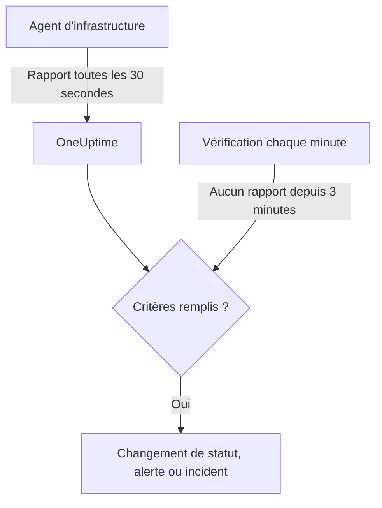

# Surveillance de serveur / VM

Un moniteur Serveur / VM surveille une machine grâce à l'agent d'infrastructure OneUptime (`oneuptime-infrastructure-agent`), un petit service qui envoie à OneUptime, toutes les 30 secondes, le CPU, la mémoire, les disques, la charge, le réseau et les processus en cours. Cette page explique comment connecter l'agent à un moniteur Serveur / VM, ce que l'agent remonte et comment écrire les critères qui décident quand le serveur est en ligne ou hors ligne.

> [!IMPORTANT]
> **Créer un moniteur** ne propose plus **Server / VM**. Les moniteurs Serveur / VM existants continuent de fonctionner, et tout ce qui figure sur cette page s'applique à eux. Pour surveiller un nouveau serveur, créez plutôt un [moniteur d'hôte](/docs/monitor/host-monitor) : il alerte sur les métriques d'hôte qu'envoie le [collecteur OpenTelemetry sur l'hôte](/docs/telemetry/host-otel-collector).

:::cards
- [Connecter l'agent](#connecter-lagent): L'installer, lui donner la clé secrète du moniteur et le démarrer.
- [Ce que remonte l'agent](#ce-que-remonte-lagent): CPU, mémoire, disques, charge, réseau et processus.
- [Critères de surveillance](#critères-de-surveillance): Décider quand le serveur est considéré en ligne ou hors ligne.
- [Dépannage](#dépannage): L'agent ne remonte rien, ou le moniteur ne passe jamais hors ligne.
:::

## Fonctionnement

L'agent s'exécute comme service système. Toutes les 30 secondes, il collecte un rapport et l'envoie à votre URL OneUptime, signé avec la clé secrète du moniteur. OneUptime enregistre les valeurs comme métriques du moniteur et vérifie le rapport par rapport aux critères du moniteur.

Le silence est vérifié séparément. Chaque minute, OneUptime réévalue les critères **Is Online** de chaque moniteur Serveur / VM qui n'a rien envoyé depuis 3 minutes ou plus, et un serveur silencieux plus longtemps que ses critères ne le permettent (3 minutes par défaut) est considéré hors ligne. Un moniteur sans critère **Is Online** n'est jamais marqué hors ligne simplement parce que l'agent s'est tu. Seul le temps pendant lequel OneUptime recevait des données compte dans ce silence : le temps pendant lequel OneUptime lui-même redémarrait, était mis à jour ou rattrapait son retard ne compte pas, comme l'explique [Quand OneUptime ne reçoit pas de données](/docs/monitor/when-oneuptime-is-not-receiving).



## Avant de commencer

- Un moniteur Serveur / VM dans votre projet.
- L'autorisation de modifier les moniteurs. La clé secrète, et les commandes de configuration qui la contiennent, ne sont montrées qu'aux personnes qui peuvent modifier les moniteurs.
- Les droits root (Linux, macOS) ou Administrateur (Windows) sur le serveur. L'agent s'installe comme service système.
- Un accès HTTPS sortant du serveur vers votre URL OneUptime, directement ou via un proxy HTTP.

## Connecter l'agent

Les commandes ci-dessous utilisent `https://oneuptime.com` et `YOUR_SECRET_KEY`. Les commandes de configuration du moniteur contiennent déjà votre URL OneUptime et la clé secrète du moniteur ; copiez-les donc depuis le moniteur quand c'est possible.

:::steps
### Ouvrir les commandes de configuration du moniteur

Allez dans **Moniteurs**, ouvrez le moniteur Serveur / VM et sélectionnez **Documentation**. Les cartes **Set up your Server Monitor (Linux/Mac)** et **Set up your Server Monitor (Windows)** contiennent les commandes de ce moniteur. Tant que l'agent n'a pas envoyé son premier rapport, la **Vue d'ensemble** du moniteur les affiche aussi.

### Installer l'agent

:::tabs
@tab Linux
```bash
curl -sSL https://oneuptime.com/docs/static/scripts/infrastructure-agent/install.sh | sudo bash
```
@tab macOS
```bash
curl -sSL https://oneuptime.com/docs/static/scripts/infrastructure-agent/install.sh | sudo bash
```
@tab Windows
1. Téléchargez l'agent depuis la [dernière version GitHub](https://github.com/OneUptime/oneuptime/releases/latest) : `oneuptime-infrastructure-agent_windows_amd64.zip` pour x64, ou `oneuptime-infrastructure-agent_windows_arm64.zip` pour ARM64.
2. Extrayez le fichier ZIP. Il contient `oneuptime-infrastructure-agent.exe`.
3. Ouvrez l'**Invite de commandes** en tant qu'administrateur dans le dossier où vous l'avez extrait.
:::

Le script d'installation télécharge la dernière version pour votre système d'exploitation et votre processeur (x86-64 ou ARM64) et place le binaire `oneuptime-infrastructure-agent` dans `$HOME/bin`. Sur une installation auto-hébergée, le script est servi par votre propre URL OneUptime.

### Le connecter au moniteur

:::tabs
@tab Linux
```bash
sudo oneuptime-infrastructure-agent configure --secret-key=YOUR_SECRET_KEY --oneuptime-url=https://oneuptime.com
```
@tab macOS
```bash
sudo oneuptime-infrastructure-agent configure --secret-key=YOUR_SECRET_KEY --oneuptime-url=https://oneuptime.com
```
@tab Windows
```shell
oneuptime-infrastructure-agent configure --secret-key=YOUR_SECRET_KEY --oneuptime-url=https://oneuptime.com
```
:::

`configure` enregistre la clé secrète et l'URL dans le fichier de configuration de l'agent et installe l'agent comme service système. Les deux options sont obligatoires. Sur une installation auto-hébergée, remplacez `https://oneuptime.com` par votre propre URL.

Si le serveur accède à Internet via un proxy, ajoutez `--proxy-url` :

```bash
sudo oneuptime-infrastructure-agent configure --proxy-url=http://proxy.example.com:8080 --secret-key=YOUR_SECRET_KEY --oneuptime-url=https://oneuptime.com
```

### Démarrer l'agent

:::tabs
@tab Linux
```bash
sudo oneuptime-infrastructure-agent start
```
@tab macOS
```bash
sudo oneuptime-infrastructure-agent start
```
@tab Windows
```shell
oneuptime-infrastructure-agent start
```
:::

Au démarrage, l'agent vérifie la clé secrète auprès de OneUptime et envoie immédiatement son premier rapport.

### Vérifier qu'il remonte des données

Exécutez `sudo oneuptime-infrastructure-agent status` (sans `sudo` sous Windows) : il affiche `Service is running`. Dans OneUptime, la **Vue d'ensemble** du moniteur cesse d'afficher les commandes de configuration dès que le premier rapport arrive, et son onglet **Métriques** commence à tracer le serveur.
:::

## Référence de l'agent

### Commandes

| Commande | Ce qu'elle fait |
| --- | --- |
| `configure --secret-key=<key> --oneuptime-url=<url>` | Enregistre les paramètres et installe l'agent comme service système. Ajoutez `--proxy-url=<url>` pour envoyer les rapports via un proxy. |
| `start` | Démarre le service. Il refuse de démarrer tant que `configure` n'a pas été exécuté. |
| `stop` | Arrête le service. |
| `restart` | Redémarre le service. |
| `status` | Indique si le service est en cours d'exécution ou arrêté. |
| `logs` | Affiche les 100 dernières lignes du journal de l'agent. `-n <lines>` affiche un autre nombre de lignes, et `-f` suit les nouvelles lignes. |
| `uninstall` | Supprime le service et efface le fichier de configuration de l'agent. |
| `help` | Liste les commandes. |

Exécutez-les avec `sudo` sous Linux et macOS, et depuis une **Invite de commandes** ouverte en tant qu'administrateur sous Windows. Pour changer la clé secrète, l'URL ou le proxy d'un agent configuré, exécutez `stop` et `uninstall`, puis de nouveau `configure` et `start`.

### Fichiers

| Fichier | Linux et macOS | Windows |
| --- | --- | --- |
| Configuration | `/etc/oneuptime-infrastructure-agent/config.json` | `%PROGRAMDATA%\oneuptime-infrastructure-agent\config.json` |
| Journal | `/var/log/oneuptime-infrastructure-agent/oneuptime-infrastructure-agent.log` | `%PROGRAMDATA%\oneuptime-infrastructure-agent\oneuptime-infrastructure-agent.log` |

Quand l'agent ne peut pas écrire dans ces répertoires, il utilise `~/.oneuptime-infrastructure-agent/` à la place. Les variables d'environnement `ONEUPTIME_AGENT_CONFIG_PATH` et `ONEUPTIME_AGENT_LOG_PATH` définissent explicitement l'un ou l'autre chemin.

## Ce que remonte l'agent

Chaque rapport contient le nom d'hôte du serveur et :

| Domaine | Ce qui est remonté |
| --- | --- |
| CPU | Utilisation en %, nombre de cœurs, utilisation par cœur, et temps passé en user, system, idle, attente d'E/S, steal, nice, IRQ et IRQ logicielles |
| Mémoire | Mémoire totale, utilisée, libre et disponible, tampons et cache, utilisation en %, et swap total, utilisé, libre et utilisation en % |
| Disques | Pour chaque disque monté : chemin de montage, périphérique, système de fichiers, espace total, utilisé et libre, utilisation en %, octets et opérations lus et écrits, et temps d'E/S |
| Charge | Charges moyennes sur 1, 5 et 15 minutes |
| Réseau | Pour chaque interface : octets et paquets envoyés et reçus, erreurs et pertes en entrée et en sortie ; plus les connexions établies et en écoute |
| Hôte | Système d'exploitation, plateforme et version, version et architecture du noyau, durée de fonctionnement, heure de démarrage, virtualisation et nombre de processus |
| Processus | Chaque processus en cours : nom, PID, commande, CPU en %, mémoire, statut, threads, utilisateur et heure de démarrage |

Les valeurs que le système d'exploitation ne fournit pas sont omises. L'onglet **Métriques** du moniteur trace la disponibilité, le CPU, la mémoire, l'utilisation et les E/S des disques, les charges moyennes, le swap, le trafic et les erreurs réseau, les connexions, la durée de fonctionnement et le nombre de processus.

## Critères de surveillance

Les critères décident quand le moniteur est en ligne, dégradé ou hors ligne, et quand il ouvre une alerte ou un incident. Chaque filtre d'un critère a un **Type de filtre**, une **Condition de filtre** et, pour la plupart des types, une valeur.

| Type de filtre | Ce qu'il vérifie | Conditions de filtre |
| --- | --- | --- |
| Is Online | Si l'agent a envoyé un rapport récemment (dans les 3 dernières minutes, par défaut) | Vrai, Faux |
| CPU Usage (in %) | Utilisation globale du CPU | Greater Than, Less Than, Greater Than Or Equal To, Less Than Or Equal To |
| Memory Usage (in %) | Mémoire utilisée | Comme pour le CPU |
| Disk Usage (in %) | Utilisation du disque indiqué dans **Chemin du disque** | Comme pour le CPU |
| Swap Usage (in %) | Swap utilisé | Comme pour le CPU |
| CPU IO Wait (in %) | Part du temps CPU passée à attendre les E/S | Comme pour le CPU |
| Load Average (1 minute) | Charge moyenne de la dernière minute | Comme pour le CPU |
| Load Average (5 minute) | Charge moyenne des 5 dernières minutes | Comme pour le CPU |
| Load Average (15 minute) | Charge moyenne des 15 dernières minutes | Comme pour le CPU |
| Server Process Name | Si un processus portant ce nom est en cours d'exécution (sans tenir compte de la casse) | Is Executing, Is Not Executing |
| Server Process Command | Si un processus avec exactement cette ligne de commande est en cours d'exécution (sans tenir compte de la casse) | Is Executing, Is Not Executing |
| Server Process PID | Si un processus avec ce PID est en cours d'exécution | Is Executing, Is Not Executing |

**Chemin du disque** accepte un point de montage ou un périphérique, comme `/`, `/mnt/data`, `C:\` ou `/dev/sda1` ; laissé vide, il vaut `/`. Saisissez `*` pour vérifier chaque disque que l'agent remonte : chaque disque qui dépasse le seuil reçoit sa propre alerte, si bien qu'un deuxième disque qui se remplit n'est pas caché derrière l'alerte ouverte du premier.

### Évaluer sur une période

**Évaluer ce critère sur une période donnée** est une case à cocher distincte dans le formulaire de critère, et non une condition de filtre. Elle est disponible pour **Is Online** et pour chaque type de filtre numérique. Cochez-la pour comparer un agrégat – choisi sous **Évaluer** (Moyenne, Somme, Maximum Value, Minimum Value, All Values, Any Value) sur la fenêtre définie par **Pour les dernières (en minutes)** – au lieu de la valeur de la dernière vérification. Sur un filtre **Is Online**, la fenêtre est la durée pendant laquelle l'agent peut rester silencieux avant que le serveur soit considéré hors ligne.

**All Values** ne correspond qu'une fois la fenêtre réellement couverte par des données. Un moniteur qui vient d'être créé, ou dont les vérifications ont cessé d'être enregistrées, n'a pas assez d'historique pour dire quoi que ce soit des N dernières minutes ; le critère attend donc au lieu de correspondre sur la seule mesure dont il dispose. **Any Value** est le réglage pour « prévenez-moi dès qu'une seule vérification dépasse » et se déclenche toujours immédiatement.

**En l'absence de données** contrôle ce qui se passe tant que la fenêtre ne peut pas étayer le critère :

| En l'absence de données | Comportement | À utiliser pour |
| --- | --- | --- |
| **Ignore** (par défaut) | Le critère ne correspond pas. | Les alertes à seuil ordinaires. |
| **Déclencheur** | Les données manquantes sont traitées comme le problème. | Les vérifications de type heartbeat, où le silence est en soi une panne. |
| **Treat As Zero** | La fenêtre est comparée comme un zéro unique. | Les compteurs, où « aucun événement » signifie vraiment zéro. |

> [!TIP]
> Le CPU et la charge connaissent sans cesse de brefs pics. Évaluez-les sur quelques minutes avec **Moyenne** ou **All Values** au lieu d'alerter sur un seul rapport.

### Exemples de critères

| Objectif | Type de filtre | Condition de filtre | Valeur |
| --- | --- | --- | --- |
| Marquer le serveur hors ligne quand l'agent cesse d'envoyer des rapports | Is Online | Faux | — |
| Alerter quand l'utilisation du CPU dépasse 90 % | CPU Usage (in %) | Greater Than | `90` |
| Alerter quand le disque racine est plein à plus de 85 % | Disk Usage (in %), **Chemin du disque** `/` | Greater Than | `85` |
| Alerter pour tout disque plein à plus de 85 %, une alerte par disque | Disk Usage (in %), **Chemin du disque** `*` | Greater Than | `85` |
| Alerter quand l'utilisation de la mémoire dépasse 80 % | Memory Usage (in %) | Greater Than | `80` |
| Alerter quand nginx cesse de tourner | Server Process Name | Is Not Executing | `nginx` |

## Dépannage

:::details L'agent ne remonte rien
- Vérifiez que le service tourne : `sudo oneuptime-infrastructure-agent status`.
- Lisez son journal : `sudo oneuptime-infrastructure-agent logs -n 50`. Une ligne `Metrics successfully pushed to OneUptime server` signifie que les rapports passent.
- L'agent vérifie la clé secrète au démarrage et s'arrête si OneUptime la refuse, en journalisant `Secret key is invalid`. Comparez la clé avec celle de la page **Paramètres** du moniteur, sous **Réinitialiser la clé secrète du moniteur de serveur**.
- Assurez-vous que le serveur peut joindre votre URL OneUptime en HTTPS et qu'aucun pare-feu ne bloque les connexions sortantes.
:::

:::details `sudo` indique que la commande est introuvable
Le script d'installation place le binaire dans le `$HOME/bin` de l'utilisateur qui l'a exécuté, et affiche le répertoire utilisé. Lancez l'agent par son chemin complet, par exemple `sudo /root/bin/oneuptime-infrastructure-agent configure ...`. Pour l'installer plutôt dans un répertoire du chemin système, passez `-b` au script :

```bash
curl -sSL https://oneuptime.com/docs/static/scripts/infrastructure-agent/install.sh | sudo bash -s -- -b /usr/local/bin
```
:::

:::details `start` indique que la configuration du service est introuvable
`configure` n'a pas été exécuté, ou `uninstall` a supprimé sa configuration. Exécutez `configure` avec la clé secrète et l'URL, puis `start`.
:::

:::details Le moniteur ne passe jamais hors ligne quand le serveur est en panne
Seul un critère **Is Online** marque un serveur silencieux comme hors ligne. Ajoutez-en un avec la **Condition de filtre** réglée sur **Faux**, et définissez le statut de moniteur qu'il applique.
:::

:::details Les rapports ne passent pas le proxy
- Vérifiez l'URL et le port du proxy passés à `--proxy-url`.
- Assurez-vous que le proxy autorise les connexions vers votre URL OneUptime.
- Pour changer de proxy, exécutez `stop` et `uninstall`, puis `configure` avec la nouvelle `--proxy-url`, et `start`.
:::

## Étapes suivantes

:::cards
- [Surveillance des hôtes](/docs/monitor/host-monitor): Le moniteur à utiliser pour les nouveaux serveurs, fondé sur les métriques d'hôte OpenTelemetry.
- [Collecteur OpenTelemetry sur l'hôte](/docs/telemetry/host-otel-collector): Envoyer les métriques et journaux d'hôte depuis Linux, macOS et Windows.
- [Modèles d'incident et d'alerte](/docs/monitor/incident-alert-templating): Mettre les détails de CPU, de mémoire, de disque et de processus dans les titres d'incident.
:::
