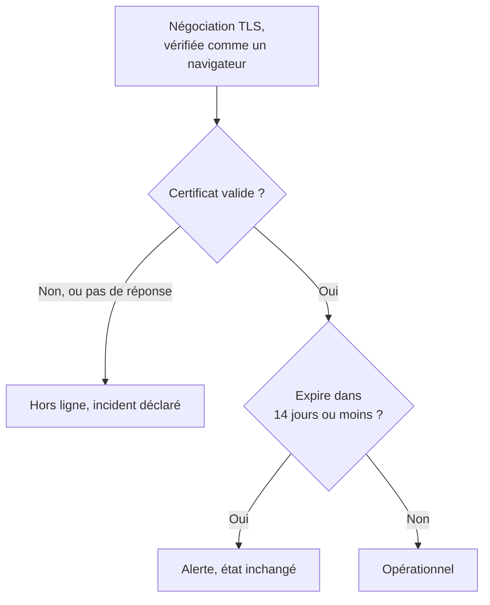

# Surveillance de certificat SSL

Un moniteur de certificat SSL vérifie les certificats TLS que présentent vos sites et services, comme le fait un navigateur, et vous avertit avant leur expiration. Il met aussi le moniteur hors ligne quand un certificat n'est plus valide : expiré, auto-signé, émis pour un autre nom d'hôte, ou par une autorité à laquelle les navigateurs ne font pas confiance.

:::cards
- [Créer le moniteur](#créer-un-moniteur-de-certificat-ssl): Six étapes dans le tableau de bord.
- [Critères par défaut](#critères-par-défaut): Un avertissement d'expiration 14 jours à l'avance, sans rien configurer.
- [Critères de surveillance](#critères-de-surveillance): Validité, expiration et certificats auto-signés.
- [Dépannage](#dépannage): Certificats auto-signés et internes.
:::

## Fonctionnement

À chaque vérification, une sonde ouvre une connexion TLS vers l'hôte et le port de l'URL, le port `443` sauf si l'URL en indique un autre, et vérifie le certificat comme le ferait un navigateur : un émetteur de confiance, un nom d'hôte qui correspond et des dates qui incluent aujourd'hui. Si le certificat échoue à la vérification, la sonde le lit quand même, donc sa date d'expiration, son émetteur et ses empreintes sont enregistrés dans tous les cas. Une connexion qui échoue, expire ou présente un certificat invalide est retentée, dans la limite du nombre de tentatives que vous autorisez. OneUptime passe ensuite le résultat au crible des critères du moniteur.

Une sonde qui a perdu sa propre connexion réseau ne rapporte aucun résultat, elle ne peut donc pas marquer votre certificat comme invalide.

## Avant de commencer

- **Un rôle qui peut créer des moniteurs** : Project Owner, Project Admin, Project Member, Monitor Admin ou Monitor Member, ou un rôle personnalisé avec l'autorisation Create Monitor.
- **Une sonde qui peut joindre l'hôte et le port.** Les sondes par défaut de votre projet sont choisies pour chaque nouveau moniteur. Un service sur un réseau privé a besoin d'une [sonde personnalisée](/docs/probe/custom-probe) dans ce réseau.

## Créer un moniteur de certificat SSL

:::steps
### Commencer un nouveau moniteur

Allez dans **Moniteurs** et cliquez sur **Créer un moniteur**. Sous **Type de moniteur**, choisissez **SSL Certificate**.

### Le nommer

Saisissez un **Nom**, comme `example.com certificate`, puis cliquez sur **Suivant**.

### Saisir l'URL

Dans **URL du site web**, saisissez le site dont le certificat doit être vérifié, comme `https://example.com`. Pour un service sur un autre port, indiquez-le : `https://example.com:8443`.

### Le tester

Cliquez sur **Tester le moniteur**, choisissez une sonde sous **Sélectionner la sonde** et cliquez sur **Exécuter le test**. **Résultat du test du moniteur** montre le certificat que la sonde a reçu, avec son émetteur et sa date d'expiration.

### Passer en revue les critères

**Critères du moniteur** commence avec les [critères par défaut](#critères-par-défaut) : hors ligne quand le certificat n'est pas valide, une alerte quand il expire dans 14 jours ou moins. Modifiez-les si besoin, puis cliquez sur **Suivant**.

### Choisir les sondes et créer

Gardez ou changez les **Sondes** et l'**Intervalle de surveillance** (il commence à **Toutes les 5 minutes** ; les moniteurs de certificat SSL se voient proposer 5 minutes ou plus), puis cliquez sur **Créer un moniteur**. La page du moniteur s'ouvre.
:::

## Options de configuration

| Champ | Par défaut | Ce qu'il faut saisir |
| --- | --- | --- |
| **URL du site web** | Aucune | Le site dont le certificat est vérifié, comme `https://example.com` ou `https://example.com:8443`. Seuls l'hôte et le port sont utilisés ; le chemin est ignoré. |
| **Délai d'expiration de la requête (secondes)** (sous **Plus de champs**) | `60` | Combien de temps attendre la négociation TLS à chaque tentative. Le maximum est de 60 secondes. |
| **Tentatives en cas d'échec** (sous **Plus de champs**) | Valeur par défaut de la sonde, généralement `3` | Combien de fois retenter une tentative échouée. Le maximum est 3. |

**Tentatives en cas d'échec** compte les nouvelles tentatives _après_ la première, donc `0` exécute la vérification une fois et `2` jusqu'à trois fois. Laissé vide, le champ prend la valeur par défaut de la sonde : 3, sauf si `PROBE_MONITOR_RETRY_LIMIT` de la sonde indique autre chose. Les échecs de connexion, les échecs de validation du certificat et les expirations sont tous retentés, avec une pause d'une seconde entre les tentatives.

## Critères de surveillance

Les critères décident quand le certificat compte comme bon, dégradé ou défaillant, et si cela déclare un incident ou crée une alerte. Chaque critère vérifie un ou plusieurs filtres :

| Filtre | Conditions | Ce qu'il vérifie |
| --- | --- | --- |
| **Is Valid Certificate** | **Vrai**, **Faux** | Le certificat passe les vérifications d'un navigateur : un émetteur de confiance, un nom d'hôte qui correspond et des dates qui incluent aujourd'hui. **Faux** quand le point de terminaison n'a pas répondu. |
| **Is Not A Valid Certificate** | **Vrai**, **Faux** | Le contraire de **Is Valid Certificate** : **Vrai** quand le certificat échoue à ces vérifications ou n'a pas pu être vérifié. |
| **Is Expired Certificate** | **Vrai**, **Faux** | La date d'expiration du certificat est passée. |
| **Is Self Signed Certificate** | **Vrai**, **Faux** | Le certificat, ou l'un de ceux de sa chaîne, est auto-signé. |
| **Expires In Days** | **Greater Than**, **Less Than**, **Greater Than Or Equal To**, **Less Than Or Equal To** | Les jours avant l'expiration du certificat. |
| **Expires In Hours** | **Greater Than**, **Less Than**, **Greater Than Or Equal To**, **Less Than Or Equal To** | Les heures avant l'expiration du certificat. |

**Expires In Days** compte des jours entiers : un certificat qui expire dans 14 jours et 20 heures a encore 14 jours. **Expires In Hours** compte des heures entières de la même manière.

Avec deux filtres ou plus, **Condition de correspondance** décide si **Tous** doivent correspondre ou si **Tout** filtre suffit. Les **Actions** d'un critère décident de ce qu'il fait : changer l'état du moniteur, créer une alerte, déclarer un incident, ou plusieurs de ces actions.

### Critères par défaut

Un nouveau moniteur de certificat SSL commence avec trois critères, donc il vous avertit avant l'expiration d'un certificat sans rien configurer :

1. **Certificat non valide** — le certificat a expiré, est auto-signé, a été émis pour un autre nom d'hôte ou par une autorité non fiable, ou n'a pas pu être vérifié parce que le point de terminaison n'a pas répondu. Le moniteur est marqué **Hors ligne** et un incident appelé « _monitor name_ certificate is not valid » est créé. Sa cause racine indique lequel de ces cas s'est produit. L'incident se résout de lui-même dès que le certificat est de nouveau valide.
2. **Certificat bientôt expiré** — le certificat est valide mais expire dans 14 jours ou moins. Une **alerte** appelée « _monitor name_ certificate expires soon » est créée.
3. **Certificat valide** — le moniteur est marqué **Opérationnel**.

L'avertissement « bientôt expiré » est une alerte, pas un incident : il n'apparaît pas sur vos pages de statut, il ne prévient personne tant que vous n'y ajoutez pas une politique d'astreinte, et il ne change pas l'état du moniteur. Il utilise la deuxième gravité d'alerte de votre projet, **Low** sur un nouveau projet. Quand le certificat renouvelé est pris en compte, le moniteur revient sur « Certificat valide » et l'alerte se résout d'elle-même.

Les critères sont vérifiés de haut en bas, et le premier qui correspond décide de ce qui se passe. C'est pourquoi « bientôt expiré » se trouve au-dessus de « valide » : un certificat qui va expirer est encore valide, il correspondrait donc aux deux.

Pour être averti plus tôt, changez la valeur du filtre **Expires In Days** dans le critère « bientôt expiré », par exemple à `30`. Pour faire prévenir quelqu'un à la place, ouvrez les **Actions** de ce critère : activez **Lorsque les filtres correspondent, déclarer un incident.**, ou gardez l'alerte et ajoutez-lui une politique d'astreinte sous **Politiques d'astreinte**.

:::details Ajouter l'avertissement à un moniteur créé avant son existence
Les moniteurs créés avant que OneUptime n'ajoute cet avertissement n'ont pas de critère « bientôt expiré ». Pour l'ajouter :

1. Sur le moniteur, ouvrez **Configuration → Critères** et cliquez sur **Modifier les critères de surveillance**.
2. Cliquez sur **Ajouter un critère**. Réglez son filtre sur **Is Valid Certificate** / **Vrai**, cliquez sur **Ajouter un filtre** et réglez le second sur **Expires In Days** / **Less Than Or Equal To** / `14`. Laissez **Condition de correspondance** sur **Tous** (il apparaît sous les filtres dès qu'il y en a deux).
3. Sous **Actions**, activez **Lorsque les filtres correspondent, créer une alerte.** et laissez **Lorsque les filtres correspondent, modifier le statut du moniteur.** désactivé, pour qu'il crée une alerte sans changer l'état du moniteur.
4. Faites glisser le nouveau critère au-dessus du critère qui marque le moniteur en ligne, puis enregistrez.
:::

### Exemples de critères

| Objectif | Filtre | Condition | Valeur |
| --- | --- | --- | --- |
| Avertir un mois à l'avance | **Expires In Days** | **Less Than Or Equal To** | `30` |
| Prévenir quelqu'un le dernier jour | **Expires In Hours** | **Less Than** | `24` |
| Hors ligne seulement une fois le certificat expiré | **Is Expired Certificate** | **Vrai** | — |
| Signaler un certificat auto-signé | **Is Self Signed Certificate** | **Vrai** | — |

Un critère sur l'expiration doit se trouver au-dessus du critère qui marque le certificat valide : un certificat sur le point d'expirer est encore valide, et le premier critère qui correspond l'emporte.

## Bonnes pratiques

1. **Gardez-vous le temps de renouveler** — L'avertissement par défaut arrive 14 jours avant l'expiration, ce qui convient aux certificats qui se renouvellent d'eux-mêmes. Si le renouvellement vous prend plus de temps (un certificat acheté, ou un processus de changement), passez-le à 30 jours.
2. **Surveillez chaque point de terminaison** — Si vous avez plusieurs domaines ou sous-domaines, créez un moniteur pour chacun. Chacun peut avoir son propre certificat.
3. **Pensez aux autres ports** — Les services qui servent du TLS sur un autre port que `443`, comme `8443`, ont aussi des certificats. Mettez le port dans l'URL.
4. **Vérifiez après le renouvellement** — Après avoir renouvelé un certificat, regardez le résultat suivant du moniteur : la date d'expiration affichée doit être la nouvelle.

## Dépannage

:::details Le certificat est correct dans mon navigateur, mais le moniteur dit qu'il n'est pas valide
La cause racine de l'incident dit pourquoi. Une cause fréquente est un serveur qui envoie son certificat sans les certificats intermédiaires : les navigateurs comblent souvent le manque eux-mêmes, la sonde non. Configurez le serveur pour qu'il envoie la chaîne complète. Une autre est une URL dont le nom d'hôte ne figure pas sur le certificat.
:::

:::details Je surveille un service interne avec un certificat auto-signé
Un certificat auto-signé n'est jamais valide, donc les critères par défaut gardent le moniteur hors ligne. **Is Self Signed Certificate**, **Is Expired Certificate** et **Expires In Days** fonctionnent quand même pour lui, alors construisez les critères sur ceux-là. Dans **Configuration → Critères** :

1. Dans le critère « non valide », cliquez sur **Ajouter un filtre**, réglez le nouveau filtre sur **Is Self Signed Certificate** / **Faux**, et réglez **Condition de correspondance** sur **Tous**. Le critère met toujours le moniteur hors ligne quand le point de terminaison ne répond pas, ou que le certificat est faux d'une autre manière.
2. Ajoutez un critère avec **Is Expired Certificate** / **Vrai** qui marque le moniteur **Hors ligne** et déclare un incident, et faites-le glisser tout en haut.
3. Dans le critère « bientôt expiré », remplacez **Is Valid Certificate** / **Vrai** par **Is Expired Certificate** / **Faux**, pour que l'avertissement couvre aussi le certificat auto-signé.

Tant que le certificat est à jour, aucun critère ne correspond et le moniteur affiche son état par défaut, **Opérationnel**.
:::

:::details Le moniteur est hors ligne avec « could not be checked because the endpoint is not reachable »
La sonde n'a pas pu ouvrir de connexion TLS vers l'hôte et le port. Vérifiez le port dans l'URL, et qu'un pare-feu laisse passer les sondes. Un hôte sur un réseau privé a besoin d'une [sonde personnalisée](/docs/probe/custom-probe).
:::

## Étapes suivantes

:::cards
- [Surveillance de site web](/docs/monitor/website-monitor): Vérifier que le site lui-même répond.
- [Surveillance de domaine](/docs/monitor/domain-monitor): Être averti avant l'expiration de l'enregistrement du domaine.
- [Règles d'escalade](/docs/on-call/escalation-rules): Décider qui est prévenu par les alertes et les incidents.
- [Vue d'ensemble des incidents](/docs/incidents/index): Ce qui se passe une fois que le moniteur en a déclaré un.
:::
