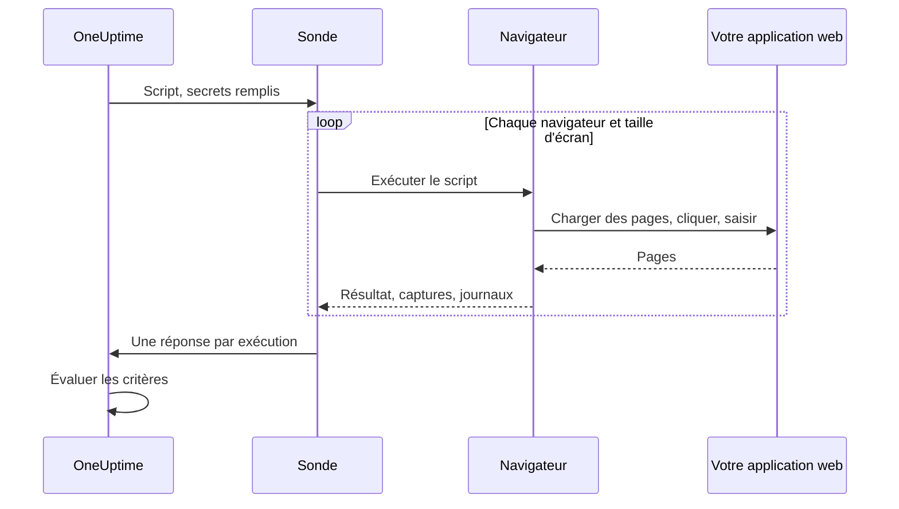

# Surveillance synthétique

Un moniteur synthétique pilote votre application web dans un vrai navigateur, selon un calendrier, avec un script Playwright que vous écrivez : il ouvre des pages, remplit des formulaires, parcourt un trajet utilisateur, et échoue quand le trajet échoue. Utilisez-le pour repérer les pannes qu'une vérification de disponibilité ne voit pas — une connexion qui ne fonctionne plus, un bouton de paiement qui ne fait rien, un tableau de bord qui ne finit jamais de charger.

:::cards
- [Créer le moniteur](#créer-un-moniteur-synthétique): Écrire un script, choisir navigateurs et tailles d'écran.
- [Écrire le script](#écrire-le-script): Un parcours de connexion prêt à l'emploi comme point de départ.
- [Captures d'écran](#captures-décran): Voir à quoi ressemblait la page quand une exécution a échoué.
- [Ce que le script peut utiliser](#modules-disponibles-dans-le-script): Playwright, HTTP, crypto et métriques.
:::

## Fonctionnement

À chaque vérification, une sonde exécute votre script une fois pour chaque navigateur et chaque taille d'écran choisis, l'un après l'autre. Chaque exécution démarre un navigateur neuf, sans cookies ni stockage des exécutions précédentes ; le script pilote sa page, prend des captures d'écran, et renvoie un résultat ou lève une erreur. La sonde rapporte chaque exécution, et OneUptime évalue vos critères sur cette base.



| Type d'écran | Fenêtre d'affichage |
| --- | --- |
| Mobile | 360 × 640 |
| Tablet | 1024 × 768 |
| Desktop | 1920 × 1080 |

Les navigateurs sont Chromium et Firefox.

## Avant de commencer

- Une **sonde** qui atteint votre application web. Utilisez une [sonde personnalisée](/docs/probe/custom-probe) pour une application à l'intérieur de votre réseau. L'image Docker de la sonde inclut Chromium et Firefox ; une sonde exécutée hors de Docker doit les avoir installés.
- Chaque mot de passe ou jeton dont le parcours a besoin, stocké comme [secret de moniteur](/docs/monitor/monitor-secrets).

## Créer un moniteur synthétique

:::steps
### Commencer un nouveau moniteur

Allez dans **Moniteurs** et cliquez sur **Créer un moniteur**. Sous **Type de moniteur**, cliquez sur **Plus de types de moniteurs** et choisissez **Synthetic Monitor** sous **Synthetic Monitoring**, ou tapez `playwright` dans le champ de recherche. Saisissez un **Nom**, puis cliquez sur **Suivant**.

### Ajouter le script

Écrivez votre script dans l'éditeur **Playwright Code**. Partez de l'[exemple ci-dessous](#écrire-le-script).

### Choisir navigateurs et tailles d'écran

Cochez les navigateurs sous **Type de navigateur** et les tailles sous **Type d'écran**. Le script s'exécute une fois pour chaque combinaison : deux navigateurs et trois tailles font donc six exécutions par vérification. Sous **Plus de champs**, **Nombre de tentatives en cas d'erreur** relance une exécution échouée jusqu'à 5 fois.

### Le tester

Cliquez sur **Tester le moniteur** pour exécuter le script une fois depuis une sonde, et vérifiez le résultat, les journaux et les captures d'écran de chaque exécution.

### Passer en revue les critères

Le moniteur commence avec deux critères : il est hors ligne, et déclare un incident, quand une exécution échoue, et en ligne quand aucune n'échoue. Modifiez-les ou ajoutez les vôtres — voir [Critères](#critères) — puis cliquez sur **Suivant**.

### Choisir les sondes et créer

Sélectionnez les **Sondes** et un **Intervalle de surveillance** — les moniteurs synthétiques se voient proposer des intervalles de 5 minutes ou plus — puis cliquez sur **Créer un moniteur**.
:::

## Écrire le script

Le script est le corps d'une fonction `async`. `page` est une page compatible Playwright déjà ouverte ; pilotez-la, renvoyez un résultat avec `return`, et faites échouer l'exécution avec `throw` (ou en laissant expirer un appel Playwright). Cet exemple se connecte et vérifie que le tableau de bord se charge :

```javascript title="Synthetic monitor script"
await page.goto("https://app.example.com/login");
screenshots["login-page"] = await page.screenshot();

await page.fill("#email", "monitoring@example.com");
await page.fill("#password", "{{monitorSecrets.AppPassword}}");
await page.click("button[type=submit]");

// Fails the run if the dashboard does not appear within 10 seconds.
await page.waitForSelector(".dashboard", { timeout: 10000 });
screenshots["dashboard"] = await page.screenshot();

console.log(`Signed in on ${browserType}, ${screenSizeType}`);

return {
  data: { title: await page.title() },
};
```

| Pour | Faites | Ce que OneUptime enregistre |
| --- | --- | --- |
| Rapporter un résultat | `return { data: ... }` | Le **Résultat** de l'exécution. Seul `data` est conservé. |
| Faire échouer l'exécution | `throw new Error("...")`, ou laisser une attente expirer | L'**Erreur de script** de l'exécution. |
| Garder des preuves | `screenshots["name"] = await page.screenshot()` | Une capture d'écran, conservée même quand l'exécution échoue. |
| Laisser une trace | `console.log(...)` | Les messages de journal de l'exécution. |

Pour voir les exécutions, ouvrez la **Vue d'ensemble** du moniteur : la carte **Résumé du moniteur** a un bloc par navigateur et taille d'écran, et **Afficher plus de détails** montre les captures d'écran de chaque exécution.

### Utilisation de Playwright

Nous utilisons Playwright pour simuler les interactions des utilisateurs. La valeur `page` est une façade sécurisée, compatible Playwright, pour la page créée pour cette exécution. Les méthodes courantes de `Page`, `Locator`, `Frame`, `ElementHandle`, `JSHandle`, `Request`, `Response`, du clavier, de la souris et du contexte de navigateur sont disponibles. Cela comprend la navigation, les localisateurs, les clics, la saisie dans les formulaires, l'évaluation dans la page, les fenêtres surgissantes, les pages supplémentaires, l'inspection des réponses et les captures d'écran. Vous atteignez le contexte de navigateur de l'exécution par `page.context()`, par exemple pour ouvrir une nouvelle page ou gérer une fenêtre surgissante.

Les scripts synthétiques ne s'exécutent pas dans le processus Node.js de la sonde. Les valeurs franchissent la frontière d'exécution sous forme de données copiées ou de capacités opaques limitées à l'exécution ; certaines API de Playwright fonctionnent donc différemment, ou pas du tout :

| Non disponible | À utiliser à la place |
| --- | --- |
| Les méthodes de lancement ou de connexion du navigateur, les sessions CDP, le routage des requêtes, les liaisons exposées, les champs privés de Playwright, et toute option qui lit ou écrit un chemin du système de fichiers de l'hôte. `page.context().browser()` n'est donc pas disponible. | La page et le contexte de navigateur qui vous sont donnés. |
| Les écouteurs d'événements (`page.on(...)`, `page.once(...)`) — les appeler échoue avec une erreur explicite. | `page.waitForEvent(...)` pour les boîtes de dialogue et les fenêtres surgissantes, ou les attentes de réponses et de requêtes avec des correspondances par chaîne ou expression régulière. |
| Les prédicats sous forme de fonction pour les méthodes d'attente d'événements, de requêtes, de réponses et d'URL. | Des correspondances par chaîne ou expression régulière, des localisateurs, ou une interrogation explicite en boucle. |
| Les accesseurs de cadres synchrones (`page.frames()`, `page.mainFrame()`, `page.frame(...)`). | `page.frameLocator(...)` pour les iframes. |
| `page.request.*` | Le global `axios` pour les requêtes HTTP. |
| Les captures pleine page et la sortie PDF. | Les captures de la fenêtre d'affichage, qui conservent le comportement de preuve en cas d'échec décrit plus bas. |

`page.waitForNavigation(...)`, `page.setDefaultTimeout(...)` et `page.setDefaultNavigationTimeout(...)` sont pris en charge. `page.waitForEvent(...)` attend `dialog`, `domcontentloaded`, `load`, `popup`, `request`, `requestfailed`, `requestfinished` et `response`. Les fonctions d'évaluation passées à des méthodes comme `page.evaluate()` s'exécutent dans la page surveillée du navigateur, jamais dans le processus de la sonde. Chaque exécution peut utiliser jusqu'à huit pages.

Les permissions du navigateur sont limitées à la géolocalisation et aux notifications. Le presse-papiers, la caméra, le micro, le MIDI, les polices locales et les autres permissions d'appareil de l'hôte ne sont pas disponibles pour les scripts de moniteur.

### Ce que le script renvoie

Les données renvoyées par le script sont sérialisées en JSON avant d'être stockées : dans les objets et tableaux simples, `NaN` et `Infinity` deviennent `null`, les propriétés `undefined` et les fonctions sont supprimées, et les objets `Date` deviennent des chaînes ISO — exactement comme le fait `JSON.stringify`. Les instances de classes et les autres objets non simples sont entièrement supprimés. Un `BigInt` devient une chaîne. Un résultat circulaire, imbriqué sur plus de 30 niveaux, ou plus grand que 5 Mo fait échouer l'exécution.

### Alerter sur les données renvoyées

Ce que le script renvoie comme `data` est la **Result Value** du moniteur, qu'un critère peut comparer. Quand `data` est un objet ou un tableau, renseignez **Chemin du champ (facultatif)** dans le filtre Result Value pour comparer un de ses champs — par exemple `status`, `timings.loadTime` ou `errors[0].message`. Le filtre est vérifié sur les données de chaque navigateur et taille d'écran où le moniteur s'exécute, et correspond dès que l'un d'eux correspond. Voir [Alerter sur les données renvoyées](/docs/monitor/custom-code-monitor#alerter-sur-les-données-renvoyées) pour le fonctionnement des chemins et des conditions.

## Captures d'écran

Un objet `screenshots` prédéclaré est disponible dans le contexte du script. Assignez-lui des captures d'écran à n'importe quel moment du script — ces captures sont conservées **même si le script lève une erreur** (y compris les assertions échouées, les délais dépassés ou les erreurs inattendues), pour que vous voyiez exactement à quoi ressemblait la page quand l'exécution a échoué. Les captures apparaissent dans le tableau de bord OneUptime pour cette exécution précise du moniteur.

```javascript
// Capture screenshots via the `screenshots` side-channel — they are preserved on both success and failure.

await page.goto("https://app.example.com/login");
screenshots["login-page"] = await page.screenshot();

await page.fill("#email", "user@example.com");
await page.fill("#password", "wrong");
await page.click("button[type=submit]");

// If the next assertion throws, the `login-page` screenshot above is still captured.
await page.waitForSelector(".dashboard", { timeout: 5000 });

screenshots["dashboard"] = await page.screenshot();

return {
  data: "Login succeeded",
};
```

Une exécution conserve jusqu'à 20 captures d'écran, chacune jusqu'à 10 Mo et 50 Mo au total. Une capture peut aussi apparaître dans l'incident ou l'alerte qu'ouvre une exécution en échec — sur sa page et dans les e-mails qui en parlent — en la plaçant dans la description d'incident ou d'alerte du moniteur. Voir [Afficher une capture d'écran](/docs/monitor/incident-alert-templating#moniteurs-synthétiques).

:::details Renvoyer des captures d'écran (ancienne méthode)
Pour la rétrocompatibilité, vous pouvez aussi renvoyer des captures d'écran dans la valeur de retour du script. Les captures renvoyées ainsi ne sont conservées **que** si le script se termine normalement — elles sont perdues s'il lève une erreur. Préférez le canal parallèle décrit plus haut quand vous voulez des preuves des échecs.

```javascript
// Legacy pattern — screenshots only captured on successful return.
const screenshots = {};
screenshots["screenshot-name"] = await page.screenshot();

return {
  data: "Hello World",
  screenshots: screenshots,
};
```
:::

## Utiliser les secrets de moniteur

Faites référence à un secret avec `{{monitorSecrets.NAME}}` n'importe où dans le script. OneUptime remplace la référence par la valeur du secret, en texte brut, avant que le script n'atteigne la sonde. Mettez donc un secret entre guillemets pour l'utiliser comme chaîne, et laissez-le nu pour l'utiliser comme nombre ou booléen :

```javascript
// Used as a string: wrap it in quotes.
const password = "{{monitorSecrets.AppPassword}}";

// Used as a number or a boolean: leave it bare.
const retryLimit = {{monitorSecrets.RetryLimit}};
const verbose = {{monitorSecrets.Verbose}};
```

Pour créer un secret et choisir les moniteurs qui peuvent l'utiliser, voir [Secrets de surveillance](/docs/monitor/monitor-secrets).

## Métriques personnalisées

Vous pouvez capturer des métriques personnalisées depuis votre script avec la fonction `oneuptime.captureMetric()`. Ces métriques sont stockées dans OneUptime et peuvent être tracées dans des tableaux de bord avec l'explorateur de métriques.

```javascript
oneuptime.captureMetric(name, value, attributes);
```

| Paramètre | Type | Description |
| --- | --- | --- |
| `name` | string, obligatoire | Le nom de la métrique (p. ex. `"dashboard.load.time"`). Il est stocké automatiquement avec le préfixe `custom.monitor.`. |
| `value` | number, obligatoire | La valeur numérique de la métrique. |
| `attributes` | object, facultatif | Des paires clé-valeur pour plus de contexte. |

### Exemple

```javascript
await page.goto("https://app.example.com");

const startTime = Date.now();
await page.waitForSelector("#dashboard-loaded");
const loadTime = Date.now() - startTime;

// Capture page load time, tagged with this run's browser and screen size
oneuptime.captureMetric("dashboard.load.time", loadTime, {
  page: "dashboard",
  browser: browserType,
  screen: screenSizeType,
});

screenshots["dashboard"] = await page.screenshot();

return {
  data: { loadTime },
};
```

Une fois capturées, ces métriques apparaissent dans l'explorateur de métriques sous des noms comme `custom.monitor.dashboard.load.time`, et sur la page **Métriques** du moniteur sous **Métriques personnalisées**. OneUptime ajoute le moniteur et la sonde à chaque point de données ; pour filtrer par navigateur ou taille d'écran, passez-les comme attributs, comme le fait l'exemple.

Une exécution peut capturer au plus 100 métriques, uniquement numériques, et OneUptime en conserve au plus 100 par vérification, toutes exécutions confondues. Comme pour un moniteur Custom Code, certains noms d'attribut sont [réservés](/docs/monitor/custom-code-monitor#clés-dattribut-réservées) et supprimés si un script les définit.

## Critères

| Type de filtre | Ce qu'il vérifie |
| --- | --- |
| **Erreur** | L'erreur levée par une exécution, le cas échéant. |
| **Result Value** | Les `data` renvoyées par une exécution. |
| **Temps d'exécution (en ms)** | La durée d'une exécution. |
| **Type de navigateur** | Le navigateur utilisé par une exécution : **Equal To** ou **Not Equal To**. |
| **Screen Size** | La taille d'écran utilisée par une exécution : **Equal To** ou **Not Equal To**. |

Chaque filtre est vérifié sur chaque exécution, et correspond dès qu'une seule exécution y correspond. Les filtres sont vérifiés séparément, et non exécution par exécution : **Erreur** Is Not Empty avec **Type de navigateur** Equal To `Firefox` correspond quand une exécution quelconque a échoué et qu'une des exécutions a utilisé Firefox — pas seulement quand l'exécution Firefox a échoué. Pour surveiller un navigateur à part, donnez-lui son propre moniteur.

Dans les modèles d'incident et d'alerte, chaque exécution se trouve dans `{{syntheticResponses}}` : voir [Modèles d'incident et d'alerte](/docs/monitor/incident-alert-templating#moniteurs-synthétiques).

## Modules disponibles dans le script

| Nom | Ce que c'est |
| --- | --- |
| `page` | Une façade sécurisée compatible Playwright pour interagir avec le navigateur. Vous atteignez le contexte de navigateur de l'exécution via `page.context()` pour créer des pages ou gérer des fenêtres surgissantes, mais le lancement/la connexion du navigateur, CDP, le routage, les liaisons, les champs privés et les options de chemins de l'hôte ne sont pas disponibles. |
| `screenshots` | Un objet prédéclaré auquel vous assignez des captures d'écran (p. ex. `screenshots['login-page'] = await page.screenshot()`). Les captures assignées ici sont conservées même si le script lève une erreur ensuite. |
| `browserType` | Le navigateur de cette exécution : `Chromium` ou `Firefox`. |
| `screenSizeType` | La taille d'écran de cette exécution : `Mobile`, `Tablet` ou `Desktop`. |
| `axios` | Un client HTTP à base de promesses : axios appelable, plus `request`, `get`, `head`, `options`, `post`, `put`, `patch`, `delete` et `create`. Le corps d'une requête peut aller jusqu'à 1 Mo et une réponse jusqu'à 5 Mo ; il suit jusqu'à 5 redirections et expire après 30 secondes au plus. Les transports, adaptateurs, sockets, agents et surcharges de proxy personnalisés ne sont pas disponibles. |
| `crypto` | Une implémentation en worker de navigateur des hachages SHA-256, de HMAC-SHA-256, de `randomBytes`, `randomInt` et `randomUUID`. |
| `console` | `console.log`, `info`, `warn` et `error`. Les messages sont conservés avec chaque exécution. |
| `oneuptime.captureMetric` | Capture une métrique personnalisée. Voir [Métriques personnalisées](#métriques-personnalisées). |
| `http` | Une façade de compatibilité côté client uniquement, avec mise en mémoire tampon, qui prend en charge `request`, `get` et `Agent`. |
| `https` | L'équivalent HTTPS de la façade `http` côté client. |
| `Buffer`, `setTimeout`, `setInterval` | Et leurs fonctions `clear`. |

Le script s'exécute dans un worker de navigateur, pas dans Node.js, et ne peut pas ouvrir ses propres connexions réseau : `fetch`, `XMLHttpRequest` et `WebSocket` sont bloqués. Utilisez `axios` pour les requêtes HTTP.

## Limites

| Limite | Par défaut | Paramètre de la sonde |
| --- | --- | --- |
| Délai du script | 60 secondes. Les workers qui expirent et tous les descendants du navigateur sont arrêtés. | `PROBE_SYNTHETIC_MONITOR_SCRIPT_TIMEOUT_IN_MS` |
| Mémoire pour toute l'arborescence de processus d'une exécution | 1,5 Gio | `PROBE_SYNTHETIC_MONITOR_MAX_PROCESS_TREE_RSS_BYTES` |
| Stockage inscriptible du navigateur | 256 Mio | `PROBE_SYNTHETIC_MONITOR_MAX_DISK_BYTES` |
| Exécutions simultanées sur une sonde | 4 | `PROBE_SYNTHETIC_MONITOR_MAX_CONCURRENCY` |
| Pages par exécution | 8 | — |

Dépasser la limite de mémoire ou de stockage arrête cette exécution et supprime son profil temporaire. Les paramètres de sonde s'appliquent aux sondes auto-hébergées ; le chart Helm définit les mêmes valeurs par sonde (par exemple `syntheticMonitorScriptTimeoutInMs`).

Les navigateurs sont livrés dans l'image Docker de la sonde : une sonde auto-hébergée reçoit donc des navigateurs plus récents quand vous mettez son image à jour.

## Dépannage

:::details Une exécution échoue, mais je ne sais pas pourquoi
Assignez des captures d'écran à l'objet `screenshots` avant chaque étape risquée. Elles sont conservées même quand l'exécution échoue, et montrent à quoi ressemblait la page à ce moment-là.
:::

:::details `page.on(...)` lève une erreur
Les écouteurs d'événements ne peuvent pas franchir la frontière d'isolation. Utilisez `page.waitForEvent(...)` pour les boîtes de dialogue et les fenêtres surgissantes, ou une attente de réponse ou de requête avec une correspondance par chaîne ou expression régulière.
:::

:::details L'exécution expire
Attendez des éléments précis avec `page.waitForSelector(...)` et un `timeout` plus court que la limite du script lui-même, pour que l'exécution échoue sur l'étape lente, avec une erreur explicite.
:::

:::details Une sonde auto-hébergée indique que l'exécutable du navigateur est introuvable
La sonde s'exécute hors de son image Docker, sans Chromium ni Firefox installés. Exécutez l'image de la sonde, ou installez les navigateurs sur cette machine.
:::

## Prochaines étapes

:::cards
- [Surveillance par code personnalisé](/docs/monitor/custom-code-monitor): Vérifier des API avec un script, sans navigateur.
- [Afficher une capture d'écran](/docs/monitor/incident-alert-templating#moniteurs-synthétiques): Mettre la capture de l'exécution en échec dans l'incident.
- [Secrets de surveillance](/docs/monitor/monitor-secrets): Garder les identifiants hors de votre script.
:::
