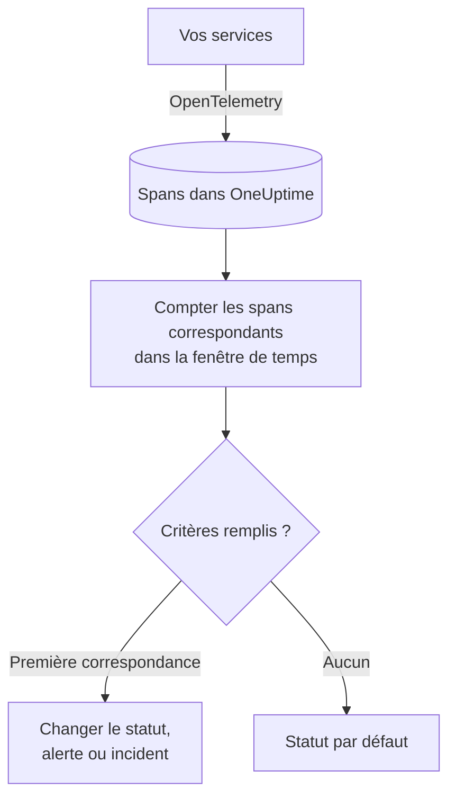

# Surveillance des traces

Un moniteur de traces compte, sur une fenêtre de temps, les spans que vos services envoient à OneUptime et qui correspondent à vos filtres – nom de span, statut, service, attributs. Quand ce nombre remplit vos critères, il change le statut du moniteur, crée une alerte ou déclare un incident. Servez-vous-en pour alerter sur les requêtes en échec vers un endpoint, sur un pic de spans en erreur ou sur un service qui a cessé d'envoyer des traces.

:::cards
- [Créer le moniteur](#créer-un-moniteur-de-traces): Choisir les spans à compter et quand alerter.
- [Codes de statut de span](#codes-de-statut-de-span): Ce que signifient OK, ERROR et UNSET, et sur lequel filtrer.
- [Comment il est évalué](#comment-il-est-évalué): La fenêtre de temps, le décompte et le cycle d'une minute.
- [Critères](#critères): Seuils, détection d'anomalies et valeurs par défaut.
:::

## Fonctionnement

Chaque minute, OneUptime compte les spans qui correspondent aux filtres du moniteur et ont commencé dans sa fenêtre de temps. Il compare ce nombre aux critères du moniteur de haut en bas, et le premier critère qui correspond décide de ce qui se passe. Si aucun ne correspond, le moniteur revient à son statut par défaut.

## Avant de commencer

- Vos services envoient des traces à OneUptime via OpenTelemetry. Voir [OpenTelemetry](/docs/telemetry/open-telemetry).
- Cherchez le nom exact du span à surveiller dans l'explorateur de traces : les noms de span sont fixés par votre instrumentation, par exemple `POST /api/checkout` ou `GET`.

## Créer un moniteur de traces

:::steps
### Commencer un nouveau moniteur

Allez dans **Moniteurs** et cliquez sur **Créer un moniteur**.

### Choisir Traces

Sous **Type de moniteur**, cliquez sur **Plus de types de moniteurs** et choisissez **Traces** sous **Télémétrie**, ou tapez `traces` dans le champ de recherche. Saisissez un **Nom**, puis cliquez sur **Suivant**.

### Choisir les spans à compter

Dans **Configuration du moniteur de traces**, renseignez **Nom du span**, **Surveiller les traces pendant (durée)** et **Filtrer par statut de span**. Un filtre laissé vide correspond à tous les spans. **Aperçu des spans**, sous les filtres, montre les spans qu'ils sélectionnent en ce moment.

### Affiner (facultatif)

Ouvrez **Plus de champs** pour filtrer par service de télémétrie, entité d'infrastructure ou attribut.

### Définir les critères

La carte **Critères du moniteur** commence avec deux critères : hors ligne, avec un incident, quand aucun span ne correspond ; en ligne dès qu'au moins un correspond. Adaptez-les à ce sur quoi vous voulez alerter – voir [Critères](#critères).

### Créer le moniteur

Cliquez sur **Créer un moniteur**. Le moniteur s'ouvre sur sa page **Vue d'ensemble**, et sa première évaluation a lieu dans la minute.
:::

> [!TIP]
> Pour être prévenu quand une fonctionnalité d'IA répond mal – réponses en échec, refusées, tronquées, vides, signalées ou lentes –, choisissez plutôt **IA / LLM** sous **Télémétrie**. Ce moniteur lit pour vous les appels d'IA de vos traces, sans filtre de span à écrire. Voir [Observabilité IA / LLM](/docs/telemetry/ai-llm-observability#être-prévenu-quand-lia-répond-mal).

## Ce qu'il interroge

| Champ | Ce qu'il sélectionne | Par défaut |
| --- | --- | --- |
| **Nom du span** | Les spans dont le nom contient ce texte, sans tenir compte de la casse. | Vide : tous les spans |
| **Surveiller les traces pendant (durée)** | Les spans commencés dans les 5 dernières secondes jusqu'aux 24 dernières heures. | **Dernière minute** |
| **Filtrer par statut de span** | Les spans ayant l'un des statuts choisis : **Non défini**, **Ok** ou **Erreur**. | Vide : tous les statuts |
| **Filtrer par service de télémétrie** (sous **Plus de champs**) | Les spans de l'un des services choisis. | Vide : tous les services |
| **Filtrer par entité d'infrastructure** (sous **Plus de champs**) | Les spans de l'un des hôtes, pods, conteneurs et autres entités choisis. | Vide : toutes les entités |
| **Filtrer par attributs** (sous **Plus de champs**) | Les spans dont les attributs remplissent chaque condition. Chaque condition a son propre opérateur, comme « égal à » ou « contient ». | Vide : aucune condition |

Tous les filtres que vous définissez doivent correspondre pour qu'un span soit compté.

### Codes de statut de span

- **OK** — L'opération a été explicitement marquée comme réussie, par le code de l'application ou par un pipeline de traces
- **ERROR** — L'opération a rencontré une erreur
- **UNSET** — Aucun statut d'erreur n'a été défini. Il s'agit du statut par défaut d'OpenTelemetry

UNSET ne signifie pas que des données sont manquantes. L'instrumentation OpenTelemetry définit ERROR lorsqu'une opération échoue et laisse les spans réussis en UNSET, de sorte que sur un service en bonne santé, la plupart des spans sont UNSET. OneUptime les affiche en vert avec le libellé « Unset (no error) ». L'enregistrement d'une exception ne modifie pas le statut d'un span, si bien qu'un span en UNSET peut tout de même avoir des exceptions, qui sont listées avec le span. Pour alerter sur les échecs, filtrez sur ERROR. Pour compter tous les spans qui n'ont pas échoué, sélectionnez à la fois OK et UNSET.

Si vous souhaitez que les requêtes réussies s'affichent comme OK, ajoutez un pipeline de traces dans **Traces > Paramètres > Pipelines** avec la condition de filtre **Statut = Non défini** et un **Remappeur de statut** qui associe à Ok les valeurs de `http.response.status_code` telles que `200`.

## Comment il est évalué

- **Chaque minute.** Un moniteur de traces n'est pas vérifié par des sondes ; il n'a donc pas d'intervalle à régler ni de page **Sondes et intervalle**.
- **Un seul nombre par évaluation.** Le moniteur compte les spans qui correspondent à chaque filtre et ont commencé dans la durée **Surveiller les traces pendant (durée)** précédant l'évaluation. Avec **Dernières 5 minutes**, chaque évaluation remonte cinq minutes en arrière, si bien que les fenêtres d'évaluations successives se chevauchent.
- **Aucun span, c'est un décompte de 0.** Un service qui cesse d'envoyer des traces produit 0, ce que recherche le critère hors ligne par défaut.
- **L'indisponibilité d'OneUptime lui-même n'est pas un silence.** Tant que la fenêtre de temps contient une période où OneUptime lui-même ne recevait pas de données – il redémarrait, était mis à jour ou rattrapait un retard –, la vérification attend : le statut ne change pas, et aucun incident ni aucune alerte n'est ouvert ni résolu. Voir [Quand OneUptime ne reçoit pas de données](/docs/monitor/when-oneuptime-is-not-receiving).
- **Les critères de haut en bas.** Le premier critère qui correspond décide ; placez donc le plus grave en premier.

Chaque changement de statut est enregistré, avec sa raison, dans la **Chronologie de statut** du moniteur.

## Critères

Les critères d'un moniteur de traces ont un seul **Type de filtre** : **Span Count**, le nombre de spans qui ont correspondu dans la fenêtre. Choisissez une **Condition de filtre** et, pour une condition de seuil, une **Valeur**.

| Condition de filtre | Correspond quand le nombre de spans est… |
| --- | --- |
| **Greater Than** | au-dessus de la valeur |
| **Greater Than Or Equal To** | égal ou supérieur à la valeur |
| **Less Than** | en dessous de la valeur |
| **Less Than Or Equal To** | égal ou inférieur à la valeur |
| **Equal To** | exactement la valeur |
| **Anomalously High** | au-dessus de la plage attendue pour cette heure de la semaine |
| **Anomalously Low** | en dessous de cette plage |
| **Anomalous** | hors de cette plage, dans un sens ou dans l'autre |

Les conditions d'anomalie ne prennent pas de **Valeur**. Choisissez une **Sensibilité** – Low, Medium (la valeur par défaut) ou High – et une **Fenêtre de référence** de 14 (la valeur par défaut), 28, 60 ou 90 jours. OneUptime convertit le décompte en taux par minute et le compare à la même heure de la semaine sur cette fenêtre. La référence ne couvre que les services et les statuts de span du moniteur : ses filtres de nom de span et d'attributs n'en font pas partie. Tant que cette heure de la semaine n'a pas assez d'historique, le critère est encore en apprentissage et ne se déclenche pas.

Un nouveau moniteur de traces commence avec ces critères :

| Critère | Filtre | Effet |
| --- | --- | --- |
| Check if … is offline | **Span Count** **Equal To** `0` | Passe le moniteur hors ligne et déclare un incident, résolu automatiquement |
| Check if … is online | **Span Count** **Greater Than** `0` | Passe le moniteur en ligne |

## Exemple : des requêtes de checkout en échec

En cinq minutes, le service checkout enregistre 1 200 spans nommés `POST /api/checkout` : 1 150 UNSET, 20 OK et 30 ERROR. Le même moniteur compte des nombres très différents selon **Filtrer par statut de span** :

| Filtrer par statut de span | Span Count | Ce qu'il mesure |
| --- | --- | --- |
| **Erreur** | 30 | Les requêtes qui ont échoué |
| **Ok** | 20 | Seulement les requêtes que votre code a marquées comme réussies |
| **Non défini** et **Ok** | 1 170 | Chaque requête qui n'a pas échoué |
| Vide | 1 200 | Chaque requête |

Pour être alerté quand plus de 10 requêtes de checkout échouent en cinq minutes :

- **Nom du span** : `POST /api/checkout`
- **Surveiller les traces pendant (durée)** : **Dernières 5 minutes**
- **Filtrer par statut de span** : **Erreur**
- Critère 1 : **Span Count** **Greater Than** `10` – passer le moniteur hors ligne et déclarer un incident
- Critère 2 : **Span Count** **Less Than Or Equal To** `10` – passer le moniteur en ligne

Avec 30 requêtes en échec, le critère 1 correspond et l'incident est déclaré. Une fois cinq minutes passées avec 10 échecs ou moins, le critère 2 correspond, le moniteur est de nouveau en ligne et l'incident se résout de lui-même.

## Dépannage

:::details Le moniteur ne compte aucun span pour mon endpoint
**Nom du span** est comparé au nom du span, et l'instrumentation nomme souvent les spans serveur d'après la route (`POST /api/checkout`) ou seulement la méthode (`GET`). Trouvez le nom exact dans l'explorateur de traces. Ouvrez ensuite la page **Critères** du moniteur (sous **Configuration**) et cliquez sur **Modifier les critères de surveillance** : **Aperçu des spans** montre ce que les filtres sélectionnent en ce moment.
:::

:::details Les requêtes réussies ne sont pas comptées quand je filtre sur Ok
La plupart des instrumentations laissent les spans réussis en UNSET, pas en OK – voir [Codes de statut de span](#codes-de-statut-de-span). Sélectionnez à la fois **Non défini** et **Ok**, ou ajoutez le pipeline de traces décrit dans cette section.
:::

:::details Un span a une exception mais n'est pas compté comme erreur
L'enregistrement d'une exception ne modifie pas le statut d'un span. Filtrez sur **Erreur**, ou utilisez un [moniteur d'exceptions](/docs/monitor/exceptions-monitor) pour alerter sur les exceptions elles-mêmes.
:::

:::details Un critère d'anomalie ne se déclenche jamais
Il est encore en apprentissage : l'heure de la semaine à laquelle il se compare n'a pas encore assez d'historique dans la **Fenêtre de référence**.
:::

## Étapes suivantes

:::cards
- [Surveillance des exceptions](/docs/monitor/exceptions-monitor): Alerter sur les exceptions que vos services enregistrent.
- [Surveillance des journaux](/docs/monitor/logs-monitor): Alerter sur le volume et le contenu des journaux.
- [Syntaxe de recherche](/docs/telemetry/search-syntax): Trouver les noms et les statuts de span dans l'explorateur de traces.
- [Modèles d'incident et d'alerte](/docs/monitor/incident-alert-templating): Écrire des titres et des descriptions d'alerte utiles.
:::
