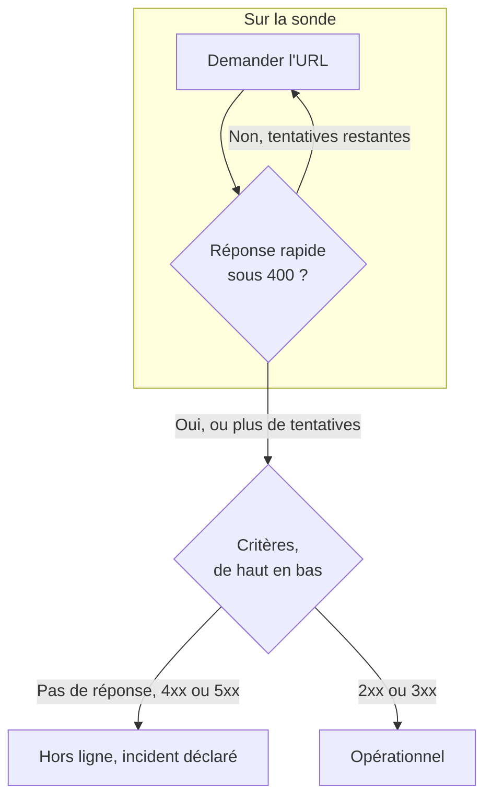

# Surveillance de site web

Un moniteur de site web vérifie qu'une page web répond. À chaque vérification, une sonde demande l'URL de la page, et le moniteur passe hors ligne et déclare un incident quand la page ne répond pas ou répond avec une erreur. Pour appeler un point de terminaison avec une méthode, des en-têtes ou un corps, utilisez plutôt un [moniteur d'API](/docs/monitor/api-monitor).

:::cards
- [Créer le moniteur](#créer-un-moniteur-de-site-web): Six étapes dans le tableau de bord.
- [Options de configuration](#options-de-configuration): Espaces réservés d'URL, redirections, certificats, délais d'expiration et nouvelles tentatives.
- [Critères de surveillance](#critères-de-surveillance): Ce qui compte comme disponible ou en panne, dès le départ.
- [Dépannage](#dépannage): Quand le moniteur et votre navigateur ne sont pas d'accord.
:::

## Fonctionnement

À chaque vérification, une sonde demande l'URL, suit les redirections et enregistre ce qui est revenu : le code de statut, le temps de réponse, les en-têtes et, quand un critère en a besoin, le corps. Une requête qui échoue, expire, répond avec un statut `4xx` ou `5xx`, ou prend plus de 10 secondes est retentée, jusqu'au nombre de nouvelles tentatives que vous autorisez. OneUptime passe ensuite le résultat dans les critères du moniteur.



Quand aucun des critères du moniteur ne lit le corps de la réponse (un filtre **Corps de la réponse** ou **JavaScript Expression**), la sonde envoie une requête `HEAD` au lieu d'un `GET`, et la répète en `GET` si le serveur refuse `HEAD`. Les journaux d'accès de votre serveur peuvent montrer l'un ou l'autre.

Une sonde qui a perdu sa propre connexion réseau ne rapporte aucun résultat, elle ne peut donc pas marquer votre site hors ligne.

## Avant de commencer

- **Un rôle qui peut créer des moniteurs** : Project Owner, Project Admin, Project Member, Monitor Admin ou Monitor Member, ou un rôle personnalisé avec l'autorisation Create Monitor.
- **Une sonde qui peut joindre le site.** Les sondes par défaut de votre projet sont choisies pour chaque nouveau moniteur. Si un pare-feu protège le site, autorisez les [adresses IP des sondes de OneUptime Cloud](/docs/configuration/ip-addresses). Un site sur un réseau privé a besoin d'une [sonde personnalisée](/docs/probe/custom-probe) dans ce réseau, autorisée à joindre des adresses privées : voir [Accès au réseau privé](/docs/self-hosted/private-network-access).

## Créer un moniteur de site web

:::steps
### Commencer un nouveau moniteur

Allez dans **Moniteurs** et cliquez sur **Créer un moniteur**. Sous **Type de moniteur**, choisissez **Site web**.

### Le nommer

Saisissez un **Nom**, comme `Marketing site`, puis cliquez sur **Suivant**.

### Saisir l'URL

Dans **URL du site web**, saisissez l'adresse complète de la page, y compris `https://`, comme `https://example.com`. Pour changer les redirections, les certificats, le délai d'expiration ou les nouvelles tentatives, ouvrez **Plus de champs** en dessous (voir [Options de configuration](#options-de-configuration)).

### Le tester

Cliquez sur **Tester le moniteur**, choisissez une sonde sous **Sélectionner la sonde** et cliquez sur **Exécuter le test**. **Résultat du test du moniteur** montre ce que la sonde a reçu.

### Passer en revue les critères

**Critères du moniteur** commence avec les [critères par défaut](#critères-par-défaut) : hors ligne quand le site ne répond pas ou répond avec une erreur, en ligne pour tout statut `2xx` ou `3xx`. Modifiez-les si besoin, puis cliquez sur **Suivant**.

### Choisir les sondes et créer

Gardez ou changez les **Sondes** et l'**Intervalle de surveillance** (il commence à **Toutes les 5 minutes**), puis cliquez sur **Créer un moniteur**. La page du moniteur s'ouvre.
:::

## Options de configuration

### URL du site web

La page à vérifier, sous forme d'URL complète avec son schéma : `https://example.com`, `https://example.com/pricing` ou `http://example.com:8080/health`. Vous pouvez placer un [secret de moniteur](/docs/monitor/monitor-secrets) dans l'URL sous la forme `{{monitorSecrets.NAME}}`, par exemple un jeton dans la chaîne de requête.

### Espaces réservés d'URL dynamiques

Quand un CDN ou un proxy de cache se trouve devant le site, une sonde peut recevoir une réponse du cache au lieu de votre serveur. Pour passer le cache, ajoutez un espace réservé à l'URL ; la sonde le remplace par une nouvelle valeur à chaque vérification.

| Espace réservé | Remplacé par | Exemple de valeur |
| --- | --- | --- |
| `{{timestamp}}` | L'heure Unix actuelle, en secondes | `1719500000` |
| `{{random}}` | Une chaîne aléatoire et unique de 32 caractères hexadécimaux | `3f2b8c1d9e7a4b6c8d0e1f2a3b4c5d6e` |

Une URL avec un espace réservé :

```text
https://example.com/health?cb={{timestamp}}
```

Ce que la sonde demande lors de deux vérifications à cinq minutes d'intervalle :

```text
https://example.com/health?cb=1719500000
https://example.com/health?cb=1719500300
```

Utilisez `{{random}}` de la même façon : `https://example.com/health?nocache={{random}}`.

### Plus de champs

Ces réglages sont repliés sous **Plus de champs**, sous l'URL. L'en-tête replié les nomme et montre ceux que vous avez changés.

| Champ | Par défaut | Ce qu'il fait |
| --- | --- | --- |
| **Ne pas suivre les redirections** | Désactivé | Juger la première réponse au lieu de suivre les redirections. Voir [ci-dessous](#ne-pas-suivre-les-redirections). |
| **Autoriser les certificats auto-signés** | Désactivé | Ignorer la validation du certificat TLS pour le nom d'hôte du moniteur lui-même. |
| **Utiliser un certificat client (mTLS)** | Désactivé | Présenter un certificat client et une clé privée. Voir [Certificat client (mTLS)](#certificat-client-mtls). |
| **Délai d'expiration de la requête (secondes)** | `60` | Combien de temps attendre chaque tentative. Le maximum est de 60 secondes. |
| **Tentatives en cas d'échec** | Valeur par défaut de la sonde, généralement `3` | Combien de fois retenter une tentative échouée. Le maximum est 3. Voir [Nouvelles tentatives et délais](#nouvelles-tentatives-et-délais). |

#### Ne pas suivre les redirections

Par défaut, la sonde suit les redirections (`301`, `302`, `303`, `307` et `308`), jusqu'à 10, et juge la page sur laquelle elle aboutit. Activez **Ne pas suivre les redirections** pour juger plutôt la réponse de redirection elle-même, par exemple pour vérifier que `http://` redirige vers `https://`. Les [critères par défaut](#critères-par-défaut) comptent une réponse de redirection comme en ligne.

**Autoriser les certificats auto-signés** suit les redirections qui restent sur le nom d'hôte du moniteur lui-même. Une redirection vers un autre nom d'hôte est vérifiée comme d'habitude.

#### Certificat client (mTLS)

Si le site exige un TLS mutuel, activez **Utiliser un certificat client (mTLS)** et renseignez :

| Champ | Ce qu'il faut saisir |
| --- | --- |
| **Certificat client (PEM)** | Le certificat client encodé en PEM à présenter. |
| **Clé privée client (PEM)** | La clé privée correspondante, encodée en PEM. |
| **Phrase secrète de la clé privée client** | Facultatif. La phrase secrète, seulement si la clé privée est chiffrée. |

C'est l'équivalent des options `--cert` et `--key` de curl :

```bash
curl --cert client.crt --key client.key https://example.com/health
```

Pour garder la clé hors des réglages du moniteur, stockez le certificat et la clé comme [secrets de moniteur](/docs/monitor/monitor-secrets) et saisissez `{{monitorSecrets.NAME}}` dans ces champs. Les secrets sont insérés sur le serveur, et leurs valeurs n'apparaissent jamais dans le tableau de bord.

Le certificat client n'est présenté que tant que la requête reste sur l'origine de l'URL du moniteur (le même schéma, le même hôte et le même port). Après une redirection vers une autre origine, la sonde continue sans lui.

#### Nouvelles tentatives et délais

**Tentatives en cas d'échec** compte les nouvelles tentatives _après_ la première, donc `0` exécute la vérification une fois et `2` jusqu'à trois fois. Laissé vide, il utilise la valeur par défaut de la sonde : 3, sauf si `PROBE_MONITOR_RETRY_LIMIT` de la sonde indique autre chose. La sonde attend une seconde entre les tentatives, et chaque tentative dispose de tout le **Délai d'expiration de la requête (secondes)**.

Ces échecs sont retentés : erreurs de connexion, expirations, réponses `4xx` et `5xx`, et réponses plus lentes que 10 secondes. Ceux-ci ne le sont pas, parce que réessayer n'y change rien : une URL invalide ou bloquée, plus de 10 redirections et une réponse de plus de 512 Kio.

## Critères de surveillance

Les critères décident quand le site web compte comme en ligne, dégradé ou hors ligne, et si cela déclare un incident ou crée une alerte. Chaque critère vérifie un ou plusieurs filtres :

| Filtre | Conditions | Ce qu'il vérifie |
| --- | --- | --- |
| **Is Online** | **Vrai**, **Faux** | Si le site a répondu, quel que soit le code de statut. |
| **Code de statut de la réponse** | **Equal To**, **Not Equal To**, **Greater Than**, **Less Than**, **Greater Than Or Equal To**, **Less Than Or Equal To** | Le code de statut HTTP. |
| **Temps de réponse (en ms)** | **Greater Than**, **Less Than**, **Greater Than Or Equal To**, **Less Than Or Equal To** | Le temps qu'a pris la requête, redirections comprises. |
| **Corps de la réponse** | **Contient**, **Not Contains** | Du texte dans le corps de la réponse. La correspondance respecte la casse. |
| **Response Header** | **Contient**, **Not Contains** | Si la réponse a un en-tête avec ce nom. Saisissez le nom en minuscules, comme `x-cache`. |
| **Response Header Value** | **Contient**, **Not Contains** | Si un en-tête a exactement cette valeur, comparée en minuscules, comme `no-store`. |
| **JavaScript Expression** | **Evaluates To True** | Une expression sur la réponse. Voir [Expressions JavaScript](/docs/monitor/javascript-expression). |
| **Is Request Timeout** | **Vrai**, **Faux** | Si la requête a expiré à chaque tentative. |

**Ajouter un critère** ajoute un critère déjà nommé d'après son filtre, par exemple _Response Time (in ms) is above 3000_. Le nom change avec les filtres jusqu'à ce que vous saisissiez votre propre nom. Une description est facultative : pour en ajouter une, ouvrez les **Paramètres** du critère.

Avec deux filtres ou plus, **Condition de correspondance** décide si **Tous** doivent correspondre ou si **Tout** filtre suffit. Les **Actions** d'un critère décident de ce qu'il fait : changer l'état du moniteur, créer une alerte, déclarer un incident, ou plusieurs de ces actions.

### Critères par défaut

Un nouveau moniteur de site web commence avec deux critères, il fonctionne donc sans rien changer :

- **Hors ligne** — le site web ne répond pas, ou répond avec un code de statut de `400` ou plus (ou inférieur à `200`). Le moniteur est marqué **Hors ligne** et un incident est créé. L'incident se résout de lui-même quand le site web revient.
- **En ligne** — le site web répond avec n'importe quel code de statut `2xx` ou `3xx`, comme `200`, `204` ou `301`. Le moniteur est marqué **Opérationnel**.

Dans la liste des critères, ils sont nommés d'après le moniteur : _Check if (name) is offline_ et _Check if (name) is online_.

Ainsi, une page qui répond `204 No Content`, ou une redirection que vous surveillez avec **Ne pas suivre les redirections** activé, compte comme disponible. Si un seul code de statut signifie « en bonne santé » pour vous, modifiez les deux critères sur la page **Configuration → Critères** du moniteur : par exemple **Code de statut de la réponse** / **Equal To** / `200` dans le critère en ligne et **Not Equal To** / `200` dans le critère hors ligne, à la place des deux filtres de code de statut de chacun.

Les critères sont vérifiés de haut en bas, et le premier qui correspond décide de ce qui se passe.

Quand aucun ne correspond, le moniteur revient à son état par défaut : **Opérationnel**, sauf si vous en choisissez un autre sous **Plus de champs**, sous les critères. L'en-tête replié de **Plus de champs** montre de quel état il s'agit.

Les moniteurs créés avant que OneUptime change ces valeurs par défaut gardent les critères avec lesquels ils ont été créés, qui ne comptent que `200` comme en ligne. Les moniteurs créés via l'API ou Terraform utilisent les critères que vous envoyez.

### Évaluer sur une période

**Évaluer ce critère sur une période donnée** est une case à cocher sous un filtre, proposée pour **Is Online**, **Code de statut de la réponse** et **Temps de réponse (en ms)**. Activez-la pour juger une fenêtre de vérifications passées au lieu de la dernière : choisissez une agrégation sous **Évaluer** et une fenêtre, de 2 à 60 minutes, sous **Pour les dernières (en minutes)**.

| Agrégation | Correspond quand |
| --- | --- |
| **Moyenne**, **Somme**, **Maximum Value**, **Minimum Value** | Cette valeur, sur la fenêtre, remplit la condition. Filtres numériques seulement. |
| **All Values** | Chaque vérification de la fenêtre remplit la condition. |
| **Any Value** | Au moins une vérification de la fenêtre remplit la condition. |

**All Values** ne correspond qu'une fois la fenêtre réellement couverte par des données. Un moniteur qui vient d'être créé, ou dont les vérifications ont cessé d'être enregistrées, n'a pas assez d'historique pour dire quoi que ce soit des N dernières minutes, donc le critère attend au lieu de correspondre sur la seule mesure qu'il possède. **Any Value** est le réglage pour « prévenez-moi dès qu'une seule vérification dépasse le seuil » et se déclenche toujours immédiatement.

**En l'absence de données** décide de ce qui se passe tant que la fenêtre ne peut pas étayer le critère :

| Option | Ce qui se passe | À utiliser pour |
| --- | --- | --- |
| **Ignore** (par défaut) | Le critère ne correspond pas. | Les alertes de seuil ordinaires. |
| **Déclencheur** | Les données manquantes comptent comme le problème. | Les vérifications où le silence est lui-même une panne. |
| **Treat As Zero** | La fenêtre est comparée comme un seul zéro. | Les compteurs où l'absence d'événements signifie vraiment zéro. |

### Exemples de critères

| Objectif | Filtre | Condition | Valeur |
| --- | --- | --- | --- |
| Marquer le site dégradé quand il est lent | **Temps de réponse (en ms)** | **Greater Than** | `3000` |
| Repérer une page d'erreur servie avec `200` | **Corps de la réponse** | **Not Contains** | `Welcome` |
| Vérifier qu'un en-tête de CDN est présent | **Response Header** | **Contient** | `x-cache` |
| N'accepter que `200` comme sain | **Code de statut de la réponse** | **Equal To** | `200` |

## Dépannage

:::details Le moniteur est hors ligne, mais le site se charge dans mon navigateur
La sonde a reçu une autre réponse que votre navigateur. La cause racine de l'incident, et **Journaux de surveillance** sur le moniteur, montrent ce que la sonde a vu. Causes fréquentes :

- Un pare-feu ou un filtre anti-robots bloque les sondes. Autorisez les [adresses IP des sondes de OneUptime Cloud](/docs/configuration/ip-addresses).
- Le site n'est joignable que sur votre réseau. Utilisez une [sonde personnalisée](/docs/probe/custom-probe) à l'intérieur.
- Le certificat est auto-signé ou émis par une autorité privée. Activez **Autoriser les certificats auto-signés**, ou surveillez le certificat à part avec un [moniteur de certificat SSL](/docs/monitor/ssl-certificate-monitor).
:::

:::details La vérification échoue avec « Remote response exceeded the allowed size. »
La sonde lit au plus 512 Kio d'une réponse, et cette page est plus grande. Pointez le moniteur vers une page plus petite, comme un point de terminaison de santé, ou retirez les filtres **Corps de la réponse** et **JavaScript Expression** pour que la sonde n'ait besoin que des en-têtes.
:::

:::details La vérification échoue avec « Monitor target exceeded 10 redirects. »
L'URL redirige plus de 10 fois, généralement en boucle. Ouvrez l'URL avec `curl -IL` pour voir la chaîne, et pointez le moniteur vers la page où la chaîne devrait se terminer.
:::

:::details La vérification échoue avec un message sur une adresse de réseau privé
L'URL se résout en une adresse privée, et la sonde qui a exécuté la vérification n'est pas autorisée à joindre des adresses privées. Sur une sonde auto-hébergée, activez cela avec `PROBE_ALLOW_PRIVATE_NETWORK_MONITORS` : voir [Accès au réseau privé](/docs/self-hosted/private-network-access).
:::

## Étapes suivantes

:::cards
- [Surveillance d'API](/docs/monitor/api-monitor): Appeler un point de terminaison avec une méthode, des en-têtes et un corps.
- [Surveillance de certificat SSL](/docs/monitor/ssl-certificate-monitor): Être prévenu avant que le certificat du site expire.
- [Secrets de surveillance](/docs/monitor/monitor-secrets): Garder les jetons et les clés hors des réglages des moniteurs.
- [Incidents](/docs/incidents/index): Ce qui se passe après que le moniteur en a déclaré un.
:::
