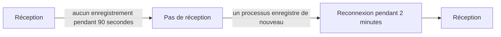

# Quand OneUptime ne reçoit pas de données

Pendant que OneUptime redémarre, est mis à niveau ou résorbe un retard, rien de ce qu'envoient vos agents, collecteurs, sondes et émetteurs de heartbeat ne peut atteindre vos moniteurs. OneUptime enregistre quand cela se produit et ne retient jamais ce temps contre un serveur, un hôte ou toute autre ressource : ce temps n'a pas été surveillé, ce n'est donc pas une indisponibilité.

## Fonctionnement

Chaque processus OneUptime qui reçoit des données enregistre toutes les 30 secondes qu'il reçoit, tant qu'il peut joindre les bases de données où il conserve les données. OneUptime laisse de côté trois sortes de temps :

- Pas de réception : aucun processus n'a rien enregistré depuis plus de 90 secondes. OneUptime était arrêté, en cours de redémarrage ou de mise à niveau, ou ne pouvait pas joindre l'une de ses bases de données.
- Reconnexion : les 2 premières minutes après que OneUptime reçoit de nouveau, pendant que les agents se reconnectent et envoient ce qu'ils ont gardé.
- Rattrapage : tant que la file des données en attente de traitement a plus d'une minute de retard, le temps écoulé depuis les plus anciennes données qui y attendent encore.



Un redémarrage de moins de 90 secondes n'est pas une interruption : les collecteurs renvoient ce qu'ils n'ont pas pu livrer.

## Ce qui change pendant ce temps

| Où | Ce que fait OneUptime |
| --- | --- |
| Moniteurs de serveur / VM | **Is Online** ne compte que les minutes pendant lesquelles OneUptime recevait : par défaut, un serveur est hors ligne après 3 minutes de silence que OneUptime aurait pu entendre. |
| Moniteurs de requêtes entrantes et d'e-mails entrants | **Recieved In Minutes** et **Not Recieved In Minutes** ne comptent que les minutes pendant lesquelles OneUptime recevait. Quand un tel critère est rempli, sa raison indique combien de ces minutes ont été laissées de côté. |
| Moniteurs d'hôte, Kubernetes, Docker, de métriques, de journaux, de traces et les autres moniteurs qui lisent la télémétrie | Une vérification dont la fenêtre contient du temps sans réception attend que ce temps ait quitté la fenêtre, et jamais plus de 15 minutes après sa fin. D'ici là, rien ne change : aucun changement de statut, et aucun incident ni alerte n'est ouvert ou résolu. Tant que la file a du retard, une vérification lit jusqu'à l'endroit où en est la file plutôt que jusqu'à maintenant. |
| Hôtes, clusters et le reste de l'inventaire | Une ressource ne passe à **Déconnecté** qu'une fois son seuil de silence, 15 minutes pour la plupart, écoulé pendant que OneUptime recevait. |
| Sondes et agents IA | Passent à **Déconnecté** après 3 minutes de silence pendant que OneUptime recevait. |
| Graphiques de **Disponibilité** des hôtes, des hôtes Docker et Podman et des clusters Kubernetes | Ce temps est ombré comme **Non surveillé**, et la courbe s'y interrompt au lieu de tomber à hors service. Le badge d'uptime laisse ce temps de côté ; un intervalle qui contient des données compte toujours comme disponible. |
| Uptime des pages de statut et SLO | Les deux sont calculés à partir des statuts des moniteurs : sans faux changement de statut, pas de fausse indisponibilité. |

> [!NOTE]
> Laisser du temps de côté n'est pas le combler. Une ressource n'est jamais affichée comme disponible pour un temps pendant lequel OneUptime ne pouvait pas l'entendre : ce temps n'est tout simplement pas jugé. Dès que OneUptime reçoit de nouveau, une ressource vraiment hors service est jugée, à partir de ce moment, sur ce qu'elle envoie ou n'envoie pas.

## Installations auto-hébergées

### Au démarrage

Pendant qu'un processus OneUptime démarre, il répond à toute requête, sauf à ses vérifications d'état, par `503 Service Unavailable` et `Retry-After: 5`, et un navigateur reçoit une page qui se recharge d'elle-même. Les collecteurs et SDK OpenTelemetry renvoient une telle requête au lieu d'abandonner les données. `/status/ready` échoue tant que le processus n'est pas prêt, si bien que Kubernetes ne lui envoie aucun trafic avant.

### Réplicas workers

Un processus n'enregistre que OneUptime reçoit que si le trafic entrant peut l'atteindre. Si vous exécutez des réplicas qui ne font que traiter des files, sans ingress devant eux, réglez `RECEIVES_INGRESS_TRAFFIC` sur `false` pour eux. Sinon, ils continuent d'enregistrer pendant que tous les réplicas qui reçoivent du trafic sont arrêtés, et cette panne compte de nouveau contre vos ressources. Le chart Helm le règle déjà sur ses pods workers, et un conteneur OneUptime unique n'a besoin de rien.

```yaml title="Conteneur worker"
env:
  - name: RECEIVES_INGRESS_TRAFFIC
    value: "false"
```

### Ce qui est enregistré

OneUptime commence à tenir cet enregistrement quand vous passez à une version qui le contient ; le temps d'avant est jugé comme il l'a toujours été. Tant qu'aucun processus n'enregistre qu'il reçoit, le temps écoulé depuis le dernier enregistrement est traité comme une interruption pendant une heure au plus ; ensuite, le silence compte de nouveau, si bien qu'un enregistrement qui n'est plus écrit ne peut pas masquer longtemps une panne de vos ressources. Les enregistrements sont conservés 400 jours, et quand OneUptime ne peut pas les lire, il juge le silence comme s'il avait reçu sans interruption.

## Étapes suivantes

:::cards
- [Surveillance des hôtes](/docs/monitor/host-monitor) : alerter sur les métriques d'un hôte.
- [Surveillance de serveur / VM](/docs/monitor/server-monitor) : savoir quand l'agent d'un serveur cesse de rendre compte.
- [Surveillance des requêtes entrantes](/docs/monitor/incoming-request-monitor) : transformer un heartbeat en dispositif d'homme mort.
- [Mise à niveau](/docs/installation/upgrading) : mettre à niveau une installation auto-hébergée.
:::
