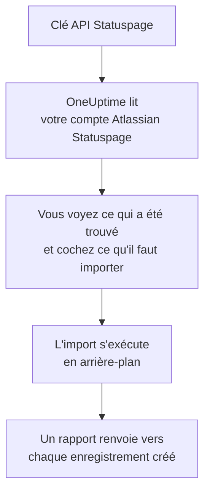

# Quitter Atlassian Statuspage

**Importer depuis un autre outil** fait venir vos pages Atlassian Statuspage dans OneUptime en quelques minutes. Avec une clé API Statuspage, OneUptime lit vos pages, leurs composants et groupes, et leurs abonnés par e-mail, vous montre ce qu'il a trouvé et crée ce que vous cochez. Rien ne change dans Statuspage.

:::cards
- [Importer votre compte](#importer-votre-compte-atlassian-statuspage) : Créez une clé, lisez votre compte et cochez ce qu'il faut importer.
- [Ce qui est importé](#ce-qui-est-importé) : Ce que devient dans OneUptime chaque page, composant et abonné Statuspage.
- [Terminer la migration](#terminer-la-migration) : Ce qu'il reste à faire une fois l'import terminé.
:::

## Fonctionnement

- **La clé ne sert qu'une fois.** Elle est conservée chiffrée pendant que OneUptime lit votre compte et supprimée dès la fin de la lecture, qu'elle ait réussi ou non. Elle n'est jamais réaffichée ni écrite dans un journal.
- **OneUptime ne fait que lire.** Il n'appelle que l'API de Atlassian Statuspage : `api.statuspage.io`. Il fait une requête par seconde, le maximum que Statuspage accorde à une clé. Quand Atlassian Statuspage lui demande de ralentir, il attend puis réessaie.
- **Rien n'est créé avant que vous lanciez l'import.** L'aperçu indique, pour chaque élément, s'il est nouveau, déjà dans OneUptime (et utilisé tel quel), repris par un import précédent, ou pourquoi il ne peut pas être importé.
- **Relancer l'import ne crée jamais rien en double.** OneUptime retient ce que chaque import a repris, par son identifiant Atlassian Statuspage. Relancez-le après avoir ajouté des pages ou des composants dans Atlassian Statuspage : seuls les nouveaux sont créés.

## Avant de commencer

- **Un projet OneUptime, et le droit de créer ce que vous importez.** Les propriétaires et administrateurs du projet peuvent tout importer. Les autres rôles peuvent aussi lancer un import, et importer les types d'enregistrements qu'ils peuvent créer. Le reste est affiché comme non importé, avec la raison.
- **Une clé API Statuspage.** Seul un propriétaire du compte peut en créer une. L'import n'écrit jamais dans Statuspage, et il lit chaque page que la clé peut voir.
- **De la place pour vos pages, sur OneUptime Cloud.** Votre offre a de la place pour un nombre donné de pages de statut et d'abonnés. Ce qui ne rentre pas est affiché comme non importé. Les composants deviennent des moniteurs manuels, qui sont gratuits.

## Importer votre compte Atlassian Statuspage

:::steps
### Créer une clé API dans Statuspage
Dans Statuspage, sélectionnez votre avatar en bas à gauche, puis **API info**. Sélectionnez **Create key**, nommez-la `OneUptime import`, puis copiez-la.

### Ouvrir la page d'import
Dans OneUptime, ouvrez **Paramètres du projet** > **Importer depuis un autre outil** et sélectionnez **Atlassian Statuspage**.

### Connecter Atlassian Statuspage
Collez la clé dans **Clé API Atlassian Statuspage** et sélectionnez **Lire mon compte Atlassian Statuspage**. Un compte volumineux prend quelques minutes, et vous pouvez quitter la page pendant la lecture.

### Cocher ce qu'il faut importer
L'aperçu liste ce qui a été trouvé, une section par type. Tout ce qui serait créé est coché au départ, sauf les abonnés. Sous chaque élément, OneUptime indique ce qui ne sera pas importé exactement à l'identique. Quand une page de statut cochée affiche un moniteur que vous n'avez pas coché, il le signale, et **Les cocher aussi** le coche. Pour importer des abonnés, cochez-les, puis confirmez en dessous qu'ils ont accepté de recevoir vos mises à jour et que vous pouvez les déplacer. Personne ne reçoit d'e-mail.

### Lancer l'import
Sélectionnez **Lancer l'import**. L'import s'exécute en arrière-plan : vous pouvez quitter la page, et le rapport vous y attend.
:::

Le rapport compte ce qui a été créé et non importé, et liste chaque élément avec un lien vers l'enregistrement qu'il est devenu, les échecs en premier. Les imports précédents sont listés sous **Imports précédents** sur la même page.

## Ce qui est importé

| Dans Atlassian Statuspage | Dans OneUptime | Comment |
| --- | --- | --- |
| Components | Moniteurs manuels | Chaque composant devient un moniteur manuel que la page de statut affiche. Rien ne le vérifie : vous définissez son statut dans OneUptime, comme dans Statuspage. Un groupe de composants devient un groupe sur la page. |
| Pages | Pages de statut | Chaque page est importée avec son nom et sa description, ses composants dans leurs groupes, et la disponibilité et l'historique des composants qu'elle met en avant. Une page que seules certaines personnes peuvent voir est importée en privé. |
| Email subscribers | Abonnés de la page de statut | Les abonnés par e-mail confirmés sont importés une fois que vous confirmez pouvoir les déplacer, et suivent les mêmes composants. Personne ne reçoit d'e-mail, et chaque mise à jour qu'ils reçoivent de OneUptime contient un lien de désabonnement. |

Les composants sont importés comme opérationnels. L'aperçu nomme chacun de ceux qui ne sont pas opérationnels dans Statuspage en ce moment, pour que vous définissiez leur statut après l'import.

## Ce qui n'est pas importé

- **Les incidents, les maintenances planifiées et leur historique.** Un incident dans OneUptime est un enregistrement vivant qui alerte des personnes : les anciens restent donc dans Statuspage.
- **Les abonnés par SMS, webhook, Slack ou Microsoft Teams.** L'aperçu les compte. Seuls les abonnés par e-mail sont importés.
- **Les modèles d'incident et les métriques système.** Ajoutez dans OneUptime ce dont vous avez encore besoin.
- **Le domaine propre et l'image de marque d'une page de statut.** Dans OneUptime, ajoutez le domaine dans **Domaines personnalisés** et le logo dans **Image de marque**.

## Limites

Un import crée au plus 2 000 enregistrements : au plus 1 000 moniteurs et 50 pages de statut. Les abonnés ne comptent pas dans ce total : un import reprend au plus 5 000 abonnés. Tout ce qui dépasse une limite est affiché comme non importé. Relancez l'import pour reprendre le reste.

Sur OneUptime Cloud, les pages de statut et les abonnés pour lesquels votre offre n'a plus de place sont affichés comme non importés, avec ce qu'il leur faut.

Un aperçu est conservé un jour. Seule la personne qui a lu le compte peut cocher et lancer l'import. Les propriétaires et administrateurs du projet voient la progression et le rapport de chaque import.

## Terminer la migration

:::steps
### Vérifier vos pages de statut
Sous **Pages de statut**, ouvrez chaque page et comparez-la avec celle de Statuspage. Chaque composant est un moniteur manuel : changez son statut dans OneUptime quand quelque chose change.

### Faire pointer l'adresse de votre page de statut vers OneUptime
Sous **Pages de statut**, ouvrez la page, ajoutez votre domaine dans **Domaines personnalisés**, puis modifiez son enregistrement DNS. Vos visiteurs et abonnés arrivent alors sur la nouvelle page.

### Désactiver votre page dans Atlassian Statuspage
Dès que votre domaine pointe vers OneUptime, fermez la page dans Statuspage pour que ses abonnés ne soient pas prévenus deux fois.
:::

## Dépannage

:::details Atlassian Statuspage n'a pas accepté la clé API
Vérifiez que vous avez copié la clé entière, et qu'un propriétaire du compte l'a créée sous **API info**. Une clé appartient à une organisation Statuspage et ne lit que ses pages. Sélectionnez ensuite **Réessayer**.
:::

:::details Les abonnés ne peuvent pas être importés
Cochez la case en dessous qui confirme qu'ils ont accepté de recevoir vos mises à jour et que vous pouvez les déplacer : **Lancer l'import** l'attend. Les abonnés qui n'ont jamais confirmé leur abonnement dans Statuspage y restent.
:::

:::details Certains éléments ne peuvent pas être cochés
Chacun indique pourquoi : un nom que le projet a déjà, quelque chose qu'un import précédent a repris, ou un enregistrement que vous n'avez pas le droit de créer ou que votre offre n'inclut pas.
:::

## Étapes suivantes

:::cards
- [Vue d'ensemble des pages de statut](/docs/status-pages/index) : Ce qu'affiche une page de statut, et qui peut la voir.
- [Abonnés et annonces](/docs/status-pages/subscribers) : Comment les abonnés sont informés des incidents.
- [Surveillance manuelle](/docs/monitor/manual-monitor) : Un moniteur dont vous définissez vous-même le statut.
:::
