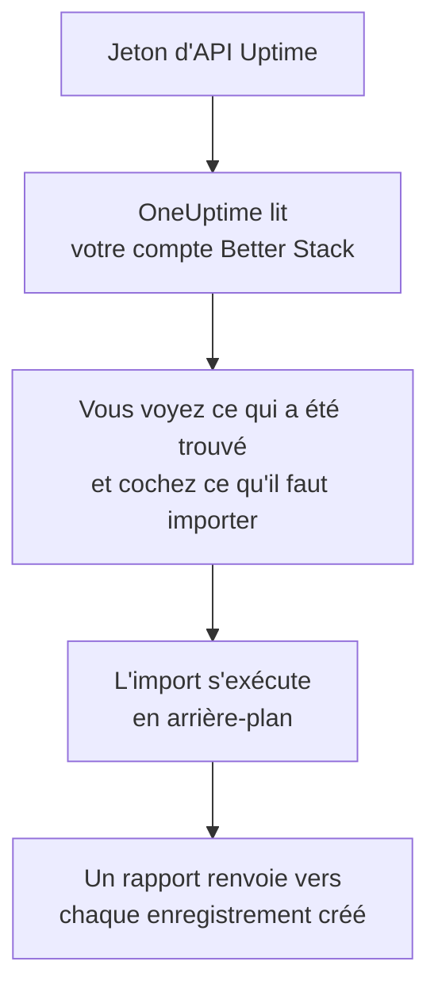

# Quitter Better Stack

**Importer depuis un autre outil** fait venir vos moniteurs Uptime, heartbeats et pages de statut Better Stack dans OneUptime en quelques minutes. Avec un jeton d'API Uptime de Better Stack, OneUptime lit vos moniteurs, heartbeats, pages de statut et leurs abonnés par e-mail, vous montre ce qu'il a trouvé et crée ce que vous cochez. Rien ne change dans Better Stack.

:::cards
- [Importer votre compte](#importer-votre-compte-better-stack) : Créez un jeton, lisez votre compte et cochez ce qu'il faut importer.
- [Ce qui est importé](#ce-qui-est-importé) : Ce que devient dans OneUptime chaque moniteur, heartbeat et page de statut Better Stack.
- [Terminer la migration](#terminer-la-migration) : Ce qu'il reste à faire une fois l'import terminé.
:::

## Fonctionnement

- **La clé ne sert qu'une fois.** Elle est conservée chiffrée pendant que OneUptime lit votre compte et supprimée dès la fin de la lecture, qu'elle ait réussi ou non. Elle n'est jamais réaffichée ni écrite dans un journal.
- **OneUptime ne fait que lire.** Il n'appelle que l'API de Better Stack : `incidents.betterstack.com`. Quand Better Stack lui demande de ralentir, il attend puis réessaie.
- **Rien n'est créé avant que vous lanciez l'import.** L'aperçu indique, pour chaque élément, s'il est nouveau, déjà dans OneUptime (et utilisé tel quel), repris par un import précédent, ou pourquoi il ne peut pas être importé.
- **Relancer l'import ne crée jamais rien en double.** OneUptime retient ce que chaque import a repris, par son identifiant Better Stack. Relancez-le après avoir ajouté des moniteurs ou des heartbeats dans Better Stack : seuls les nouveaux sont créés.

## Avant de commencer

- **Un projet OneUptime, et le droit de créer ce que vous importez.** Les propriétaires et administrateurs du projet peuvent tout importer. Les autres rôles peuvent aussi lancer un import, et importer les types d'enregistrements qu'ils peuvent créer. Le reste est affiché comme non importé, avec la raison.
- **Un jeton d'API Uptime de Better Stack.** Utilisez un jeton Uptime d'équipe : il lit les moniteurs, heartbeats et pages de statut de cette équipe. L'import n'écrit jamais dans Better Stack.
- **Un moyen de paiement, sur OneUptime Cloud.** Les moniteurs qui effectuent des vérifications sont facturés à l'usage, même avec l'offre Free : ajoutez-en un dans **Paramètres du projet** > **Facturation** avant l'import. Sans lui, ces moniteurs sont affichés comme non importés.

## Importer votre compte Better Stack

:::steps
### Créer un jeton d'API dans Better Stack
Dans Better Stack, ouvrez **API tokens** > **Team-based tokens** et sélectionnez votre équipe. Sous **Uptime API tokens**, créez un jeton nommé `OneUptime import` et copiez-le.

### Ouvrir la page d'import
Dans OneUptime, ouvrez **Paramètres du projet** > **Importer depuis un autre outil** et sélectionnez **Better Stack**.

### Connecter Better Stack
Collez le jeton dans **Clé API Better Stack** et sélectionnez **Lire mon compte Better Stack**. Un compte volumineux prend quelques minutes, et vous pouvez quitter la page pendant la lecture.

### Cocher ce qu'il faut importer
L'aperçu liste ce qui a été trouvé, une section par type. Tout ce qui serait créé est coché au départ, sauf les moniteurs en pause, importés en pause si vous les cochez, et les abonnés. Sous chaque élément, OneUptime indique ce qui ne sera pas importé exactement à l'identique. Quand une page de statut cochée affiche un moniteur que vous n'avez pas coché, il le signale, et **Les cocher aussi** le coche. Pour importer des abonnés, cochez-les, puis confirmez en dessous qu'ils ont accepté de recevoir vos mises à jour et que vous pouvez les déplacer. Personne ne reçoit d'e-mail.

### Lancer l'import
Sélectionnez **Lancer l'import**. L'import s'exécute en arrière-plan : vous pouvez quitter la page, et le rapport vous y attend.
:::

Le rapport compte ce qui a été créé et non importé, et liste chaque élément avec un lien vers l'enregistrement qu'il est devenu, les échecs en premier. Les imports précédents sont listés sous **Imports précédents** sur la même page.

## Ce qui est importé

| Dans Better Stack | Dans OneUptime | Comment |
| --- | --- | --- |
| Monitors and heartbeats | Moniteurs | Chaque moniteur devient un moniteur du même type, avec la même adresse, le même intervalle et le même délai d'attente. Chaque heartbeat devient un moniteur de requêtes entrantes. |
| Status pages | Pages de statut | Chaque page est importée avec ses sections en groupes et les moniteurs et heartbeats qu'elle affiche. Un élément suivi à la main devient un moniteur manuel. Une page protégée par mot de passe ou par une liste d'adresses IP autorisées est importée en privé. |
| Email subscribers | Abonnés de la page de statut | Les abonnés par e-mail confirmés sont importés une fois que vous confirmez pouvoir les déplacer, et suivent les mêmes ressources. Personne ne reçoit d'e-mail, et chaque mise à jour qu'ils reçoivent de OneUptime contient un lien de désabonnement. |

- **Les moniteurs status, expected status code, keyword et keyword absence** deviennent des moniteurs de site web, ou des moniteurs d'API quand ils envoient une autre méthode, des en-têtes ou un corps JSON. Un moniteur status est disponible sur toute réponse 2xx, et un moniteur expected status code sur les codes qu'il liste.
- **Les moniteurs ping et TCP** deviennent des moniteurs ping et de port. **Les moniteurs SMTP, POP et IMAP** deviennent des moniteurs de port sur leur port : OneUptime vérifie que le port répond, pas l'échange de courrier.
- **Les moniteurs DNS** deviennent des moniteurs DNS du nom qu'ils interrogent, auprès du même serveur.
- **Les heartbeats** deviennent des moniteurs de requêtes entrantes, qui tombent quand aucune requête n'est arrivée pendant la période et le délai de grâce. Chacun a une nouvelle adresse dans OneUptime.
- **Les alertes d'expiration SSL.** Un moniteur qui avertit avant l'expiration de son certificat reçoit aussi un moniteur de certificat SSL, à son nom, qui avertit autant de jours à l'avance.

Chaque moniteur est vérifié par les sondes de votre projet, comme un moniteur que vous créez vous-même. Un intervalle que OneUptime ne propose pas devient le plus proche qu'il propose, et un délai d'attente de plus d'une minute devient une minute. L'aperçu indique quand l'un ou l'autre change.

## Ce qui n'est pas importé

- **L'historique de disponibilité, les temps de réponse et les incidents.** OneUptime commence à vérifier une fois l'import terminé.
- **Les contacts d'alerte et les intégrations.** Choisissez qui est prévenu dans OneUptime, comme décrit dans [Terminer la migration](#terminer-la-migration).
- **Les mots de passe, et les en-têtes qui peuvent contenir un secret.** Un moniteur qui se connecte, ou qui envoie un en-tête `Authorization`, de cookie ou de jeton, est importé sans lui : ajoutez-le avec un [secret de moniteur](/docs/monitor/monitor-secrets).
- **Les moniteurs UDP et Playwright.** OneUptime n'a aucun moniteur qui fait la même chose, et l'aperçu nomme chacun d'eux.
- **Les abonnés qui n'ont jamais confirmé leur abonnement.** Ils restent dans Better Stack.
- **Ce qu'une page de statut affiche en plus des moniteurs, heartbeats et éléments suivis à la main.** L'aperçu nomme chacun d'eux.
- **Le domaine propre et l'image de marque d'une page de statut.** Dans OneUptime, ajoutez le domaine dans **Domaines personnalisés** et le logo dans **Image de marque**.

## Limites

Un import crée au plus 2 000 enregistrements : au plus 1 000 moniteurs et 50 pages de statut. Les abonnés ne comptent pas dans ce total : un import reprend au plus 5 000 abonnés. Tout ce qui dépasse une limite est affiché comme non importé. Relancez l'import pour reprendre le reste.

Sur OneUptime Cloud, les moniteurs qui effectuent des vérifications ont besoin d'un moyen de paiement, et ce pour quoi votre offre n'a plus de place est affiché comme non importé, avec ce qu'il lui faut.

Un aperçu est conservé un jour. Seule la personne qui a lu le compte peut cocher et lancer l'import. Les propriétaires et administrateurs du projet voient la progression et le rapport de chaque import.

## Terminer la migration

:::steps
### Vérifier vos moniteurs
Ouvrez chacun d'eux sous **Moniteurs** et vérifiez ses premiers résultats. Un moniteur heartbeat a une nouvelle adresse : faites pointer dessus la tâche qui l'appelle.

### Choisir qui est prévenu
Ajoutez des propriétaires à vos moniteurs, ou une politique d'astreinte sous **Astreinte** > **Politiques d'astreinte** aux incidents qu'ils ouvrent, pour que les bonnes personnes soient prévenues quand quelque chose tombe en panne.

### Faire pointer l'adresse de votre page de statut vers OneUptime
Sous **Pages de statut**, ouvrez la page, ajoutez votre domaine dans **Domaines personnalisés**, puis modifiez son enregistrement DNS. Vos visiteurs et abonnés arrivent alors sur la nouvelle page.

### Désactiver les vérifications dans Better Stack
Dès que OneUptime vérifie les mêmes choses, mettez-les en pause dans Better Stack pour que personne ne soit prévenu deux fois.
:::

## Dépannage

:::details Better Stack n'a pas accepté la clé API
Vérifiez que vous avez copié le jeton entier, et qu'il s'agit du jeton de l'équipe dans **Uptime API tokens**, et non d'un jeton Telemetry. Sélectionnez ensuite **Réessayer**.
:::

:::details Un moniteur est affiché comme non importé
Il indique pourquoi : un type de moniteur que OneUptime n'a pas, une adresse que OneUptime ne peut pas lire, ou un projet sans place ni moyen de paiement pour lui. Un moniteur que OneUptime exécute déjà, avec le même nom, le même type et la même adresse, est utilisé tel quel.
:::

:::details Certains éléments ne peuvent pas être cochés
Chacun indique pourquoi : un nom que le projet a déjà, quelque chose qu'un import précédent a repris, ou un enregistrement que vous n'avez pas le droit de créer ou que votre offre n'inclut pas.
:::

## Étapes suivantes

:::cards
- [Surveillance des requêtes entrantes](/docs/monitor/incoming-request-monitor) : Comment fonctionne un heartbeat dans OneUptime.
- [Vue d'ensemble des pages de statut](/docs/status-pages/index) : Ce qu'affiche une page de statut, et qui peut la voir.
- [Quitter UptimeRobot](/docs/moving-to-oneuptime/uptimerobot) : Faire venir vos vérifications depuis UptimeRobot.
:::
