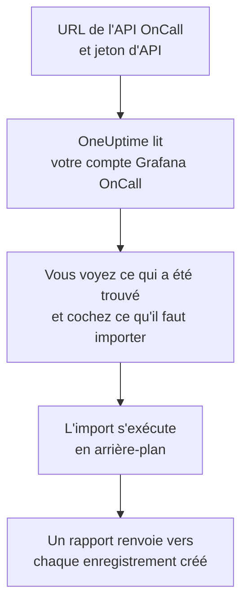

# Quitter Grafana OnCall

Grafana Labs a archivé la version open source de Grafana OnCall en mars 2026, et sur Grafana Cloud elle continue au sein de Grafana Cloud IRM. Où que la vôtre tourne, **Importer depuis un autre outil** fait venir votre configuration d'astreinte dans OneUptime en quelques minutes. Avec votre URL d'API OnCall et un jeton d'API, OneUptime lit vos utilisateurs, équipes, plannings et chaînes d'escalade, vous montre ce qu'il a trouvé et crée ce que vous cochez. Rien ne change dans Grafana OnCall.

:::cards
- [Importer votre compte](#importer-votre-compte-grafana-oncall) : Créez un jeton, lisez votre compte et cochez ce qu'il faut importer.
- [Ce qui est importé](#ce-qui-est-importé) : Ce que devient chaque enregistrement Grafana OnCall dans OneUptime.
- [Terminer la migration](#terminer-la-migration) : Ce qu'il reste à faire une fois l'import terminé.
:::

## Fonctionnement

- **Le jeton ne sert qu'une fois.** Il est conservé chiffré, avec l'URL de l'API, pendant que OneUptime lit votre compte et supprimé dès la fin de la lecture, qu'elle ait réussi ou non. Il n'est jamais réaffiché ni écrit dans un journal.
- **OneUptime ne fait que lire, et seulement à l'adresse que vous donnez.** Il n'appelle que l'URL de l'API OnCall que vous collez, au plus une fois par seconde, ce qui reste dans la limite de Grafana OnCall de 300 requêtes par jeton en cinq minutes. Quand Grafana OnCall lui demande de ralentir, il attend puis réessaie.
- **L'adresse est vérifiée avant chaque requête.** OneUptime n'appelle jamais la machine sur laquelle il tourne ni un service de métadonnées cloud, et ne suit jamais de redirection. Sur OneUptime Cloud, l'adresse doit en plus être publique et commencer par `https://`. Un OneUptime auto-hébergé peut aussi lire un Grafana OnCall sur votre propre réseau, sauf si son administrateur l'a désactivé, comme décrit dans [Private Network Access](/docs/self-hosted/private-network-access).
- **Rien n'est créé avant que vous lanciez l'import.** L'aperçu indique, pour chaque élément, s'il est nouveau, déjà dans OneUptime (et utilisé tel quel), repris par un import précédent, ou pourquoi il ne peut pas être importé.
- **Relancer l'import ne crée jamais rien en double.** OneUptime retient ce que chaque import a repris, par son identifiant Grafana OnCall. Relancez-le après avoir ajouté des personnes ou des plannings dans Grafana OnCall : seuls les nouveaux sont créés.

## Avant de commencer

- **Un projet OneUptime, et le droit de créer ce que vous importez.** Les propriétaires et administrateurs du projet peuvent tout importer. Les autres rôles peuvent aussi lancer un import, et importer les types d'enregistrements qu'ils peuvent créer. Le reste est affiché comme non importé, avec la raison.
- **Un jeton d'API Grafana OnCall.** Utilisez un jeton d'API OnCall, pas le jeton d'un compte de service Grafana. L'import n'écrit jamais dans Grafana OnCall. Supprimez le jeton une fois l'import terminé.
- **Votre URL d'API OnCall.** Les paramètres d'OnCall l'affichent à côté des jetons d'API. Sur Grafana Cloud, elle ressemble à `https://oncall-prod-us-central-0.grafana.net/oncall`. Sur votre propre installation, c'est l'adresse de votre moteur OnCall.

## Importer votre compte Grafana OnCall

:::steps
### Créer un jeton d'API dans Grafana OnCall
Dans Grafana, ouvrez **OnCall** > **Settings**. Sur Grafana Cloud, ouvrez **IRM** > **Settings** > **Admin & API**. Copiez l'URL de l'API OnCall qui y est affichée. Sous **API tokens**, créez un jeton nommé `OneUptime import` et copiez-le.

### Ouvrir la page d'import
Dans OneUptime, ouvrez **Paramètres du projet** > **Importer depuis un autre outil** et sélectionnez **Grafana OnCall**.

### Connecter Grafana OnCall
Collez l'adresse dans **URL de l'API Grafana OnCall** et le jeton dans **Clé API Grafana OnCall**, puis sélectionnez **Lire mon compte Grafana OnCall**. Un compte volumineux prend quelques minutes, et vous pouvez quitter la page pendant la lecture.

### Cocher ce qu'il faut importer
L'aperçu liste ce qui a été trouvé, une section par type. Tout ce qui serait créé est coché au départ, sauf les personnes qui ne font partie d'aucune équipe, d'aucun planning ni d'aucune chaîne d'escalade. Sous chaque élément, OneUptime indique ce qui ne sera pas importé exactement à l'identique. Quand un élément coché utilise quelque chose que vous n'avez pas coché, il le signale, et **Les cocher aussi** le coche.

### Lancer l'import
Si des personnes seront invitées, choisissez l'équipe qu'elles rejoignent sous **Inviter les nouvelles personnes dans**. Sélectionnez ensuite **Lancer l'import**. L'import s'exécute en arrière-plan : vous pouvez quitter la page, et le rapport vous y attend.
:::

Le rapport compte ce qui a été créé, invité et non importé, et liste chaque élément avec un lien vers l'enregistrement qu'il est devenu, les échecs en premier. Les imports précédents sont listés sous **Imports précédents** sur la même page.

## Ce qui est importé

| Dans Grafana OnCall | Dans OneUptime | Comment |
| --- | --- | --- |
| Utilisateurs | Membres du projet | Rapprochés par adresse e-mail. Toute personne qui n'est pas encore dans le projet est invitée dans l'équipe que vous choisissez. |
| Équipes | Équipes | Créées avec leurs membres. Une équipe dont le projet a déjà le nom est utilisée telle quelle, et ses membres ne sont pas modifiés. |
| Plannings | Plannings d'astreinte | Chaque rotation devient une couche avec les mêmes personnes, le même début, la même passation et les mêmes heures d'astreinte, dans le fuseau horaire du planning, détenue par l'équipe du planning. Une rotation sur une couche supérieure prend toujours le pas sur celles du dessous. |
| Chaînes d'escalade | Politiques d'astreinte | Les étapes qui notifient des personnes, une équipe ou la personne d'astreinte d'un planning deviennent des règles d'escalade, et une étape d'attente devient l'attente avant la règle suivante. Une étape qui répète la chaîne devient les répétitions de la politique. |

Les rotations d'une même couche qui sont d'astreinte en même temps, et une rotation qui met plusieurs personnes d'astreinte à la fois, deviennent chacune un planning OneUptime, car un planning OneUptime n'a qu'une personne d'astreinte à la fois. Chaque politique d'astreinte qui alertait le planning les alerte tous.

## Ce qui n'est pas importé

- **Les groupes d'alertes et leur historique.** OneUptime démarre avec votre configuration, pas avec vos alertes passées.
- **Les intégrations, routes et webhooks sortants.** Dirigez plutôt vos moniteurs et sources d'alertes vers OneUptime, comme indiqué dans [Terminer la migration](#terminer-la-migration).
- **Les remplacements, les créneaux ponctuels et les rotations déjà terminées.** Ajoutez dans OneUptime, après l'import, les remplacements dont vous avez encore besoin.
- **Les créneaux issus d'un lien de calendrier.** Un planning dont les créneaux viennent d'un lien iCal est importé sans couches : ajoutez-les dans OneUptime.
- **Les règles de notification de chaque personne.** Chacun choisit comment être alerté dans ses propres **Paramètres utilisateur** une fois son invitation acceptée.
- **Les étapes sans équivalent exact dans OneUptime.** Une étape qui notifie un groupe d'utilisateurs Slack ou un canal, appelle un webhook, déclare un incident ou résout l'alerte est laissée de côté. Une étape qui notifie les personnes une à une les alerte toutes en même temps, une étape qui ne continue qu'à certaines heures ou selon un nombre d'alertes continue toujours, et l'aperçu indique ce qui change.

## Limites

Un import crée au plus 2 000 enregistrements : au plus 500 personnes, 200 équipes, 200 plannings d'astreinte et 200 politiques d'astreinte. Tout ce qui dépasse une limite est affiché comme non importé. Relancez l'import pour reprendre le reste.

Sur OneUptime Cloud, les enregistrements que votre offre n'inclut pas sont affichés comme non importés, avec l'offre nécessaire.

Un aperçu est conservé un jour. Seule la personne qui a lu le compte peut cocher et lancer l'import. Les propriétaires et administrateurs du projet voient la progression et le rapport de chaque import.

## Terminer la migration

:::steps
### Vérifier les plannings d'astreinte
Ouvrez chaque planning sous **Astreinte** > **Plannings d'astreinte** et vérifiez qui est d'astreinte maintenant et qui le sera ensuite.

### S'assurer que chacun peut être alerté
Les personnes invitées acceptent leur invitation, puis ajoutent un numéro de téléphone, une adresse e-mail ou l'application mobile sur lesquels être alertées. **Astreinte** > **Disponibilité** montre qui ne peut pas encore être joint.

### Envoyer vos alertes à OneUptime
Dirigez vos moniteurs et les outils qui déclenchent des alertes vers OneUptime, et alertez-vous une fois pour tester.

### Désactiver les alertes dans Grafana OnCall
Dès que OneUptime alerte les bonnes personnes, désactivez les notifications dans Grafana OnCall pour que personne ne soit alerté deux fois.
:::

## Dépannage

:::details Grafana OnCall n'a pas accepté la clé API
Vérifiez que vous avez copié le jeton entier, qu'il s'agit d'un jeton d'API OnCall et non du jeton d'un compte de service Grafana, et que l'URL de l'API est celle affichée à côté. Sélectionnez ensuite **Réessayer**.
:::

:::details OneUptime n'a pas appelé l'URL de l'API
Collez l'URL de l'API OnCall exactement comme les paramètres d'OnCall l'affichent. Sur OneUptime Cloud, elle doit commencer par `https://` et être joignable depuis Internet. Un OneUptime auto-hébergé peut aussi joindre une adresse de votre propre réseau, sauf si son administrateur l'a désactivé, mais jamais une adresse de la machine sur laquelle OneUptime tourne.
:::

:::details Un type d'enregistrement manque dans l'aperçu
Le jeton n'a pas pu le lire, et l'aperçu l'indique en haut. Un jeton lit ce que la personne qui l'a créé peut voir : créez-le donc en tant qu'administrateur de Grafana OnCall et relisez le compte.
:::

:::details Certains éléments ne peuvent pas être cochés
Chacun indique pourquoi : un nom que le projet a déjà, quelque chose qu'un import précédent a repris, ou un enregistrement que vous n'avez pas le droit de créer ou que votre offre n'inclut pas.
:::

## Étapes suivantes

:::cards
- [Plannings d'astreinte](/docs/on-call/schedules) : Couches, restrictions et passations.
- [Règles d'escalade](/docs/on-call/escalation-rules) : Comment les politiques d'astreinte alertent les personnes.
- [Quitter PagerDuty](/docs/moving-to-oneuptime/pagerduty) : Faire venir une équipe depuis PagerDuty.
:::
