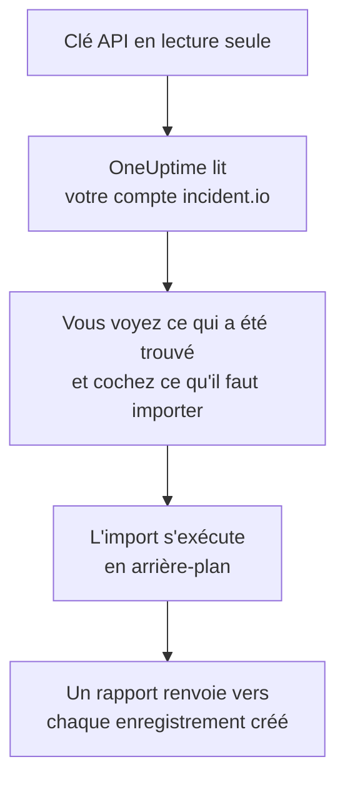

# Quitter incident.io

**Importer depuis un autre outil** fait venir votre configuration incident.io dans OneUptime en quelques minutes. Avec une clé API incident.io en lecture seule, OneUptime lit vos utilisateurs, équipes, plannings, chemins d'escalade, services et paramètres d'incident, vous montre ce qu'il a trouvé et crée ce que vous cochez. Rien ne change dans incident.io.

:::cards
- [Importer votre compte](#importer-votre-compte-incidentio) : Créez une clé, lisez votre compte et cochez ce qu'il faut importer.
- [Ce qui est importé](#ce-qui-est-importé) : Ce que devient chaque enregistrement incident.io dans OneUptime.
- [Terminer la migration](#terminer-la-migration) : Ce qu'il reste à faire une fois l'import terminé.
:::

## Fonctionnement

- **La clé ne sert qu'une fois.** Elle est conservée chiffrée pendant que OneUptime lit votre compte et supprimée dès la fin de la lecture, qu'elle ait réussi ou non. Elle n'est jamais réaffichée ni écrite dans un journal.
- **OneUptime ne fait que lire.** Il n'appelle que l'API d'incident.io, `api.incident.io`. Quand incident.io lui demande de ralentir, il attend puis réessaie.
- **Rien n'est créé avant que vous lanciez l'import.** L'aperçu indique, pour chaque élément, s'il est nouveau, déjà dans OneUptime (et utilisé tel quel), repris par un import précédent, ou pourquoi il ne peut pas être importé.
- **Relancer l'import ne crée jamais rien en double.** OneUptime retient ce que chaque import a repris, par son identifiant incident.io. Relancez-le après avoir ajouté des personnes ou des plannings dans incident.io : seuls les nouveaux sont créés.

## Avant de commencer

- **Un projet OneUptime, et le droit de créer ce que vous importez.** Les propriétaires et administrateurs du projet peuvent tout importer. Les autres rôles peuvent aussi lancer un import, et importer les types d'enregistrements qu'ils peuvent créer. Le reste est affiché comme non importé, avec la raison.
- **Une clé API incident.io qui ne peut que consulter les données.** L'import n'écrit jamais dans incident.io : la clé n'a donc besoin d'aucun droit de création, de modification ou de gestion.

## Importer votre compte incident.io

:::steps
### Créer une clé API dans incident.io
Dans incident.io, ouvrez **Settings** > **API keys** et sélectionnez **Add new**. Nommez-la `OneUptime import`, donnez-lui uniquement des droits de consultation, aucun droit de création, de modification ou de gestion, puis copiez la clé.

### Ouvrir la page d'import
Dans OneUptime, ouvrez **Paramètres du projet** > **Importer depuis un autre outil** et sélectionnez **incident.io**.

### Connecter incident.io
Collez la clé dans **Clé API incident.io** et sélectionnez **Lire mon compte incident.io**. Un compte volumineux prend quelques minutes, et vous pouvez quitter la page pendant la lecture.

### Cocher ce qu'il faut importer
L'aperçu liste ce qui a été trouvé, une section par type. Tout ce qui serait créé est coché au départ, sauf les personnes qui ne font partie d'aucune équipe, d'aucun planning ni d'aucun chemin d'escalade. Sous chaque élément, OneUptime indique ce qui ne sera pas importé exactement à l'identique. Quand un élément coché utilise quelque chose que vous n'avez pas coché, il le signale, et **Les cocher aussi** le coche.

### Lancer l'import
Si des personnes seront invitées, choisissez l'équipe qu'elles rejoignent sous **Inviter les nouvelles personnes dans**. Sélectionnez ensuite **Lancer l'import**. L'import s'exécute en arrière-plan : vous pouvez quitter la page, et le rapport vous y attend.
:::

Le rapport compte ce qui a été créé, invité et non importé, et liste chaque élément avec un lien vers l'enregistrement qu'il est devenu, les échecs en premier. Les imports précédents sont listés sous **Imports précédents** sur la même page.

## Ce qui est importé

| Dans incident.io | Dans OneUptime | Comment |
| --- | --- | --- |
| Utilisateurs | Membres du projet | Rapprochés par adresse e-mail. Toute personne qui n'est pas encore dans le projet est invitée dans l'équipe que vous choisissez. Les utilisateurs désactivés ne sont pas importés. |
| Équipes | Équipes | Créées avec leurs membres. Une équipe dont le projet a déjà le nom est utilisée telle quelle, et ses membres ne sont pas modifiés. |
| Plannings | Plannings d'astreinte | Chaque rotation devient une couche avec les mêmes personnes, le même début, la même durée de tour et les mêmes heures de travail, dans le fuseau horaire du planning. C'est la version de la rotation en vigueur aujourd'hui qui est importée. |
| Chemins d'escalade | Politiques d'astreinte | Chaque niveau devient une règle d'escalade qui alerte les mêmes plannings, utilisateurs et équipes, après la même attente. Une répétition devient les répétitions de la politique, et d'une branche, c'est le premier chemin qui est importé. |
| Services du catalogue | Services | Les entrées de vos types de catalogue de la catégorie service, créées dans le catalogue de services. Les entrées archivées sont laissées de côté. |
| Gravités | Gravités d'incident | Créées dans leur ordre incident.io, la plus grave en premier. Une gravité dont le projet a déjà le nom est utilisée telle quelle. |
| Statuts | États d'incident | Un statut de triage correspond à l'état dans lequel OneUptime démarre les incidents, et un statut fermé à l'état dans lequel les incidents sont résolus. Les statuts actifs et en pause sont créés entre Pris en compte et Résolu. |
| Rôles d'incident | Rôles d'incident | Le rôle principal correspond au Responsable d'incident de OneUptime, et les autres rôles sont créés. OneUptime enregistre qui a déclaré chaque incident : le rôle de rapporteur n'est donc pas nécessaire. |
| Champs personnalisés | Champs personnalisés des incidents | Les champs à choix unique deviennent des listes déroulantes, les champs à choix multiples des listes déroulantes à choix multiples, les champs texte et lien du texte, et les champs numériques des nombres, avec leurs options. |

Une rotation où plusieurs personnes sont d'astreinte en même temps devient un planning OneUptime par personne d'astreinte, car un planning OneUptime n'a qu'une personne d'astreinte à la fois. Chaque politique d'astreinte qui alertait le planning les alerte tous.

## Ce qui n'est pas importé

- **Les incidents, les alertes et leur historique.** OneUptime démarre avec votre configuration, pas avec vos incidents passés.
- **Les workflows, pages de statut, routes d'alerte et intégrations.** Dirigez plutôt vos moniteurs et sources d'alertes vers OneUptime, comme indiqué dans [Terminer la migration](#terminer-la-migration).
- **Les champs personnalisés dont les options viennent du catalogue,** et les statuts sans état dans OneUptime : declined, merged, canceled et learning.
- **Les remplacements de planning, et les modifications d'une rotation prévues plus tard.** L'aperçu nomme chaque modification prévue, pour que vous la fassiez dans OneUptime le moment venu.
- **Les étapes d'escalade sans équivalent exact dans OneUptime.** Une étape qui publie dans un canal Slack ou Microsoft Teams est laissée de côté, car ce sont les règles de notification de l'espace de travail qui s'en chargent dans OneUptime, tout comme une étape qui passe la main à un autre chemin d'escalade. Une étape qui alerte la personne d'astreinte suivante est importée sous la forme la plus proche dont dispose OneUptime, et l'aperçu indique ce qui change.

## Limites

Un import crée au plus 2 000 enregistrements : au plus 500 personnes, 200 équipes, 200 plannings d'astreinte, 200 politiques d'astreinte, 500 services, 100 champs personnalisés d'incident et 25 gravités, états et rôles d'incident de chaque sorte. Tout ce qui dépasse une limite est affiché comme non importé. Relancez l'import pour reprendre le reste.

Sur OneUptime Cloud, les enregistrements que votre offre n'inclut pas sont affichés comme non importés, avec l'offre nécessaire.

Un aperçu est conservé un jour. Seule la personne qui a lu le compte peut cocher et lancer l'import. Les propriétaires et administrateurs du projet voient la progression et le rapport de chaque import.

## Terminer la migration

:::steps
### Vérifier les plannings d'astreinte
Ouvrez chaque planning sous **Astreinte** > **Plannings d'astreinte** et vérifiez qui est d'astreinte maintenant et qui le sera ensuite.

### S'assurer que chacun peut être alerté
Les personnes invitées acceptent leur invitation, puis ajoutent un numéro de téléphone, une adresse e-mail ou l'application mobile sur lesquels être alertées. **Astreinte** > **Disponibilité** montre qui ne peut pas encore être joint.

### Envoyer vos alertes à OneUptime
Dirigez vos moniteurs et les outils qui déclenchent des alertes vers OneUptime, et alertez-vous une fois pour tester.

### Désactiver les alertes dans incident.io
Dès que OneUptime alerte les bonnes personnes, désactivez les notifications dans incident.io pour que personne ne soit alerté deux fois.
:::

## Dépannage

:::details incident.io n'a pas accepté la clé API
Vérifiez que vous avez copié la clé entière et qu'elle n'a pas été supprimée dans **Settings** > **API keys**. Sélectionnez ensuite **Réessayer**.
:::

:::details Un type d'enregistrement manque dans l'aperçu
La clé n'a pas pu le lire, et l'aperçu l'indique en haut. Donnez à la clé le droit de consulter ce type de données et relisez le compte.
:::

:::details Certains éléments ne peuvent pas être cochés
Chacun indique pourquoi : un utilisateur désactivé, un nom que le projet a déjà, quelque chose qu'un import précédent a repris, ou un enregistrement que vous n'avez pas le droit de créer ou que votre offre n'inclut pas.
:::

## Étapes suivantes

:::cards
- [Plannings d'astreinte](/docs/on-call/schedules) : Couches, restrictions et passations.
- [États et gravités d'incident](/docs/incidents/states-and-severities) : Les états et gravités par lesquels passent les incidents.
- [Quitter Opsgenie](/docs/moving-to-oneuptime/opsgenie) : Faire venir une équipe depuis Opsgenie.
:::
