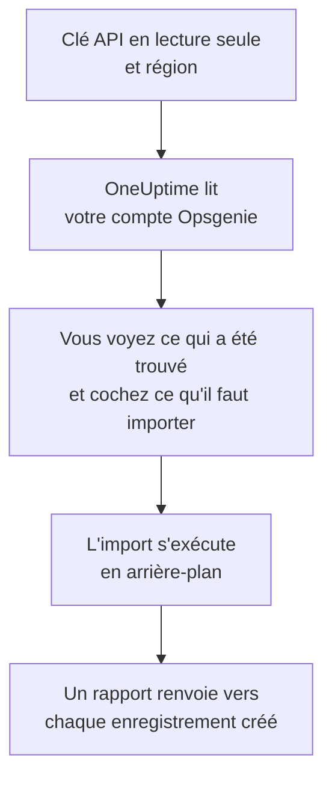

# Quitter Opsgenie

Atlassian met fin à Opsgenie : Opsgenie n'est plus vendu depuis juin 2025 et son support prend fin en avril 2027. OneUptime accueille votre équipe d'astreinte, et **Importer depuis un autre outil** la fait venir en quelques minutes. Avec une clé API Opsgenie en lecture seule, OneUptime lit vos utilisateurs, équipes, plannings, escalades et services, vous montre ce qu'il a trouvé et crée ce que vous cochez. Rien ne change dans Opsgenie.

:::cards
- [Importer votre compte](#importer-votre-compte-opsgenie) : Créez une clé, lisez votre compte et cochez ce qu'il faut importer.
- [Ce qui est importé](#ce-qui-est-importé) : Ce que devient chaque enregistrement Opsgenie dans OneUptime.
- [Terminer la migration](#terminer-la-migration) : Ce qu'il reste à faire une fois l'import terminé.
:::

## Fonctionnement

- **La clé ne sert qu'une fois.** Elle est conservée chiffrée pendant que OneUptime lit votre compte et supprimée dès la fin de la lecture, qu'elle ait réussi ou non. Elle n'est jamais réaffichée ni écrite dans un journal.
- **OneUptime ne fait que lire.** Il n'appelle que l'API d'Opsgenie : `api.opsgenie.com`, ou `api.eu.opsgenie.com` pour un compte en Europe. Quand Opsgenie lui demande de ralentir, il attend puis réessaie.
- **Rien n'est créé avant que vous lanciez l'import.** L'aperçu indique, pour chaque élément, s'il est nouveau, déjà dans OneUptime (et utilisé tel quel), repris par un import précédent, ou pourquoi il ne peut pas être importé.
- **Relancer l'import ne crée jamais rien en double.** OneUptime retient ce que chaque import a repris, par son identifiant Opsgenie. Relancez-le après avoir ajouté des personnes ou des plannings dans Opsgenie : seuls les nouveaux sont créés.

## Avant de commencer

- **Un projet OneUptime, et le droit de créer ce que vous importez.** Les propriétaires et administrateurs du projet peuvent tout importer. Les autres rôles peuvent aussi lancer un import, et importer les types d'enregistrements qu'ils peuvent créer. Le reste est affiché comme non importé, avec la raison.
- **Une clé API Opsgenie avec les droits Read et Configuration access.** Configuration access permet à une clé de lire les utilisateurs, équipes, plannings et escalades. L'import n'écrit jamais dans Opsgenie.
- **Votre région Opsgenie.** Si vous vous connectez sur `app.eu.opsgenie.com`, votre compte est en Europe. Sinon, il est aux États-Unis.

## Importer votre compte Opsgenie

:::steps
### Créer une clé API dans Opsgenie
Dans Opsgenie, ouvrez **Settings** > **API key management** et sélectionnez **Add new API key**. Nommez-la `OneUptime import`, donnez-lui uniquement **Read** et **Configuration access**, puis copiez la clé.

### Ouvrir la page d'import
Dans OneUptime, ouvrez **Paramètres du projet** > **Importer depuis un autre outil** et sélectionnez **Opsgenie**.

### Connecter Opsgenie
Sous **Où se trouve votre compte Opsgenie ?**, choisissez **États-Unis** ou **Europe**. Collez la clé dans **Clé API Opsgenie** et sélectionnez **Lire mon compte Opsgenie**. Un compte volumineux prend quelques minutes, et vous pouvez quitter la page pendant la lecture.

### Cocher ce qu'il faut importer
L'aperçu liste ce qui a été trouvé, une section par type. Tout ce qui serait créé est coché au départ, sauf les plannings désactivés dans Opsgenie et les personnes qui ne font partie d'aucune équipe, d'aucun planning ni d'aucune escalade. Sous chaque élément, OneUptime indique ce qui ne sera pas importé exactement à l'identique. Quand un élément coché utilise quelque chose que vous n'avez pas coché, il le signale, et **Les cocher aussi** le coche.

### Lancer l'import
Si des personnes seront invitées, choisissez l'équipe qu'elles rejoignent sous **Inviter les nouvelles personnes dans**. Sélectionnez ensuite **Lancer l'import**. L'import s'exécute en arrière-plan : vous pouvez quitter la page, et le rapport vous y attend.
:::

Le rapport compte ce qui a été créé, invité et non importé, et liste chaque élément avec un lien vers l'enregistrement qu'il est devenu, les échecs en premier. Les imports précédents sont listés sous **Imports précédents** sur la même page.

## Ce qui est importé

| Dans Opsgenie | Dans OneUptime | Comment |
| --- | --- | --- |
| Utilisateurs | Membres du projet | Rapprochés par adresse e-mail. Toute personne qui n'est pas encore dans le projet est invitée dans l'équipe que vous choisissez. Les utilisateurs bloqués ne sont pas importés. |
| Équipes | Équipes | Créées avec leurs membres. Une équipe dont le projet a déjà le nom est utilisée telle quelle, et ses membres ne sont pas modifiés. |
| Plannings | Plannings d'astreinte | Chaque rotation devient une couche avec les mêmes personnes, le même début, la même durée de tour et la même restriction horaire, dans le fuseau horaire du planning, détenue par l'équipe du planning. |
| Escalades | Politiques d'astreinte | Chaque règle devient une règle d'escalade qui alerte le même planning, utilisateur ou équipe. Les règles ayant le même délai alertent ensemble, et l'attente avant la règle d'escalade suivante est la différence entre les délais. Les répétitions de l'escalade deviennent celles de la politique. |
| Services | Services | Créés dans le catalogue de services, détenus par leur équipe. |

Un planning dont les rotations mettent deux personnes d'astreinte en même temps devient un planning OneUptime par rotation, car un planning OneUptime n'a qu'une personne d'astreinte à la fois. Chaque politique d'astreinte qui alertait le planning les alerte tous.

## Ce qui n'est pas importé

- **Les alertes, les incidents et leur historique.** OneUptime démarre avec votre configuration, pas avec vos alertes passées.
- **Les intégrations, heartbeats, politiques d'alerte et règles de routage.** Dirigez plutôt vos moniteurs et sources d'alertes vers OneUptime, comme indiqué dans [Terminer la migration](#terminer-la-migration).
- **Les remplacements de planning, et les rotations déjà terminées.** Ajoutez dans OneUptime, après l'import, les remplacements dont vous avez encore besoin.
- **Les règles de notification de chaque personne.** Chacun choisit comment être alerté dans ses propres **Paramètres utilisateur** une fois son invitation acceptée.
- **Les étapes sans équivalent exact dans OneUptime.** Une règle qui alerte la personne d'astreinte suivante, ou les administrateurs d'une équipe, est importée sous la forme la plus proche dont dispose OneUptime, et l'aperçu indique ce qui change.

## Limites

Un import crée au plus 2 000 enregistrements : au plus 500 personnes, 200 équipes, 200 plannings d'astreinte, 200 politiques d'astreinte et 500 services. Tout ce qui dépasse une limite est affiché comme non importé. Relancez l'import pour reprendre le reste.

Sur OneUptime Cloud, les enregistrements que votre offre n'inclut pas sont affichés comme non importés, avec l'offre nécessaire.

Un aperçu est conservé un jour. Seule la personne qui a lu le compte peut cocher et lancer l'import. Les propriétaires et administrateurs du projet voient la progression et le rapport de chaque import.

## Terminer la migration

:::steps
### Vérifier les plannings d'astreinte
Ouvrez chaque planning sous **Astreinte** > **Plannings d'astreinte** et vérifiez qui est d'astreinte maintenant et qui le sera ensuite.

### S'assurer que chacun peut être alerté
Les personnes invitées acceptent leur invitation, puis ajoutent un numéro de téléphone, une adresse e-mail ou l'application mobile sur lesquels être alertées. **Astreinte** > **Disponibilité** montre qui ne peut pas encore être joint.

### Envoyer vos alertes à OneUptime
Dirigez vos moniteurs et les outils qui déclenchent des alertes vers OneUptime, et alertez-vous une fois pour tester.

### Désactiver les alertes dans Opsgenie
Dès que OneUptime alerte les bonnes personnes, désactivez les notifications dans Opsgenie pour que personne ne soit alerté deux fois.
:::

## Dépannage

:::details Opsgenie n'a pas accepté la clé API
Vérifiez que vous avez copié la clé entière, qu'il s'agit d'une clé de **API key management** et non de la clé d'une intégration, qu'elle a **Read** et **Configuration access**, et que vous avez choisi la région de votre compte. Sélectionnez ensuite **Réessayer**.
:::

:::details Un type d'enregistrement manque dans l'aperçu
La clé n'a pas pu le lire, et l'aperçu l'indique en haut. Donnez **Configuration access** à la clé et relisez le compte.
:::

:::details Certains éléments ne peuvent pas être cochés
Chacun indique pourquoi : un utilisateur bloqué, un nom que le projet a déjà, quelque chose qu'un import précédent a repris, ou un enregistrement que vous n'avez pas le droit de créer ou que votre offre n'inclut pas.
:::

## Étapes suivantes

:::cards
- [Plannings d'astreinte](/docs/on-call/schedules) : Couches, restrictions et passations.
- [Règles d'escalade](/docs/on-call/escalation-rules) : Comment les politiques d'astreinte alertent les personnes.
- [Quitter incident.io](/docs/moving-to-oneuptime/incident-io) : Faire venir une équipe depuis incident.io.
:::
