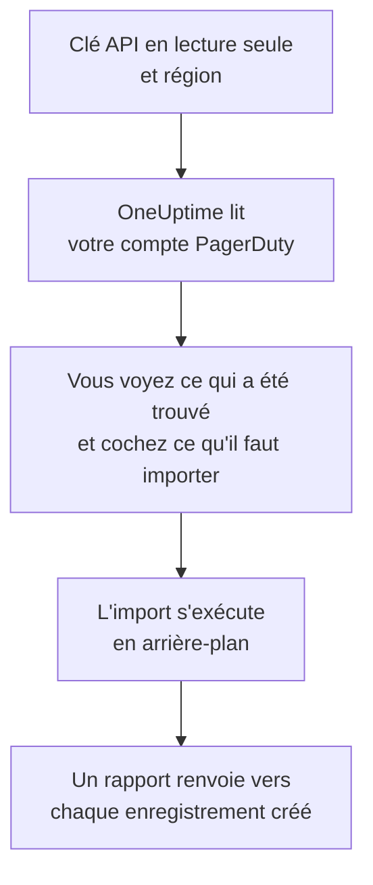

# Quitter PagerDuty

**Importer depuis un autre outil** fait venir votre configuration PagerDuty dans OneUptime en quelques minutes. Avec une clé API PagerDuty en lecture seule, OneUptime lit vos utilisateurs, équipes, plannings, politiques d'escalade et services, vous montre ce qu'il a trouvé et crée ce que vous cochez. Rien ne change dans PagerDuty.

:::cards
- [Importer votre compte](#importer-votre-compte-pagerduty) : Créez une clé, lisez votre compte et cochez ce qu'il faut importer.
- [Ce qui est importé](#ce-qui-est-importé) : Ce que devient chaque enregistrement PagerDuty dans OneUptime.
- [Terminer la migration](#terminer-la-migration) : Ce qu'il reste à faire une fois l'import terminé.
:::

## Fonctionnement

- **La clé ne sert qu'une fois.** Elle est conservée chiffrée pendant que OneUptime lit votre compte et supprimée dès la fin de la lecture, qu'elle ait réussi ou non. Elle n'est jamais réaffichée ni écrite dans un journal.
- **OneUptime ne fait que lire.** Il n'appelle que l'API REST de PagerDuty : `api.pagerduty.com`, ou `api.eu.pagerduty.com` pour un compte en Europe. Quand PagerDuty lui demande de ralentir, il attend puis réessaie.
- **Rien n'est créé avant que vous lanciez l'import.** L'aperçu indique, pour chaque élément, s'il est nouveau, déjà dans OneUptime (et utilisé tel quel), repris par un import précédent, ou pourquoi il ne peut pas être importé.
- **Relancer l'import ne crée jamais rien en double.** OneUptime retient ce que chaque import a repris, par son identifiant PagerDuty. Relancez-le après avoir ajouté des personnes ou des plannings dans PagerDuty : seuls les nouveaux sont créés.

## Avant de commencer

- **Un projet OneUptime, et le droit de créer ce que vous importez.** Les propriétaires et administrateurs du projet peuvent tout importer. Les autres rôles peuvent aussi lancer un import, et importer les types d'enregistrements qu'ils peuvent créer. Le reste est affiché comme non importé, avec la raison.
- **Une clé API REST PagerDuty en lecture seule.** Les administrateurs et propriétaires de compte PagerDuty peuvent en créer une. L'import n'écrit jamais dans PagerDuty : la clé n'a besoin que d'un accès en lecture.
- **Votre région PagerDuty.** Si vous vous connectez sur une adresse qui se termine par `eu.pagerduty.com`, votre compte est en Europe. Sinon, il est aux États-Unis.

## Importer votre compte PagerDuty

:::steps
### Créer une clé API dans PagerDuty
Dans PagerDuty, ouvrez **Integrations** > **Developer Tools** > **API Access Keys** et sélectionnez **Create New API Key**. Décrivez-la comme `OneUptime import`, cochez **Read-only API Key**, sélectionnez **Create Key**, puis copiez la clé.

### Ouvrir la page d'import
Dans OneUptime, ouvrez **Paramètres du projet** > **Importer depuis un autre outil** et sélectionnez **PagerDuty**.

### Connecter PagerDuty
Sous **Où se trouve votre compte PagerDuty ?**, choisissez **États-Unis** ou **Europe**. Collez la clé dans **Clé API PagerDuty** et sélectionnez **Lire mon compte PagerDuty**. Un compte volumineux prend quelques minutes, et vous pouvez quitter la page pendant la lecture.

### Cocher ce qu'il faut importer
L'aperçu liste ce qui a été trouvé, une section par type. Tout ce qui serait créé est coché au départ, sauf les services désactivés dans PagerDuty et les personnes qui ne font partie d'aucune équipe, d'aucun planning ni d'aucune politique d'escalade. Sous chaque élément, OneUptime indique ce qui ne sera pas importé exactement à l'identique. Quand un élément coché utilise quelque chose que vous n'avez pas coché, il le signale, et **Les cocher aussi** le coche.

### Lancer l'import
Si des personnes seront invitées, choisissez l'équipe qu'elles rejoignent sous **Inviter les nouvelles personnes dans**. Sélectionnez ensuite **Lancer l'import**. L'import s'exécute en arrière-plan : vous pouvez quitter la page, et le rapport vous y attend.
:::

Le rapport compte ce qui a été créé, invité et non importé, et liste chaque élément avec un lien vers l'enregistrement qu'il est devenu, les échecs en premier. Les imports précédents sont listés sous **Imports précédents** sur la même page.

## Ce qui est importé

| Dans PagerDuty | Dans OneUptime | Comment |
| --- | --- | --- |
| Utilisateurs | Membres du projet | Rapprochés par adresse e-mail. Toute personne qui n'est pas encore dans le projet est invitée dans l'équipe que vous choisissez. |
| Équipes | Équipes | Créées avec leurs membres. Une équipe dont le projet a déjà le nom est utilisée telle quelle, et ses membres ne sont pas modifiés. |
| Plannings | Plannings d'astreinte | Chaque couche devient une couche avec les mêmes personnes, le même début, la même durée de tour et les mêmes restrictions, dans le fuseau horaire du planning, détenue par l'équipe du planning. Les couches gardent leur ordre : une couche supérieure prend toujours le pas sur celles du dessous. |
| Politiques d'escalade | Politiques d'astreinte | Chaque règle d'escalade devient une règle d'escalade qui alerte les mêmes plannings et utilisateurs, et escalade après le même délai. Les répétitions de la politique deviennent celles de la politique d'astreinte. |
| Services | Services | Créés dans le catalogue de services, détenus par leur équipe. Un service désactivé dans PagerDuty est décoché au départ. |

Un planning PagerDuty reste un seul planning OneUptime : ses couches prennent le pas les unes sur les autres comme dans PagerDuty. Une couche dont les tours ne durent pas un nombre entier d'heures est importée avec des tours arrondis à l'heure, et l'aperçu le signale.

## Ce qui n'est pas importé

- **Les incidents, les alertes et leur historique.** OneUptime démarre avec votre configuration, pas avec vos incidents passés.
- **Les intégrations, Event Orchestrations, Incident Workflows et pages de statut.** Dirigez plutôt vos moniteurs et sources d'alertes vers OneUptime, comme indiqué dans [Terminer la migration](#terminer-la-migration).
- **Les remplacements de planning, et les couches déjà terminées.** Ajoutez dans OneUptime, après l'import, les remplacements dont vous avez encore besoin.
- **Les plannings basés sur les tours de garde.** L'import lit les plannings à couches de PagerDuty, pas ses plannings plus récents basés sur les tours de garde (shift-based schedules). Si votre compte en a, l'aperçu l'indique en haut, et une règle d'escalade qui en alerte un est importée sans lui. Créez-les dans OneUptime.
- **Les règles de notification de chaque personne.** Chacun choisit comment être alerté dans ses propres **Paramètres utilisateur** une fois son invitation acceptée.
- **Les règles sans équivalent exact dans OneUptime.** Une règle d'escalade qui attribue ses personnes à tour de rôle (round robin) les alerte toutes en même temps dans OneUptime, et l'aperçu indique ce qui change.

## Limites

Un import crée au plus 2 000 enregistrements : au plus 500 personnes, 200 équipes, 200 plannings d'astreinte, 200 politiques d'astreinte et 500 services. Tout ce qui dépasse une limite est affiché comme non importé. Relancez l'import pour reprendre le reste.

Sur OneUptime Cloud, les enregistrements que votre offre n'inclut pas sont affichés comme non importés, avec l'offre nécessaire.

Un aperçu est conservé un jour. Seule la personne qui a lu le compte peut cocher et lancer l'import. Les propriétaires et administrateurs du projet voient la progression et le rapport de chaque import.

## Terminer la migration

:::steps
### Vérifier les plannings d'astreinte
Ouvrez chaque planning sous **Astreinte** > **Plannings d'astreinte** et vérifiez qui est d'astreinte maintenant et qui le sera ensuite.

### S'assurer que chacun peut être alerté
Les personnes invitées acceptent leur invitation, puis ajoutent un numéro de téléphone, une adresse e-mail ou l'application mobile sur lesquels être alertées. **Astreinte** > **Disponibilité** montre qui ne peut pas encore être joint.

### Envoyer vos alertes à OneUptime
Dirigez vos moniteurs et les outils qui déclenchent des alertes vers OneUptime, et alertez-vous une fois pour tester.

### Désactiver les alertes dans PagerDuty
Dès que OneUptime alerte les bonnes personnes, désactivez les notifications dans PagerDuty pour que personne ne soit alerté deux fois.
:::

## Dépannage

:::details PagerDuty n'a pas accepté la clé API
Vérifiez que vous avez copié la clé entière, qu'il s'agit d'une clé API REST de **API Access Keys** et non d'une clé d'intégration, et que vous avez choisi la région de votre compte. Sélectionnez ensuite **Réessayer**.
:::

:::details Un type d'enregistrement manque dans l'aperçu
La clé n'a pas pu le lire, et l'aperçu l'indique en haut. Certains types n'existent que dans les offres PagerDuty qui les incluent, par exemple les équipes. Relisez le compte avec une clé qui peut les lire.
:::

:::details Certains éléments ne peuvent pas être cochés
Chacun indique pourquoi : un nom que le projet a déjà, quelque chose qu'un import précédent a repris, ou un enregistrement que vous n'avez pas le droit de créer ou que votre offre n'inclut pas.
:::

## Étapes suivantes

:::cards
- [Plannings d'astreinte](/docs/on-call/schedules) : Couches, restrictions et passations.
- [Règles d'escalade](/docs/on-call/escalation-rules) : Comment les politiques d'astreinte alertent les personnes.
- [Quitter Opsgenie](/docs/moving-to-oneuptime/opsgenie) : Faire venir une équipe depuis Opsgenie.
:::
