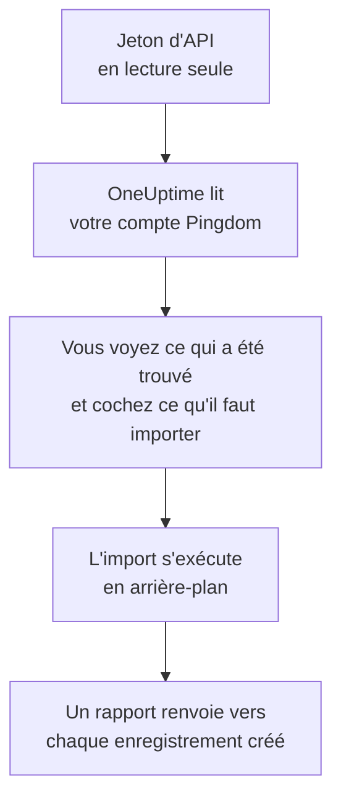

# Quitter Pingdom

**Importer depuis un autre outil** fait venir vos vérifications de disponibilité Pingdom dans OneUptime en quelques minutes. Avec un jeton d'API Pingdom en lecture seule, OneUptime lit vos vérifications, vous montre ce qu'il a trouvé et crée ce que vous cochez. Rien ne change dans Pingdom.

:::cards
- [Importer votre compte](#importer-votre-compte-pingdom) : Créez un jeton, lisez votre compte et cochez ce qu'il faut importer.
- [Ce qui est importé](#ce-qui-est-importé) : Ce que devient chaque vérification Pingdom dans OneUptime.
- [Terminer la migration](#terminer-la-migration) : Ce qu'il reste à faire une fois l'import terminé.
:::

## Fonctionnement

- **La clé ne sert qu'une fois.** Elle est conservée chiffrée pendant que OneUptime lit votre compte et supprimée dès la fin de la lecture, qu'elle ait réussi ou non. Elle n'est jamais réaffichée ni écrite dans un journal.
- **OneUptime ne fait que lire.** Il n'appelle que l'API de Pingdom : `api.pingdom.com`. Pingdom décompte chaque requête de l'allocation du jeton : OneUptime ne lit donc les réglages d'une vérification que si elle en a, une requête à la fois. Quand Pingdom lui demande de ralentir, il attend puis réessaie.
- **Rien n'est créé avant que vous lanciez l'import.** L'aperçu indique, pour chaque élément, s'il est nouveau, déjà dans OneUptime (et utilisé tel quel), repris par un import précédent, ou pourquoi il ne peut pas être importé.
- **Relancer l'import ne crée jamais rien en double.** OneUptime retient ce que chaque import a repris, par son identifiant Pingdom. Relancez-le après avoir ajouté des vérifications dans Pingdom : seuls les nouveaux sont créés.

## Avant de commencer

- **Un projet OneUptime, et le droit de créer ce que vous importez.** Les propriétaires et administrateurs du projet peuvent tout importer. Les autres rôles peuvent aussi lancer un import, et importer les types d'enregistrements qu'ils peuvent créer. Le reste est affiché comme non importé, avec la raison.
- **Un jeton d'API Pingdom avec Read access.** L'import n'écrit jamais dans Pingdom.
- **Un moyen de paiement, sur OneUptime Cloud.** Les moniteurs qui effectuent des vérifications sont facturés à l'usage, même avec l'offre Free : ajoutez-en un dans **Paramètres du projet** > **Facturation** avant l'import. Sans lui, ces moniteurs sont affichés comme non importés.

## Importer votre compte Pingdom

:::steps
### Créer un jeton d'API dans Pingdom
Dans My Pingdom, ouvrez **Settings** > **Pingdom API** et sélectionnez **Add API token**. Nommez-le `OneUptime import`, choisissez **Read access**, puis copiez le jeton.

### Ouvrir la page d'import
Dans OneUptime, ouvrez **Paramètres du projet** > **Importer depuis un autre outil** et sélectionnez **Pingdom**.

### Connecter Pingdom
Collez le jeton dans **Clé API Pingdom** et sélectionnez **Lire mon compte Pingdom**. Un compte volumineux prend quelques minutes, et vous pouvez quitter la page pendant la lecture.

### Cocher ce qu'il faut importer
L'aperçu liste ce qui a été trouvé, une section par type. Tout ce qui serait créé est coché au départ, sauf les vérifications en pause dans Pingdom, qui sont importées en pause si vous les cochez. Sous chaque élément, OneUptime indique ce qui ne sera pas importé exactement à l'identique.

### Lancer l'import
Sélectionnez **Lancer l'import**. L'import s'exécute en arrière-plan : vous pouvez quitter la page, et le rapport vous y attend.
:::

Le rapport compte ce qui a été créé et non importé, et liste chaque élément avec un lien vers l'enregistrement qu'il est devenu, les échecs en premier. Les imports précédents sont listés sous **Imports précédents** sur la même page.

## Ce qui est importé

| Dans Pingdom | Dans OneUptime | Comment |
| --- | --- | --- |
| Uptime checks | Moniteurs | Chaque vérification devient un moniteur du même type, avec la même adresse, le même intervalle et le texte qu'une page doit, ou ne doit pas, contenir. |

- **Les vérifications HTTP** deviennent des moniteurs de site web, ou des moniteurs d'API quand elles envoient des données ou des en-têtes.
- **Les vérifications ping et TCP** deviennent des moniteurs ping et de port. **Les vérifications SMTP, POP3 et IMAP** deviennent des moniteurs de port sur leur port : OneUptime vérifie que le port répond, pas l'échange de courrier.
- **Les vérifications DNS** deviennent des moniteurs DNS, auprès du même serveur de noms.
- **Les vérifications de certificat.** Une vérification HTTP qui considère un certificat sur le point d'expirer comme une panne reçoit aussi un moniteur de certificat SSL, à son nom, qui avertit autant de jours à l'avance.

Chaque moniteur est vérifié par les sondes de votre projet, comme un moniteur que vous créez vous-même. Un intervalle que OneUptime ne propose pas devient le plus proche qu'il propose, et un délai d'attente de plus d'une minute devient une minute. L'aperçu indique quand l'un ou l'autre change.

## Ce qui n'est pas importé

- **L'historique de disponibilité, les temps de réponse et les incidents.** OneUptime commence à vérifier une fois l'import terminé.
- **Les contacts d'alerte et les intégrations.** Choisissez qui est prévenu dans OneUptime, comme décrit dans [Terminer la migration](#terminer-la-migration).
- **Les mots de passe, et les en-têtes qui peuvent contenir un secret.** Un moniteur qui se connecte, ou qui envoie un en-tête `Authorization`, de cookie ou de jeton, est importé sans lui : ajoutez-le avec un [secret de moniteur](/docs/monitor/monitor-secrets).
- **Les vérifications UDP, HTTP personnalisées et de transaction.** OneUptime n'a aucun moniteur qui fait la même chose, et l'aperçu nomme chacune d'elles. Un [moniteur synthétique](/docs/monitor/synthetic-monitor) peut parcourir une page comme le fait une vérification de transaction.
- **L'adresse qu'attend une vérification DNS.** Ajoutez-la comme critère dans OneUptime.
- **Les fenêtres de maintenance.** L'aperçu les compte : planifiez-les comme maintenance planifiée dans OneUptime.

## Limites

Un import crée au plus 2 000 enregistrements, et au plus 1 000 moniteurs. Tout ce qui dépasse une limite est affiché comme non importé. Relancez l'import pour reprendre le reste.

Sur OneUptime Cloud, les moniteurs qui effectuent des vérifications ont besoin d'un moyen de paiement, et ce pour quoi votre offre n'a plus de place est affiché comme non importé, avec ce qu'il lui faut.

Un aperçu est conservé un jour. Seule la personne qui a lu le compte peut cocher et lancer l'import. Les propriétaires et administrateurs du projet voient la progression et le rapport de chaque import.

## Terminer la migration

:::steps
### Vérifier vos moniteurs
Ouvrez chacun d'eux sous **Moniteurs** et vérifiez ses premiers résultats. Un moniteur heartbeat a une nouvelle adresse : faites pointer dessus la tâche qui l'appelle.

### Choisir qui est prévenu
Ajoutez des propriétaires à vos moniteurs, ou une politique d'astreinte sous **Astreinte** > **Politiques d'astreinte** aux incidents qu'ils ouvrent, pour que les bonnes personnes soient prévenues quand quelque chose tombe en panne.

### Désactiver les vérifications dans Pingdom
Dès que OneUptime vérifie les mêmes choses, mettez-les en pause dans Pingdom pour que personne ne soit prévenu deux fois.
:::

## Dépannage

:::details Pingdom n'a pas accepté la clé API
Vérifiez que vous avez copié le jeton entier, et qu'il s'agit d'un jeton de l'API 3.1 créé dans **Pingdom API** avec **Read access**. Sélectionnez ensuite **Réessayer**.
:::

:::details Un moniteur est affiché comme non importé
Il indique pourquoi : un type de moniteur que OneUptime n'a pas, une adresse que OneUptime ne peut pas lire, ou un projet sans place ni moyen de paiement pour lui. Un moniteur que OneUptime exécute déjà, avec le même nom, le même type et la même adresse, est utilisé tel quel.
:::

:::details Certains éléments ne peuvent pas être cochés
Chacun indique pourquoi : un nom que le projet a déjà, quelque chose qu'un import précédent a repris, ou un enregistrement que vous n'avez pas le droit de créer ou que votre offre n'inclut pas.
:::

## Étapes suivantes

:::cards
- [Surveillance de site web](/docs/monitor/website-monitor) : Ce qu'un moniteur de site web vérifie, et comment.
- [Surveillance de port](/docs/monitor/port-monitor) : Ce qu'un moniteur de port vérifie, et comment.
- [Quitter StatusCake](/docs/moving-to-oneuptime/statuscake) : Faire venir vos vérifications depuis StatusCake.
:::
