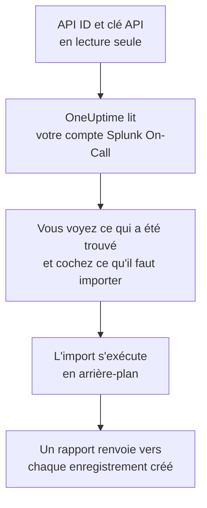

# Quitter Splunk On-Call

**Importer depuis un autre outil** fait venir votre configuration Splunk On-Call (anciennement VictorOps) dans OneUptime en quelques minutes. Avec votre API ID et une clé API en lecture seule, OneUptime lit vos utilisateurs, équipes, rotations et politiques d'escalade, vous montre ce qu'il a trouvé et crée ce que vous cochez. Rien ne change dans Splunk On-Call.

:::cards
- [Importer votre compte](#importer-votre-compte-splunk-on-call) : Créez une clé, lisez votre compte et cochez ce qu'il faut importer.
- [Ce qui est importé](#ce-qui-est-importé) : Ce que devient chaque enregistrement Splunk On-Call dans OneUptime.
- [Terminer la migration](#terminer-la-migration) : Ce qu'il reste à faire une fois l'import terminé.
:::

## Fonctionnement

- **La clé ne sert qu'une fois.** Elle est conservée chiffrée, avec l'API ID, pendant que OneUptime lit votre compte et supprimée dès la fin de la lecture, qu'elle ait réussi ou non. Elle n'est jamais réaffichée ni écrite dans un journal.
- **OneUptime ne fait que lire.** Il n'appelle que l'API de Splunk On-Call, `api.victorops.com`. Splunk On-Call répond à chaque type de requête au plus deux fois par seconde : OneUptime respecte ce rythme, et quand Splunk On-Call lui demande de ralentir, il attend puis réessaie.
- **Rien n'est créé avant que vous lanciez l'import.** L'aperçu indique, pour chaque élément, s'il est nouveau, déjà dans OneUptime (et utilisé tel quel), repris par un import précédent, ou pourquoi il ne peut pas être importé.
- **Relancer l'import ne crée jamais rien en double.** OneUptime retient ce que chaque import a repris, par son identifiant Splunk On-Call. Relancez-le après avoir ajouté des personnes ou des rotations dans Splunk On-Call : seules les nouvelles sont créées.

## Avant de commencer

- **Un projet OneUptime, et le droit de créer ce que vous importez.** Les propriétaires et administrateurs du projet peuvent tout importer. Les autres rôles peuvent aussi lancer un import, et importer les types d'enregistrements qu'ils peuvent créer. Le reste est affiché comme non importé, avec la raison.
- **Votre API ID Splunk On-Call et une clé API en lecture seule.** Les deux se trouvent sous **Integrations** > **API** dans Splunk On-Call. L'import n'écrit jamais dans Splunk On-Call : une clé en lecture seule suffit.

## Importer votre compte Splunk On-Call

:::steps
### Créer une clé API dans Splunk On-Call
Dans Splunk On-Call, ouvrez **Integrations** > **API**. Votre API ID s'affiche au-dessus de vos clés API. Créez une nouvelle clé API nommée `OneUptime import`, cochez **Read-only**, puis copiez l'API ID et la clé.

### Ouvrir la page d'import
Dans OneUptime, ouvrez **Paramètres du projet** > **Importer depuis un autre outil** et sélectionnez **Splunk On-Call**.

### Connecter Splunk On-Call
Collez l'API ID dans **API ID Splunk On-Call** et la clé dans **Clé API Splunk On-Call**, puis sélectionnez **Lire mon compte Splunk On-Call**. Un compte volumineux prend quelques minutes, et vous pouvez quitter la page pendant la lecture.

### Cocher ce qu'il faut importer
L'aperçu liste ce qui a été trouvé, une section par type. Tout ce qui serait créé est coché au départ, sauf les personnes qui ne font partie d'aucune équipe, d'aucune rotation ni d'aucune politique d'escalade. Sous chaque élément, OneUptime indique ce qui ne sera pas importé exactement à l'identique. Quand un élément coché utilise quelque chose que vous n'avez pas coché, il le signale, et **Les cocher aussi** le coche.

### Lancer l'import
Si des personnes seront invitées, choisissez l'équipe qu'elles rejoignent sous **Inviter les nouvelles personnes dans**. Sélectionnez ensuite **Lancer l'import**. L'import s'exécute en arrière-plan : vous pouvez quitter la page, et le rapport vous y attend.
:::

Le rapport compte ce qui a été créé, invité et non importé, et liste chaque élément avec un lien vers l'enregistrement qu'il est devenu, les échecs en premier. Les imports précédents sont listés sous **Imports précédents** sur la même page.

## Ce qui est importé

| Dans Splunk On-Call | Dans OneUptime | Comment |
| --- | --- | --- |
| Utilisateurs | Membres du projet | Rapprochés par adresse e-mail. Toute personne qui n'est pas encore dans le projet est invitée dans l'équipe que vous choisissez. |
| Équipes | Équipes | Créées avec leurs membres. Une équipe dont le projet a déjà le nom est utilisée telle quelle, et ses membres ne sont pas modifiés. |
| Rotations | Plannings d'astreinte | Chaque rotation devient un planning détenu par son équipe, et chacun de ses créneaux une couche avec les mêmes personnes, le même début, la même passation et les mêmes jours et heures d'astreinte. La personne d'astreinte maintenant dans Splunk On-Call l'est aussi dans OneUptime. |
| Politiques d'escalade | Politiques d'astreinte | Détenues par l'équipe de la politique. Chaque étape devient une règle d'escalade qui alerte les mêmes rotations et utilisateurs. Le délai d'une étape devient l'attente qui la précède, et les étapes sans délai entre elles alertent ensemble. |

Les créneaux d'une rotation qui sont d'astreinte en même temps deviennent chacun un planning OneUptime, car un planning OneUptime n'a qu'une personne d'astreinte à la fois. Chaque politique d'astreinte qui alertait la rotation les alerte tous. Le planning garde le fuseau horaire du premier créneau de la rotation, et un créneau défini dans un autre fuseau horaire voit ses heures converties dans celui-ci.

## Ce qui n'est pas importé

- **Les incidents, les alertes et leur historique.** OneUptime démarre avec votre configuration, pas avec vos incidents passés.
- **Les intégrations, routing keys et règles d'alerte.** Dirigez plutôt vos moniteurs et sources d'alertes vers OneUptime, comme indiqué dans [Terminer la migration](#terminer-la-migration).
- **Les remplacements planifiés.** Ajoutez dans OneUptime, après l'import, les remplacements dont vous avez encore besoin.
- **La politique de notification de chaque personne.** Chacun choisit comment être alerté dans ses propres **Paramètres utilisateur** une fois son invitation acceptée.
- **Les étapes sans équivalent exact dans OneUptime.** Une étape qui appelle un webhook ou renvoie vers une autre politique d'escalade est laissée de côté, tout comme une étape qui envoie un e-mail à une adresse qui n'est celle d'aucune personne importée. Une étape qui alerte la personne d'astreinte suivante, ou précédente, alerte la personne d'astreinte maintenant, et l'aperçu indique ce qui change.

## Limites

Un import crée au plus 2 000 enregistrements : au plus 500 personnes, 200 équipes, 200 plannings d'astreinte et 200 politiques d'astreinte. Tout ce qui dépasse une limite est affiché comme non importé. Relancez l'import pour reprendre le reste.

Sur OneUptime Cloud, les enregistrements que votre offre n'inclut pas sont affichés comme non importés, avec l'offre nécessaire.

Un aperçu est conservé un jour. Seule la personne qui a lu le compte peut cocher et lancer l'import. Les propriétaires et administrateurs du projet voient la progression et le rapport de chaque import.

## Terminer la migration

:::steps
### Vérifier les plannings d'astreinte
Ouvrez chaque planning sous **Astreinte** > **Plannings d'astreinte** et vérifiez qui est d'astreinte maintenant et qui le sera ensuite.

### S'assurer que chacun peut être alerté
Les personnes invitées acceptent leur invitation, puis ajoutent un numéro de téléphone, une adresse e-mail ou l'application mobile sur lesquels être alertées. **Astreinte** > **Disponibilité** montre qui ne peut pas encore être joint.

### Envoyer vos alertes à OneUptime
Dirigez vos moniteurs et les outils qui déclenchent des alertes vers OneUptime, et alertez-vous une fois pour tester.

### Désactiver les alertes dans Splunk On-Call
Dès que OneUptime alerte les bonnes personnes, désactivez les notifications dans Splunk On-Call pour que personne ne soit alerté deux fois.
:::

## Dépannage

:::details Splunk On-Call n'a pas accepté l'API ID et la clé API
Vérifiez que vous avez copié l'API ID et la clé entière depuis **Integrations** > **API**, et que la clé n'y a pas été supprimée. Sélectionnez ensuite **Réessayer**.
:::

:::details Un type d'enregistrement manque dans l'aperçu
La clé n'a pas pu le lire, et l'aperçu l'indique en haut. Vérifiez la clé sous **Integrations** > **API** et relisez le compte.
:::

:::details Certains éléments ne peuvent pas être cochés
Chacun indique pourquoi : un nom que le projet a déjà, quelque chose qu'un import précédent a repris, ou un enregistrement que vous n'avez pas le droit de créer ou que votre offre n'inclut pas.
:::

## Étapes suivantes

:::cards
- [Plannings d'astreinte](/docs/on-call/schedules) : Couches, restrictions et passations.
- [Règles d'escalade](/docs/on-call/escalation-rules) : Comment les politiques d'astreinte alertent les personnes.
- [Quitter PagerDuty](/docs/moving-to-oneuptime/pagerduty) : Faire venir une équipe depuis PagerDuty.
:::
