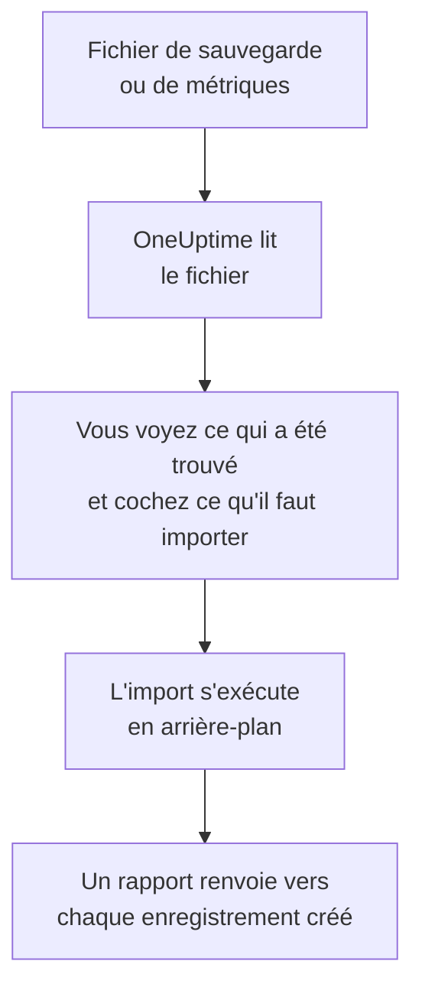

# Quitter Uptime Kuma

Uptime Kuma tourne sur vos propres machines : **Importer depuis un autre outil** le lit donc à partir d'un fichier plutôt que d'une clé, la sauvegarde qu'exporte Uptime Kuma 1 ou la page de métriques que sert chaque version. OneUptime y lit vos moniteurs, vous montre ce qu'il a trouvé et crée ce que vous cochez. Rien ne change dans Uptime Kuma.

:::cards
- [Importer vos moniteurs](#importer-vos-moniteurs-uptime-kuma) : Enregistrez le fichier, lisez-le et cochez ce qu'il faut importer.
- [Ce qui est importé](#ce-qui-est-importé) : Ce que devient chaque moniteur Uptime Kuma dans OneUptime.
- [Terminer la migration](#terminer-la-migration) : Ce qu'il reste à faire une fois l'import terminé.
:::

## Fonctionnement

- **Le fichier est lu une seule fois.** OneUptime le lit pendant l'envoi, pour trouver vos moniteurs, et ne le conserve jamais. Les mots de passe, jetons et clés push qu'il contient ne sont jamais copiés.
- **OneUptime ne se connecte jamais à Uptime Kuma.** Tout vient du fichier. Un fichier qui n'est ni une sauvegarde ni une page de métriques d'Uptime Kuma est refusé, avec la raison.
- **Rien n'est créé avant que vous lanciez l'import.** L'aperçu indique, pour chaque élément, s'il est nouveau, déjà dans OneUptime (et utilisé tel quel), repris par un import précédent, ou pourquoi il ne peut pas être importé.
- **Relancer l'import ne crée jamais rien en double.** OneUptime retient ce que chaque import a repris, par son identifiant Uptime Kuma. Lisez un fichier plus récent après avoir ajouté des moniteurs : seuls les nouveaux sont créés.

## Avant de commencer

- **Un projet OneUptime, et le droit de créer ce que vous importez.** Les propriétaires et administrateurs du projet peuvent tout importer. Les autres rôles peuvent aussi lancer un import, et importer les types d'enregistrements qu'ils peuvent créer. Le reste est affiché comme non importé, avec la raison.
- **Un fichier d'Uptime Kuma.** Dans Uptime Kuma 1, la sauvegarde JSON contient chaque moniteur avec ses réglages. Uptime Kuma 2 n'a pas de sauvegarde : enregistrez plutôt sa page de métriques, qui donne le nom, le type et l'adresse de chaque moniteur, mais pas la fréquence de vérification ni ce qu'il recherche.
- **Un moyen de paiement, sur OneUptime Cloud.** Les moniteurs qui effectuent des vérifications sont facturés à l'usage, même avec l'offre Free : ajoutez-en un dans **Paramètres du projet** > **Facturation** avant l'import. Sans lui, ces moniteurs sont affichés comme non importés.

## Importer vos moniteurs Uptime Kuma

:::steps
### Enregistrer le fichier dans Uptime Kuma
Dans Uptime Kuma 1, ouvrez **Settings** > **Backup** et sélectionnez **Export**. Dans Uptime Kuma 2, ajoutez une clé dans **Settings** > **API Keys**, ouvrez `/metrics` sur votre Uptime Kuma, connectez-vous sans nom d'utilisateur avec la clé comme mot de passe, et enregistrez la page en fichier texte.

### Ouvrir la page d'import
Dans OneUptime, ouvrez **Paramètres du projet** > **Importer depuis un autre outil** et sélectionnez **Uptime Kuma**.

### Lire le fichier
Sous **Fichier de sauvegarde ou de métriques Uptime Kuma**, sélectionnez **Choisir un fichier**, choisissez le fichier enregistré, puis sélectionnez **Lire le fichier**. OneUptime le lit aussitôt et montre ce qu'il a trouvé.

### Cocher ce qu'il faut importer
L'aperçu liste ce qui a été trouvé, une section par type. Tout ce qui serait créé est coché au départ, sauf les moniteurs en pause dans Uptime Kuma, qui sont importés en pause si vous les cochez. Sous chaque élément, OneUptime indique ce qui ne sera pas importé exactement à l'identique.

### Lancer l'import
Sélectionnez **Lancer l'import**. L'import s'exécute en arrière-plan : vous pouvez quitter la page, et le rapport vous y attend.
:::

Le rapport compte ce qui a été créé et non importé, et liste chaque élément avec un lien vers l'enregistrement qu'il est devenu, les échecs en premier. Les imports précédents sont listés sous **Imports précédents** sur la même page.

## Ce qui est importé

| Dans Uptime Kuma | Dans OneUptime | Comment |
| --- | --- | --- |
| Monitors | Moniteurs | Depuis une sauvegarde, chaque moniteur devient un moniteur du même type, avec la même adresse, le même intervalle, le même délai d'attente et les mêmes codes de statut considérés comme disponibles. Depuis la page de métriques, chacun est importé avec une vérification toutes les cinq minutes : vérifiez-les un par un après l'import. |

- **Les moniteurs HTTP(S) et à mot-clé** deviennent des moniteurs de site web, ou des moniteurs d'API quand ils envoient une autre méthode, des en-têtes ou un corps JSON, avec le mot-clé là où il doit être.
- **Les moniteurs de requête JSON** deviennent des moniteurs d'API, sans la requête : ajoutez-la comme critère dans OneUptime.
- **Les moniteurs ping, de port et DNS** deviennent des moniteurs ping, de port et DNS.
- **Les moniteurs push** deviennent des moniteurs de requêtes entrantes, qui tombent quand aucune requête n'est arrivée pendant l'intervalle et ses nouvelles tentatives. Chacun a une nouvelle adresse dans OneUptime.
- **Les moniteurs manuels** restent des moniteurs manuels. **Les groupes** sont des dossiers : leurs moniteurs sont importés séparément.
- **L'expiration des certificats.** Un moniteur qui avertit avant l'expiration de son certificat reçoit aussi un moniteur de certificat SSL, à son nom.

Chaque moniteur est vérifié par les sondes de votre projet, comme un moniteur que vous créez vous-même. Un intervalle que OneUptime ne propose pas devient le plus proche qu'il propose, et un délai d'attente de plus d'une minute devient une minute. L'aperçu indique quand l'un ou l'autre change.

## Ce qui n'est pas importé

- **L'historique de disponibilité, les temps de réponse et les incidents.** OneUptime commence à vérifier une fois l'import terminé.
- **Les notifications.** Choisissez qui est prévenu dans OneUptime, comme décrit dans [Terminer la migration](#terminer-la-migration).
- **Les mots de passe, et les en-têtes qui peuvent contenir un secret.** Un moniteur qui se connecte, ou qui envoie un en-tête `Authorization`, de cookie ou de jeton, est importé sans lui : ajoutez-le avec un [secret de moniteur](/docs/monitor/monitor-secrets).
- **Les moniteurs inversés**, considérés comme disponibles quand leur vérification échoue. OneUptime n'a aucun moniteur qui fait cela.
- **Les moniteurs Docker, de base de données, de serveur de jeu, MQTT et les autres sans équivalent dans OneUptime.** L'aperçu nomme chacun d'eux.
- **Les pages de statut et les maintenances.** Créez dans OneUptime les pages de statut dont vous avez besoin, et affichez-y les moniteurs importés.

## Limites

Un import crée au plus 2 000 enregistrements, et au plus 1 000 moniteurs. Un fichier peut faire au plus 10 Mo. Tout ce qui dépasse une limite est affiché comme non importé. Relancez l'import pour reprendre le reste.

Sur OneUptime Cloud, les moniteurs qui effectuent des vérifications ont besoin d'un moyen de paiement, et ce pour quoi votre offre n'a plus de place est affiché comme non importé, avec ce qu'il lui faut.

Un aperçu est conservé un jour. Seule la personne qui a lu le fichier peut cocher et lancer l'import. Les propriétaires et administrateurs du projet voient la progression et le rapport de chaque import.

## Terminer la migration

:::steps
### Vérifier vos moniteurs
Ouvrez chacun d'eux sous **Moniteurs** et vérifiez ses premiers résultats. Un moniteur heartbeat a une nouvelle adresse : faites pointer dessus la tâche qui l'appelle.

### Choisir qui est prévenu
Ajoutez des propriétaires à vos moniteurs, ou une politique d'astreinte sous **Astreinte** > **Politiques d'astreinte** aux incidents qu'ils ouvrent, pour que les bonnes personnes soient prévenues quand quelque chose tombe en panne.

### Désactiver les vérifications dans Uptime Kuma
Dès que OneUptime vérifie les mêmes choses, mettez-les en pause dans Uptime Kuma pour que personne ne soit prévenu deux fois.
:::

## Dépannage

:::details Le fichier a été refusé
OneUptime indique pourquoi : un fichier de plus de 10 Mo, un fichier qui n'est pas du JSON valide, ou un fichier qui n'est ni une sauvegarde ni la page de métriques d'Uptime Kuma. Exportez de nouveau la sauvegarde, ou enregistrez de nouveau `/metrics` en texte brut, et choisissez-le à nouveau.
:::

:::details Un moniteur est affiché comme non importé
Il indique pourquoi : un type de moniteur que OneUptime n'a pas, une adresse que OneUptime ne peut pas lire, ou un projet sans place ni moyen de paiement pour lui. Un moniteur que OneUptime exécute déjà, avec le même nom, le même type et la même adresse, est utilisé tel quel.
:::

:::details Certains éléments ne peuvent pas être cochés
Chacun indique pourquoi : un nom que le projet a déjà, quelque chose qu'un import précédent a repris, ou un enregistrement que vous n'avez pas le droit de créer ou que votre offre n'inclut pas.
:::

## Étapes suivantes

:::cards
- [Surveillance de site web](/docs/monitor/website-monitor) : Ce qu'un moniteur de site web vérifie, et comment.
- [Surveillance des requêtes entrantes](/docs/monitor/incoming-request-monitor) : Comment fonctionne un heartbeat dans OneUptime.
- [Quitter UptimeRobot](/docs/moving-to-oneuptime/uptimerobot) : Faire venir vos vérifications depuis UptimeRobot.
:::
