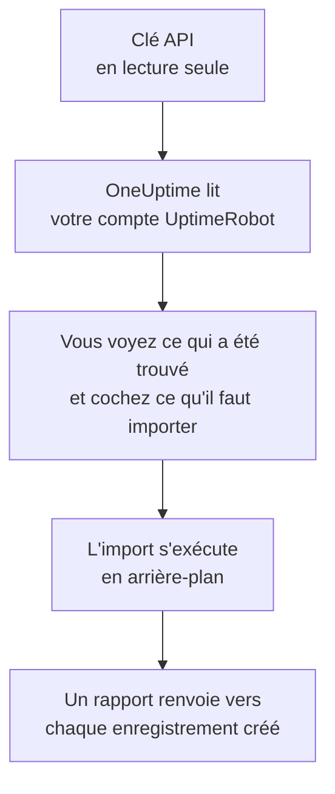

# Quitter UptimeRobot

**Importer depuis un autre outil** fait venir vos moniteurs et pages de statut UptimeRobot dans OneUptime en quelques minutes. Avec une clé API UptimeRobot en lecture seule, OneUptime lit vos moniteurs et vos pages de statut publiques, vous montre ce qu'il a trouvé et crée ce que vous cochez. Rien ne change dans UptimeRobot.

:::cards
- [Importer votre compte](#importer-votre-compte-uptimerobot) : Créez une clé, lisez votre compte et cochez ce qu'il faut importer.
- [Ce qui est importé](#ce-qui-est-importé) : Ce que devient dans OneUptime chaque moniteur et page de statut UptimeRobot.
- [Terminer la migration](#terminer-la-migration) : Ce qu'il reste à faire une fois l'import terminé.
:::

## Fonctionnement

- **La clé ne sert qu'une fois.** Elle est conservée chiffrée pendant que OneUptime lit votre compte et supprimée dès la fin de la lecture, qu'elle ait réussi ou non. Elle n'est jamais réaffichée ni écrite dans un journal.
- **OneUptime ne fait que lire.** Il n'appelle que l'API de UptimeRobot : `api.uptimerobot.com`. Il fait une requête toutes les six secondes, ce qui reste dans les dix par minute qu'UptimeRobot accorde à un compte Free : un compte volumineux prend donc quelques minutes. Quand UptimeRobot lui demande de ralentir, il attend puis réessaie.
- **Rien n'est créé avant que vous lanciez l'import.** L'aperçu indique, pour chaque élément, s'il est nouveau, déjà dans OneUptime (et utilisé tel quel), repris par un import précédent, ou pourquoi il ne peut pas être importé.
- **Relancer l'import ne crée jamais rien en double.** OneUptime retient ce que chaque import a repris, par son identifiant UptimeRobot. Relancez-le après avoir ajouté des moniteurs dans UptimeRobot : seuls les nouveaux sont créés.

## Avant de commencer

- **Un projet OneUptime, et le droit de créer ce que vous importez.** Les propriétaires et administrateurs du projet peuvent tout importer. Les autres rôles peuvent aussi lancer un import, et importer les types d'enregistrements qu'ils peuvent créer. Le reste est affiché comme non importé, avec la raison.
- **Une clé API UptimeRobot.** La Read-only API key suffit : l'import n'écrit jamais dans UptimeRobot. La Main API key fonctionne aussi, mais une clé propre à un moniteur ne lit que ce moniteur.
- **Un moyen de paiement, sur OneUptime Cloud.** Les moniteurs qui effectuent des vérifications sont facturés à l'usage, même avec l'offre Free : ajoutez-en un dans **Paramètres du projet** > **Facturation** avant l'import. Sans lui, ces moniteurs sont affichés comme non importés.

## Importer votre compte UptimeRobot

:::steps
### Créer une clé API dans UptimeRobot
Dans UptimeRobot, ouvrez **Integrations & API** > **API**. Créez une **Read-only API key**, ou copiez celle que vous avez.

### Ouvrir la page d'import
Dans OneUptime, ouvrez **Paramètres du projet** > **Importer depuis un autre outil** et sélectionnez **UptimeRobot**.

### Connecter UptimeRobot
Collez la clé dans **Clé API UptimeRobot** et sélectionnez **Lire mon compte UptimeRobot**. Un compte volumineux prend quelques minutes, et vous pouvez quitter la page pendant la lecture.

### Cocher ce qu'il faut importer
L'aperçu liste ce qui a été trouvé, une section par type. Tout ce qui serait créé est coché au départ, sauf les moniteurs en pause dans UptimeRobot, qui sont importés en pause si vous les cochez. Sous chaque élément, OneUptime indique ce qui ne sera pas importé exactement à l'identique. Quand une page de statut cochée affiche un moniteur que vous n'avez pas coché, il le signale, et **Les cocher aussi** le coche.

### Lancer l'import
Sélectionnez **Lancer l'import**. L'import s'exécute en arrière-plan : vous pouvez quitter la page, et le rapport vous y attend.
:::

Le rapport compte ce qui a été créé et non importé, et liste chaque élément avec un lien vers l'enregistrement qu'il est devenu, les échecs en premier. Les imports précédents sont listés sous **Imports précédents** sur la même page.

## Ce qui est importé

| Dans UptimeRobot | Dans OneUptime | Comment |
| --- | --- | --- |
| Monitors | Moniteurs | Chaque moniteur devient un moniteur du même type, avec la même adresse, le même intervalle et le même délai d'attente, et les mêmes codes de statut considérés comme disponibles. |
| Public status pages | Pages de statut | Chaque page affiche les mêmes moniteurs : ceux qu'elle nomme, ceux qui portent ses tags, ou tous, avec la disponibilité et les barres d'historique telles qu'elle les affichait. Une page protégée par mot de passe est importée en privé. |

- **Les moniteurs HTTP(S) et à mot-clé** deviennent des moniteurs de site web, ou des moniteurs d'API quand ils envoient une autre méthode, des en-têtes ou un corps JSON. Un moniteur à mot-clé tombe quand son mot-clé apparaît ou manque, comme dans UptimeRobot, et le recherche exactement, majuscules comprises.
- **Les moniteurs ping et de port** deviennent des moniteurs ping et de port.
- **Les moniteurs heartbeat** deviennent des moniteurs de requêtes entrantes, qui tombent quand aucune requête n'est arrivée pendant l'intervalle et le délai de grâce. Chacun a une nouvelle adresse dans OneUptime.
- **Les moniteurs DNS et d'API** deviennent des moniteurs DNS et d'API.
- **Les rappels d'expiration SSL.** Un moniteur qui avertit avant l'expiration de son certificat reçoit aussi un moniteur de certificat SSL, à son nom, qui avertit autant de jours à l'avance.

Chaque moniteur est vérifié par les sondes de votre projet, comme un moniteur que vous créez vous-même. Un intervalle que OneUptime ne propose pas devient le plus proche qu'il propose, et un délai d'attente de plus d'une minute devient une minute. L'aperçu indique quand l'un ou l'autre change.

## Ce qui n'est pas importé

- **L'historique de disponibilité, les temps de réponse et les incidents.** OneUptime commence à vérifier une fois l'import terminé.
- **Les contacts d'alerte et les intégrations.** Choisissez qui est prévenu dans OneUptime, comme décrit dans [Terminer la migration](#terminer-la-migration).
- **Les mots de passe, et les en-têtes qui peuvent contenir un secret.** Un moniteur qui se connecte, ou qui envoie un en-tête `Authorization`, de cookie ou de jeton, est importé sans lui : ajoutez-le avec un [secret de moniteur](/docs/monitor/monitor-secrets).
- **Les moniteurs UDP, de comparaison visuelle et de dépendance.** OneUptime n'a aucun moniteur qui fait la même chose, et l'aperçu nomme chacun d'eux.
- **Les moniteurs de port qui alertent tant que le port est ouvert.** Ils fonctionnent à l'inverse des moniteurs de port de OneUptime.
- **Les réponses qu'attend un moniteur DNS et les assertions d'un moniteur d'API.** Ajoutez-les comme critères dans OneUptime.
- **Les fenêtres de maintenance.** L'aperçu les compte : planifiez-les comme maintenance planifiée dans OneUptime.
- **Le domaine propre et l'image de marque d'une page de statut.** Dans OneUptime, ajoutez le domaine dans **Domaines personnalisés** et le logo dans **Image de marque**.

## Limites

Un import crée au plus 2 000 enregistrements : au plus 1 000 moniteurs et 50 pages de statut. Tout ce qui dépasse une limite est affiché comme non importé. Relancez l'import pour reprendre le reste.

Sur OneUptime Cloud, les moniteurs qui effectuent des vérifications ont besoin d'un moyen de paiement, et ce pour quoi votre offre n'a plus de place est affiché comme non importé, avec ce qu'il lui faut.

Un aperçu est conservé un jour. Seule la personne qui a lu le compte peut cocher et lancer l'import. Les propriétaires et administrateurs du projet voient la progression et le rapport de chaque import.

## Terminer la migration

:::steps
### Vérifier vos moniteurs
Ouvrez chacun d'eux sous **Moniteurs** et vérifiez ses premiers résultats. Un moniteur heartbeat a une nouvelle adresse : faites pointer dessus la tâche qui l'appelle.

### Choisir qui est prévenu
Ajoutez des propriétaires à vos moniteurs, ou une politique d'astreinte sous **Astreinte** > **Politiques d'astreinte** aux incidents qu'ils ouvrent, pour que les bonnes personnes soient prévenues quand quelque chose tombe en panne.

### Faire pointer l'adresse de votre page de statut vers OneUptime
Sous **Pages de statut**, ouvrez la page, ajoutez votre domaine dans **Domaines personnalisés**, puis modifiez son enregistrement DNS. Vos visiteurs et abonnés arrivent alors sur la nouvelle page.

### Désactiver les vérifications dans UptimeRobot
Dès que OneUptime vérifie les mêmes choses, mettez-les en pause dans UptimeRobot pour que personne ne soit prévenu deux fois.
:::

## Dépannage

:::details UptimeRobot n'a pas accepté la clé API
Vérifiez que vous avez copié la clé entière, et qu'il s'agit de la Read-only ou de la Main API key du compte, dans **Integrations & API**, et non d'une clé propre à un moniteur. Sélectionnez ensuite **Réessayer**.
:::

:::details Un moniteur est affiché comme non importé
Il indique pourquoi : un type de moniteur que OneUptime n'a pas, une adresse que OneUptime ne peut pas lire, ou un projet sans place ni moyen de paiement pour lui. Un moniteur que OneUptime exécute déjà, avec le même nom, le même type et la même adresse, est utilisé tel quel.
:::

:::details Certains éléments ne peuvent pas être cochés
Chacun indique pourquoi : un nom que le projet a déjà, quelque chose qu'un import précédent a repris, ou un enregistrement que vous n'avez pas le droit de créer ou que votre offre n'inclut pas.
:::

## Étapes suivantes

:::cards
- [Surveillance de site web](/docs/monitor/website-monitor) : Ce qu'un moniteur de site web vérifie, et comment.
- [Surveillance des requêtes entrantes](/docs/monitor/incoming-request-monitor) : Comment fonctionne un heartbeat dans OneUptime.
- [Quitter Pingdom](/docs/moving-to-oneuptime/pingdom) : Faire venir vos vérifications depuis Pingdom.
:::
