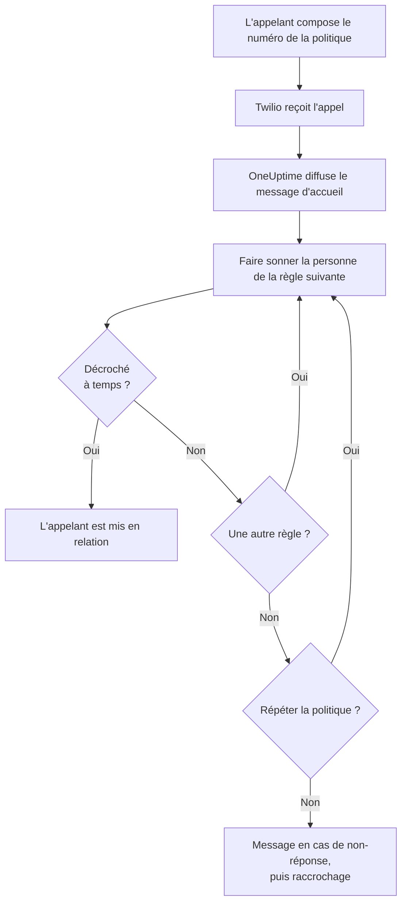
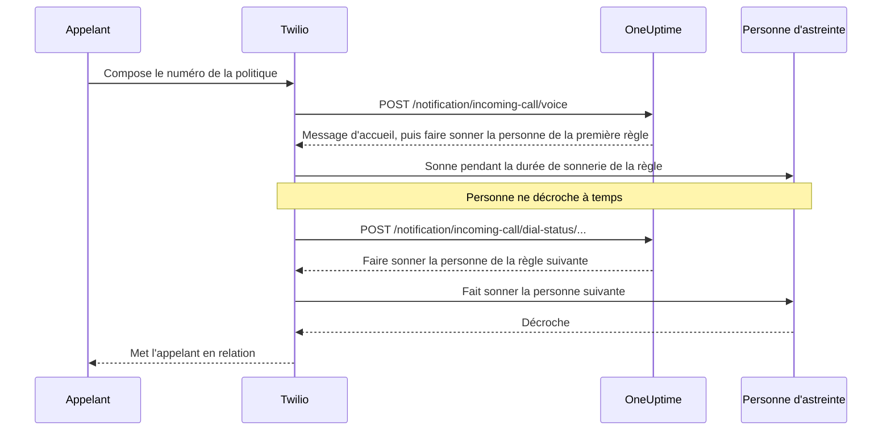

# Politique d'appels entrants

Une politique d'appels entrants donne à votre équipe un numéro de téléphone qui joint la personne d'astreinte. Quand quelqu'un l'appelle, OneUptime fait sonner, l'une après l'autre, les personnes des règles d'escalade de la politique jusqu'à ce que l'une d'elles décroche, puis met l'appelant en relation. Les numéros et les appels passent par votre propre compte Twilio.

:::cards
- [Configurer une politique](#configurer-une-politique): De votre compte Twilio à un appel de test, en sept étapes.
- [Comment un appel est acheminé](#comment-un-appel-est-acheminé): Qui sonne, combien de temps, et ce qu'entend l'appelant.
- [Appels manqués](#appels-manqués): Qui est prévenu, et comment y réagir dans un workflow.
- [Dépannage](#dépannage): Les appels qui n'arrivent jamais, ou qui ne joignent jamais personne.
:::

## Avant de commencer

| Il vous faut | Pourquoi |
| --- | --- |
| Un compte Twilio, avec son Account SID et son Auth Token | Les numéros et les appels de la politique passent par lui, et Twilio les lui facture. |
| L'offre **Growth**, sur OneUptime Cloud | Un projet en a besoin pour sa propre configuration Twilio. |
| Un serveur OneUptime que Twilio peut joindre, si vous l'hébergez vous-même | Twilio envoie chaque appel à `https://<your host>/notification/incoming-call/voice`. |
| Les **SMS** activés dans le projet | Le numéro de chaque personne est vérifié par un code envoyé par SMS. |
| Un numéro vérifié pour chaque personne | Une règle ne fait sonner que les personnes qui ont ajouté et vérifié un numéro pour les appels entrants dans le projet. |

## Configurer une politique

:::steps
### Ajouter votre compte Twilio

Allez dans **Paramètres du projet** > **Notifications** > **Paramètres de notification**. Dans la carte **Configuration Twilio**, cliquez sur **Créer une configuration Twilio** et remplissez le formulaire :

- **Nom** et **Description** : à quoi sert le compte, par exemple « Ligne d'assistance ».
- **SID de compte Twilio** : dans la console Twilio. Il commence par `AC`.
- **Jeton d'authentification Twilio** : dans la console Twilio.
- **Numéro de téléphone principal Twilio** : un numéro de ce compte, pour les SMS et les appels qu'il envoie.
- **Numéros de téléphone secondaires Twilio** : facultatif. Des numéros qui envoient à la place du numéro principal aux destinataires de leur pays.
- **Définir par défaut pour le projet** : activé pour la première configuration Twilio du projet, afin que les SMS et appels destinés aux membres du projet passent aussi par ce compte. Désactivez-le si ce compte ne sert qu'aux appels entrants.

### Créer la politique

Allez dans **Astreinte** > **Politiques d'appels entrants** et cliquez sur **Créer : Politique d'appels entrants**. Donnez-lui un **Nom**, par exemple « Ligne d'assistance », et éventuellement une **Description** et des **Étiquettes**. Ouvrez-la ensuite depuis la liste.

### Choisir le compte Twilio

La **Vue d'ensemble** de la politique affiche une carte **Configuration** avec trois étapes numérotées. Dans la première, cliquez sur **Sélectionner**, choisissez le compte sous **Configuration Twilio** et cliquez sur **Enregistrer**.

### Ajouter un numéro de téléphone

Dans la deuxième étape, cliquez sur **Ajouter un numéro de téléphone**. Choisissez **Use Existing Phone Number** pour utiliser un numéro que votre compte Twilio possède déjà, ou **Reserve New Phone Number** pour en obtenir un nouveau. OneUptime fait pointer le numéro vers lui-même, il n'y a donc rien à configurer dans Twilio. Voir [Numéros de téléphone](#numéros-de-téléphone).

### Ajouter des règles d'escalade

Dans la troisième étape, cliquez sur **Gérer les règles**. Ajoutez une règle pour chaque planning d'astreinte ou personne à faire sonner, dans l'ordre où ils doivent sonner. Voir [Règles d'escalade](#règles-descalade).

### Vérifier le numéro de chaque personne

Chaque personne qu'une règle peut faire sonner ajoute et vérifie son propre numéro pour les appels entrants. Voir [Numéros des personnes d'astreinte](#numéros-des-personnes-dastreinte).

### Appeler le numéro

Une fois les trois étapes terminées, la carte devient **Phone Numbers & Twilio Configuration**. Appelez le numéro depuis n'importe quel téléphone, puis ouvrez les **Journaux d'appels** de la politique pour voir qui a sonné.
:::

## Comment un appel est acheminé

1. Twilio envoie l'appel à OneUptime, qui lit le **Message d'accueil** de la politique.
2. OneUptime fait sonner la personne nommée par la première règle d'escalade : cette personne, ou celle qui est d'astreinte à ce moment dans le planning d'astreinte de la règle, remplacements d'utilisateurs compris. Son téléphone affiche le numéro de la politique comme appelant.
3. Si elle décroche dans la **Durée de sonnerie** de la règle, l'appelant est mis en relation, et le journal d'appels enregistre qui a répondu.
4. Sinon, l'appelant entend « Connecting you to the next available engineer. », et la personne de la règle suivante sonne.
5. Après la dernière règle, la politique recommence à la première si **Répéter la politique si personne ne répond** est activé, autant de fois que l'indique **Nombre de répétitions de la politique**. Sinon, l'appelant entend le **Message en cas de non-réponse**, et l'appel se termine.

Une règle est ignorée, sans rien faire sonner, quand personne ne peut être appelé pour elle à ce moment : son planning n'a personne d'astreinte, la personne n'a pas de numéro vérifié pour les appels entrants dans ce projet, ou elle n'est plus membre du projet. Quand aucune règle n'a quelqu'un à faire sonner, l'appelant entend le **Message lorsque personne n'est disponible**. Une politique désactivée répond à chaque appel par « Sorry, this service is currently disabled. » et raccroche.

OneUptime vérifie la signature de Twilio sur chaque requête avec l'Auth Token de la configuration Twilio, et refuse une requête qu'il ne peut pas vérifier.

> [!TIP]
> Enregistrez le numéro de la politique comme contact sur votre téléphone, par exemple « Ligne d'assistance », pour reconnaître un appel acheminé quand il sonne.

## Règles d'escalade

Les règles d'escalade décident qui sonne quand quelqu'un appelle le numéro de la politique, du haut de la liste vers le bas. Ouvrez la politique, choisissez **Règles d'escalade** dans son menu latéral et cliquez sur **Ajouter une règle d'escalade**. Une règle tient en une seule étape courte :

- **Qui appeler** : un planning d'astreinte ou une seule personne. Un planning fait sonner la personne qui y est d'astreinte au moment de l'appel. Les personnes sont les membres de votre projet.
- **Durée de sonnerie (en secondes)** : combien de temps leur téléphone sonne avant que l'appel passe à la règle suivante. La valeur de départ est 20 secondes, et Twilio accepte de 5 à 600.
- **Nom** et **Description** sont facultatifs, sous **Plus de champs**. Une règle sans nom est listée d'après sa place dans la liste : **Level 1**, **Level 2**.

Les règles sont appelées du haut de la liste vers le bas, et une nouvelle règle est ajoutée à la fin. Pour changer l'ordre, faites glisser une règle par la poignée en haut à gauche. Au clavier, placez le focus sur la poignée, appuyez sur Espace, déplacez la règle avec les flèches et appuyez de nouveau sur Espace.

> [!WARNING]
> **Attention à la messagerie vocale** : gardez la **Durée de sonnerie** plus courte que le temps que met le téléphone de la personne à renvoyer un appel sans réponse vers sa messagerie. Si sa messagerie décroche en premier, l'appelant est mis en relation avec elle et l'appel ne passe pas à la règle suivante. Twilio ajoute quelques secondes de son côté à chaque sonnerie. C'est pourquoi une nouvelle règle commence à 20 secondes. Les règles ajoutées quand la valeur par défaut était de 30 secondes gardent leurs 30 : si leurs appels aboutissent sur une messagerie, réduisez la **Durée de sonnerie** de ces règles.

Par exemple, trois règles qui essaient deux rotations, puis un responsable :

| Niveau | Qui appeler | Durée de sonnerie |
| --- | --- | --- |
| Level 1 | Planning d'astreinte principal | 20 secondes |
| Level 2 | Planning d'astreinte secondaire | 20 secondes |
| Level 3 | Responsable technique (une personne) | 20 secondes |

## Numéros de téléphone

Une politique peut avoir plusieurs numéros, et chacun fait sonner les mêmes règles. Chaque numéro appartient à une seule politique. Ajoutez-les avec **Ajouter un numéro de téléphone** dans la **Vue d'ensemble** de la politique :

:::tabs
@tab Utiliser un numéro existant
1. Cliquez sur **Ajouter un numéro de téléphone**, puis sur **Use Existing Phone Number**. OneUptime liste les numéros du compte Twilio de la politique.
2. Cliquez sur **Sélectionner** à côté du numéro, puis sur **Attribuer un numéro**.

Un numéro dont les appels vont déjà ailleurs l'indique par « Currently has a webhook configured ». L'attribuer envoie ses appels à OneUptime à la place.
@tab Réserver un nouveau numéro
1. Cliquez sur **Ajouter un numéro de téléphone**, puis sur **Reserve New Phone Number** et **Rechercher des numéros**.
2. Choisissez un **Pays**. Remplissez éventuellement **Indicatif régional (facultatif)**, par exemple 415, ou **Contient (facultatif)** avec des chiffres que le numéro doit contenir. Cliquez sur **Rechercher** : jusqu'à 10 numéros locaux sont listés.
3. Cliquez sur **Réserver** à côté d'un numéro, et confirmez avec **Réserver**. Twilio facture le numéro sur votre compte Twilio.
:::

OneUptime définit le webhook vocal du numéro sur `https://<your host>/notification/incoming-call/voice`, construit à partir de `HOST` et `HTTP_PROTOCOL` sur une installation auto-hébergée. Pour passer une politique sur un autre compte Twilio, libérez d'abord ses numéros : le compte ne peut changer que tant que la politique n'en a aucun.

Pour libérer un numéro, cliquez sur **Libérer** à côté de lui et confirmez avec **Libérer le numéro**.

> [!CAUTION]
> Libérer un numéro le rend à Twilio, même un numéro apporté avec **Use Existing Phone Number**, et vous risquez de ne pas le récupérer. Supprimer une politique, ou la configuration Twilio qu'elle utilise, libère aussi ses numéros.

## Numéros des personnes d'astreinte

Une règle fait sonner une personne sur le numéro qu'elle a vérifié pour les appels entrants dans ce projet, et ignore quiconque n'en a pas. Chaque personne ajoute le sien :

:::steps
1. Ouvrez **Paramètres utilisateur** > **Politique d'appels entrants** > **Numéros de téléphone entrants**. **Politique d'appels entrants** est une section du menu latéral qui commence repliée.
2. Dans la carte **Numéros de téléphone pour le routage des appels entrants**, cliquez sur **Ajouter : Numéro de téléphone pour le routage des appels entrants** et saisissez le numéro avec son indicatif de pays, par exemple `+15551234567`.
3. Saisissez le code à 6 chiffres que OneUptime y envoie par SMS sous **Code de vérification**, et cliquez sur **Vérifier**. **Send a new code** en envoie un autre.
:::

Chaque personne peut avoir un numéro vérifié par projet. Pour le changer, supprimez d'abord l'ancien numéro. Ces numéros sont distincts des numéros de téléphone sous **Méthodes de notification**, qu'utilisent les alertes d'astreinte.

Les numéros pour les appels entrants sont vérifiés par SMS ; les **SMS** doivent donc d'abord être activés pour le projet. Un propriétaire du projet ou une personne disposant du rôle **Billing Admin** ou de l'autorisation **Manage Billing** les active dans la carte **Canaux de notification** de **Paramètres du projet > Notifications > Paramètres de notification**.

## Messages vocaux et paramètres de la politique

Ouvrez la politique et choisissez **Paramètres** sous **Avancé** dans son menu latéral. **Modifier les messages** sur la carte **Messages vocaux** change ce qu'entendent les appelants ; **Modifier les paramètres de la politique** sur la carte **Paramètres de la politique** change le reste.

| Paramètre | Ce qu'il fait | Pour une nouvelle politique |
| --- | --- | --- |
| **Message d'accueil** | Lu quand l'appel est pris, avant que la première personne sonne. | "Please wait while we connect you to the on-call engineer." |
| **Message en cas de non-réponse** | Lu quand toutes les règles ont été essayées et que personne n'a décroché. | "No one is available. Please try again later." |
| **Message lorsque personne n'est disponible** | Lu quand aucune règle n'a quelqu'un à faire sonner. | "We are sorry, but no on-call engineer is currently available. Please try again later or contact support." |
| **Activé** | Une politique désactivée refuse tous les appels. | Activé |
| **Répéter la politique si personne ne répond** | Après la dernière règle, recommencer à la première. | Désactivé |
| **Nombre de répétitions de la politique** | Combien de fois recommencer. | 1 |

Twilio lit les messages avec une voix de synthèse : écrivez-les comme vous voulez qu'ils sonnent.

## Journaux d'appels

Chaque appel figure sur la page **Journaux d'appels** de la politique, sous **Journaux** dans son menu latéral : l'**Appelant**, le **Numéro appelé**, son **Statut**, qui a répondu (**Répondu par**), la **Durée**, et quand il a commencé (**Démarré le**). Cliquez sur **View Timeline** sur un appel pour voir sa **Chronologie de l'appel** : chaque personne qui a sonné, sur quel numéro, et comment chaque tentative s'est terminée.

| Statut | Ce qui s'est passé |
| --- | --- |
| **Initié**, **Ringing**, **Escaladé** | L'appel est en cours : il est arrivé, un téléphone sonne, ou il est passé à une règle suivante. |
| **Achevé** | Quelqu'un a décroché, et l'appelant a été mis en relation. |
| **Pas de réponse** | Toutes les règles d'escalade ont été essayées et personne n'a décroché. L'appelant a entendu votre **Message en cas de non-réponse**. |
| **L'appelant a raccroché** | L'appelant a raccroché pendant que le téléphone d'une personne sonnait. |
| **Échec** | Personne n'a pu sonner : aucune règle d'escalade n'avait une personne d'astreinte avec un numéro vérifié pour les appels entrants (l'appelant a entendu votre **Message lorsque personne n'est disponible**), ou la politique est désactivée. |

## Appels manqués

Un appel est manqué lorsqu'il se termine sans joindre personne : son statut est **Pas de réponse**, **L'appelant a raccroché** ou **Échec**.

### Qui est prévenu

Quand un appel est manqué, OneUptime prévient les propriétaires de la politique : les utilisateurs et les membres des équipes ajoutés sur la page **Propriétaires** de la politique. Si la politique n'a pas de propriétaires, ce sont les propriétaires du projet qui sont prévenus.

La notification indique qui a appelé, quel numéro a été composé, pourquoi personne n'a répondu, qui a sonné et comment chaque tentative s'est terminée. Elle renvoie vers l'appel dans le journal d'appels.

Les propriétaires reçoivent un e-mail par défaut. Chacun peut choisir d'autres canaux (SMS, appel, push et plus) ou la désactiver dans **Paramètres utilisateur** > **Paramètres de notification**, sous **Astreinte** > **Politiques d'appels entrants** > **Appel manqué**.

### Réagir aux appels manqués dans un workflow

Les journaux d'appels entrants sont disponibles comme déclencheurs de workflow :

- **On Create Incoming Call Log** s'exécute quand un appel arrive.
- **On Update Incoming Call Log** s'exécute à mesure que l'appel progresse. La mise à jour qui définit **Ended At** marque la fin de l'appel.

Pour ne réagir qu'aux appels manqués, par exemple pour les publier dans Slack ou Microsoft Teams ou ouvrir un ticket :

:::steps
1. Ajoutez le déclencheur **On Update Incoming Call Log**. Réglez **Listen on** sur **Ended At**, et sélectionnez les champs à utiliser, comme **Status**, **Caller Phone Number** et **Routing Phone Number**.
2. Ajoutez une étape **If / Else**. Testez le **Status** du déclencheur avec la comparaison **is not equal to** et `Completed`.
3. Reliez vos étapes au port **Yes**.
:::

Un workflow peut lire les journaux d'appels avec **Find One** et **Find Many**, mais il ne peut ni en créer ni en modifier.

## Qui peut ajouter et libérer des numéros de téléphone

Les numéros de téléphone d'une politique suivent les mêmes rôles que la politique elle-même :

- **Rechercher des numéros** - chercher chez Twilio un numéro à réserver, ou lister les numéros que votre compte Twilio possède déjà - nécessite l'autorisation de lire les politiques d'appels entrants et de lire les configurations d'appel et SMS, car cela lit votre compte Twilio via l'une d'elles. **Project Owner**, **Project Admin**, **Project Member**, **Viewer**, **Settings Admin**, **Settings Member** et **Settings Viewer** ont les deux. Dans un rôle personnalisé, ce sont **Read Incoming Call Policy** et **Read Call and SMS**.
- **Réserver un numéro, en utiliser un existant et en libérer un** nécessitent l'autorisation de modifier les politiques d'appels entrants : **Project Owner**, **Project Admin**, **Project Member**, **Settings Admin** et **Settings Member**, ou **Edit Incoming Call Policy** dans un rôle personnalisé. Ces actions changent les numéros d'une politique que vous pouvez modifier : avec un rôle limité à certaines étiquettes, les politiques qui portent ces étiquettes.

Un blocage d'équipe sans étiquettes sur l'une de ces autorisations la retire. Pour tous les autres, **Ajouter un numéro de téléphone** et **Libérer** restent sur la page, verrouillés, et leur info-bulle indique ce qu'il faut. L'API refuse leur requête avec une phrase qui dit ce qu'il faut : "Looking up phone numbers needs permission to read incoming call policies and call and SMS settings." ou "Adding or releasing a phone number needs permission to edit incoming call policies." Réserver un numéro est facturé sur votre propre compte Twilio, pas sur votre solde OneUptime, et ne nécessite donc aucune autorisation de facturation.

## Créer des politiques avec l'API ou Terraform

| Ressource | Route de l'API |
| --- | --- |
| Politiques d'appels entrants | `/api/incoming-call-policy` |
| Leurs règles d'escalade | `/api/incoming-call-policy-escalation-rule` |
| Leurs numéros de téléphone, en lecture seule | `/api/incoming-call-policy-phone-number` |
| Journaux d'appels, en lecture seule | `/api/incoming-call-log` |

Une règle créée via l'API sans `escalateAfterSeconds` sonne pendant 20 secondes, tout comme une règle que Terraform crée sans `escalate_after_seconds`.

### Paramètres d'une règle d'escalade

| Paramètre | Champ de l'API | Ce qu'il contient |
| --- | --- | --- |
| Qui appeler | `onCallDutyPolicyScheduleId` ou `userId` | L'un des deux, jamais les deux : le planning dont la personne d'astreinte sonne, ou la personne. |
| Durée de sonnerie (en secondes) | `escalateAfterSeconds` | Combien de temps le téléphone sonne avant que l'appel continue (par défaut : 20 ; de 5 à 600). |
| Nom et Description | `name`, `description` | Facultatifs. Une règle sans nom est listée comme Level 1, Level 2 et ainsi de suite, d'après sa place dans la liste. |
| Ordre | `order` | La place de la règle dans la liste : les règles sont appelées du haut vers le bas. Une nouvelle règle sans ordre va à la fin. |

## Dépannage

:::details Les appels n'atteignent pas OneUptime
- Dans la console Twilio, ouvrez le numéro : **A call comes in** doit être le webhook `https://<your host>/notification/incoming-call/voice`, en HTTP POST. OneUptime le définit quand le numéro est ajouté, à partir de `HOST` et `HTTP_PROTOCOL`. Si ces valeurs ont changé depuis, corrigez le webhook dans Twilio.
- Un OneUptime auto-hébergé doit être joignable depuis Internet en https. Le journal d'appels du numéro dans la console Twilio, et le **Debugger** de Twilio, montrent ce que OneUptime a répondu.
- Une réponse `403` signifie que la signature de la requête n'a pas été validée. Vérifiez que la configuration Twilio contient le **Jeton d'authentification Twilio** actuel du compte, et qu'un proxy devant OneUptime transmet l'hôte et le schéma appelés par Twilio (`X-Forwarded-Host` et `X-Forwarded-Proto`).
:::

:::details L'appel est pris, mais personne ne sonne
Le journal d'appels indique **Échec**. Vérifiez que la politique est **Activé**, que le planning d'astreinte de chaque règle a quelqu'un d'astreinte en ce moment, et que les personnes que les règles font sonner ont un numéro vérifié sous **Paramètres utilisateur** > **Politique d'appels entrants** > **Numéros de téléphone entrants**, dans ce projet. Les règles ne font sonner que des membres du projet.
:::

:::details Les appels aboutissent sur une messagerie vocale
Si les appels aboutissent sur la messagerie d'une personne, réglez la **Durée de sonnerie** de la règle en dessous du temps que met son téléphone à basculer sur la messagerie. Une messagerie qui décroche compte comme une réponse, et l'appel s'arrête là.
:::

:::details Impossible de réserver un nouveau numéro
Dans de nombreux pays, Twilio exige un dossier réglementaire (regulatory bundle) approuvé avant de vendre des numéros locaux, et certains numéros nécessitent un solde Twilio positif. Réglez cela dans la console Twilio, ou obtenez-y le numéro et ajoutez-le avec **Use Existing Phone Number**.
:::

:::details Impossible de changer le compte Twilio de la politique
Le compte ne peut changer que tant que la politique n'a aucun numéro de téléphone : la page indique « Remove all phone numbers to change ». Libérer les numéros les rend à Twilio : planifiez donc le changement à l'avance.
:::

:::details Le code pour le numéro d'une personne n'arrive pas
Les SMS doivent être activés pour le projet. Sur OneUptime Cloud, un projet sans configuration Twilio par défaut à lui paie les SMS sur son solde, qui doit dépasser 1 USD. Les codes peuvent mettre une minute à arriver ; cliquez sur **Send a new code** pour en envoyer un autre, et **Paramètres du projet** > **Notifications** > **Journaux de notification** montre ce qu'il est devenu.
:::

## Étapes suivantes

:::cards
- [Règles d'escalade](/docs/on-call/escalation-rules): Comment une politique d'astreinte alerte les personnes, niveau par niveau.
- [Plannings d'astreinte](/docs/on-call/schedules): Construire les rotations que vos règles font sonner.
- [Workflows](/docs/workflows/index): Réagir aux appels manqués : les publier dans un canal ou ouvrir un ticket.
- [Intégration Twilio pour les SMS et la voix](/docs/self-hosted/twilio-integration): Configurer Twilio pour une installation auto-hébergée.
:::
