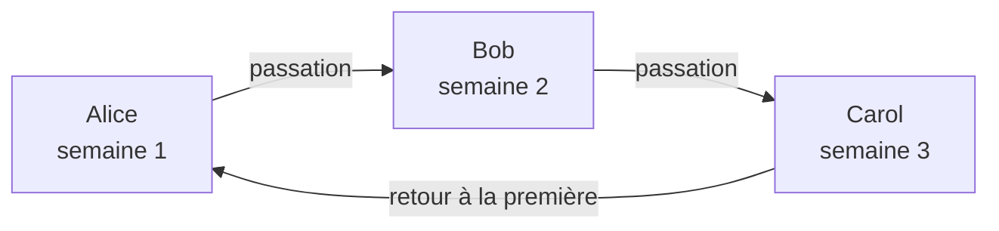

# Plannings d'astreinte

Un planning d'astreinte détermine qui est d'astreinte à chaque instant. Les personnes y assurent l'astreinte à tour de rôle : chacune est d'astreinte pendant un temps, puis la suivante prend le relais. Ajoutez un planning aux règles d'escalade d'une politique d'astreinte, et la politique alerte la personne d'astreinte dans ce planning lorsque ce niveau s'exécute.

> [!NOTE]
> Sur OneUptime Cloud, les plannings d'astreinte font partie de l'offre **Growth** et des offres supérieures. Un planning qu'un projet possède encore continue d'alerter les personnes qui y figurent, via les règles d'escalade qui le nomment, après la fin d'un essai Growth ou une rétrogradation de l'offre. Sous **Growth**, la page **Plannings d'astreinte** affiche donc la note sur l'offre avec, en dessous, les plannings encore configurés, que vous pouvez y supprimer. Créer ou modifier un planning nécessite **Growth**.

:::cards
- [Qui assure l'astreinte à tour de rôle](#qui-assure-lastreinte-à-tour-de-rôle): Créer un planning avec sa première rotation.
- [Couches](#couches): Empiler des rotations, limiter les heures d'astreinte et ajouter une couverture de secours.
- [API et Terraform](#créer-des-plannings-avec-lapi-ou-terraform): Créer des plannings et leurs rotations sous forme de code.
:::

## Qui assure l'astreinte à tour de rôle

Lorsque vous créez un planning sur la page **Plannings d'astreinte**, le formulaire demande son **Nom** et **Qui assure l'astreinte à tour de rôle ?**. Les personnes choisies forment la première couche du planning, **Layer 1**, d'astreinte 24 heures sur 24.

:::steps
1. Allez dans **Astreinte** > **Plannings d'astreinte** et cliquez sur **Créer un planning d'astreinte**.
2. Saisissez un **Nom**.
3. Sous **Qui assure l'astreinte à tour de rôle ?**, cliquez sur **Ajouter un utilisateur** et choisissez les personnes, dans l'ordre de leurs tours.
4. Si vous le souhaitez, ouvrez **Plus de champs** pour changer la durée de chaque tour, le fuseau horaire, la description ou les étiquettes.
5. Cliquez sur **Créer un planning d'astreinte**. Le nouveau planning s'ouvre ensuite sur sa page **Couches**, où vous pouvez modifier la rotation ou ajouter d'autres couches.
:::

Les personnes se relaient une à une, et la première est d'astreinte dès la création du planning :



**Qui assure l'astreinte à tour de rôle ?** est facultatif. Si vous le laissez vide, le planning démarre sans couches : il ne met personne d'astreinte tant que vous n'ajoutez pas de couche sur sa page **Couches**. La question n'est posée qu'aux personnes autorisées à ajouter des couches.

Tout le reste se trouve sous **Plus de champs**, replié jusqu'à ce que vous l'ouvriez :

| Champ | Ce qu'il fait |
| --- | --- |
| **Chaque tour dure** | **1 jour**, **1 semaine**, **2 semaines** ou **1 mois**, et **1 semaine** si vous ne le changez pas. Il est demandé dès que quelqu'un assure l'astreinte à tour de rôle. Chaque personne est d'astreinte pendant cette durée, puis la suivante prend le relais, à l'heure de la journée à laquelle le planning a été créé. |
| **Fuseau horaire** | Le fuseau horaire des heures de passation et des heures d'astreinte. Il commence avec le vôtre. |
| **Description** | Des notes sur le planning. |
| **Étiquettes** | Des étiquettes pour retrouver et regrouper le planning. |

Tant que quelqu'un assure l'astreinte à tour de rôle et que rien n'est modifié sous **Plus de champs**, son en-tête replié indique ce qui va se passer : chaque personne est d'astreinte pendant une semaine, puis la suivante prend le relais.

## Couches

La rotation d'un planning se compose de couches, sur sa page **Couches**. Les couches se lisent de haut en bas : la couche la plus haute où quelqu'un est d'astreinte est celle qui alerte. Placez donc la rotation principale en haut et la couverture de secours en dessous.

```mermaid title="La couche la plus haute où quelqu'un est d'astreinte est celle qui alerte"
flowchart TB
    start["Un niveau alerte le planning"] --> first{"Quelqu'un d'astreinte<br/>dans la couche du haut ?"}
    first -->|"Oui"| pageTop["Alerter cette personne"]
    first -->|"Non"| next{"Quelqu'un d'astreinte<br/>dans la couche suivante ?"}
    next -->|"Oui"| pageNext["Alerter cette personne"]
    next -->|"Non"| gap["Personne n'est alerté<br/>un trou de couverture"]
```

**Ajouter une couche** ajoute une couche qui démarre comme la première : d'astreinte dès maintenant, chaque personne pendant une semaine, 24 heures sur 24. Dépliez une couche pour y ajouter des personnes, et pour changer quand elle commence, à quelle fréquence elle passe le relais, quand a lieu sa première passation et ses heures d'astreinte :

| Champ | Ce qu'il définit |
| --- | --- |
| **Nom de la couche** | Ce que la couche couvre, par exemple « Principal en semaine ». |
| **Rotation starts at** | La date et l'heure de début de la rotation de la couche. |
| **Rotate every** | La fréquence à laquelle l'astreinte passe à la personne suivante de la couche. |
| **Heure de la première passation** | La première passation à la personne suivante, au début ou après. Les passations suivantes suivent chaque intervalle de rotation. |
| **Restrictions** | Les heures d'astreinte de la couche : **Aucune restriction**, **Heures spécifiques de la journée** ou **Heures spécifiques de la semaine**, dans le fuseau horaire du planning. En dehors, les couches inférieures prennent le relais. |

Pour changer la couche qui passe en premier, utilisez **Monter la couche (priorité plus haute)** ou **Descendre la couche (priorité plus basse)** dans le menu d'une couche.

Chaque personne garde une seule couleur partout, pour que vous puissiez la suivre d'un coup d'œil : sur chaque couche, dans le planning final et ses remplacements, et sur la **Chronologie des astreintes**.

## Créer des plannings avec l'API ou Terraform

Les plannings d'astreinte sont la ressource `/api/on-call-duty-policy-schedule` ; leurs couches et les personnes qui les composent sont les ressources `/api/on-call-duty-schedule-layer` et `/api/on-call-duty-schedule-layer-user`.

- Créer un planning avec `firstLayerUsers` (une liste d'identifiants d'utilisateurs, dans l'ordre de leurs tours) dans ses `miscDataProps` lui donne sa première couche, comme le fait le tableau de bord : **Layer 1**, d'astreinte dès maintenant, 24 heures sur 24. `firstLayerRotation` indique la durée de chaque tour, sous forme de rotation comme `{"_type": "Recurring", "value": {"intervalType": "Week", "intervalCount": 1}}` ; sans elle, une semaine. Chaque utilisateur doit être membre du projet et l'appelant doit être autorisé à créer des couches, sinon le planning n'est pas créé.
- Un planning créé sans eux n'a pas de couches, comme auparavant ; la ressource Terraform des plannings ne les envoie pas.
- Une couche créée sans `rotation` passe le relais chaque jour, comme toujours.

```bash
curl -X POST https://oneuptime.com/api/on-call-duty-policy-schedule \
  -H "apikey: $ONEUPTIME_API_KEY" \
  -H "Content-Type: application/json" \
  -d '{
    "data": {
      "projectId": "<project-id>",
      "name": "Primary on-call",
      "timezone": "Europe/Berlin"
    },
    "miscDataProps": {
      "firstLayerUsers": ["<user-id-1>", "<user-id-2>", "<user-id-3>"],
      "firstLayerRotation": {"_type": "Recurring", "value": {"intervalType": "Week", "intervalCount": 1}}
    }
  }'
```

## Étapes suivantes

:::cards
- [Règles d'escalade](/docs/on-call/escalation-rules): Faire alerter ce planning par un niveau d'une politique d'astreinte.
- [Chronologie des astreintes](/docs/on-call/schedule-timeline): Voir tous les plannings côte à côte, avec les trous de couverture.
- [Flux de calendrier](/docs/on-call/calendar-feeds): Mettre les permanences dans Google Agenda, Outlook ou Apple Calendrier.
:::
