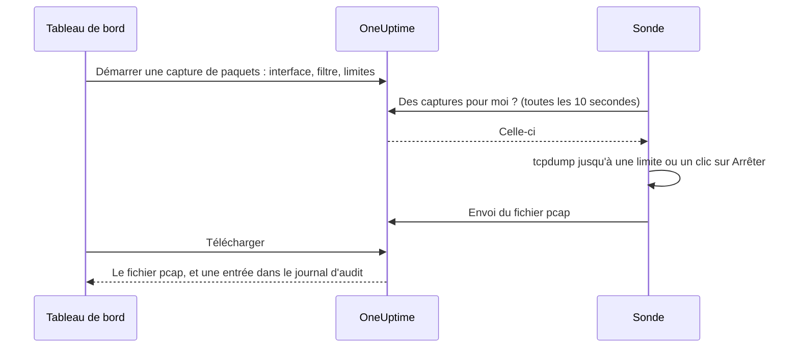

# Capture de paquets

Capturez le trafic que voit l'une de vos sondes directement depuis le tableau de bord, et ouvrez le fichier dans Wireshark. La sonde se trouve déjà dans le réseau que vous dépannez : pas de VPN à ouvrir ni d'hôte de rebond auquel se connecter.

Les captures sont désactivées sur chaque sonde jusqu'à ce que la personne qui l'exploite les active, et elles ne s'exécutent que sur les sondes propres à votre projet.

:::cards
- [Fonctionnement](#fonctionnement) : de « Démarrer une capture de paquets » à un fichier dans Wireshark.
- [Activer la capture de paquets](#activer-la-capture-de-paquets) : ce que règle la personne qui exploite la sonde, pour Docker, Docker Compose et Kubernetes.
- [Démarrer une capture](#démarrer-une-capture) : choisir une interface, cibler ce dont vous avez besoin, télécharger le fichier.
- [Référence](#référence) : limites, filtres, autorisations, journal d'audit et durée de conservation des fichiers.
- [Dépannage](#dépannage) : ce que signifie le message d'une capture qui a échoué.
:::

## Fonctionnement



1. **Démarrer.** Une personne autorisée à démarrer des captures choisit l'interface de la sonde, un filtre et les limites, puis clique sur **Démarrer la capture**. OneUptime vérifie le filtre et les limites par rapport à ce que la sonde autorise avant d'enregistrer la capture.
2. **Prise en charge.** La sonde demande du travail à OneUptime toutes les dix secondes, comme elle demande ses moniteurs. Elle prend la capture et lance `tcpdump`.
3. **Capture.** La capture s'arrête à la première de ses limites : sa durée, sa limite de paquets ou sa taille de fichier. **Arrêter** la termine plus tôt et conserve ce qu'elle a capturé.
4. **Envoi.** La sonde envoie le fichier pcap. OneUptime le stocke comme fichier privé du projet.
5. **Téléchargement.** La capture affiche **Achevé** avec un bouton **Télécharger**. Le fichier s'ouvre dans Wireshark, tcpdump ou tout autre outil qui lit les fichiers pcap.

## Avant de commencer

- **Une sonde propre à votre projet.** Les sondes globales transportent le trafic d'autres projets : elles ne capturent donc jamais. Pour installer votre propre sonde, voir [Sondes personnalisées](/docs/probe/custom-probe).
- **Une sonde de cette version ou d'une version ultérieure.** Les sondes plus anciennes ne signalent pas les interfaces sur lesquelles elles peuvent capturer.
- **Les bonnes autorisations.** Démarrer et arrêter une capture demande **Start Packet Capture**, et télécharger un fichier **Download Packet Capture**. Les propriétaires et administrateurs du projet ont les deux. Voir [Autorisations](#autorisations).
- **Un port dupliqué, pour le trafic qui n'atteint pas la sonde.** Une sonde ne voit que le trafic des interfaces de son propre hôte. Pour capturer le trafic entre d'autres équipements, dupliquez leur port de commutateur (SPAN) vers une interface libre de l'hôte de la sonde.

## Activer la capture de paquets

La personne qui exploite la sonde active les captures là où la sonde s'exécute : le tableau de bord ne le peut pas, par conception. La sonde a besoin de trois choses :

| Paramètre | Pourquoi |
| --- | --- |
| `PROBE_PACKET_CAPTURE_ENABLED=true` | Active les captures. Toute autre valeur, ou aucune, les laisse désactivées. |
| Réseau de l'hôte | Permet à la sonde de voir les interfaces de l'hôte lui-même, et un port dupliqué. Sans cela, la sonde ne voit que le réseau de son conteneur. |
| La capacité `NET_RAW` | Permet à tcpdump de capturer. Docker l'accorde par défaut. Le standard Pod Security « restricted » de Kubernetes la retire : ajoutez-la. |

:::tabs
@tab Docker
```bash
docker run --name oneuptime-probe --network host \
  --cap-add NET_RAW \
  -e PROBE_KEY=<probe-key> \
  -e PROBE_ID=<probe-id> \
  -e ONEUPTIME_URL=https://oneuptime.com \
  -e PROBE_PACKET_CAPTURE_ENABLED=true \
  -d oneuptime/probe:release
```
@tab Docker Compose
```yaml
services:
  oneuptime-probe:
    image: oneuptime/probe:release
    container_name: oneuptime-probe
    network_mode: host
    cap_add:
      - NET_RAW
    environment:
      - PROBE_KEY=<probe-key>
      - PROBE_ID=<probe-id>
      - ONEUPTIME_URL=https://oneuptime.com
      - PROBE_PACKET_CAPTURE_ENABLED=true
    restart: always
```
@tab Kubernetes
```yaml
apiVersion: apps/v1
kind: Deployment
metadata:
  name: oneuptime-probe
spec:
  selector:
    matchLabels:
      app: oneuptime-probe
  template:
    metadata:
      labels:
        app: oneuptime-probe
    spec:
      hostNetwork: true
      dnsPolicy: ClusterFirstWithHostNet
      containers:
        - name: oneuptime-probe
          image: oneuptime/probe:release
          securityContext:
            capabilities:
              add: ["NET_RAW"]
          env:
            - name: PROBE_KEY
              value: "<probe-key>"
            - name: PROBE_ID
              value: "<probe-id>"
            - name: ONEUPTIME_URL
              value: "https://oneuptime.com"
            - name: PROBE_PACKET_CAPTURE_ENABLED
              value: "true"
```
:::

Au démarrage, le journal de la sonde indique `Packet capture is on: captures of up to 30 minutes and 25 MB can be started on this probe from the dashboard.` Moins d'une minute plus tard, la page de la sonde dans le tableau de bord propose **Démarrer une capture de paquets**.

Pour fixer sur cette sonde un plafond plus bas que celui que respecte chaque sonde, ajoutez l'une de ces variables :

| Variable | Par défaut | Effet |
| --- | --- | --- |
| `PROBE_PACKET_CAPTURE_MAX_DURATION_IN_SECONDS` | `1800` | La capture la plus longue que cette sonde exécute, de 5 à 1800 secondes. |
| `PROBE_PACKET_CAPTURE_MAX_FILE_SIZE_IN_MB` | `25` | Le plus gros fichier de capture que cette sonde produit, de 1 à 25 Mo. |

> [!NOTE]
> Les sondes fournies avec une installation auto-hébergée de OneUptime, via Docker Compose ou le chart Helm, sont des sondes globales : elles ne capturent donc jamais. Exécutez une sonde personnalisée dans le réseau où vous voulez capturer.

## Démarrer une capture

:::steps
### Ouvrir la sonde ou l'équipement

Ouvrez **Moniteurs → Paramètres → Sondes** et cliquez sur votre sonde : sa carte **Captures de paquets** liste ses captures. Ou ouvrez un équipement réseau et allez sur sa page **Traffic** : les captures y tournent sur la sonde de l'équipement, et sont d'abord filtrées sur l'adresse de l'équipement.

### Cliquer sur Démarrer une capture de paquets

Le formulaire dit ce que contient une capture avant que vous en démarriez une : les mots de passe, jetons et données personnelles qui transitent sur le réseau se retrouvent dans le fichier.

### Choisir l'interface

**Toutes les interfaces (any)** capture sur toutes les interfaces de la sonde. Choisissez l'interface vers laquelle un commutateur duplique le trafic quand vous capturez du trafic dupliqué.

### Choisir quels paquets

Remplissez **Hôte ou réseau**, **Port** et **Protocole** pour cibler la capture, ou laissez-les vides pour garder chaque paquet. Le formulaire affiche le filtre qu'ils forment, par exemple `host 10.0.0.5 and tcp port 443`. Cliquez sur **Écrire plutôt un filtre BPF** pour écrire le vôtre.

### Vérifier les limites

**Plus de champs** contient **Durée**, **Limite de paquets** et **Limite de taille du fichier (Mo)**. Son résumé dit quand la capture s'arrête : `S'arrête après 1 minute, 100 000 paquets ou 10 Mo, selon ce qui arrive en premier.`

### Cliquer sur Démarrer la capture

La capture affiche **En attente** jusqu'à ce que la sonde la prenne en charge, puis **En cours d'exécution**, avec son avancement. Cliquez sur **Arrêter** pour la terminer plus tôt.
:::

Quand la capture affiche **Achevé**, cliquez sur **Télécharger**, puis ouvrez le fichier `.pcap` dans Wireshark. Une capture sur **Toutes les interfaces (any)** est une « Linux cooked capture », que Wireshark lit comme n'importe quelle autre.

## Référence

### Limites

| Limite | Par défaut | Plage |
| --- | --- | --- |
| Durée | 1 minute | 5 secondes à 30 minutes |
| Limite de paquets | 100 000 | 1 à 1 000 000 |
| Limite de taille du fichier | 10 Mo | 1 à 25 Mo |

- Une capture s'arrête à la première limite qu'elle atteint. Un fichier qui atteint sa limite de taille est coupé après le dernier paquet complet : il s'ouvre donc toujours.
- Une sonde exécute au plus 2 captures à la fois.
- Une capture que la sonde ne prend pas en charge dans les 5 minutes échoue, et le dit.
- La sonde soumet de nouveau chaque capture à ces limites, et à ses propres limites plus basses.

### Filtres

Les champs du formulaire forment un [filtre BPF](https://www.tcpdump.org/manpages/pcap-filter.7.html), le langage de filtre de capture de tcpdump et de Wireshark :

| Hôte ou réseau | Port | Protocole | Filtre |
| --- | --- | --- | --- |
| `10.0.0.5` | | Tous les protocoles | `host 10.0.0.5` |
| `10.0.0.0/24` | `443` | TCP | `net 10.0.0.0/24 and tcp port 443` |
| | `5060` | UDP | `udp port 5060` |
| | `8000-8080` | Tous les protocoles | `portrange 8000-8080` |
| `10.0.0.5` | | ICMP | `host 10.0.0.5 and (icmp or icmp6)` |

Un filtre que vous écrivez vous-même tient sur une ligne d'au plus 500 caractères, faite de lettres, de chiffres, d'espaces et de `. : / ( ) [ ] ! & | < > = + - * % ^ _`. OneUptime le vérifie avant de l'enregistrer, et tcpdump le compile sur la sonde. La sonde le transmet à tcpdump comme un seul argument, jamais par un shell.

### Autorisations

| Autorisation | Permet de | Qui l'a par défaut |
| --- | --- | --- |
| **Start Packet Capture** | Démarrer des captures, et les arrêter | Project Owner, Project Admin |
| **Download Packet Capture** | Télécharger les fichiers de capture | Project Owner, Project Admin |
| **Delete Packet Capture** | Supprimer des captures et leurs fichiers | Project Owner, Project Admin |
| **Read Packet Capture** | Voir les captures : quand elles ont tourné, sur quelle sonde et avec quel filtre | Project Owner, Project Admin, Project Member, Viewer |

Pour donner **Start Packet Capture** ou **Download Packet Capture** à une équipe, ouvrez-la sous **Paramètres → Équipes** et ajoutez l'autorisation sur sa page **Autorisations**. Voir [Autorisations](/docs/permissions/index).

### Journal d'audit et confidentialité

- Démarrer une capture est consigné dans le journal d'audit comme un **Create** de la **Packet Capture**, et sa suppression comme un **Delete**. Chaque téléchargement est consigné comme un **Download**, avec qui a téléchargé quelle capture.
- Le fichier est un fichier privé du projet. Seul le bouton **Télécharger**, avec **Download Packet Capture**, le délivre.
- Les captures et leurs fichiers sont supprimés 7 jours après leur démarrage. Supprimer une capture supprime son fichier aussitôt.

## Dépannage

:::details « La capture de paquets est désactivée sur cette sonde »
La sonde tourne sans `PROBE_PACKET_CAPTURE_ENABLED=true`. Redémarrez-la avec les paramètres de [Activer la capture de paquets](#activer-la-capture-de-paquets).
:::

:::details "The probe is not allowed to capture packets on eth0"
tcpdump n'a pas pu ouvrir l'interface. Donnez au conteneur de la sonde la capacité `NET_RAW` : `--cap-add NET_RAW` avec Docker, `cap_add` avec Docker Compose, `securityContext.capabilities.add` avec Kubernetes.
:::

:::details "The interface does not exist on the probe"
L'interface a disparu depuis que la sonde l'a signalée, ou la sonde tourne sans le réseau de l'hôte et ne voit que les interfaces de son conteneur. Exécutez-la avec le réseau de l'hôte, puis choisissez de nouveau l'interface.
:::

:::details "tcpdump could not use the filter"
tcpdump n'a pas pu compiler le filtre. Le message reprend les mots de tcpdump, par exemple `syntax error`. Vérifiez le filtre avec le [manuel pcap-filter](https://www.tcpdump.org/manpages/pcap-filter.7.html).
:::

:::details "The probe did not pick up this capture within 5 minutes"
La sonde est déconnectée, ou la capture de paquets y a été désactivée après le démarrage de la capture. Vérifiez le **Statut de connexion** de la sonde, et son journal.
:::

:::details « Aucun paquet ne correspondait au filtre. »
La capture a tourné, et rien sur l'interface ne correspondait au filtre. Vérifiez que le trafic passe par cette interface : le trafic entre d'autres équipements n'atteint la sonde que par un port dupliqué.
:::

:::details "This probe is already running 2 packet captures"
Une sonde exécute 2 captures à la fois. Attendez qu'une se termine, ou arrêtez-en une, et redémarrez la vôtre.
:::

## Étapes suivantes

:::cards
- [Sondes personnalisées](/docs/probe/custom-probe) : installer une sonde dans le réseau où vous voulez capturer.
- [Moniteur d'équipement réseau](/docs/monitor/network-device-monitor) : surveiller les équipements dont vous capturez le trafic.
- [Autorisations](/docs/permissions/index) : donner à une équipe les autorisations de capture de paquets.
:::
