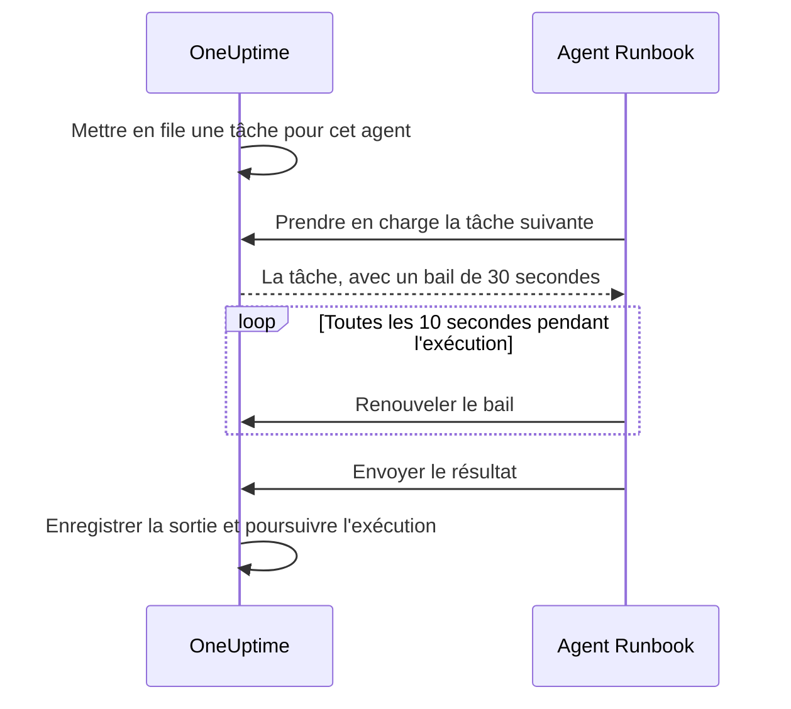

# Agents de runbook

Un **agent de runbook**, que le tableau de bord appelle **Agent Runbook** (le Runner), est un petit processus auto-hébergé qui exécute les étapes JavaScript, Bash, SSH et Kubernetes de vos runbooks **dans votre propre infrastructure**. Le Worker OneUptime n'exécute jamais vos scripts : il les met en file, et l'agent Runbook choisi par l'auteur de l'étape prend chacun en charge, l'exécute et renvoie le résultat. Cette page s'adresse à qui installe et exploite les agents Runbook.

:::cards
- [Installer un agent Runbook](#installer-un-agent-runbook): Du tableau de bord à un conteneur connecté, en cinq étapes.
- [Diriger une étape vers un agent Runbook](#diriger-une-étape-vers-un-agent-runbook): Lier une étape à l'agent Runbook qui doit l'exécuter.
- [Délais](#délais): Délais de prise en charge et d'exécution, et leur interaction.
- [Variables d'environnement](#variables-denvironnement): Ce que lit le conteneur au démarrage.
:::

## Fonctionnement

```mermaid title="Ce qui circule sur le réseau entre un agent Runbook et OneUptime"
flowchart TB
    subgraph yours["Votre infrastructure"]
        direction LR
        runner["Conteneur de l'agent Runbook"]
        targets["Hôtes, clusters, services internes"]
    end
    subgraph cloud["OneUptime"]
        direction LR
        worker["Le Worker met l'étape en file"]
        ingest["API des agents Runbook"]
    end
    worker --> ingest
    runner -->|"HTTPS sortant, ID et clé de l'agent"| ingest
    ingest -->|"Tâche prise en charge, avec ses secrets ou son identifiant"| runner
    runner -->|"Script, SSH ou API Kubernetes"| targets
```

1. Vous créez un agent Runbook dans OneUptime. OneUptime génère pour lui un ID et une clé secrète.
2. Vous lancez le conteneur de l'agent sur un hôte de votre infrastructure, avec cet ID, cette clé et l'URL de votre OneUptime.
3. L'agent demande du travail à OneUptime toutes les 5 secondes, et signale qu'il est vivant toutes les 60 secondes.
4. Quand vous écrivez une étape JavaScript, Bash, SSH ou Kubernetes, vous choisissez l'agent Runbook dans une liste déroulante. L'étape est liée à cet agent.
5. Quand l'étape s'exécute, le Worker met en file une tâche dont `targetAgentId` désigne cet agent. Seul cet agent peut la prendre en charge.
6. L'agent exécute la tâche localement — `bash -c <script>` pour Bash, un bac à sable `isolated-vm` pour JavaScript, une connexion SSH ou un appel au serveur API du cluster avec l'identifiant de l'étape —, capture le résultat et le renvoie. Le Worker reprend le runbook avec ce résultat.

L'agent n'a besoin que de **HTTPS sortant** vers votre instance OneUptime. Il n'accepte aucune connexion entrante.

Un agent Runbook ne détient que son ID et sa clé. Il reçoit tout le reste avec la tâche qu'il prend en charge : un script, dans lequel sont insérés les [secrets de runbook](/docs/runbooks/credentials#secrets-pour-les-scripts) qui lui sont attribués, ou l'[identifiant](/docs/runbooks/credentials) que désigne une étape SSH ou Kubernetes. C'est pourquoi quiconque détient la clé d'un agent peut agir en son nom : traitez la clé comme les identifiants qui lui sont attribués.

## Pourquoi les scripts s'exécutent sur un agent Runbook

Exécuter les scripts sur le Worker OneUptime posait deux problèmes :

- **Frontière de confiance.** Quiconque pouvait rédiger un runbook pouvait exécuter du code sur le Worker, avec accès à tout ce que le Worker pouvait joindre.
- **Portée.** La plupart des étapes utiles agissent sur _votre_ infrastructure (« redémarrer ce service », « chercher un enregistrement dans notre base interne »), pas sur celle d'OneUptime.

Avec les agents Runbook, ces étapes s'exécutent sur un hôte que vous contrôlez, et vous décidez de ce que cet hôte peut faire. Les étapes de requête HTTP et IA s'exécutent toujours sur le Worker, car elles n'ont besoin de rien dans votre réseau.

## Avant de commencer

- **Un hôte avec Docker** dans votre infrastructure, qui joint l'URL de votre OneUptime en HTTPS ainsi que les systèmes sur lesquels agissent vos étapes.
- **Un rôle qui crée des agents Runbook.** Project Owner, Project Admin, Project Member et Runbook Admin peuvent en créer un. Seuls un Project Owner, un Project Admin ou un Runbook Admin voient la clé d'un agent, que contient la commande d'installation.

## Installer un agent Runbook

### 1. Créer l'enregistrement de l'agent

Allez dans **Runbooks → Agents de runbook** et créez un nouvel agent. Cliquez sur **Créer : Agent Runbook** et remplissez ses deux étapes :

| Champ | Étape | Notes |
| --- | --- | --- |
| **Nom** | **Agent Runbook** | Un nom parlant, en général l'endroit où il tourne et ce qu'il peut joindre, par exemple `prod-eu-west-1`. C'est ce que vous choisissez quand vous écrivez une étape. |
| **Description** | **Agent Runbook** | Facultatif. Une phrase sur ce que cet hôte peut joindre. |
| **Étiquettes** | **Agent Runbook** (sous **Plus de champs**) | Facultatif. |
| **Exécute les runbooks** | **Capacités** | Activé par défaut. Permet à cet agent de prendre des étapes de runbook. |
| **Exécute les corrections de code IA** | **Capacités** | Désactivé par défaut. Lui permet d'ouvrir des pull requests de correction de code par IA ; voir [Fix Tasks](/docs/ai/ai-agent). |
| **Exécute les commandes de remédiation IA** | **Capacités** | Désactivé par défaut. Permet à la remédiation automatique par IA d'y exécuter des commandes vérifiées par une politique. L'activer pour un agent qui détient des identifiants SSH demande l'autorisation de lire les identifiants de runbook ; voir [Agents Runbook qui exécutent les commandes d'OneUptime AI](/docs/runbooks/credentials#agents-runbook-qui-exécutent-les-commandes-doneuptime-ai). |

Un agent Runbook prend en compte un changement de ses capacités à son prochain heartbeat ; inutile de le redémarrer.

### 2. Copier la commande d'installation

Sur la ligne de l'agent, cliquez sur **Afficher les instructions de configuration**. La boîte de dialogue **Configuration de l'agent Runbook** montre une commande `docker run` préremplie avec l'ID et la clé de cet agent. La même commande figure sur la page de l'agent, sous **Instructions de configuration**.

Seuls un Project Owner, un Project Admin ou un Runbook Admin peuvent lire la clé. Les autres voient « Vous n'avez pas l'autorisation d'afficher la clé de cet agent Runbook » à la place de la commande.

### 3. La lancer sur un hôte de votre infrastructure

Lancez la commande sur un hôte de votre environnement qui peut :

- joindre votre instance OneUptime en HTTPS, et
- faire ce dont vos étapes ont besoin, par exemple joindre d'autres hôtes en SSH, appeler le serveur API d'un cluster ou parler à une base de données.

```bash
docker run --name oneuptime-runner --restart unless-stopped \
  -e ONEUPTIME_RUNNER_ID=<runner-id> \
  -e ONEUPTIME_RUNNER_KEY=<runner-key> \
  -e ONEUPTIME_URL=https://oneuptime.yourdomain.com \
  -d oneuptime/runner:release
```

### 4. Vérifier que l'agent est connecté

Revenez dans **Runbooks → Agents de runbook**. Moins d'une minute après le démarrage du conteneur, le **Statut** de l'agent doit indiquer **Connecté**, avec une valeur récente dans **Dernière fois vu**. Sur la page de l'agent, la carte **Statut de l'agent Runbook** montre sa **Version de l'agent Runbook** et son **Hôte**. S'il reste **Jamais connecté** ou **Déconnecté**, voir [Dépannage](#dépannage).

### 5. Garder l'agent à jour

Quand un agent tourne dans une version plus ancienne que votre OneUptime, un signe d'avertissement apparaît à côté de sa **Version de l'agent Runbook** sur sa page. Sélectionnez-le pour voir comment le mettre à jour : récupérer la nouvelle image et supprimer le conteneur, puis relancer la commande d'installation de l'étape 2. Un agent installé par le chart de l'agent Kubernetes se met à jour avec le chart.

```bash
docker pull oneuptime/runner:release
docker rm -f oneuptime-runner
```

## Diriger une étape vers un agent Runbook

:::steps
### Ajouter une étape qui s'exécute sur un agent Runbook

Dans les **Étapes** de votre runbook, ajoutez une étape JavaScript, Bash, SSH ou Kubernetes.

### Choisir l'agent Runbook

La liste déroulante **Agent Runbook** de l'étape affiche chaque agent du projet, et s'il est connecté. Si le projet n'en a encore aucun, l'étape le dit et vous renvoie à **Runbooks › Runners**.

### Enregistrer les étapes

Cliquez sur **Save Steps**. Quand une exécution atteint l'étape, le Worker met en file une tâche pour l'ID de cet agent, et seul cet agent peut la prendre en charge.
:::

Bash est exécuté avec `bash -c`. JavaScript s'exécute dans un bac à sable `isolated-vm` sur l'agent, sans accès au système de fichiers ni aux processus ; il peut appeler des API HTTP publiques avec `axios`, mais pas des adresses d'un réseau privé. Les étapes SSH et Kubernetes utilisent l'[identifiant](/docs/runbooks/credentials) que l'étape désigne, qui doit être attribué au même agent.

Besoin de plus d'un agent ? Créez-les, puis dirigez chaque étape vers celui qui convient. Pour la redondance, faites tourner un second agent et répartissez vos étapes entre les deux, ou gardez un runbook de secours dont les étapes visent l'autre agent.

## Notes d'exploitation

### Délais

Deux délais s'appliquent à chaque étape qui s'exécute sur un agent Runbook :

| Délai | Valeur par défaut | Ce qu'il contrôle |
| --- | --- | --- |
| **Délai de prise en charge** | 2 minutes | Combien de temps le Worker attend que l'agent choisi prenne la tâche en charge. Si l'agent ne la prend pas à temps, l'étape échoue pour dépassement de délai et le runbook continue (ou s'arrête, selon **Continuer en cas d'échec**). |
| **Délai d'exécution** | 30 secondes | Combien de temps l'agent laisse l'étape tourner avant de l'arrêter. Bash reçoit `SIGKILL` ; le bac à sable de JavaScript est détruit. |

Les deux se configurent par étape. Ouvrez **Runbooks › votre runbook › Étapes**, dépliez l'étape et réglez **Délai d'exécution** et **Délai de prise en charge** (en secondes) dans ses réglages. Laissez un champ vide pour garder la valeur par défaut. Chacun accepte de 1 seconde à 1 heure ; les valeurs hors de cette plage sont ramenées dans la plage à l'exécution de l'étape.

La fenêtre d'attente globale du Worker est `claim timeout + execution timeout + a few seconds`. Choisissez des valeurs adaptées à l'étape.

Deux points à garder en tête si vous réduisez le délai de prise en charge :

- L'agent demande du travail à chaque cycle d'interrogation (`ONEUPTIME_RUNNER_POLL_INTERVAL_MS`, 5 secondes par défaut). Un délai de prise en charge plus court qu'un cycle peut expirer avant qu'un agent parfaitement sain ait même vu la tâche, et l'étape échoue alors avec le même message qu'avec un agent hors ligne.
- Un agent exécute une tâche à la fois par défaut (`ONEUPTIME_RUNNER_CONCURRENCY`). Pendant qu'une longue étape l'occupe, les autres étapes dirigées vers le même agent épuisent leurs propres délais de prise en charge. Si vous portez un délai d'exécution à plusieurs minutes, augmentez d'autant le délai de prise en charge des étapes qui partagent cet agent, ou donnez-leur un autre agent.

### Bail et heartbeat



Quand un agent prend une tâche en charge, il obtient un bail court (30 secondes par défaut). Pendant l'exécution de l'étape, l'agent renouvelle le bail toutes les 10 secondes. Si l'agent meurt ou perd le réseau au milieu d'un script, le bail expire et le Worker marque la tâche `TimedOut` au lieu d'attendre indéfiniment.

Les processus enfants de Bash ne sont **pas** annulés automatiquement à l'expiration du bail (un bac à sable JavaScript est lui aussi laissé finir, s'il finit), mais le Worker cesse de les attendre, et l'agent ne peut plus soumettre de résultat une fois qu'une autre prise en charge a pris le relais. Concevez des scripts qui peuvent être relancés sans risque si l'exécution unique compte pour vous.

### Si le Worker OneUptime redémarre au milieu d'une étape

Une exécution de runbook tourne sur un seul Worker du début à la fin, donc un déploiement ou un plantage peut l'interrompre pendant qu'une étape est en cours. La suite dépend de la reprise ou non de l'exécution :

- **Elle reprend.** Le Worker qui la reprend trouve la tâche que votre étape a déjà créée et **s'y rattache**. Il attend cette tâche au lieu d'envoyer une seconde copie du script à votre agent. Si l'agent avait déjà terminé, le résultat enregistré est utilisé tel quel. Une étape est envoyée à un agent au plus une fois par exécution.
- **Elle ne reprend pas.** Si l'exécution n'est jamais reprise, un balayage la marque `Failed` une fois qu'elle a dépassé la fenêtre de prise en charge et d'exécution configurée pour son étape en cours, avec un message qui nomme cette étape. Une exécution ne reste jamais bloquée en `Running`.

La seule chose que ce mécanisme ne peut pas dire, c'est jusqu'où un script est allé avant la disparition du Worker. Une étape qui était en cours est signalée en échec avec une note indiquant qu'elle a pu s'exécuter partiellement : vérifiez le système cible avant de relancer le runbook.

### Aucun agent en ligne

Si l'agent choisi est hors ligne quand l'étape s'exécute, la tâche attend en `Pending` jusqu'à l'expiration du délai de prise en charge, puis l'étape échoue avec "No runbook agent picked up this step before the wait window expired." La page **Agents de runbook** est l'endroit où vérifier la couverture avant d'exécuter un runbook en situation réelle.

### Plafond de sortie

stdout et stderr réunis sont plafonnés à **50 Ko** par étape. Une sortie plus longue est coupée avec un marqueur. Si vous avez besoin d'un journal complet, écrivez-le depuis le script dans votre stockage de journaux ou un stockage objet et affichez l'URL avec `echo`.

### Annulation

Annuler une exécution de runbook, depuis la page d'exécution ou l'API, marque aussitôt toutes ses tâches `Pending`, `Claimed` et `Running` comme `Cancelled`. Un agent déjà au milieu d'un script termine son travail, mais le serveur n'accepte pas son résultat, et aucune étape suivante du runbook n'est envoyée.

### Concurrence

Chaque agent exécute une tâche à la fois par défaut. Pour en permettre davantage, définissez `ONEUPTIME_RUNNER_CONCURRENCY` sur le conteneur, mais n'oubliez pas que l'agent partage l'hôte avec tout ce qui y tourne déjà.

## Variables d'environnement

L'agent lit ces variables au démarrage :

| Variable | Obligatoire | Valeur par défaut | Notes |
| --- | --- | --- | --- |
| `ONEUPTIME_URL` | oui | — | URL de base de votre instance OneUptime, par exemple `https://oneuptime.yourdomain.com`. |
| `ONEUPTIME_RUNNER_ID` | oui | — | L'ID de l'agent, tiré de sa commande d'installation. |
| `ONEUPTIME_RUNNER_KEY` | oui | — | La clé secrète de l'agent, tirée de sa commande d'installation. |
| `ONEUPTIME_RUNNER_POLL_INTERVAL_MS` | non | `5000` | La fréquence à laquelle l'agent demande de nouvelles tâches. Une valeur inférieure à `1000` revient à la valeur par défaut. |
| `ONEUPTIME_RUNNER_HEARTBEAT_INTERVAL_MS` | non | `60000` | La fréquence à laquelle l'agent signale qu'il est vivant. Une valeur inférieure à `5000` revient à la valeur par défaut. |
| `ONEUPTIME_RUNNER_JOB_HEARTBEAT_INTERVAL_MS` | non | `10000` | La fréquence à laquelle l'agent renouvelle le bail d'une tâche en cours. Une valeur inférieure à `1000` revient à la valeur par défaut. |
| `ONEUPTIME_RUNNER_CONCURRENCY` | non | `1` | Nombre maximal de tâches simultanées sur cet agent. |
| `ONEUPTIME_RUNNER_ENABLE_RUNBOOKS` | non | — | Mettez `false` pour que cet agent ne prenne plus d'étapes de runbook, quoi qu'indique le tableau de bord. Ne peut que désactiver la capacité. |
| `ONEUPTIME_RUNNER_ENABLE_CODE_FIXES` | non | — | Mettez `false` pour que cet agent ne prenne plus de corrections de code par IA, quoi qu'indique le tableau de bord. |
| `ONEUPTIME_RUNNER_ENABLE_AI_COMMANDS` | non | — | Mettez `false` pour que cet agent n'exécute plus de commandes de remédiation IA, quoi qu'indique le tableau de bord. |

## Faire tourner la clé d'un agent

Si une clé fuite, réinitialisez-la. L'ancienne clé cesse aussitôt de fonctionner.

:::steps
### Réinitialiser la clé

Ouvrez l'agent depuis **Runbooks → Agents de runbook**, cliquez sur **Réinitialiser la clé de l'agent Runbook** et confirmez. L'agent ne se connecte plus tant qu'il n'a pas la nouvelle clé.

### Lancer le conteneur avec la nouvelle clé

Copiez la nouvelle commande depuis les **Instructions de configuration** de l'agent, supprimez l'ancien conteneur et lancez la nouvelle commande sur le même hôte :

```bash
docker rm -f oneuptime-runner
```

### Vérifier qu'il se reconnecte

Dans **Runbooks → Agents de runbook**, le **Statut** de l'agent repasse à **Connecté** en moins d'une minute.
:::

## Autorisations

La gestion des agents relève du groupe d'autorisations Runbooks existant :

- `CreateRunner`, `EditRunner`, `DeleteRunner`, `ReadRunner` — gérer les enregistrements des agents.
- `RunbookAdmin`, `RunbookMember`, `RunbookViewer` (rôles) — `RunbookAdmin` construit les runbooks, leurs règles et les agents sur lesquels ils tournent, et les exécute. `RunbookMember` ouvre les runbooks et leurs exécutions et les exécute — il lance une exécution, termine ou ignore ses étapes et l'annule — mais ne crée, ne modifie ni ne supprime aucun runbook ni aucun agent. `RunbookViewer` lit les runbooks et leurs exécutions et n'exécute rien. `RunbookAdmin` regroupe toutes les autorisations granulaires ci-dessus.

Déclencher un runbook (et donc envoyer ses étapes aux agents) demande un rôle qui exécute les runbooks — `ProjectOwner`, `ProjectAdmin`, `ProjectMember`, `RunbookAdmin` ou `RunbookMember` — ou `CreateRunbookExecution` ; terminer, ignorer ou annuler une exécution accepte aussi `EditRunbookExecution`. Un rôle n'exécute que les runbooks que sa portée atteint.

La clé d'un agent n'est lisible que par les Project Owners, les Project Admins et les Runbook Admins.

## API côté agent

Pour les curieux : l'agent utilise ces points de terminaison, montés sous `/runner-ingest`. Le chemin d'avant la fusion, `/runbook-agent-ingest`, est toujours servi pour les agents qui n'ont pas encore été redéployés, donc mettre à jour le serveur ne les casse pas. Ils sont authentifiés par l'ID et la clé de l'agent dans le corps JSON (`agentId` et `agentKey`), ou dans les en-têtes `x-agent-id` et `x-agent-key`.

| Point de terminaison | Rôle |
| --- | --- |
| `POST /heartbeat` | Signe de vie. Met à jour la dernière heure de contact, la version et les informations d'hôte de l'agent, et renvoie les capacités que le projet lui accorde. |
| `POST /claim-next-job` | Prendre en charge de façon atomique la plus ancienne tâche `Pending` destinée à l'ID de cet agent. Renvoie `{ job: null }` quand il n'y a rien à faire. |
| `POST /job/:jobId/heartbeat` | Rafraîchir le bail de la tâche. Renvoie 404 une fois le bail expiré ou la tâche terminée. |
| `POST /job/:jobId/result` | Soumettre le résultat final. Ignoré si le bail est déjà passé à autre chose. |
| `POST /disconnect` | Se déconnecter lors d'un arrêt propre. |

Vous ne devriez pas avoir à les appeler à la main : l'agent fourni le fait. Ils sont documentés ici pour que vous puissiez construire votre propre agent si vous avez une contrainte à laquelle le nôtre ne répond pas.

## Dépannage

:::details L'agent reste Jamais connecté ou Déconnecté
- Consultez les journaux du conteneur avec `docker logs oneuptime-runner` à la recherche d'erreurs d'authentification ou de réseau.
- Vérifiez que l'hôte joint l'URL de votre OneUptime, par exemple avec `curl`.
- Vérifiez que l'ID et la clé ont été copiés sans espaces, et que `ONEUPTIME_URL` est l'adresse à laquelle vous ouvrez OneUptime.

**Jamais connecté** signifie que l'agent ne s'est jamais signalé. **Déconnecté** signifie qu'il l'a fait, mais pas dans les 5 dernières minutes.
:::

:::details Les étapes échouent avec "No runbook agent picked up this step before the wait window expired."
L'agent de l'étape n'a pas pris la tâche en charge dans son délai de prise en charge. Vérifiez que l'agent est **Connecté**, que **Exécute les runbooks** est activé pour lui, et qu'il n'est pas occupé par une longue étape : il exécute une tâche à la fois, sauf si vous augmentez `ONEUPTIME_RUNNER_CONCURRENCY`. Un délai de prise en charge plus court que l'intervalle d'interrogation échoue de la même façon.
:::

:::details Les étapes échouent avec "The runbook agent stopped responding while this step was running."
L'agent a pris la tâche en charge, puis a cessé de renouveler son bail : il a planté, redémarré ou perdu le réseau. Vérifiez qu'il est en ligne, puis vérifiez le système cible avant de relancer le runbook.
:::

:::details L'agent journalise "No capability is enabled"
Toutes les capacités sont désactivées pour cet agent. Activez **Exécute les runbooks** sur la page de l'agent dans OneUptime. Il prend en compte le changement à son prochain heartbeat.
:::

## Prochaines étapes

:::cards
- [Rédiger un runbook](/docs/runbooks/authoring): Écrire les étapes qui s'exécutent sur votre agent Runbook.
- [Identifiants de runbook](/docs/runbooks/credentials): Donner aux étapes SSH et Kubernetes un accès géré.
- [Configuration & sécurité des runbooks](/docs/runbooks/configuration): Limites, autorisations et durcissement.
:::
