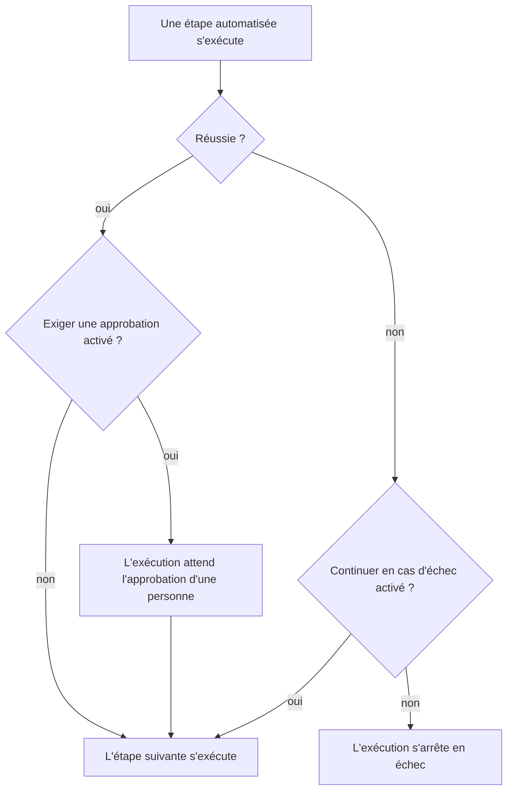

# Rédiger un runbook

Vous écrivez un runbook sous forme de liste ordonnée d'étapes, sur sa page **Étapes**. Cette page montre comment créer un runbook, comment configurer chacun des sept types d'étapes, et comment les échecs et les approbations changent le cours d'une exécution.

:::cards
- [Créer un runbook](#créer-un-runbook): D'un runbook vide à des étapes enregistrées.
- [Types d'étapes](#types-détapes): Manual, JavaScript, HTTP request, Bash, SSH, Kubernetes et AI.
- [Gestion des échecs et approbations](#gestion-des-échecs-et-approbations): Ce qui se passe après l'échec ou la réussite d'une étape.
- [Un exemple complet](#un-exemple-complet): Une bascule de base de données en cinq étapes.
:::

## Avant de commencer

- **Un rôle qui rédige des runbooks.** Project Owner, Project Admin et Runbook Admin créent des runbooks et enregistrent leurs étapes. Avec des autorisations granulaires, il vous faut **Create Runbook** et **Edit Runbook**. Voir [Autorisations](/docs/runbooks/configuration#autorisations).
- **Un agent Runbook, pour les étapes JavaScript, Bash, SSH et Kubernetes.** Ces étapes s'exécutent sur un [agent Runbook](/docs/runbooks/agents) dans votre propre infrastructure, jamais sur le Worker OneUptime. Installez-en un d'abord.
- **Un identifiant, pour les étapes SSH et Kubernetes, et l'autorisation de le lire.** Voir [Identifiants de runbook](/docs/runbooks/credentials). Une étape ne peut désigner un identifiant que si vous pouvez lire les identifiants de runbook : Project Owner, Project Admin, ou **Read Runbook Credential**. Runbook Admin ne l'inclut pas.
- **Un fournisseur LLM, pour les étapes IA.** Voir [Fournisseurs LLM](/docs/ai/llm-provider).

## Créer un runbook

:::steps
### Ouvrir Runbooks

Ouvrez **Produits → Runbooks**. Runbooks se trouve dans le groupe **Tableaux de bord et automatisation**.

### Créer le runbook

Cliquez sur **Créer : Runbook**, saisissez un **Nom** et, si vous le souhaitez, une **Description** de l'usage du runbook. Sous **Plus de champs** se trouvent l'interrupteur **Activé**, activé par défaut, et les **Étiquettes**. Le nouveau runbook apparaît dans la liste : ouvrez-le.

### Ajouter des étapes

Allez dans **Étapes**. Sous **Start your runbook**, choisissez le type de la première étape ; sous la dernière étape, **Ajouter une autre étape** propose les mêmes sept types. Chaque étape s'ouvre avec son **Titre**, sa **Description** (en Markdown, affichée à la personne qui intervient) et les réglages de son type. Dès que le runbook a une étape, **Ajouter une étape**, en haut de la carte, ajoute une étape Manual.

### Ordonner les étapes

Les étapes s'exécutent **dans l'ordre**. Pour changer l'ordre, faites glisser une étape par la poignée à gauche de son en-tête ; au clavier, placez le focus sur la poignée, appuyez sur Espace, déplacez l'étape avec les flèches et appuyez de nouveau sur Espace.

### Enregistrer les étapes

Cliquez sur **Save Steps**. Tant que vous ne l'avez pas fait, l'éditeur affiche **Modifications non enregistrées**. Une fois l'enregistrement fait, vous voyez **Enregistré**, et le runbook est prêt à être [exécuté](/docs/runbooks/running).
:::

## Anatomie d'une étape

Chaque étape comporte ces champs :

| Champ | Rôle |
| --- | --- |
| **Titre** | Un libellé court, affiché dans la liste des étapes et dans chaque exécution. |
| **Description** | Contexte facultatif pour la personne qui intervient, en Markdown. Pour une étape Manual, c'est la consigne qu'elle lit. |
| **Continuer en cas d'échec** | Étapes automatisées uniquement. Si activé, une étape en échec n'arrête pas l'exécution : l'étape suivante s'exécute quand même. |
| **Exiger une approbation** | Étapes automatisées uniquement. Si activé, le runbook se met en pause après cette étape et attend qu'une personne approuve avant d'exécuter l'étape suivante. L'interrupteur s'intitule **Exiger une approbation avant d'exécuter l'étape suivante**. |
| Réglages propres au type | Le script, l'URL, l'agent Runbook, l'identifiant ou le prompt. Voir [Types d'étapes](#types-détapes). |

## Types d'étapes

| Type | S'exécute sur | Nécessite |
| --- | --- | --- |
| [Manual](#manual) | Une personne | Rien |
| [JavaScript](#javascript) | Un agent Runbook | Un agent Runbook |
| [HTTP request](#http-request) | Le Worker OneUptime | Rien |
| [Bash](#bash) | Un agent Runbook | Un agent Runbook |
| [SSH](#ssh) | Un agent Runbook | Un agent Runbook et un identifiant SSH |
| [Kubernetes](#kubernetes) | Un agent Runbook | Un agent Runbook et un identifiant Kubernetes |
| [AI](#ai) | Le Worker OneUptime | Un fournisseur LLM |

### Manual

Un élément de checklist pour une personne. L'exécution se met en pause quand elle atteint une étape Manual et reste en `WaitingForManualStep` (**En attente de votre part**) jusqu'à ce que quelqu'un clique sur **Marquer comme terminé** ou **Ignorer**. Une exécution qui attend une personne n'expire jamais.

Utilisez-la pour ce que seul un humain peut vérifier ou faire : « Confirmer dans le tableau de bord du répartiteur de charge que le trafic est passé dans la région secondaire. »

### JavaScript

Un extrait de JavaScript, exécuté dans un bac à sable `isolated-vm` sur un [agent Runbook](/docs/runbooks/agents) dans votre propre infrastructure, pas sur le Worker OneUptime.

| Champ | Ce qu'il fait | Valeur par défaut |
| --- | --- | --- |
| **Agent Runbook** | L'agent Runbook qui exécute l'étape. Seul cet agent peut prendre en charge la tâche. | — |
| **Script** | Le JavaScript à exécuter. Renvoyez une valeur avec `return` pour la capturer ; chaque ligne de `console.log` est capturée aussi. Lever une erreur fait échouer l'étape. | — |
| **Délai d'exécution** | Combien de temps l'agent Runbook laisse tourner l'extrait avant de détruire le bac à sable. | 30 secondes |
| **Délai de prise en charge** | Combien de temps le Worker attend que l'agent Runbook prenne la tâche en charge. | 2 minutes |

```javascript
const start = Date.now();
// ... your logic ...
console.log("replica lag checked");
return { durationMs: Date.now() - start };
```

Le bac à sable dispose de 128 Mo de mémoire et n'a accès ni au système de fichiers ni aux processus. Il peut faire des requêtes HTTP avec `axios`, mais seulement vers des adresses publiques : une requête vers un réseau privé, vers l'hôte même de l'agent Runbook ou vers un point de métadonnées cloud est refusée. Pour joindre un service de votre réseau, utilisez une étape [Bash](#bash) avec `curl`.

### HTTP request

Un appel HTTP sortant, fait par le Worker OneUptime. Aucun agent Runbook n'est nécessaire.

| Champ | Ce qu'il fait | Valeur par défaut |
| --- | --- | --- |
| **Méthode** | `GET`, `POST`, `PUT`, `PATCH`, `DELETE` ou `HEAD`. | `GET` |
| **URL** | Le point de terminaison à appeler. | Vide |
| **En-têtes (JSON)** | Un objet JSON, par exemple `{ "Authorization": "Bearer ..." }`. Des en-têtes qui ne sont pas du JSON valide font échouer l'étape. | Aucun |
| **Corps** | Envoyé en JSON s'il s'analyse comme du JSON, sinon en texte. | Aucun |
| **Request timeout** | Combien de temps attendre la réponse du point de terminaison avant de faire échouer l'étape. | 30 secondes |

L'étape réussit sur une réponse `2xx` ou `3xx` et échoue sur tout le reste, avec `HTTP <status>` comme erreur. Les redirections ne sont pas suivies. Le statut, les en-têtes et le corps de la réponse sont capturés, jusqu'à 50 Ko.

> [!NOTE]
> Le Worker n'appelle jamais d'adresses de bouclage ou de lien local, comme un point de métadonnées cloud. Sur OneUptime Cloud, il n'appelle que des adresses publiques. Un OneUptime auto-hébergé atteint aussi les réseaux privés, sauf si `DATA_SOURCE_BLOCK_PRIVATE_ADDRESSES` vaut `true`. Pour appeler un service de votre réseau depuis OneUptime Cloud, utilisez une étape [Bash](#bash) avec `curl`.

Utile pour : ouvrir un incident PagerDuty, publier sur un webhook Slack, appeler l'API publique de votre fournisseur cloud ou la vôtre.

### Bash

Un script bash, exécuté avec `bash -c <script>` sur un [agent Runbook](/docs/runbooks/agents) dans votre propre infrastructure. Bash ne s'exécute jamais sur le Worker OneUptime.

| Champ | Ce qu'il fait | Valeur par défaut |
| --- | --- | --- |
| **Agent Runbook** | L'agent Runbook qui exécute l'étape. Seul cet agent peut prendre en charge la tâche. | — |
| **Script Bash** | Le script. La sortie (stdout et stderr) est capturée jusqu'à 50 Ko, et un code de sortie non nul fait échouer l'étape. | — |
| **Délai d'exécution** | Combien de temps l'agent Runbook laisse tourner le script avant de le tuer avec `SIGKILL`. Augmentez-le pour les étapes qui prennent légitimement des minutes. | 30 secondes |
| **Délai de prise en charge** | Combien de temps le Worker attend que l'agent Runbook prenne la tâche en charge. | 2 minutes |

Le script s'exécute dans le conteneur de l'agent Runbook, avec les outils que fournit son image, comme `curl`, `wget` et le client `ssh`, et avec l'accès réseau de l'hôte sur lequel il tourne. Par exemple, pour vérifier un service que seul votre réseau peut joindre :

```bash
set -euo pipefail
HTTP_CODE=$(curl -s -o /tmp/resp.txt -w "%{http_code}" "http://payments.internal:8080/health")
echo "HTTP $HTTP_CODE"
cat /tmp/resp.txt
if [[ "$HTTP_CODE" != "200" ]]; then
  echo "Health check failed"
  exit 1
fi
```

Si l'agent Runbook choisi est hors ligne quand l'exécution atteint cette étape, l'étape attend jusqu'au **délai de prise en charge** (2 minutes par défaut) puis échoue pour dépassement de délai. Ajoutez un agent sous **Runbooks → Agents de runbook** avant de compter sur une étape Bash.

> [!TIP]
> Gardez les mots de passe et les jetons hors du script. Stockez-les comme secrets de runbook et écrivez `{{runbookSecrets.NAME}}` dans un script Bash ou JavaScript : l'agent Runbook reçoit le script avec la valeur insérée. Voir [Secrets pour les scripts](/docs/runbooks/credentials#secrets-pour-les-scripts).

### SSH

Exécuter une commande sur un hôte que l'agent Runbook peut joindre en SSH. Contrairement à `ssh host cmd` dans une étape Bash, l'accès est un [identifiant](/docs/runbooks/credentials) géré plutôt qu'une clé privée posée sur le disque de l'agent : chiffré au repos, attribué à des agents précis et jamais relisible via l'API.

| Champ | Ce qu'il fait |
| --- | --- |
| **Agent Runbook** | L'agent Runbook qui ouvre la connexion. Il doit pouvoir joindre l'hôte sur le réseau. |
| **Identifiant** | Un identifiant SSH contenant l'hôte, le port, l'utilisateur et la clé ou le mot de passe. Il doit être attribué à l'agent Runbook choisi, sinon l'étape échoue au lieu de s'exécuter avec le mauvais accès. |
| **Commande** | Exécutée sur l'hôte distant sous l'utilisateur de l'identifiant. La sortie est capturée jusqu'à 50 Ko, et un code de sortie non nul fait échouer l'étape. |
| **Délai d'exécution** | Couvre ensemble la connexion, l'authentification et l'exécution de la commande, pour qu'une commande bloquée ne puisse pas tenir l'étape ouverte. 30 secondes par défaut. |
| **Délai de prise en charge** | Combien de temps le Worker attend que l'agent Runbook prenne la tâche en charge. 2 minutes par défaut. |

### Kubernetes

Redémarrer ou mettre à l'échelle une charge de travail dans un cluster. Les actions forment volontairement un ensemble fermé : une étape capable de modifier n'importe quel objet serait un shell d'administrateur de cluster, et ce type d'étape existe pour rendre les remédiations courantes assez sûres pour la remédiation automatique.

| Champ | Ce qu'il fait |
| --- | --- |
| **Agent Runbook** | L'agent Runbook qui appelle le serveur API du cluster. Il doit pouvoir le joindre. |
| **Identifiant** | Un identifiant Kubernetes : l'URL du serveur API, un jeton de compte de service et l'autorité de certification du cluster. Liez ce compte de service à un rôle qui n'autorise que ce dont vos runbooks ont besoin. |
| **Action** | **Restart workload** modifie le modèle de pod pour que le contrôleur recrée les pods, comme le fait `kubectl rollout restart`. **Scale workload** fixe le nombre de réplicas. |
| **Workload kind** | **Déploiement**, **StatefulSet** ou **DaemonSet**. |
| **Espace de noms** et **Workload name** | La charge de travail visée. |
| **Réplicas** | Mise à l'échelle uniquement. Zéro est autorisé : vider une charge de travail est une remédiation légitime. Un DaemonSet tourne avec un pod par nœud et ne peut pas être mis à l'échelle ; redémarrez-le plutôt. |
| **Délai d'exécution** | Combien de temps l'agent Runbook attend que le serveur API accepte la modification. 30 secondes par défaut. |
| **Délai de prise en charge** | Combien de temps le Worker attend que l'agent Runbook prenne la tâche en charge. 2 minutes par défaut. |

Si le serveur API refuse la modification, son propre message s'affiche sur l'étape, si bien qu'un échec d'autorisation vous indique quelle liaison de rôle élargir.

### AI

Demandez à l'IA d'analyser, de résumer ou de décider quelque chose en cours d'exécution. La réponse devient la sortie de l'étape sur l'exécution. Les étapes IA s'exécutent sur le Worker OneUptime ; aucun agent Runbook n'est nécessaire.

| Champ | Ce qu'il fait |
| --- | --- |
| **Prompt** | Ce que l'IA doit faire. Par exemple : « Examine la sortie des étapes précédentes et dis s'il est sûr de poursuivre la remédiation. » |
| **LLM provider** | Facultatif. **Project default** utilise le fournisseur par défaut du projet. Fixez un fournisseur quand l'étape a besoin d'un modèle précis, par exemple un modèle auto-hébergé pour des données qui ne doivent pas quitter votre réseau. Voir [Fournisseurs LLM](/docs/ai/llm-provider). |
| **Inclure le contexte des étapes précédentes** | Si activé, l'IA voit tout des étapes exécutées avant celle-ci : titre, type, statut, sortie et messages d'erreur. Elle reçoit jusqu'à 4 000 caractères de la sortie de chaque étape. |
| **Inclure le contexte du déclencheur** | Si activé, l'IA voit ce qui a lancé l'exécution : l'incident, l'alerte ou l'événement de maintenance planifiée lié (sa description, sa gravité, son état actuel, les moniteurs touchés, la cause racine, la chronologie des états et les notes publiques), ou la personne qui a lancé le runbook à la main. |

Associez une étape IA à **Exiger une approbation** pour garder une personne dans la boucle : l'IA analyse, une personne lit sa réponse et approuve, et seulement alors l'étape suivante (de remédiation) s'exécute.

**Ce que l'IA ne voit jamais.** La réponse d'une étape IA est stockée comme sortie d'étape sur l'exécution, et les exécutions sont lisibles par toute personne ayant le droit de lire les runbooks, un public plus large que celui de l'incident. Le contexte du déclencheur laisse donc de côté les **notes internes privées** et les **messages des canaux Slack et Microsoft Teams**. La sortie des étapes précédentes est analysée à la recherche de secrets (jetons, clés, identifiants), qui sont masqués avant l'envoi au modèle. Les images intégrées et les longues données encodées, comme une capture d'écran collée dans la description d'un incident, sont aussi laissées de côté, avec une courte note à leur place.

Les étapes IA sont mesurées et facturées comme toute autre fonctionnalité d'IA. L'étape échoue, avec un message qui dit pourquoi, quand elle n'a pas de prompt, quand les fonctionnalités d'IA sont désactivées pour le projet, quand aucun fournisseur LLM n'est disponible, ou quand le fournisseur fixé n'est plus disponible pour le projet. Activez **Continuer en cas d'échec** si le reste du runbook doit tout de même s'exécuter.

## Gestion des échecs et approbations



Par défaut, une étape en échec arrête l'exécution et la marque `Failed`, avec l'erreur de l'étape comme motif. Avec **Continuer en cas d'échec**, l'échec est enregistré et l'étape suivante s'exécute, ce qui convient aux runbooks du type « essayer ces trois choses, puis prévenir ». **Exiger une approbation** s'applique après la réussite d'une étape : l'exécution attend sur cette étape jusqu'à ce que quelqu'un clique sur **Approuver et continuer** ou **Ignorer**.

## Enregistrer et modifier

Les modifications des étapes prennent effet quand vous cliquez sur **Save Steps**. Chaque exécution travaille sur l'instantané pris à son démarrage : les exécutions en cours gardent les étapes avec lesquelles elles ont commencé, et une modification ne réécrit jamais l'historique des exécutions passées.

## Un exemple complet

Un runbook pour « DB primary unreachable » :

| # | Type | Ce qu'elle fait |
| --- | --- | --- |
| 1 | JavaScript | Récupérer l'hôte primaire actuel depuis votre service de configuration et le journaliser. |
| 2 | Manual | « Confirmer que le retard de réplication du secondaire est inférieur à 5 secondes. » |
| 3 | HTTP request | `POST` vers l'API de votre orchestrateur de bascule. |
| 4 | Manual | « Vérifier que les écritures vont désormais vers le nouveau primaire. » |
| 5 | HTTP request | `POST` d'un message de fin d'alerte vers un webhook Slack. |

La personne qui intervient regarde l'étape 1 s'exécuter, coche l'étape 2, regarde l'étape 3 s'exécuter, coche l'étape 4, et l'exécution se termine par l'étape 5. La sortie de chaque étape est capturée pour le postmortem.

## Prochaines étapes

:::cards
- [Exécuter un runbook](/docs/runbooks/running): Lancer une exécution, et terminer, approuver ou ignorer ses étapes.
- [Règles de runbook](/docs/runbooks/rules): Lancer ce runbook automatiquement sur les incidents correspondants.
- [Agents de runbook](/docs/runbooks/agents): Installer l'agent Runbook dont vos étapes de script ont besoin.
- [Identifiants de runbook](/docs/runbooks/credentials): Donner aux étapes SSH et Kubernetes un accès géré.
:::
