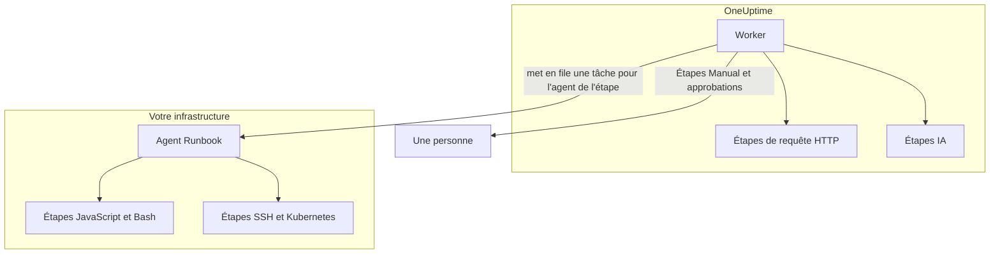

# Configuration & sécurité des runbooks

Voici la référence pour les opérateurs et les responsables de la sécurité : où s'exécute chaque type d'étape, les limites et les délais auxquels une étape est soumise, qui peut faire quoi, et comment les runbooks sont durcis.

:::cards
- [Où s'exécute chaque type d'étape](#où-sexécute-chaque-type-détape): Le Worker, un agent Runbook ou une personne.
- [Plafonds de sortie et délais](#plafonds-de-sortie-et-délais): Chaque limite à laquelle une étape est soumise.
- [Autorisations](#autorisations): Les autorisations granulaires, les trois rôles de runbook, et les runbooks qu'un rôle atteint.
- [Notes de durcissement](#notes-de-durcissement): Bac à sable, accès réseau et authentification des agents Runbook.
:::

## Où s'exécute chaque type d'étape

| Type d'étape | S'exécute sur | Comment |
| --- | --- | --- |
| Manual | Une personne | L'exécution attend que quelqu'un termine ou ignore l'étape. |
| JavaScript | Un agent Runbook | Dans un bac à sable `isolated-vm`. |
| HTTP request | Le Worker OneUptime | Un appel HTTP sortant. |
| Bash | Un agent Runbook | `bash -c <script>`. |
| SSH | Un agent Runbook | Une connexion SSH, avec un [identifiant](/docs/runbooks/credentials). |
| Kubernetes | Un agent Runbook | Un appel au serveur API du cluster, avec un identifiant. |
| AI | Le Worker OneUptime | Un appel au fournisseur LLM du projet. |

## Comment les étapes des agents Runbook sont envoyées

Les étapes JavaScript, Bash, SSH et Kubernetes **ne s'exécutent jamais sur le Worker OneUptime**. Elles sont envoyées comme tâches à un [agent de runbook](/docs/runbooks/agents) précis : un petit processus que vous installez sur un hôte de votre propre infrastructure.

Le modèle d'envoi :

1. L'auteur de l'étape de runbook choisit un agent Runbook dans la liste déroulante en écrivant l'étape.
2. Quand l'étape s'exécute, le Worker insère une ligne dans `RunnerJob` dont `targetAgentId` vaut l'ID de cet agent et dont le statut est `Pending`.
3. Cet agent précis (et lui seul) prend la tâche en charge de façon atomique, l'exécute localement — Bash via `bash -c <script>`, JavaScript dans un bac à sable `isolated-vm`, SSH et Kubernetes avec l'identifiant de l'étape — et renvoie le résultat.
4. Le Worker reprend le runbook avec le résultat.

Il n'existe plus d'indicateur d'environnement `RUNBOOK_BASH_ENABLED`. Le fonctionnement de ces étapes dans un déploiement dépend uniquement de la présence, dans le projet, d'un agent Runbook connecté avec **Exécute les runbooks** activé.

## Plafonds de sortie et délais

| Limite | Valeur | S'applique à |
| --- | --- | --- |
| Sortie par étape | **50 Ko**. Une sortie plus longue est coupée avec un marqueur. | Chaque étape automatisée |
| Délai d'exécution | **30 secondes** par défaut | Étapes JavaScript, Bash, SSH et Kubernetes |
| Délai de la requête | **30 secondes** par défaut | Étapes de requête HTTP |
| Délai de prise en charge | **2 minutes** par défaut : combien de temps le Worker attend que l'agent choisi prenne la tâche en charge avant de la faire échouer | Étapes JavaScript, Bash, SSH et Kubernetes |
| Plage des délais | **1 seconde à 1 heure** | Chaque délai |
| Attente d'une personne | Aucune limite | Étapes Manual et approbations |

Réglez les délais étape par étape sur la page **Étapes** du runbook ; laissez un champ vide pour garder la valeur par défaut. Une valeur hors plage est ramenée dans la plage à l'exécution de l'étape, pour qu'une configuration mal saisie ne puisse ni désactiver le délai ni occuper indéfiniment un emplacement du Worker.

## Autorisations

Les autorisations des runbooks se trouvent dans le groupe d'autorisations `Runbook` :

- `CreateRunbook`, `EditRunbook`, `DeleteRunbook`, `ReadRunbook` — gérer les modèles de runbook.
- `CreateRunbookExecution`, `EditRunbookExecution`, `DeleteRunbookExecution`, `ReadRunbookExecution` — lancer, cocher, supprimer et lire les exécutions.
- `CreateRunbookRule`, `EditRunbookRule`, `DeleteRunbookRule`, `ReadRunbookRule` — gérer les règles de déclenchement automatique.
- `CreateRunner`, `EditRunner`, `DeleteRunner`, `ReadRunner` — gérer les agents Runbook qui exécutent les étapes dans votre propre infrastructure. (Elles s'appelaient `*RunbookAgent` avant le renommage en Runner ; les attributions existantes ont été migrées, il n'y a donc rien à réattribuer.)
- `RunbookAdmin`, `RunbookMember`, `RunbookViewer` (rôles) — `RunbookAdmin` construit les runbooks, leurs règles et les agents sur lesquels ils tournent, et les exécute. `RunbookMember` ouvre les runbooks et leurs exécutions et les exécute — il lance une exécution, termine ou ignore ses étapes et l'annule — mais ne crée, ne modifie ni ne supprime aucun runbook ni aucun agent. `RunbookViewer` lit les runbooks et leurs exécutions et n'exécute rien. `RunbookAdmin` regroupe toutes les autorisations granulaires ci-dessus.

Un rôle exécute les runbooks que sa portée atteint. Une attribution `RunbookMember`, `RunbookAdmin` ou `ProjectMember` limitée à certaines étiquettes lance et fait avancer les exécutions des runbooks qui portent ces étiquettes, une attribution limitée à **Owned** celles des runbooks dont son équipe est propriétaire, et le blocage d'une étiquette par une équipe lui retire ces runbooks. `CreateRunbookExecution` et `EditRunbookExecution` portent sur les exécutions, qui n'ont pas d'étiquettes : elles atteignent donc tous les runbooks du projet. L'approbation d'une suggestion de remédiation qui lance un runbook est vérifiée de la même façon.

Les identifiants et les secrets sont en dehors de `RunbookAdmin`. Les gérer demande `ProjectOwner` ou `ProjectAdmin`, ou les autorisations `CreateRunbookCredential`, `EditRunbookCredential`, `DeleteRunbookCredential`, `ReadRunbookCredential` et `CreateRunbookSecret`, `EditRunbookSecret`, `DeleteRunbookSecret`, `ReadRunbookSecret`. Voir [Identifiants de runbook](/docs/runbooks/credentials).

Les règles de propriétaire et d'étiquettes sous **Runbooks → Paramètres** sont elles aussi en dehors de `RunbookAdmin`. Les gérer demande `ProjectOwner` ou `ProjectAdmin`, ou les autorisations `CreateRunbookOwnerRule` et `CreateRunbookLabelRule` avec leurs équivalents de modification, de suppression et de lecture.

Pour la façon dont les rôles et les autorisations granulaires se combinent, voir [Utilisateurs, équipes et autorisations](/docs/permissions/index).

## File & worker

Les exécutions de runbook tournent dans la file BullMQ `Runbook`. Chaque processus Worker exécute jusqu'à 25 exécutions à la fois ; ce nombre est fixé dans le code, pas par une variable d'environnement.

Quand une étape manuelle est cochée via l'API, l'exécution est remise en file pour continuer à l'étape suivante. Elle attend en `Scheduled` qu'un Worker la reprenne, et une exécution en file n'échoue jamais pour cause d'attente.

## Notes de durcissement

- **JavaScript, Bash, SSH et Kubernetes** s'exécutent sur un hôte d'agent Runbook que vous contrôlez, pas sur le Worker OneUptime. JavaScript tourne dans un isolat `isolated-vm` distinct avec 128 Mo de mémoire et sans accès au système de fichiers ni aux processus de l'agent ; il peut faire des requêtes HTTP avec `axios`, mais les requêtes vers les réseaux privés et les adresses de bouclage et de lien local sont refusées. Bash s'exécute via `bash -c`, avec un délai appliqué sur l'agent.
- **Les étapes HTTP** utilisent une validation de statut permissive : une réponse 4xx ou 5xx est enregistrée comme étape en échec au lieu de lever une exception, et la sortie capturée reflète ce que le service distant a vraiment renvoyé. Les redirections ne sont pas suivies. Le Worker n'appelle jamais d'adresses de bouclage ou de lien local, comme un point de métadonnées cloud ; sur OneUptime Cloud, il refuse aussi les adresses de réseau privé, et un OneUptime auto-hébergé les refuse avec `DATA_SOURCE_BLOCK_PRIVATE_ADDRESSES=true`.
- **Les étapes IA** ne voient jamais les notes privées d'incident ni les messages Slack et Microsoft Teams, et la sortie des étapes précédentes est analysée à la recherche de secrets, qui sont masqués avant d'atteindre le modèle. Les images intégrées et les longues données encodées sont laissées hors du prompt. Voir [AI](/docs/runbooks/authoring#ai).
- **L'authentification des agents Runbook** se fait par ID et clé secrète, définis sur le conteneur de l'agent comme variables d'environnement. Côté serveur, l'identité de référence de l'agent provient de la ligne de base de données correspondant à l'ID et à la clé présentés : un client ne peut pas se faire passer pour un autre agent, même avec une clé compromise.
- **Les identifiants et les secrets** sont chiffrés au repos, jamais renvoyés par l'API, et remis uniquement aux agents auxquels ils sont attribués, quand ceux-ci prennent une étape en charge.

## Tables de la base de données

| Table | Ce qu'elle contient |
| --- | --- |
| `Runbook` | Le modèle : nom, slug, description, `isEnabled`, étiquettes et les étapes en JSON. |
| `RunbookExecution` | Une ligne par exécution, avec les clés étrangères facultatives `incidentId`, `alertId` et `scheduledMaintenanceId` et un tableau JSON `stepExecutions` qui fige les étapes et l'état de chacune. |
| `RunbookRule` | Les règles de déclenchement automatique, avec un discriminant `triggerEntityType` (Incident, Alert, ScheduledMaintenance), une relation plusieurs-à-plusieurs vers les runbooks à lancer, et ce sur quoi elles portent : une colonne JSON `criteria` (les conditions) plus des liens plusieurs-à-plusieurs vers les moniteurs, les gravités d'incident, les gravités d'alerte, les étiquettes et les étiquettes de moniteur, ainsi que des modèles de titre, de description, de nom de moniteur et de description de moniteur. |
| `Runner` | Une ligne par agent Runbook installé : nom, clé secrète, `lastAlive`, `connectionStatus`, informations d'hôte et capacités. |
| `RunnerJob` | Une ligne par étape envoyée à un agent Runbook : `targetAgentId` (l'agent choisi par l'auteur de l'étape), type d'étape, script ou charge utile, statut (`Pending` → `Claimed` → `Running` → `Succeeded`, `Failed`, `TimedOut` ou `Cancelled`), échéance de prise en charge, bail, sortie et code de sortie. |
| `RunbookCredential` | Les identifiants SSH et Kubernetes, avec leurs champs secrets chiffrés, et les agents auxquels ils sont attribués. |
| `RunbookSecret` | Les secrets de runbook, chiffrés, et les agents qui peuvent les recevoir. |

## Conseils d'exploitation

- **Assurez-vous que l'agent Runbook choisi pour une étape est en bonne santé.** Si vous avez besoin de redondance, faites tourner un second agent et répartissez vos étapes entre les deux, ou gardez un runbook de secours qui vise l'autre agent.
- **Capturez des URL, pas des blobs.** Si une étape produit plus de quelques Ko de sortie, écrivez-la dans un stockage objet ou votre pile de journalisation et renvoyez l'URL.
- **L'idempotence compte.** Une étape de requête HTTP ou IA s'exécute de nouveau si le Worker redémarre au milieu de l'étape et que l'exécution reprend. Une étape sur un agent Runbook est envoyée au plus une fois par exécution, mais un script peut s'être exécuté en partie avant un échec, et vous pouvez relancer le runbook. Concevez des étapes qui peuvent être rejouées sans risque.

## Prochaines étapes

:::cards
- [Agents de runbook](/docs/runbooks/agents): Installer, exploiter et dépanner les agents Runbook.
- [Identifiants de runbook](/docs/runbooks/credentials): Accès SSH et Kubernetes gérés, et secrets pour les scripts.
- [Utilisateurs, équipes et autorisations](/docs/permissions/index): Comment les rôles, les étiquettes et les équipes décident qui exécute quoi.
:::
