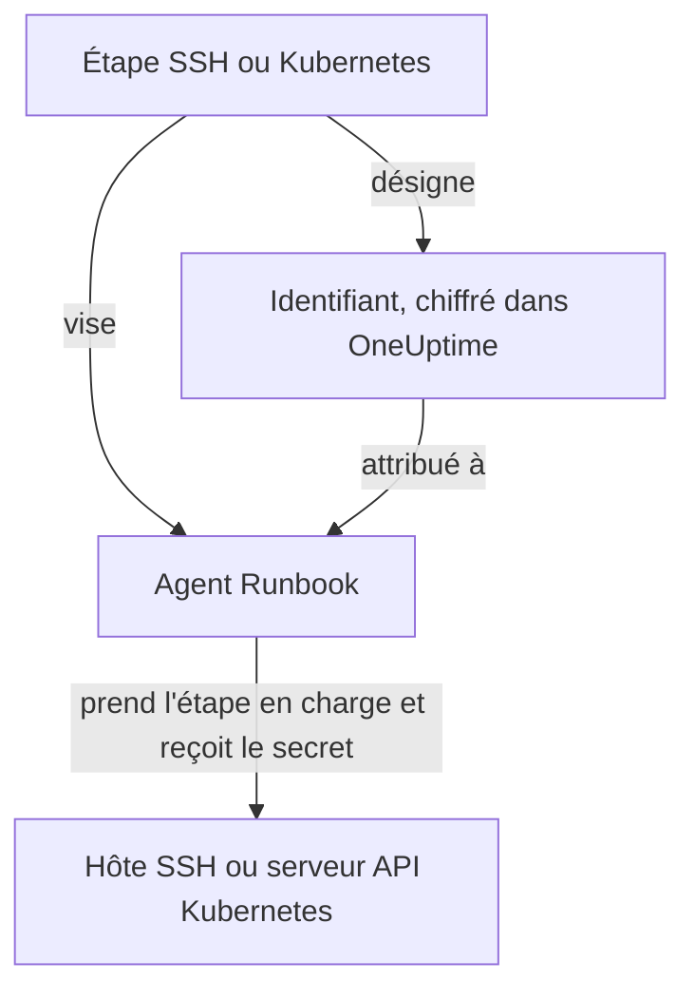

# Identifiants de runbook

Un identifiant est le moyen pour un runbook d'atteindre quelque chose qui n'est **pas** l'hôte même de l'agent Runbook — un serveur en SSH, ou un cluster Kubernetes. Sans lui, « redémarrer le service » revient à écrire un script shell et à déposer à la main une clé ou un kubeconfig sur l'hôte de l'agent, où il reste sur le disque hors du contrôle d'OneUptime. Un identifiant, c'est ce même accès sous forme d'objet géré : chiffré au repos, attribué à des agents précis et désigné par son nom depuis une étape.

Gérez-les sous **Runbooks → Agents de runbook → Identifiants**.

:::cards
- [Créer un identifiant](#créer-un-identifiant): Son accès, et les agents Runbook qui peuvent l'utiliser.
- [Moindre privilège de l'autre côté](#moindre-privilège-de-lautre-côté): Limiter ce que la clé ou le jeton peut faire.
- [Secrets pour les scripts](#secrets-pour-les-scripts): Donner un mot de passe ou un jeton à un script Bash ou JavaScript.
:::

## Comment un identifiant est utilisé



Une étape SSH ou Kubernetes désigne un identifiant et un agent Runbook. Quand cet agent prend l'étape en charge, OneUptime vérifie que l'identifiant lui est attribué, déchiffre le secret et le remet uniquement dans la réponse à cette prise en charge. Le secret n'est jamais stocké sur la tâche et n'est jamais lisible via l'API.

## Avant de commencer

- **Un rôle qui gère les identifiants.** Project Owner et Project Admin, ou toute personne ayant l'autorisation **Create Runbook Credential**. Le rôle Runbook Admin ne l'inclut pas. Attribuer un identifiant SSH à un agent qui exécute les commandes d'OneUptime AI demande aussi **Read Runbook Credential** ; voir [Agents Runbook qui exécutent les commandes d'OneUptime AI](#agents-runbook-qui-exécutent-les-commandes-doneuptime-ai).
- **Une offre qui les inclut.** Sur OneUptime Cloud, les identifiants de runbook demandent l'offre **Growth** ou supérieure.
- **Un [agent Runbook](/docs/runbooks/agents)** qui joint l'hôte ou le serveur API du cluster sur le réseau.

## Créer un identifiant

:::steps
### Ouvrir les identifiants

Ouvrez **Runbooks → Agents de runbook → Identifiants** et cliquez sur **Créer : Identifiant de runbook**.

### Le nommer et choisir son type

À l'étape **Identifiant**, saisissez un **Nom**, par exemple `prod-cluster`, une **Description** facultative et le **Type** : **SSH** ou **Kubernetes**. Le type ne peut pas être modifié ensuite ; créez plutôt un nouvel identifiant.

### Saisir l'accès

:::tabs
@tab SSH
À l'étape **Hôte SSH**, saisissez le **Nom d'hôte**, le **Port** (22 s'il est vide) et le **Nom d'utilisateur**. À l'étape **Authentification SSH**, collez une **Private Key (PEM)**, avec sa **Private Key Passphrase** si elle en a une, ou saisissez un **Mot de passe** pour un hôte sans accès par clé. Une clé est la meilleure option quand vous avez le choix.
@tab Kubernetes
À l'étape **Kubernetes**, saisissez l'**URL du serveur API**, par exemple `https://10.0.0.1:6443`, le **Service Account Token**, et le **Certificat CA (PEM)** pour que l'agent Runbook puisse vérifier le serveur API. Ne laissez la CA vide que si le serveur API présente un certificat auquel l'agent fait déjà confiance.
:::

### L'attribuer à des agents Runbook

À l'étape **Agents de runbook**, choisissez les agents qui peuvent utiliser l'identifiant, puis cliquez sur **Créer : Identifiant de runbook**. Un identifiant attribué à aucun agent ne peut être utilisé par aucune étape.

### L'utiliser dans une étape

Dans une [étape SSH ou Kubernetes](/docs/runbooks/authoring#types-détapes), choisissez l'un de ces agents, puis l'identifiant sous **Identifiant**. Une étape ne propose que des identifiants de son propre type, et enregistrer une étape qui désigne un identifiant demande l'autorisation de lire les identifiants de runbook.
:::

## Ce qui est stocké

| Type | Champs |
| --- | --- |
| SSH | Nom d'hôte, port (22 par défaut), nom d'utilisateur, et soit une clé privée PEM (avec une phrase secrète facultative), soit un mot de passe. |
| Kubernetes | URL du serveur API, un jeton de compte de service et le certificat de l'autorité de certification du cluster. |

## Les valeurs secrètes sont en écriture seule

Les clés privées, phrases secrètes, mots de passe et jetons de compte de service sont chiffrés au repos et l'API **ne les renvoie jamais** — ni au tableau de bord, ni à un workflow, ni à un export. Le tableau peut vous montrer ce qu'*est* un identifiant sans jamais montrer ce qu'il contient.

Il n'y a donc pas d'« afficher » pour une valeur secrète, seulement « remplacer » : saisir de nouveau une valeur est la façon de la faire tourner. Si vous avez perdu l'original, émettez une nouvelle clé sur le système cible et mettez à jour l'identifiant.

## Attribuer un identifiant à des agents Runbook

Un identifiant n'est utilisable que par les agents Runbook auxquels vous l'attribuez, et une étape doit viser l'un de ces agents. Si une étape désigne un identifiant qui n'est pas attribué à son agent, l'étape **échoue au lieu de s'exécuter** — un agent qui ne fait rien en silence ressemble exactement à un agent qui a réussi.

L'attribution est la frontière d'accès, alors gardez-la étroite : un agent qui ne fait jamais que redémarrer un cluster n'a pas besoin de la clé SSH de vos hôtes de base de données.

### Agents Runbook qui exécutent les commandes d'OneUptime AI

Sur un agent où **Exécute les commandes de remédiation IA** est activé, OneUptime AI choisit parmi les identifiants SSH attribués à l'agent pour les commandes qu'il y exécute. Un identifiant SSH n'atteint donc un tel agent que par une personne qui peut lire les identifiants de runbook (**Read Runbook Credential**, ou un Project Owner ou un Project Admin), selon ce qui est enregistré en premier :

- **Attribuer l'identifiant.** Créer un identifiant SSH avec un tel agent, ou ajouter un tel agent à un identifiant, demande cette autorisation. Sans elle, l'enregistrement est refusé et nomme l'agent : attribuez l'identifiant à des agents qui n'exécutent pas de commandes de remédiation IA, ou demandez à une personne qui a l'autorisation de l'attribuer.
- **Activer l'interrupteur.** Activer **Exécute les commandes de remédiation IA** pour un agent qui détient des identifiants SSH demande la même autorisation.

Retirer des agents d'un identifiant, enregistrer un identifiant avec les agents qu'il a déjà, et les identifiants Kubernetes ne demandent rien de plus : les commandes kubectl d'OneUptime AI s'exécutent avec l'identifiant lié à leur cluster. Les attributions d'identifiants et l'activation de l'interrupteur par une personne sans cette autorisation sont enregistrées une à la fois dans un projet, pour que les deux ne puissent pas réussir leurs vérifications ensemble ; un enregistrement qui arrive pendant qu'un autre est en cours l'attend, et si cela prend trop longtemps il est refusé avec *Try again in a moment*. Enregistrez de nouveau.

Les étapes d'un workflow agissent en tant que Project Admin, mais ne se voient pas prêter la lecture des identifiants de runbook d'un Project Admin : une étape ne l'a que si la personne qui a enregistré en dernier les étapes du workflow l'a. Voir [Ce que peuvent faire les étapes de workflow](/docs/workflows/configuration#ce-que-les-étapes-dun-workflow-peuvent-faire).

## Moindre privilège de l'autre côté

OneUptime ne peut pas restreindre ce que votre identifiant a le droit de faire sur le système cible — c'est le rôle du système cible, et cela vaut la peine :

- **SSH** — préférez une clé à un mot de passe, ne donnez à l'utilisateur que les commandes dont il a besoin (une commande forcée ou un shell restreint quand c'est possible), et ne réutilisez pas la clé personnelle d'un administrateur.
- **Kubernetes** — liez le compte de service à un Role qui autorise `patch` exactement sur les charges de travail que touchent vos runbooks, exactement dans les espaces de noms où elles tournent. **Restart workload** modifie la charge de travail elle-même, et **Scale workload** modifie sa sous-ressource `scale` : rien de plus n'est nécessaire.

Par exemple, un compte de service qui peut redémarrer et mettre à l'échelle un Deployment, et rien d'autre :

```yaml title="oneuptime-runbooks-rbac.yaml"
apiVersion: v1
kind: ServiceAccount
metadata:
  name: oneuptime-runbooks
  namespace: checkout
---
apiVersion: rbac.authorization.k8s.io/v1
kind: Role
metadata:
  name: oneuptime-runbooks
  namespace: checkout
rules:
  # Restart workload: patches the Deployment's pod template.
  - apiGroups: ["apps"]
    resources: ["deployments"]
    resourceNames: ["checkout-api"]
    verbs: ["patch"]
  # Scale workload: patches the Deployment's scale subresource.
  - apiGroups: ["apps"]
    resources: ["deployments/scale"]
    resourceNames: ["checkout-api"]
    verbs: ["patch"]
---
apiVersion: rbac.authorization.k8s.io/v1
kind: RoleBinding
metadata:
  name: oneuptime-runbooks
  namespace: checkout
subjects:
  - kind: ServiceAccount
    name: oneuptime-runbooks
    namespace: checkout
roleRef:
  apiGroup: rbac.authorization.k8s.io
  kind: Role
  name: oneuptime-runbooks
```

Pour un StatefulSet ou un DaemonSet, utilisez plutôt `statefulsets` ou `daemonsets`. Un DaemonSet ne peut pas être mis à l'échelle, il n'a donc pas besoin de règle `scale`.

## Secrets pour les scripts

Les étapes Bash et JavaScript n'ont pas de champ **Identifiant**. Pour donner à un script un mot de passe, un jeton ou une clé d'API sans l'écrire dans le runbook, stockez-le comme **secret de runbook**. Les secrets se gèrent sous **Runbooks → Paramètres → Secrets**, par les Project Owners et les Project Admins ou avec l'autorisation **Create Runbook Secret**.

:::steps
### Créer le secret

Cliquez sur **Créer : Secret de runbook**. À l'étape **Secret**, saisissez un **Nom** (lettres, chiffres, tirets et traits de soulignement), une **Description** facultative et la **Valeur du secret**. À l'étape **Accès**, choisissez les agents sous **Agents Runbook ayant accès à ce secret**.

### L'utiliser dans un script

Écrivez `{{runbookSecrets.NAME}}` là où la valeur doit aller :

```bash
curl -s -X POST \
  -H "Authorization: Bearer {{runbookSecrets.CDN_API_TOKEN}}" \
  "https://api.cdn.example.com/v1/purge"
```

Quand un agent auquel le secret est attribué prend l'étape en charge, il reçoit le script avec la valeur insérée.
:::

Comme les champs secrets d'un identifiant, la valeur d'un secret est chiffrée au repos et jamais renvoyée par l'API : **Mettre à jour la valeur secrète** la remplace. Sur OneUptime Cloud, les secrets de runbook demandent aussi l'offre **Growth** ou supérieure.

| | Identifiant | Secret de runbook |
| --- | --- | --- |
| Utilisé par | Les étapes SSH et Kubernetes | Les scripts Bash et JavaScript |
| Contient | Un hôte et sa clé, ou l'URL et le jeton d'un cluster | N'importe quelle valeur unique |
| Géré sous | **Runbooks → Agents de runbook → Identifiants** | **Runbooks → Paramètres → Secrets** |
| Atteint l'agent Runbook | Dans la réponse à la prise en charge d'une étape qui le désigne | Inséré dans le script de l'étape qu'il prend en charge |
| Relisible via l'API | Ses champs non secrets seulement | Jamais sa valeur |

## Qui peut les voir

Créer, modifier et supprimer des identifiants demande les autorisations sur les identifiants de runbook (ou Project Owner/Admin). Lire un identifiant n'en montre que les champs non secrets.

Notez que la **clé d'agent** d'un agent Runbook équivaut aux identifiants qui lui sont attribués : tout ce qui détient la clé peut prendre du travail en charge au nom de cet agent et recevoir des identifiants. C'est pourquoi les clés d'agent ne sont lisibles que par les Project Owners, les Project Admins et les Runbook Admins — traitez-les comme vous traiteriez les identifiants eux-mêmes.

## Prochaines étapes

:::cards
- [Rédiger un runbook](/docs/runbooks/authoring): Écrire les étapes SSH et Kubernetes qui utilisent un identifiant.
- [Agents de runbook](/docs/runbooks/agents): Installer l'agent Runbook auquel un identifiant est attribué.
- [Configuration & sécurité des runbooks](/docs/runbooks/configuration): Autorisations et durcissement de toute la pile des runbooks.
:::
