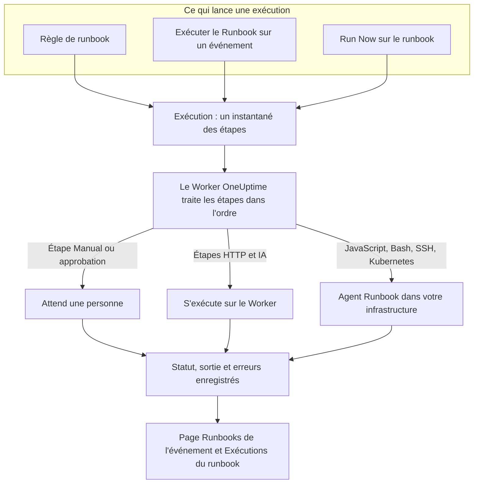

# Vue d'ensemble des Runbooks

Un runbook est une procédure de réponse réutilisable : une liste ordonnée d'étapes manuelles et automatisées que vous exécutez sur un incident, une alerte ou un événement de maintenance planifiée. Il transforme le fil « on fait quoi maintenant ? » en une checklist que toute personne d'astreinte peut suivre à 3 h du matin, avec les scripts, les appels d'API et les approbations déjà écrits. Les runbooks s'adressent aux ingénieurs d'astreinte qui répondent aux incidents et aux équipes plateforme qui automatisent cette réponse.

:::cards
- [Rédiger un runbook](/docs/runbooks/authoring): Créer un runbook et écrire ses étapes.
- [Règles de runbook](/docs/runbooks/rules): Démarrer des runbooks sur les nouveaux incidents, alertes et événements de maintenance.
- [Exécuter un runbook](/docs/runbooks/running): Lancer une exécution, terminer et approuver ses étapes, l'annuler.
- [Agents de runbook](/docs/runbooks/agents): Installer l'agent Runbook qui exécute vos scripts dans votre propre infrastructure.
:::

## Comment un runbook s'exécute



Chaque exécution d'un runbook est une **exécution**. Au démarrage, les étapes du runbook y sont copiées, et OneUptime les traite dans l'ordre. Une étape Manual, ou une étape qui exige une approbation, met l'exécution en pause jusqu'à ce que quelqu'un agisse.

Les étapes HTTP et IA s'exécutent sur le Worker OneUptime. Les étapes JavaScript, Bash, SSH et Kubernetes s'exécutent sur un [agent Runbook](/docs/runbooks/agents) que vous installez dans votre propre infrastructure, de sorte que vos scripts ne s'exécutent jamais sur les serveurs d'OneUptime. Le statut, la sortie et le message d'erreur de chaque étape sont enregistrés sur l'exécution, qui reste attachée à l'incident, à l'alerte ou à l'événement pour lequel elle a tourné.

## Concepts clés

| Terme | Signification |
| --- | --- |
| **Runbook** | Le modèle. Une procédure nommée et réutilisable, avec une liste ordonnée d'étapes et un interrupteur **Exécuter ce runbook**. |
| **Étape** | Un élément d'un runbook. Elle a un type (Manual, JavaScript, HTTP request, Bash, SSH, Kubernetes ou AI), un titre, une description et des réglages propres à son type. |
| **Règle de runbook** | Une règle qui attache automatiquement un ou plusieurs runbooks aux incidents, alertes ou événements de maintenance planifiée qui remplissent ses conditions : leurs moniteurs, leur gravité, leurs étiquettes, les étiquettes de leurs moniteurs, leur titre ou leur description. |
| **Exécution** | Une exécution d'un runbook. Elle est créée quand une règle se déclenche, quand quelqu'un clique sur **Exécuter le Runbook** sur un événement, ou quand quelqu'un clique sur **Run Now** sur le runbook lui-même. Elle contient un instantané des étapes ainsi que le statut et la sortie de chaque étape. |
| **Instantané** | La copie figée des étapes du runbook qui vit sur chaque exécution. Vous pouvez modifier le runbook plus tard sans réécrire l'historique des exécutions passées. |
| **Agent Runbook** | Un petit agent que vous faites tourner sur un hôte de votre propre infrastructure. Il exécute les étapes JavaScript, Bash, SSH et Kubernetes qui le désignent. Aussi appelé Runner. |
| **Identifiant** | Un accès SSH ou Kubernetes géré, utilisé par les étapes SSH et Kubernetes. Chiffré au repos et remis uniquement aux agents Runbook auxquels vous l'attribuez. |
| **Secret** | Une valeur unique, comme un jeton d'API, qu'un script Bash ou JavaScript utilise sous la forme `{{runbookSecrets.NAME}}`. Chiffré au repos et remis uniquement aux agents Runbook auxquels vous l'attribuez. |

## Types d'étapes

Choisissez le type qui convient à chaque étape. [Rédiger un runbook](/docs/runbooks/authoring) détaille les réglages de chaque type.

| Type d'étape | S'exécute sur | À utiliser quand… | Exemple |
| --- | --- | --- | --- |
| **Manual** | Une personne | Un humain doit vérifier quelque chose, trancher, ou agir là où OneUptime ne le peut pas. | « Confirmer que le trafic est passé dans la région secondaire. » |
| **JavaScript** | Un agent Runbook | Vous avez besoin d'un petit calcul isolé, dans un bac à sable. | Calculer le retard de réplication et décider de continuer ou non. |
| **HTTP request** | Le Worker OneUptime | Vous appelez une API existante : un fournisseur cloud, PagerDuty, un webhook Slack, votre propre service. | `POST` vers votre orchestrateur de bascule. |
| **Bash** | Un agent Runbook | Vous avez besoin de commandes shell sur votre propre infrastructure. | Lancer `kubectl rollout restart` ou un script de reprise. |
| **SSH** | Un agent Runbook | Vous avez besoin d'une commande sur un hôte distant, avec un identifiant SSH géré. | Redémarrer un service sur un serveur web. |
| **Kubernetes** | Un agent Runbook | Vous devez redémarrer ou mettre à l'échelle un Deployment, un StatefulSet ou un DaemonSet. | Redémarrer `checkout-api` dans `production`. |
| **AI** | Le Worker OneUptime | Vous voulez une analyse, un résumé ou un avis en cours d'exécution, fourni par le fournisseur LLM de votre projet. | « Examine les diagnostics ci-dessus. La bascule est-elle sûre ? » |

Un runbook peut tous les mélanger. La force des runbooks est d'entremêler des vérifications humaines, de l'automatisation et de l'analyse par IA.

## Ce qui lance une exécution

| Comment | Où | L'exécution est attachée à |
| --- | --- | --- |
| Une règle de runbook | **Incidents**, **Alertes** ou **Maintenance planifiée** → **Règles** → **Règles de runbook** | Le nouvel incident, la nouvelle alerte ou le nouvel événement |
| **Exécuter le Runbook** | La page **Runbooks** d'un incident, d'une alerte ou d'un événement de maintenance planifiée | Cet événement |
| **Run Now** | La page **Vue d'ensemble** du runbook | Rien : une exécution ponctuelle |
| Une règle de remédiation automatique | Voir [AI SRE](/docs/ai/ai-sre) | L'incident ou l'alerte |

Un runbook dont l'interrupteur **Exécuter ce runbook** est désactivé, sur sa page **Paramètres**, n'est lancé par aucun de ces moyens. Les exécutions déjà démarrées continuent.

## Où se trouvent les runbooks dans le tableau de bord

Runbooks se trouve sous **Produits**, dans le groupe **Tableaux de bord et automatisation**.

| Page | Ce que vous y faites |
| --- | --- |
| **Produits → Runbooks** | Parcourir, créer et ouvrir des runbooks. |
| Les **Étapes** d'un runbook | Écrire et réordonner ses étapes, puis **Save Steps**. |
| La **Vue d'ensemble** d'un runbook | Voir sa dernière exécution et ses résultats, et cliquer sur **Run Now**. |
| Les **Exécutions** d'un runbook | Toutes les exécutions de ce runbook, filtrées par statut ou date de début. |
| Les **Propriétaires** d'un runbook | Ajouter les personnes et les équipes qui en sont responsables. |
| Les **Paramètres** d'un runbook | Désactiver **Exécuter ce runbook** sans supprimer le runbook. |
| **Runbooks → Exécutions** | Toutes les exécutions de tous les runbooks du projet. |
| **Runbooks → Agents de runbook** et **Runbooks → Agents de runbook → Identifiants** | Installer des [agents Runbook](/docs/runbooks/agents) et gérer les [identifiants](/docs/runbooks/credentials). |
| **Runbooks → Paramètres** | Gérer les [secrets](/docs/runbooks/credentials#secrets-pour-les-scripts) des scripts, ainsi que les **Règles de propriétaire** et les **Règles d'étiquettes** qui ajoutent des propriétaires et des étiquettes aux nouveaux runbooks. |
| **Incidents / Alertes / Maintenance planifiée → Règles → Règles de runbook** | Créer les règles qui lancent des runbooks automatiquement. |
| Un incident, une alerte ou un événement de maintenance → **Runbooks** | Voir les exécutions qui y sont attachées, et cliquer sur **Exécuter le Runbook** pour en lancer une. |

## Un exemple complet

Supposons que chaque incident dont le titre contient « db-primary » doive lancer un runbook de bascule de base de données en cinq étapes.

:::steps
### Créer le runbook

Sous **Runbooks**, cliquez sur **Créer : Runbook** et nommez-le « DB primary failover ». Ouvrez-le, allez dans **Étapes**, ajoutez ces étapes, puis cliquez sur **Save Steps** :

| # | Type | Titre |
| --- | --- | --- |
| 1 | JavaScript | Relever le retard de réplication avant la bascule |
| 2 | Manual | Confirmer dans le tableau de bord DBA que le réplica est sain |
| 3 | HTTP request | `POST` vers l'orchestrateur de bascule |
| 4 | Manual | Vérifier que les écritures vont vers le nouveau primaire |
| 5 | HTTP request | Publier la fin d'alerte dans `#db-incidents` sur Slack |

### Ajouter une règle

Sous **Incidents → Règles → Règles de runbook**, créez une règle avec une condition et le runbook à lancer :

```text
Conditions:  Incident Title starts with db-primary
Runbooks:    [DB primary failover]
```

### La laisser tourner

Un moniteur ouvre l'incident `INC-4821 · db-primary connection timeout`. La règle correspond et une exécution démarre :

- L'étape 1 (JavaScript) s'exécute sur l'agent Runbook que vous avez choisi pour elle. Sa valeur de retour, par exemple `{ lagMs: 412 }`, est capturée.
- L'étape 2 (Manual) met l'exécution en pause, qui affiche **En attente de votre part**. La personne d'astreinte vérifie le tableau de bord et clique sur **Marquer comme terminé**.
- L'étape 3 (HTTP request) s'exécute, et la réponse au `POST` est capturée.
- L'étape 4 (Manual) remet l'exécution en pause jusqu'à ce que quelqu'un la termine.
- L'étape 5 (HTTP request) s'exécute, et l'exécution passe à **Achevé**.

### L'examiner

L'exécution reste sur la page **Runbooks** de l'incident. Quand vous rédigez le postmortem, la sortie, l'erreur et le minutage de chaque étape sont à un clic.
:::

## Cas d'usage courants

- **Bascule de base de données** : capturer l'état avec JavaScript, demander au DBA d'astreinte de confirmer la santé du réplica (Manual), appeler l'orchestrateur (HTTP request), confirmer le DNS (Manual), publier la fin d'alerte (HTTP request).
- **Vidage de cache** : une requête HTTP, puis une étape Manual « confirmer que le taux de succès du cache se rétablit ».
- **Incident avec impact client** : Manual « publier une mise à jour sur la page de statut », une requête HTTP pour prévenir l'équipe support, JavaScript pour récupérer la liste des comptes touchés.
- **Vérification avant une maintenance planifiée** : relever des métriques, confirmer la fenêtre de changement avec les parties prenantes (Manual), activer le mode maintenance sur le répartiteur de charge (HTTP request).
- **Diagnostiquer, puis corriger** : une étape Bash collecte des diagnostics, une étape IA avec **Exiger une approbation** les lit et recommande une correction, et une étape Kubernetes ne redémarre la charge de travail qu'après l'approbation d'une personne.
- **Hygiène systématique** : une règle sans condition qui capture l'état du système à chaque incident, pour le postmortem.

## Comment les runbooks s'intègrent au reste d'OneUptime

- Les **moniteurs** ouvrent des incidents et des alertes, et les **règles de runbook** les transforment en exécutions de runbook : détecter, déclencher, répondre, enregistrer.
- Les **[politiques d'astreinte](/docs/on-call/schedules)** décident qui est alerté. Les runbooks décident de ce que cette personne fait une fois réveillée.
- Les **[connexions d'espace de travail](/docs/workspace-connections/slack)** comme Slack et Microsoft Teams sont des cibles naturelles pour des étapes de requête HTTP qui publient des mises à jour.
- Les **[pages de statut](/docs/status-pages/index)** sont souvent mises à jour par une étape Manual d'un runbook orienté client.

## Prochaines étapes

:::cards
- [Rédiger un runbook](/docs/runbooks/authoring): Créer votre premier runbook et ses étapes.
- [Agents de runbook](/docs/runbooks/agents): Installer un agent Runbook avant d'écrire une étape JavaScript, Bash, SSH ou Kubernetes.
- [Règles de runbook](/docs/runbooks/rules): Lancer des runbooks automatiquement à la création d'incidents.
- [Configuration & sécurité des runbooks](/docs/runbooks/configuration): Limites, délais, autorisations et durcissement.
:::
