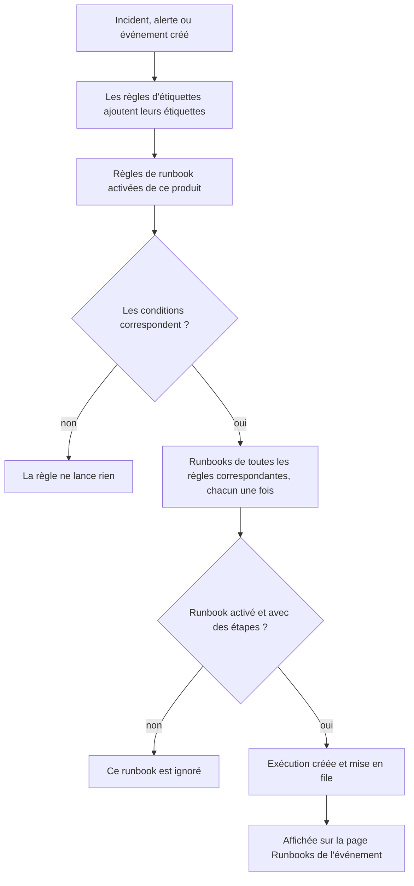

# Règles de runbook

Les règles de runbook lancent automatiquement des runbooks quand un **incident**, une **alerte** ou un **événement de maintenance planifiée** est créé, pour que personne n'ait à penser à les lancer au milieu d'une panne. Chaque produit a sa propre page de règles, dans son menu **Règles** :

- Incidents → Règles → **Règles de runbook**
- Alertes → Règles → **Règles de runbook**
- Maintenance planifiée → Règles → **Règles de runbook**

Les trois pages modifient le même type de règle, filtré sur les règles de ce produit.

:::cards
- [Créer une règle de runbook](#créer-une-règle-de-runbook): Quatre étapes : un nom, des conditions et les runbooks à lancer.
- [Conditions](#conditions): Chaque critère et chaque opérateur qu'une règle peut utiliser.
- [Logique de correspondance](#logique-de-correspondance): Plusieurs règles, conditions sur les moniteurs et règles d'étiquettes.
- [Exemples](#exemples): Trois règles à reprendre.
:::

## Comment une règle lance un runbook



Quand une règle se déclenche, pour chaque runbook qu'elle désigne :

1. Le runbook est chargé.
2. Ses étapes sont copiées en **instantané** sur une nouvelle exécution de runbook.
3. L'exécution est mise dans la file du worker des runbooks.
4. L'exécution est liée à l'entité source : elle apparaît sur la page **Runbooks** de l'incident, de l'alerte ou de l'événement de maintenance planifiée et dans la liste **Exécutions** du runbook.

Vous voyez toutes les exécutions, lancées par une règle ou non, sous **Runbooks → Exécutions**, filtrées par statut, runbook ou date de début.

## Avant de commencer

- **Un runbook qui peut s'exécuter.** Il lui faut au moins une étape, et **Exécuter ce runbook** activé, sur sa page **Paramètres**. Voir [Rédiger un runbook](/docs/runbooks/authoring).
- **L'autorisation de gérer les règles.** Project Owner, Project Admin et Runbook Admin créent des règles de runbook, comme toute personne ayant l'autorisation **Create Runbook Rule**.

## Créer une règle de runbook

:::steps
### Ouvrir les règles de runbook

Dans **Incidents**, **Alertes** ou **Maintenance planifiée**, ouvrez **Règles → Règles de runbook**, puis cliquez sur **Créer : Règle de runbook**.

### Nommer la règle

Sous **Informations de base**, saisissez un **Nom**, par exemple « Lancer la bascule DB pour les incidents de base de données », et si vous le souhaitez une **Description**.

### Ajouter des conditions

Sous **Critères de correspondance**, cliquez sur **Ajouter une condition**, choisissez un critère et un opérateur, puis saisissez ou choisissez la valeur. Ajoutez d'autres conditions si besoin et choisissez **Toutes requises** ou **Au moins une requise**. N'en ajoutez aucune pour lancer les runbooks à chaque nouvel événement de ce type.

### Choisir les runbooks

Sous **Runbooks**, choisissez un ou plusieurs **Runbooks à démarrer**, puis cliquez sur **Créer : Règle de runbook**. La règle est active dès sa création et apparaît dans la liste avec le statut **Activé**.
:::

## Anatomie d'une règle

| Champ | Rôle |
| --- | --- |
| **Nom** | Un libellé court et parlant pour la règle. |
| **Description** | Contexte facultatif pour l'équipe. |
| **Activé** | Activé pour une nouvelle règle. Désactivez-le dans le formulaire de modification de la règle pour la suspendre sans la supprimer. |
| **Conditions** | Ce que la règle fait correspondre, à l'étape **Critères de correspondance**. Laissez vide pour correspondre à chaque événement de son type. |
| **Runbooks à démarrer** | Un ou plusieurs runbooks à lancer quand la règle se déclenche. |

## Conditions

Chaque condition compare une caractéristique de l'incident, de l'alerte ou de l'événement de maintenance planifiée à une valeur que vous donnez. Une règle de runbook propose les mêmes critères que les autres règles de son produit : une règle de runbook d'incident fait correspondre ce que fait correspondre une règle de confidentialité ou d'astreinte d'incident.

| Critère | Ce qu'il vérifie |
| --- | --- |
| **Moniteurs** | Les moniteurs que touche l'incident ou l'événement de maintenance planifiée, ou le moniteur qui a levé l'alerte. |
| **Gravités d'incident** / **Gravités d'alerte** | La gravité de l'incident ou de l'alerte. Les événements de maintenance planifiée n'ont pas de gravité, donc leurs règles ne la proposent pas. |
| **Étiquettes d'incident** / **Étiquettes d'alerte** / **Étiquettes de l'événement** | Les étiquettes de l'incident, de l'alerte ou de l'événement lui-même, y compris celles que les règles d'étiquettes ont attachées à sa création. |
| **Étiquettes du moniteur** | Les étiquettes de ses moniteurs. Étiquetez vos moniteurs `production` ou `staging` pour lancer un runbook dans un seul environnement. |
| **Titre de l'incident** / **Titre de l'alerte** / **Titre de l'événement** | Son titre. |
| **Description de l'incident** / **Description de l'alerte** / **Description de l'événement** | Sa description. |
| **Nom du moniteur** / **Description du moniteur** | Le nom ou la description de ses moniteurs. |

Choisissez un opérateur pour chaque condition :

- Un critère de liste — **Moniteurs**, les gravités et les étiquettes — utilise **Contient l'un de**, **Contient tous les** ou **Ne contient aucun de** des valeurs choisies.
- Un critère de texte utilise **Contient** (le choix par défaut d'une nouvelle condition), **Ne contient pas**, **Égal à**, **Différent de**, **Commence par**, **Se termine par**, ou **Correspond au modèle** / **Ne correspond pas au modèle** pour une expression régulière insensible à la casse ou un joker `*`. Les comparaisons de texte ignorent la casse.

Avec deux conditions ou plus, choisissez **Toutes requises** (chaque condition doit être vraie) ou **Au moins une requise** (au moins une doit l'être).

## Logique de correspondance

- Une règle sans condition s'applique à chaque événement de son type (une règle globale « toujours exécuter »).
- Plusieurs règles peuvent correspondre au même événement. Chaque correspondance se déclenche, et l'union de leurs runbooks s'exécute : chaque runbook a sa propre exécution, et un runbook désigné par deux règles correspondantes s'exécute une seule fois.
- Les conditions sur les moniteurs sont vérifiées moniteur par moniteur. Avec **Toutes requises**, « **Nom du moniteur** contient `api` » et « **Étiquettes du moniteur** contient l'un de _Production_ » demandent un moniteur qui réponde aux deux, pas un moniteur pour chacune.
- Les règles de runbook s'exécutent après les règles d'étiquettes, si bien qu'une étiquette qu'une règle d'étiquettes attache à un nouvel incident, une nouvelle alerte ou un nouvel événement peut lancer un runbook.
- Un incident ou une alerte créé déjà résolu ne lance aucun runbook : il était terminé avant d'être enregistré. Voir [Déclaré déjà pris en compte ou résolu](/docs/incidents/declaring-incidents#déclaré-déjà-pris-en-compte-ou-résolu).
- Une condition sur la gravité d'un autre produit — **Gravités d'alerte** dans une règle d'incident, par exemple — ne peut jamais être vraie, donc l'API refuse de l'enregistrer.
- Les règles sont évaluées une seule fois, à la création de l'événement. Modifier plus tard le titre, la gravité ou les étiquettes d'un incident ne redéclenche pas les règles.

## Exemples

### Bascule DB pour les incidents de base de données

```text
Name:        Start DB failover for DB incidents
Trigger:     Incident
Conditions:  Incident Title matches pattern (?:^|\b)(db|database|postgres|mysql|mongo)
Runbooks:    [DB failover playbook, Notify DBA team]
```

Cela crée deux exécutions de runbook chaque fois qu'un incident dont le titre contient « db », « database », « postgres », etc. est créé.

### Seulement pour les incidents critiques de production

```text
Name:        Flush the CDN cache for critical production incidents
Trigger:     Incident
Conditions:  Match all
             Monitor Labels has any of Production
             Incident Severities has any of Critical
Runbooks:    [Flush CDN cache]
```

S'exécute pour un incident critique sur un moniteur étiqueté _Production_, et pour rien en préproduction.

### Règle d'hygiène toujours exécutée

```text
Name:        Always-run pre-flight check
Trigger:     Incident
Conditions:  (none)
Runbooks:    [Capture pre-incident state]
```

Se déclenche à chaque incident : utile pour capturer des instantanés de l'état du système, des métriques et autres pour le postmortem.

## Runbooks désactivés

Si une règle désigne un runbook désactivé (**Exécuter ce runbook** désactivé sur la page **Paramètres** du runbook, `isEnabled = false`), la règle correspond toujours mais l'exécution du runbook est ignorée. Réactivez l'interrupteur pour reprendre. Un runbook sans étape est ignoré de la même façon.

## Tester une règle

Avant de compter sur une règle en production, créez un incident (ou une alerte) de test qui remplit ses conditions, et vérifiez que les runbooks attendus apparaissent sur sa page **Runbooks**.

> [!NOTE]
> Les règles de runbook n'agissent que sur les nouveaux événements. Contrairement aux règles d'étiquettes et de propriétaires, elles ne peuvent pas être [appliquées aux enregistrements existants](/docs/configuration/run-rules-now) : cela lancerait des runbooks pour des incidents déjà terminés.

## Dépannage

:::details Une règle a correspondu, mais aucun runbook ne s'est exécuté
Vérifiez, dans l'ordre :

- La règle est **Activé**.
- Chaque runbook a **Exécuter ce runbook** activé, sur sa page **Paramètres**, et au moins une étape enregistrée.
- L'incident ou l'alerte n'a pas été créé déjà résolu.
- L'exécution du runbook n'est pas simplement en attente : ouvrez-la depuis la page **Runbooks** de l'événement. Une étape Manual ou une approbation affiche **En attente de votre part**.
:::

:::details Une règle ne correspond jamais
Les règles voient l'événement tel qu'il a été créé, avec les étiquettes que les règles d'étiquettes ont ajoutées à ce moment. Une étiquette, une gravité ou un titre modifié après coup n'est pas vu. Avec plusieurs conditions, vérifiez **Toutes requises** par rapport à **Au moins une requise**, et rappelez-vous que les conditions sur les moniteurs doivent toutes être vraies pour un même moniteur.
:::

:::details L'API refuse une règle avec "can only be used by"
Un critère de gravité appartient à un seul produit. **Gravités d'alerte** dans une règle d'incident, ou **Gravités d'incident** dans une règle d'alerte, ne pourrait jamais correspondre, donc la règle est refusée avec un message comme "Alert Severities can only be used by alert runbook rules." Supprimez cette condition. Le tableau de bord ne propose que les critères propres à chaque produit.
:::

## Prochaines étapes

:::cards
- [Exécuter un runbook](/docs/runbooks/running): Ce que voient les personnes qui interviennent une fois qu'une règle lance une exécution.
- [Rédiger un runbook](/docs/runbooks/authoring): Écrire les runbooks que vos règles lancent.
- [Déclarer un incident](/docs/incidents/declaring-incidents): Comment les incidents sont créés, et quand les règles les voient.
:::
