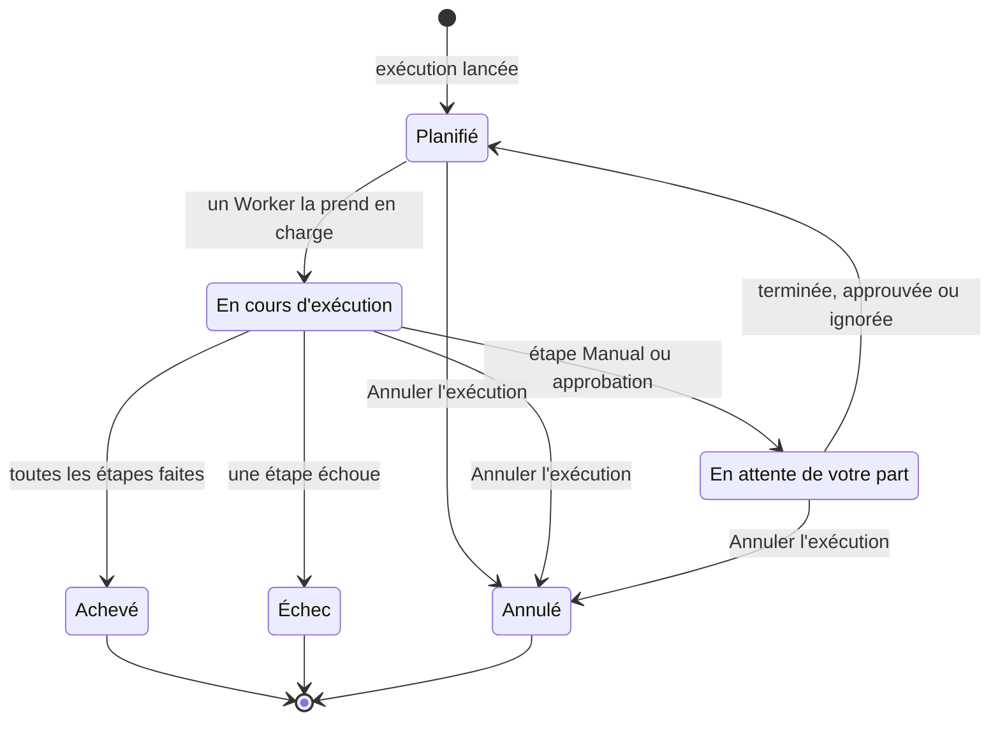

# Exécuter un runbook

Chaque exécution d'un runbook est une **exécution** : un instantané des étapes du runbook, traitées dans l'ordre, avec le statut et la sortie de chaque étape enregistrés. Cette page s'adresse aux personnes qui interviennent et qui lancent des exécutions et les font avancer : comment une exécution démarre, ce que montre la page d'exécution, et comment terminer, approuver, ignorer et annuler des étapes.

:::cards
- [Lancer une exécution](#lancer-une-exécution): Depuis un incident, une alerte ou un événement, ou depuis le runbook lui-même.
- [La vue d'exécution](#la-vue-dexécution): Ce que montre chaque étape pendant qu'une exécution est en cours.
- [Terminer, approuver et ignorer des étapes](#terminer-approuver-et-ignorer-des-étapes): Quelle étape accepte une décision, et quand.
- [Dépannage](#dépannage): Les exécutions qui ne démarrent pas ou ne se terminent pas.
:::

## Comment une exécution avance

Une nouvelle exécution est **Planifié** jusqu'à ce qu'un Worker la prenne en charge et la marque **En cours d'exécution**. Elle se met en pause en **En attente de votre part** sur une étape Manual, ou après une étape qui exige une approbation, et retourne dans la file dès que quelqu'un agit. Une exécution qui attend une personne n'expire jamais. Elle se termine en **Achevé**, **Échec** ou **Annulé**.

## Lancer une exécution

Une exécution de runbook peut être créée de trois façons :

1. **Automatiquement via une règle** : une [règle de runbook](/docs/runbooks/rules) la lance quand un incident, une alerte ou un événement de maintenance planifiée correspondant est créé. Une règle de remédiation automatique peut aussi en lancer une ; voir [AI SRE](/docs/ai/ai-sre).
2. **Manuellement depuis un événement** : cliquez sur **Exécuter le Runbook** sur un incident, une alerte ou un événement de maintenance planifiée. L'exécution est attachée à cet événement.
3. **Manuellement depuis la page du runbook** : cliquez sur **Run Now** sur la page **Vue d'ensemble** d'un runbook. L'exécution n'est attachée à aucun incident, aucune alerte ni aucun événement de maintenance planifiée.

Pour en lancer une à la main :

:::tabs
@tab Depuis un événement
1. Ouvrez l'incident, l'alerte ou l'événement de maintenance planifiée, et allez sur sa page **Runbooks**.
2. Cliquez sur **Exécuter le Runbook**. La boîte de dialogue **Exécuter un Runbook** liste les runbooks du projet qui sont activés.
3. Cliquez sur **Run** à côté du runbook. L'exécution apparaît dans la liste de l'événement : cliquez sur **Voir** pour l'ouvrir.
@tab Depuis le runbook
1. Ouvrez le runbook depuis **Runbooks**.
2. Sur sa **Vue d'ensemble**, cliquez sur **Run Now**.
3. La page d'exécution s'ouvre.
:::

Lancer une exécution demande Project Owner, Project Admin, Project Member, Runbook Admin ou Runbook Member, ou l'autorisation **Create Runbook Execution**. Runbook Viewer et Viewer voient **Run Now** verrouillé, avec la raison. Voir [Autorisations](/docs/runbooks/configuration#autorisations).

## La vue d'exécution

Ouvrez n'importe quelle exécution pour voir sa checklist. Le haut de la page montre le **Statut** de l'exécution, son **Progress** (étapes faites sur le total), **Démarrée** (quand elle a commencé) et **Déclenché par** (ce qui l'a lancée). Chaque étape affiche :

- **Pastille de statut** — En attente, En cours d'exécution, En attente de votre part, Terminé, Ignoré, Échec ou Annulé.
- **Titre et description** — copiés depuis le runbook au moment de l'exécution.
- **Sortie** (repliable) — stdout, valeurs de retour, réponses HTTP, ou la réponse de l'IA.
- **Message d'erreur** si l'étape a échoué.
- Sur l'étape attendue par l'exécution : **Marquer comme terminé** (une étape Manual) ou **Approuver et continuer** (une étape avec **Exiger une approbation**), et **Ignorer**.
- Pendant la pause, **Ignorer** sur les étapes automatisées suivantes qui n'exigent pas d'approbation.

Tant que l'exécution est en cours, la page s'actualise toute seule toutes les 30 secondes. Cliquez sur **Actualiser** pour voir l'état le plus récent tout de suite.

## Terminer, approuver et ignorer des étapes

Seule l'étape attendue par l'exécution peut être marquée comme terminée, approuvée ou ignorée pour faire continuer l'exécution. Une étape Manual ou une étape avec **Exiger une approbation** ne peut pas être cochée ni ignorée avant que l'exécution l'atteigne — son rôle est d'arrêter l'exécution, elle n'accepte donc une décision qu'une fois l'exécution arrivée là (pour une approbation, une fois que l'étape s'est exécutée et que vous voyez sa sortie).

Pendant la pause, vous pouvez aussi ignorer une étape automatisée suivante qui n'exige pas d'approbation, pour qu'elle ne s'exécute pas quand l'exécution reprend. L'exécution reste en pause sur l'étape qui vous attend. Ignorer n'est pas possible pendant que des étapes s'exécutent — attendez la pause, ou annulez l'exécution. Chaque étape enregistre qui l'a terminée ou ignorée.

| L'étape | Terminer ou approuver | Ignorer |
| --- | --- | --- |
| Celle que l'exécution attend | Oui | Oui |
| Une étape automatisée suivante, sans **Exiger une approbation** | Non | Oui, pendant la pause |
| Une étape Manual suivante, ou une avec **Exiger une approbation** | Non | Non |
| N'importe quelle étape, pendant que des étapes s'exécutent | Non | Non |

Terminer, approuver, ignorer et annuler demandent les mêmes rôles que lancer une exécution, ou l'autorisation **Edit Runbook Execution**.

## Entremêler étapes manuelles et automatisées

Le déroulé classique :

| # | Étape | Ce qui se passe |
| --- | --- | --- |
| 1 | Bash : capturer l'état du système | S'exécute sur son agent Runbook dès le démarrage de l'exécution. |
| 2 | Manual : « Prévenir les clients avec la bannière de la page de statut. » | L'exécution se met en pause jusqu'à ce qu'une personne clique sur **Marquer comme terminé**. |
| 3 | HTTP request : alerter le DBA via PagerDuty | S'exécute sur le Worker. |
| 4 | Manual : « Confirmer que la base secondaire est désormais primaire. » | L'exécution se remet en pause. |
| 5 | HTTP request : publier la fin d'alerte sur un webhook Slack | S'exécute, et l'exécution passe à **Achevé**. |

Les étapes 2 et 4 mettent l'exécution en pause jusqu'à ce que quelqu'un les coche. Les étapes 1, 3 et 5 s'exécutent automatiquement. L'ensemble est une seule exécution, une seule chronologie et une seule source de vérité.

## Annuler une exécution

Cliquez sur **Annuler l'exécution** sur la page d'exécution. Le statut passe à `Cancelled`, et aucune étape suivante ne démarre. Une étape déjà en cours n'est pas interrompue, mais son résultat n'est pas enregistré : l'étape reste `Cancelled`. Les tâches qui attendent encore un agent Runbook sont annulées ; un agent qui exécute déjà un script le termine, mais son résultat n'est pas accepté.

## Limites de sortie

La sortie de chaque étape est plafonnée à **50 Ko**, pour qu'un script emballé ne gonfle pas la base de données. Une sortie plus longue est coupée avec un marqueur. Si vous avez besoin d'artefacts plus gros, écrivez-les depuis le script dans un stockage objet ou un journal, et mettez l'URL dans la sortie.

## Relancer un runbook

Une exécution est un enregistrement unique et immuable. Pour relancer le runbook, cliquez sur **Exécuter à nouveau** sur une exécution terminée, ou sur **Run Now** sur le runbook. Les deux créent une nouvelle exécution à partir des étapes actuelles du runbook, attachée à aucun événement. Pour le relancer sur un incident, utilisez **Exécuter le Runbook** sur la page **Runbooks** de l'incident. L'exécution d'origine reste intacte pour la piste d'audit.

## Retrouver les exécutions passées

| Où | Ce qui est listé |
| --- | --- |
| Les **Exécutions** d'un runbook | Toutes les exécutions de ce runbook, avec des filtres par statut et date de début, et une colonne **Déclenché par**. |
| **Runbooks → Exécutions** | Toutes les exécutions de tous les runbooks du projet. |
| La page **Runbooks** d'un incident, d'une alerte ou d'un événement | Les exécutions qui y sont attachées. La vue d'ensemble de l'événement les affiche aussi, dès qu'il y en a. |

## Dépannage

:::details Run Now est verrouillé
Votre rôle lit les runbooks mais ne les exécute pas : le bouton indique « Vous n'avez pas l'autorisation de lancer des exécutions de runbook dans ce projet. » Demandez Runbook Member, ou l'autorisation **Create Runbook Execution**.
:::

:::details Le lancement échoue avec "Runbook is disabled" ou "Runbook has no steps to run"
L'interrupteur **Exécuter ce runbook** du runbook est désactivé, sur sa page **Paramètres**, ou il n'a aucune étape enregistrée. Activez l'interrupteur, ou ajoutez des étapes et cliquez sur **Save Steps**.
:::

:::details Une étape a échoué parce qu'il lui manque un agent Runbook ou un identifiant
Le message indique par exemple "Bash step is missing a Runner. Pick one under Runbooks → Runners." L'étape a été enregistrée sans **Agent Runbook**, ou une étape SSH ou Kubernetes sans **Identifiant**. Ouvrez les **Étapes** du runbook, choisissez ce qui manque à l'étape, cliquez sur **Save Steps** et relancez le runbook.
:::

:::details Une étape a échoué parce qu'aucun agent de runbook ne l'a prise en charge
Le message indique "No runbook agent picked up this step before the wait window expired." L'agent Runbook de l'étape n'a pas pris la tâche en charge dans son délai de prise en charge. Vérifiez sous **Runbooks → Agents de runbook** que l'agent est **Connecté** et que **Exécute les runbooks** est activé. Voir [Agents de runbook](/docs/runbooks/agents#dépannage).
:::

:::details L'exécution attend depuis des heures
Une exécution qui attend une personne n'expire jamais. Ouvrez-la et agissez sur l'étape marquée **En attente de votre part**, ou cliquez sur **Annuler l'exécution**.
:::

:::details Une étape indique qu'elle a pu s'exécuter partiellement
Le Worker OneUptime qui exécutait l'étape a redémarré ou a cessé de répondre, et l'exécution a été mise en échec au lieu de rester en cours. Vérifiez le système cible avant de relancer le runbook.
:::

## Prochaines étapes

:::cards
- [Rédiger un runbook](/docs/runbooks/authoring): Ajouter des étapes Manual et des approbations là où une personne doit décider.
- [Règles de runbook](/docs/runbooks/rules): Lancer des exécutions automatiquement sur les nouveaux incidents.
- [Agents de runbook](/docs/runbooks/agents): Garder en ligne les agents Runbook dont vos étapes ont besoin.
:::
