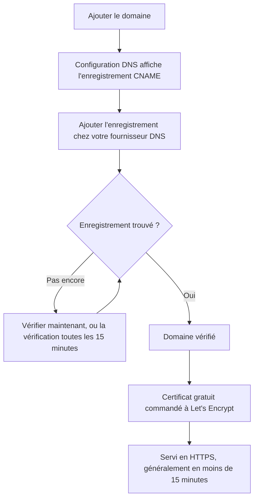

# Personnalisation et domaines de la page de statut

Votre page de statut est l'écran OneUptime que regardent vos clients : elle devrait donc vous ressembler et se trouver sur votre propre domaine, comme `status.yourcompany.com`. Cette page parcourt la page **Image de marque** carte par carte, puis place la page de statut sur votre domaine : ajoutez le domaine, ajoutez un enregistrement DNS, et le certificat SSL gratuit suit de lui-même.

:::cards
- [La page Image de marque](#la-page-image-de-marque): Logo, titre, favicon, liens, pied de page, couleurs et langues.
- [HTML, CSS et JavaScript personnalisés](#html-css-et-javascript-personnalisés): Tout ce que les réglages intégrés ne couvrent pas.
- [Domaines personnalisés](#domaines-personnalisés): Votre propre nom d'hôte, avec un certificat gratuit.
- [La colonne Statut](#lire-la-colonne-statut-du-domaine): Où en est chaque domaine sur le chemin de HTTPS.
:::

## Où se trouve chaque réglage de personnalisation

Ouvrez une page de statut : la section **Image de marque** de son menu latéral contient trois entrées :

| Page | Ce que vous y réglez |
| ---- | ------------------ |
| **Image de marque** | Logo et image de couverture, titre et description de la page, favicon, liens d'en-tête, description de la page de vue d'ensemble, ligne de copyright et liens du pied de page. Repliés sous **Plus de paramètres** : les couleurs du graphique d'historique, les langues et l'indexation par les moteurs de recherche. |
| **Domaines personnalisés** | Votre propre domaine, son enregistrement DNS et son certificat SSL gratuit. |
| **HTML, CSS et JavaScript** | HTML d'en-tête, HTML du pied de page, CSS personnalisé, JavaScript personnalisé. |

Trois éléments qui ressemblent à de la personnalisation se trouvent plutôt dans **Pages de statut → votre page → Avancé → Paramètres avancés** (`{id}/settings`), parce qu'ils décident de ce que la page montre et non de son apparence : le pourcentage de disponibilité global, les statuts de moniteur qui comptent contre la disponibilité, et la mention « Powered by OneUptime ». Les trois sont des lignes de la carte **Ce que montre votre page de statut**.

La personnalisation était autrefois répartie sur des écrans séparés **Personnalisation essentielle**, **En-tête**, **Pied de page**, **Page de vue d'ensemble** et **Langues**. Leurs anciennes adresses (`{id}/header-style`, `{id}/footer-style`, `{id}/overview-page-branding` et `{id}/languages`) ouvrent désormais la page **Image de marque** : les anciens favoris et liens fonctionnent toujours.

## La page Image de marque

**Pages de statut → votre page → Image de marque → Image de marque** (`{id}/branding`). Chaque carte s'enregistre séparément. Après le logo, le titre et le favicon, les cartes suivent votre page de statut de haut en bas : les liens de l'en-tête, le texte en haut de la vue d'ensemble, puis le pied de page. Ce que peu de gens modifient est replié sous **Plus de paramètres**, en bas.

### Logo et image de couverture

La première carte, **Logo et image de couverture**, a un bouton **Modifier les images** qui ouvre deux étapes :

| Étape | Champs |
| ---- | ------ |
| **Logo** | Le téléversement du logo (texte indicatif `Upload logo`) et **Texte alternatif du logo** (texte indicatif `Logo of My Company`). Laissez le texte alternatif vide et le titre de la page de statut est utilisé à la place. |
| **Image de couverture** | **Couverture**, un téléversement (texte indicatif `Upload cover image`) pour la large bannière derrière l'en-tête, et **Texte alternatif de l'image de couverture**. Laissez le texte alternatif vide si la couverture est purement décorative. |

Le logo, l'image de couverture et le favicon sont des fichiers téléversés dans le projet de la page de statut lui-même, et c'est vérifié à chaque enregistrement – depuis le tableau de bord, l'API, Terraform ou un workflow. Un fichier téléversé dans un autre projet est refusé avec les mêmes mots qu'un fichier qui n'existe plus : "The logo's file could not be found. Upload the logo again.", "The cover image's file could not be found. Upload the cover image again." ou "The favicon's file could not be found. Upload the favicon again." Téléverser à nouveau l'image depuis la page règle le problème.

Votre page de statut n'affiche que les images de son propre projet ; une image qu'elle ne peut pas afficher est omise, comme si la page n'en avait pas. Le tableau de bord, l'API et Terraform lisent les images de la page de la même façon : une image d'un autre projet revient comme aucune image. Les e-mails que la page envoie – aux abonnés, et aux utilisateurs privés au sujet de leur connexion – affichent son logo de la même manière : un logo que la page ne peut pas afficher en est omis lui aussi, plutôt qu'affiché comme une image cassée.

### Titre, description et favicon

- **Titre et description** – la carte précise que cela sert aussi au SEO. **Modifier** ouvre **Titre de la page** (texte indicatif `Please enter page title here.`) et **Description de la page**. Les moteurs de recherche et les aperçus de liens les affichent : écrivez-les pour un client, pas pour votre équipe.
- **Favicon** – **Modifier le favicon** ouvre le téléversement **Favicon** : la petite icône de l'onglet du navigateur.

### Liens d'en-tête

Le tableau **Liens d'en-tête** contient les liens de l'en-tête de la page de statut, comme votre site web, votre documentation ou un portail de support. Chaque lien a un **Titre** et un **Lien** (une URL, texte indicatif `https://link.com`), et vous les réordonnez par glisser-déposer. Sans lien, le tableau indique **Aucun lien d'en-tête de statut pour cette page de statut**, avec **Créer : Lien de l'en-tête de la page de statut** en dessous.

### Description de la page de vue d'ensemble

**Description de la page de vue d'ensemble** est la première chose sur la vue d'ensemble de la page de statut, au-dessus des annonces, du statut global et de vos ressources. **Modifier la description** ouvre un champ Markdown. Servez-vous-en pour une phrase de contexte : ce que couvre cette page, et où s'adresser pour obtenir de l'aide. Une image que vous y placez est montrée à chaque visiteur de la page.

### Pied de page

- **Informations de copyright** – **Modifier le copyright** ouvre un champ, **Informations de copyright**, avec le texte indicatif `Acme, Inc.`.
- **Liens du pied de page** – la même paire **Titre** et **Lien** que les liens d'en-tête, ordonnés par glisser-déposer. Sans lien, il indique « Aucun lien de pied de page de statut pour cette page de statut. »

Les liens d'en-tête servent à la navigation ; les liens du pied de page aux mentions légales, comme les conditions, la confidentialité et les conditions d'utilisation.

### Plus de paramètres

La dernière section de la page est repliée sous **Plus de paramètres**, car peu de gens modifient ce qu'elle contient. Repliée, son en-tête nomme ses quatre sections – **Couleur de barre par défaut**, **Règles de couleur des barres**, **Langues** et **Indexation par les moteurs de recherche** – et montre chacune de celles qui diffèrent de ce avec quoi commence une nouvelle page de statut : une couleur de barre par défaut autre que le vert de départ de chaque page, toute règle de couleur de barre, une langue par défaut autre que l'anglais, une liste de langues plus courte, ou l'indexation désactivée. Cliquez dessus pour l'ouvrir : c'est une seule carte, les quatre sections l'une sous l'autre, chacune avec son titre et son bouton, séparées par des lignes de séparation.

**Couleurs du graphique d'historique.** Ce sont les seuls réglages de couleur intégrés d'une page de statut.

- **Couleur de barre par défaut du graphique d'historique** – **Modifier la couleur de barre par défaut** ouvre le sélecteur **Couleur de barre par défaut**. Chaque nouvelle page de statut commence avec le vert. Avec des règles de couleur, c'est aussi la couleur d'un jour auquel aucune règle ne correspond. Un jour pour lequel la page n'a pas de données est toujours dessiné en gris.
- **Rules for Bar Colors of History Chart** – un tableau ordonné de règles que vous triez par glisser-déposer. Chaque règle a **Lorsque le % de disponibilité est supérieur ou égal à** et **Ensuite, utilisez cette couleur de barre** ; les colonnes du tableau s'intitulent `When Uptime Percent >=` et `Then, Bar Color is`. La couleur d'une nouvelle règle est déjà choisie, une que les autres règles n'utilisent pas encore ; choisissez plutôt celle que vous voulez. L'ordre compte : rangez les règles dans l'ordre où vous voulez qu'elles soient évaluées. Sans règle, la barre de chaque jour prend la couleur du statut de moniteur le plus bas de ce jour.

Le nombre de jours que couvre le graphique ne se règle pas ici. C'est **Historique de disponibilité** dans la carte **Ce que montre votre page de statut** de **Avancé → Paramètres avancés**, de 1 à 90 jours. Les statuts de moniteur qui comptent comme une panne, c'est **Compte comme indisponibilité**, dans la même ligne de cette carte.

**Langues.** La section **Langues** règle le sélecteur de langue que les visiteurs trouvent dans le pied de page. **Modifier les langues** ouvre deux champs :

| Champ | Ce qu'il fait |
| ----- | ------------ |
| **Langue par défaut** | La langue que voient les nouveaux visiteurs, choisie dans une liste qui nomme chaque langue dans sa propre graphie et en anglais (`Deutsch (German)`). Elle vaut l'anglais par défaut, et les visiteurs peuvent toujours changer depuis le pied de page. |
| **Langues activées** | Une sélection multiple, texte indicatif `All languages`. Laissez-la vide et toutes les langues prises en charge sont proposées ; choisissez-en quelques-unes et le pied de page ne liste que celles-ci. |

Dix-sept langues sont livrées avec OneUptime : anglais, allemand, français, espagnol, italien, portugais, néerlandais, danois, norvégien, suédois, russe, japonais, coréen, chinois (simplifié), chinois (traditionnel), hindi et persan.

**Indexation par les moteurs de recherche.** Un commutateur, **Autoriser les moteurs de recherche à indexer cette page de statut**, décide si Google, Bing et les autres moteurs de recherche peuvent référencer la page. Il est activé par défaut. Il n'y a pas de bouton **Modifier** : le commutateur s'enregistre dès que vous le basculez. Désactivez-le et la page est servie avec `noindex, nofollow` (une balise meta robots et un en-tête `X-Robots-Tag`) ; toute personne qui a le lien peut toujours l'ouvrir. Les moteurs de recherche peuvent mettre quelques semaines à retirer une page déjà indexée.

> [!TIP]
> Désactivez **Autoriser les moteurs de recherche à indexer cette page de statut** tant qu'une page est interne ou encore en cours de configuration, pour qu'une page à moitié terminée ne commence pas à se positionner sur votre nom de marque.

## Pourcentage de disponibilité et statuts d'indisponibilité

Les deux se trouvent dans la ligne **Historique de disponibilité** de la carte **Ce que montre votre page de statut**, dans **Pages de statut → votre page → Avancé → Paramètres avancés** (`{id}/settings`). Il n'y a pas de bouton **Modifier** : chacun s'enregistre dès que vous le changez.

- **Afficher le pourcentage de disponibilité global** – un commutateur, désactivé par défaut. Tant qu'il est activé, **Précision** à côté choisit le nombre de décimales du pourcentage : `99%`, `99.9%`, `99.99%` (la valeur par défaut) ou `99.999%`. Sur OneUptime Cloud, activer le pourcentage demande le forfait **Scale** ; sa précision peut être modifiée sur tous les forfaits.
- **Compte comme indisponibilité** – les statuts de moniteur, sous forme de pastilles colorées, dont le temps compte contre la disponibilité sur cette page. C'est ici que vous décidez si, par exemple, un statut dégradé compte contre la disponibilité. Au moins un statut reste sélectionné.

C'étaient autrefois deux cartes à part, **Pourcentage de disponibilité global** et **Statuts de moniteur d'indisponibilité**, chacune derrière un bouton **Modifier**. Voir [Vue d'ensemble des pages de statut](/docs/status-pages/index#choisir-ce-qui-saffiche-sur-la-page) pour le reste de la carte.

## HTML, CSS et JavaScript personnalisés

**Pages de statut → votre page → Image de marque → HTML, CSS et JavaScript** (`{id}/custom-code`) a quatre cartes, chacune modifiée séparément et stockée dans une colonne de la page de statut :

| Carte | Colonne | Ce qu'elle contient |
| ---- | ------ | ------------- |
| **HTML d'en-tête** | `headerHTML` | Du HTML ajouté à l'en-tête de la page (texte indicatif `Insert Custom HTML here.`). |
| **HTML du pied de page** | `footerHTML` | Du HTML ajouté au pied de page. |
| **CSS personnalisé** | `customCSS` | Des styles pour toute la page (texte indicatif `Insert Custom CSS here.`). |
| **JavaScript personnalisé** | `customJavaScript` | Un script que la page exécute (texte indicatif `Insert Custom JavaScript here.`). |

> [!IMPORTANT]
> Le HTML, le CSS et le JavaScript personnalisés ne sont servis que sur un domaine personnalisé vérifié. Ils sont désactivés sur l'adresse par défaut `/status-page/:id`, parce que cette adresse partage l'origine connectée d'OneUptime.

Sur OneUptime Cloud, ajouter ou modifier l'un d'eux demande le forfait **Growth**. Les vider fonctionne sur tous les forfaits, si bien que le code personnalisé ajouté pendant un essai peut toujours être retiré.

**Il n'y a pas de sélecteur de thème.** Les pages de statut OneUptime n'ont aucun réglage de thème ni de couleur de marque : les seuls réglages de couleur intégrés, où que ce soit, sont **Couleur de barre par défaut** et les règles de couleur des barres du graphique d'historique, sous **Plus de paramètres** sur la page **Image de marque**. Les polices, les couleurs de fond, les couleurs d'accent et les ajustements de mise en page passent tous par **CSS personnalisé**. Si vous cherchiez un champ « couleur de marque », voici la réponse : il n'y en a pas, et ce champ est le moyen d'y parvenir.

> [!WARNING]
> Le JavaScript personnalisé s'exécute dans le navigateur de vos visiteurs, sur une page qu'on ouvre justement quand on pense que quelque chose est cassé. Gardez-le court, hébergez vous-même ce qu'il charge quand c'est possible, et testez-le avant de compter dessus.

## Domaines personnalisés

Par défaut, une page de statut est accessible à l'URL d'aperçu affichée sur son écran **Vue d'ensemble**. Pour la placer sur votre propre nom d'hôte, allez dans **Pages de statut → votre page → Image de marque → Domaines personnalisés** (`{id}/domains`).

La carte **Domaines personnalisés** indique quoi faire : faites pointer l'enregistrement CNAME de chaque domaine vers l'enregistrement CNAME des pages de statut de votre installation, et OneUptime émet le certificat SSL du domaine et le renouvelle pour vous. Quand rien n'est configuré, le tableau indique **Aucun domaine personnalisé trouvé**, avec **Créer : Domaine de la page de statut** en dessous. Le tableau a deux colonnes, **Domaine** et **Statut**, et des filtres pour **Domaine**, **CNAME valide** et **SSL provisionné**.

Placer la page sur votre domaine se fait en trois étapes, et seules les deux premières vous reviennent :

1. **Ajouter le domaine** : un sous-domaine et l'un de vos domaines vérifiés.
2. **Ajouter son enregistrement CNAME** chez votre fournisseur DNS. La boîte de dialogue **Configuration DNS** affiche l'enregistrement dès que vous ajoutez le domaine.
3. **Le certificat SSL gratuit est émis automatiquement** une fois l'enregistrement trouvé. Il n'y a aucun bouton à presser.



### Avant de commencer

- **Le domaine parent doit être vérifié.** La liste déroulante **Domaine** ne propose que les domaines vérifiés sous **Paramètres du projet → Domaines**, où vous prouvez qu'un domaine vous appartient avec un enregistrement TXT. Le lien **Ajouter un domaine** à côté du champ ouvre cette page dans un nouvel onglet.
- **Votre installation a besoin d'un enregistrement CNAME pour les pages de statut.** OneUptime Cloud en a un. Sur une installation auto-hébergée, faites-le pointer vers un nom d'hôte qui pointe lui-même vers votre serveur OneUptime (un enregistrement A), et assurez-vous que le serveur répond sur le port 80, où Let's Encrypt le vérifie. Sans lui, la carte et la boîte de dialogue **Configuration DNS** indiquent « Custom Domains not enabled for this OneUptime installation » au lieu d'afficher un enregistrement.

:::tabs
@tab Docker Compose
```ini title="config.env"
STATUS_PAGE_CNAME_RECORD=oneuptime.yourcompany.com
```
@tab Kubernetes
```yaml title="values.yaml"
statusPage:
  cnameRecord: oneuptime.yourcompany.com
```
:::

### Ajouter le domaine

:::steps
#### Ouvrir Créer : Domaine de la page de statut

Dans **Domaines personnalisés**, cliquez sur **Créer : Domaine de la page de statut**. La boîte de dialogue tient sur une seule page.

#### Saisir le sous-domaine

Dans **Sous-domaine** (texte indicatif `status (leave blank for root)`), saisissez seulement le libellé, comme `status`, pas le nom d'hôte complet. Laissez-le vide, ou saisissez `@`, pour utiliser le domaine racine (apex).

#### Choisir le domaine

Dans **Domaine** (texte indicatif `Select domain`), choisissez l'un de vos domaines vérifiés. Un domaine que vous n'avez pas vérifié n'est pas listé, car il serait refusé.

#### Garder le certificat gratuit, ou téléverser le vôtre

**Plus de champs** est replié, et son en-tête indique le certificat qu'utilisera le domaine : « Nous émettons un certificat SSL gratuit pour ce domaine et le renouvelons automatiquement. » Ne l'ouvrez que pour utiliser votre propre certificat : activez **Téléverser un certificat personnalisé**, puis collez le **Certificat** et la **Clé privée du certificat** au format PEM. Les deux deviennent alors obligatoires.

#### Créer le domaine

Cliquez sur **Créer : Domaine de la page de statut**. La boîte de dialogue se ferme et la **Configuration DNS** du nouveau domaine s'ouvre, avec l'enregistrement à ajouter.
:::

Le nom complet d'un domaine est fixé quand vous l'ajoutez : **Modifier** ne change donc que son certificat. Pour utiliser un autre sous-domaine, ajoutez ce domaine et supprimez l'ancien.

### Configuration DNS et vérification

La boîte de dialogue **Configuration DNS** affiche l'enregistrement à ajouter chez votre fournisseur DNS, un champ par ligne, chacun avec un bouton de copie :

| Champ | Ce qu'il faut saisir |
| ----- | ------------- |
| **Type** | `CNAME` |
| **Nom** | Le domaine complet que vous avez ajouté, par exemple `status.yourcompany.com` |
| **Valeur** | L'enregistrement CNAME des pages de statut de votre installation |

> [!NOTE]
> Pour un domaine racine, sans sous-domaine, la boîte de dialogue ajoute une remarque : beaucoup de fournisseurs DNS n'y autorisent pas d'enregistrement CNAME. Utilisez à la place l'enregistrement ALIAS, ANAME ou d'aplatissement de CNAME de votre fournisseur, avec la même valeur.

OneUptime vérifie chaque domaine non vérifié toutes les 15 minutes et vérifie le vôtre dès que son enregistrement est actif, que vous reveniez ou non. Pour vérifier tout de suite, cliquez sur **Vérifier maintenant** :

- **L'enregistrement n'est pas encore trouvé.** La boîte de dialogue reste ouverte et indique l'enregistrement qu'elle a cherché. Un nouvel enregistrement DNS peut mettre un moment à apparaître : cliquez de nouveau sur **Vérifier maintenant** plus tard, ou laissez faire la vérification toutes les 15 minutes.
- **L'enregistrement est trouvé.** La boîte de dialogue indique « Votre enregistrement CNAME est vérifié. » et ce qui arrive ensuite au certificat. Le certificat gratuit est commandé à ce moment-là.

Tant qu'un domaine n'est pas vérifié et que son certificat n'est pas en place, sa ligne a une action **Configuration DNS** qui ouvre la même boîte de dialogue. Sur un domaine vérifié dont la commande de certificat échoue sans cesse, ou dont le certificat a expiré, **Vérifier maintenant** y passe une nouvelle commande et montre pourquoi la dernière a échoué. Elle commande au plus une fois par domaine toutes les 15 minutes ; entre-temps, OneUptime continue d'essayer de lui-même.

### Certificats SSL

Chaque domaine personnalisé reçoit un certificat gratuit de Let's Encrypt, émis et renouvelé automatiquement. Il n'y a rien à cliquer :

- **Vérifier maintenant** commande le certificat dès que l'enregistrement est trouvé. La boîte de dialogue indique alors que le certificat est généralement actif en moins de 15 minutes.
- Quand la vérification toutes les 15 minutes vérifie un domaine, elle commande le certificat du domaine dans la même vérification.
- Le renouvellement est automatique, bien avant l'expiration du certificat. Si votre DNS ne répond pas un instant pendant le renouvellement d'un certificat, le certificat continue d'être servi et est renouvelé lors d'une tentative ultérieure. Une vérification DNS en échec ne retire jamais un certificat encore valide.

Un nouveau certificat est servi dans les 15 minutes qui suivent son émission, car c'est la fréquence à laquelle les certificats sont écrits sur les serveurs qui répondent pour votre domaine. La colonne Statut dit _généralement_ en moins de 15 minutes : quand beaucoup de domaines attendent en même temps, ils sont traités quelques-uns à la fois.

Chaque certificat OneUptime est commandé depuis un compte Let's Encrypt partagé, et Let's Encrypt limite le nombre de nouvelles commandes qu'un compte peut passer en peu de temps, et la fréquence à laquelle une commande pour le même domaine peut échouer. OneUptime maintient toutes ses commandes – nouveaux domaines, **Vérifier maintenant**, réémissions et renouvellements – ensemble dans ces limites, et les renouvellements passent toujours en premier : un afflux de nouveaux domaines ne retarde jamais les renouvellements qui gardent les domaines existants en ligne.

Si une commande échoue, la colonne Statut l'indique, avec la raison sur la ligne en dessous, et **Vérifier maintenant** dans **Configuration DNS** la montre aussi. OneUptime continue d'essayer de lui-même, en attendant un peu plus longtemps après chaque échec consécutif, si bien qu'un domaine dont la commande échoue sans cesse n'épuise pas les commandes dont tous les autres domaines ont besoin. Les causes habituelles sont un enregistrement CAA sur votre domaine qui n'autorise pas `letsencrypt.org` et, sur une installation auto-hébergée, un serveur que Let's Encrypt ne peut pas joindre sur le port 80 ; sur une installation auto-hébergée, les journaux du worker donnent les détails. Une fois la cause corrigée, cliquez sur **Vérifier maintenant** pour commander de nouveau tout de suite. Il passe au plus une commande par domaine toutes les 15 minutes ; un clic entre-temps montre comment s'est passée la dernière commande.

Si vous avez téléversé votre propre certificat sous **Plus de champs**, OneUptime sert celui-ci à la place, dans les 15 minutes qui suivent l'enregistrement. Téléversez son remplaçant avant son expiration en modifiant le domaine.

### Réémettre un certificat

Le renouvellement automatique couvre le cas ordinaire, mais vous voulez parfois un tout nouveau certificat immédiatement : une clé privée que vous préférez ne pas garder, un certificat qui déplaît à votre propre scanner, ou un domaine qui a changé en amont. Dès qu'un certificat gratuit a été commandé pour un domaine, sa ligne affiche une action **Reissue SSL**.

Sa boîte de dialogue, **Reissue SSL Certificate for this Status Page**, demande à Let's Encrypt un nouveau certificat pour le domaine et remplace par celui-ci le certificat servi. Votre page de statut reste en ligne sur le certificat existant pendant ce temps, et le nouveau certificat est servi dans les 15 minutes. Cliquez sur **Reissue SSL Certificate** pour le commander.

> [!NOTE]
> Un domaine ne peut être réémis qu'une fois toutes les 24 heures. Let's Encrypt limite la fréquence à laquelle le même domaine peut être émis, et chaque certificat OneUptime est commandé depuis un compte partagé, y compris les renouvellements automatiques qui gardent en ligne les pages de tous les autres. Dans cet intervalle, la boîte de dialogue vous dit combien de temps il reste au lieu de commander. Si un certificat est en cours de commande pour le domaine à ce moment-là, ou si les commandes Let's Encrypt de l'installation sont épuisées pour l'instant, la boîte de dialogue le dit, rien n'est commandé, et le clic ne compte pas comme votre réémission.

L'action n'apparaît pas sur un domaine qui utilise un certificat que vous avez téléversé : il n'y a pas de certificat Let's Encrypt à réémettre ; téléversez-en un nouveau en modifiant le domaine. Elle n'apparaît pas non plus avant que le premier certificat du domaine soit commandé, ce qui se fait de lui-même une fois son enregistrement CNAME vérifié.

Le même bouton, avec la même limite de 24 heures, existe sur les domaines personnalisés des tableaux de bord, sous **Tableaux de bord → votre tableau de bord → Image de marque → Domaines personnalisés**, qui fonctionnent comme les domaines personnalisés des pages de statut : voir [Partage et tableaux de bord publics](/docs/dashboards/sharing#domaines-personnalisés).

### Lire la colonne Statut du domaine

La colonne **Statut** indique où en est chaque domaine sur le chemin de HTTPS, dans l'un de sept états. Quand une commande a échoué, la raison figure sur la ligne en dessous.

| Ce qu'indique la colonne Statut | Ce que cela signifie |
| --------------------------- | ------------- |
| En attente du DNS : ajoutez l'enregistrement CNAME. | L'enregistrement CNAME n'est pas encore trouvé. Ouvrez **Configuration DNS** pour l'enregistrement, ajoutez-le chez votre fournisseur DNS, puis cliquez sur **Vérifier maintenant** ou attendez la vérification toutes les 15 minutes. |
| Émission d'un certificat gratuit, généralement en moins de 15 minutes. | L'enregistrement est vérifié, et le certificat est en cours de commande ou d'écriture. Rien à faire. |
| Impossible d'émettre un certificat gratuit pour l'instant. Nous continuons d'essayer. | L'enregistrement est vérifié, mais la commande de son certificat a échoué, pour la raison indiquée sur la ligne en dessous. Corrigez la cause, puis ouvrez **Configuration DNS** et cliquez sur **Vérifier maintenant** pour commander de nouveau tout de suite. |
| Certificat expiré. Nous continuons d'essayer de le renouveler. | Le certificat du domaine a expiré parce que ses renouvellements ont échoué. Ouvrez **Configuration DNS** et cliquez sur **Vérifier maintenant** pour le renouveler tout de suite et voir pourquoi. |
| Certificat émis, renouvelé automatiquement. | Terminé. Le domaine sert son certificat en HTTPS, et OneUptime le renouvelle. |
| Certificat émis, mais son renouvellement a échoué. Nous continuons d'essayer. | Le domaine sert toujours un certificat valide, mais son dernier renouvellement a échoué, pour la raison indiquée sur la ligne en dessous. OneUptime réessaie bien avant l'expiration du certificat. |
| Utilise votre certificat téléversé. | L'enregistrement est vérifié, et le domaine est servi avec le certificat que vous avez téléversé. |

:::details Un domaine reste sur « En attente du DNS » longtemps après l'ajout de l'enregistrement
Vérifiez que le nom de l'enregistrement est le domaine complet, comme `status.yourcompany.com`, et que sa valeur correspond exactement à l'enregistrement CNAME de votre installation. Sur un domaine racine, utilisez un enregistrement ALIAS, ANAME ou CNAME aplati. Cliquez ensuite sur **Vérifier maintenant** dans **Configuration DNS**.
:::

:::details La colonne Statut indique qu'aucun certificat gratuit n'a pu être émis
Cherchez sur votre domaine un enregistrement CAA qui omet `letsencrypt.org` et, sur une installation auto-hébergée, vérifiez que votre serveur répond sur le port 80. Corrigez la cause, puis cliquez sur **Vérifier maintenant** dans **Configuration DNS** pour commander de nouveau.
:::

### Qui peut vérifier et réémettre

**Vérifier maintenant**, la commande du certificat d'un domaine et **Reissue SSL** modifient le domaine : ils demandent donc l'autorisation de le modifier, **Edit Status Page Domain**, ou un rôle qui l'inclut (Project Owner, Project Admin, Project Member, Status Page Admin ou Status Page Member).

Quelqu'un qui peut seulement lire le domaine, comme un Viewer ou un Status Page Viewer, voit quand même la colonne **Statut** et l'enregistrement à ajouter dans **Configuration DNS**. Pour lui, **Vérifier maintenant** et **Reissue SSL** sont verrouillés et indiquent l'autorisation qui lui manque. OneUptime continue de toute façon à vérifier chaque domaine et à commander son certificat de lui-même.

Il en va de même pour les clés d'API. Une clé qui peut seulement lire les domaines de pages de statut ne peut pas appeler `verify-cname`, `order-ssl` ni `reissue-ssl` sur `/status-page-domain`. Donnez-lui **Read Status Page Domain** et **Edit Status Page Domain** si elle en a besoin.

## Powered by OneUptime

La mention « Powered by OneUptime » n'est pas un réglage de personnalisation. C'est le dernier commutateur de la carte **Ce que montre votre page de statut**, dans **Pages de statut → votre page → Avancé → Paramètres avancés** (`{id}/settings`) : **Afficher la mention « Propulsé par OneUptime »**, activé par défaut. Désactivez-le pour masquer la mention ; c'est enregistré aussitôt. Sur OneUptime Cloud, la masquer demande le forfait **Scale**.

## Étapes suivantes

:::cards
- [Vue d'ensemble des pages de statut](/docs/status-pages/index): Ce que la page montre, et qui peut la voir.
- [Ressources et groupes de la page de statut](/docs/status-pages/resources-and-groups): Choisir ce que les visiteurs voient vraiment sur la page.
- [Abonnés et annonces](/docs/status-pages/subscribers): Les e-mails qui portent votre logo et renvoient vers votre domaine.
- [API publique](/docs/status-pages/public-api): Lire la page en JSON, aussi sur votre propre domaine.
:::
