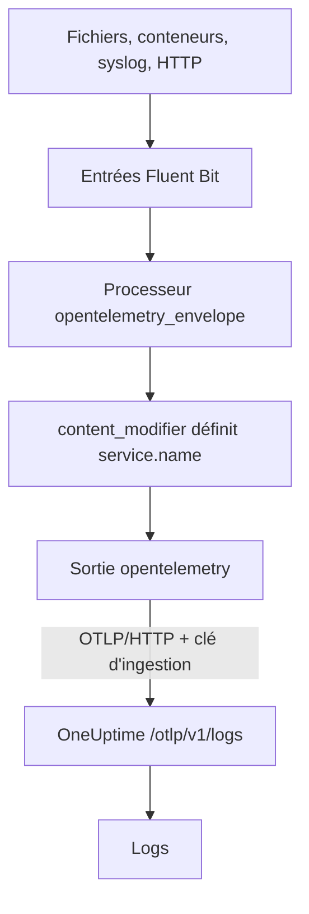

# Fluent Bit

[Fluent Bit](https://docs.fluentbit.io/manual) est un agent léger qui collecte des logs depuis des fichiers, systemd, des conteneurs, syslog, HTTP et bien d'autres sources. Sa [sortie OpenTelemetry](https://docs.fluentbit.io/manual/pipeline/outputs/opentelemetry) envoie ce qu'il collecte au point de terminaison OpenTelemetry (OTLP) de OneUptime, où les logs deviennent consultables sous **Produits → Journaux**.

:::cards
- [Configurer Fluent Bit](#configurer-fluent-bit): Ajouter la sortie OpenTelemetry et nommer votre service.
- [Exemple complet](#exemple-complet): Un fichier de configuration entier pour démarrer.
- [OneUptime auto-hébergé](#oneuptime-auto-hébergé): Pointer Fluent Bit vers votre propre instance.
:::

## Fonctionnement



Fluent Bit enveloppe chaque enregistrement dans une enveloppe OpenTelemetry, pour qu'il puisse porter des attributs de ressource comme `service.name`. La sortie OpenTelemetry envoie ensuite les enregistrements à OneUptime avec votre clé d'ingestion dans l'en-tête `x-oneuptime-token`. OneUptime les range sous le service nommé par `service.name`, et crée ce service au premier envoi.

## Avant de commencer

- **Installer Fluent Bit** — voir le [guide d'installation](https://docs.fluentbit.io/manual/installation/getting-started-with-fluent-bit). La configuration de cette page utilise le format YAML de Fluent Bit et le processeur `opentelemetry_envelope` : utilisez donc une version récente.
- **Un projet OneUptime.** Sur OneUptime Cloud, la télémétrie est facturée par Go ingéré — voir les [tarifs](https://oneuptime.com/pricing) — et un projet du forfait Free a besoin d'un moyen de paiement avant de pouvoir envoyer de la télémétrie.
- **Une clé d'ingestion de télémétrie.** Si vous n'en avez pas :

:::steps
### Ouvrir les clés d'ingestion

Allez dans **Produits → Paramètres du projet**, ouvrez **Télémétrie & APM** dans le menu latéral et sélectionnez **Clés d'ingestion**.


### Créer une clé

Cliquez sur **Créer une clé d'ingestion**. La fenêtre a déjà rempli le nom de la clé et choisi **Serveur** — le type de clé avec lequel une application ou un collector envoie —, donc cliquez sur **Créer une clé d'ingestion** pour la créer, ou renommez-la d'abord.

### Copier le secret

La nouvelle clé s'ouvre sur sa propre page. Copiez sa **Clé secrète** : c'est le `YOUR_TELEMETRY_INGESTION_TOKEN` de la configuration ci-dessous.


:::

## Configurer Fluent Bit

Fluent Bit lit sa configuration YAML depuis un fichier tel que `/etc/fluent-bit/fluent-bit.yaml`.

:::steps
### Ajouter la sortie OpenTelemetry

Ajoutez une sortie `opentelemetry` qui envoie à OneUptime. Gardez la sortie `stdout` pendant vos tests si vous voulez voir les enregistrements en local :

```yaml title="fluent-bit.yaml"
pipeline:
  outputs:
    - name: stdout
      match: "*"
    - name: opentelemetry
      match: "*"
      host: "oneuptime.com"
      port: 443
      metrics_uri: "/otlp/v1/metrics"
      logs_uri: "/otlp/v1/logs"
      traces_uri: "/otlp/v1/traces"
      tls: On
      header:
        - x-oneuptime-token YOUR_TELEMETRY_INGESTION_TOKEN
```

### Envelopper les logs dans une enveloppe OpenTelemetry et nommer le service

Ajoutez le processeur `opentelemetry_envelope` à chaque entrée, suivi d'un `content_modifier` qui définit `service.name`. Remplacez `YOUR_SERVICE_NAME` par le nom sous lequel les logs doivent apparaître dans OneUptime :

```yaml title="fluent-bit.yaml"
pipeline:
  inputs:
    - name: tail # or any other input
      path: /var/log/my-app/*.log

      processors:
        logs:
          - name: opentelemetry_envelope

          - name: content_modifier
            context: otel_resource_attributes
            action: upsert
            key: service.name
            value: YOUR_SERVICE_NAME
```

### Redémarrer Fluent Bit

Redémarrez le service Fluent Bit, ou lancez-le avec `fluent-bit -c /etc/fluent-bit/fluent-bit.yaml`. En quelques secondes, les logs apparaissent sous **Produits → Journaux**, et le service figure sous **Produits → Services**.
:::

## Exemple complet

Cette configuration reçoit des logs en HTTP sur le port `8888` et les transmet à OneUptime :

```yaml title="fluent-bit.yaml"
service:
  flush: 1
  log_level: info

pipeline:
  inputs:
    - name: http
      listen: 0.0.0.0
      port: 8888

      processors:
        logs:
          - name: opentelemetry_envelope

          - name: content_modifier
            context: otel_resource_attributes
            action: upsert
            key: service.name
            value: YOUR_SERVICE_NAME

  outputs:
    - name: stdout
      match: "*"
    - name: opentelemetry
      match: "*"
      host: "oneuptime.com"
      port: 443
      metrics_uri: "/otlp/v1/metrics"
      logs_uri: "/otlp/v1/logs"
      traces_uri: "/otlp/v1/traces"
      tls: On
      header:
        - x-oneuptime-token YOUR_TELEMETRY_INGESTION_TOKEN
```

Remplacez l'entrée `http` par les entrées dont vous avez besoin — par exemple `tail` pour des fichiers de logs ou `systemd` pour le journal — et gardez les deux processeurs sur chacune d'elles.

## OneUptime auto-hébergé

Réglez `host` sur l'hôte de votre instance OneUptime. Si elle est servie en HTTP simple plutôt qu'en HTTPS, réglez aussi `port` sur le port qu'elle écoute (en général `80`) et retirez `tls` :

```yaml title="fluent-bit.yaml"
pipeline:
  outputs:
    - name: stdout
      match: "*"
    - name: opentelemetry
      match: "*"
      host: "your-oneuptime-instance.com"
      port: 80
      metrics_uri: "/otlp/v1/metrics"
      logs_uri: "/otlp/v1/logs"
      traces_uri: "/otlp/v1/traces"
      header:
        - x-oneuptime-token YOUR_TELEMETRY_INGESTION_TOKEN
```

## Dépannage

:::details Fluent Bit journalise `401` depuis la sortie OpenTelemetry
La clé d'ingestion est absente, inconnue ou expirée. Vérifiez la ligne `header` : c'est `x-oneuptime-token`, un espace, puis la **Clé secrète** de la clé.
:::

:::details Fluent Bit journalise `402` ou `422`
`402` : sur OneUptime Cloud, le projet est sur le forfait Free et n'a pas de moyen de paiement. Ajoutez-en un sous **Paramètres du projet → Facturation et factures → Facturation**. `422` : la clé est désactivée, ou c'est une clé Navigateur. Réactivez **Activé** dans les réglages de la clé, ou créez une clé **Serveur**.
:::

:::details Les logs arrivent sous un service inattendu
Le service vient de `service.name`. Vérifiez que chaque entrée a le processeur `opentelemetry_envelope` suivi du `content_modifier` qui le définit.
:::

:::details Rien n'arrive, et Fluent Bit journalise des erreurs de connexion
Vérifiez que `tls: On` et `port: 443` sont définis pour un point de terminaison HTTPS, et que l'hôte qui exécute Fluent Bit peut joindre votre hôte OneUptime sur ce port.
:::

Pour toute question ou si vous avez besoin d'aide avec la configuration, écrivez-nous à support@oneuptime.com.

## Étapes suivantes

:::cards
- [Pipelines de journaux](/docs/telemetry/log-pipelines): Analyser et enrichir les logs qu'envoie Fluent Bit.
- [Syntaxe de recherche](/docs/telemetry/search-syntax): Trouver les logs dans l'explorateur de journaux.
- [OpenTelemetry](/docs/telemetry/open-telemetry): Points de terminaison, clés et limites pour toute la télémétrie.
- [Fluentd](/docs/telemetry/fluentd): Utiliser plutôt Fluentd.
:::
