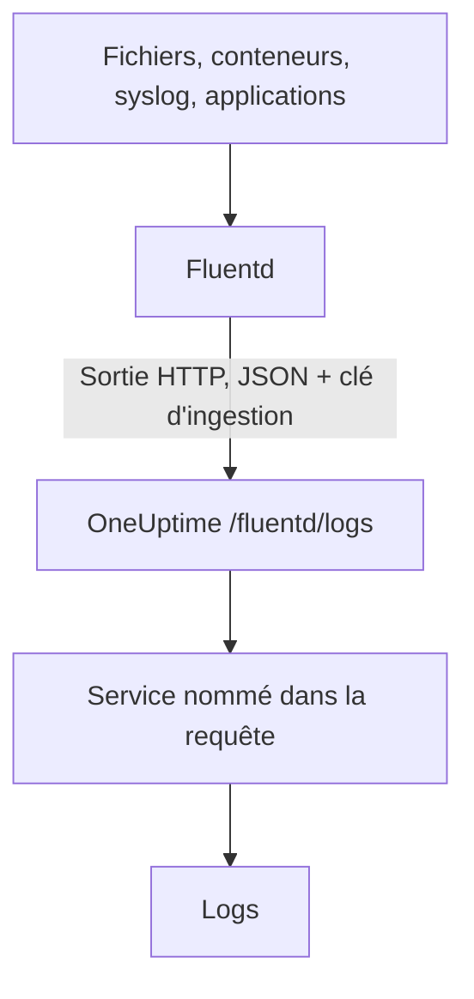

# Fluentd

[Fluentd](https://www.fluentd.org/) collecte des logs depuis des fichiers, des conteneurs, syslog, des applications et [bien d'autres sources](https://www.fluentd.org/datasources). Sa [sortie HTTP](https://docs.fluentd.org/output/http) intégrée les envoie au point de terminaison Fluentd de OneUptime, où ils deviennent consultables sous **Produits → Journaux**.

:::cards
- [Configurer Fluentd](#configurer-fluentd): Ajouter une sortie HTTP qui pointe vers OneUptime.
- [Comment les enregistrements sont lus](#comment-les-enregistrements-sont-lus): Quels champs deviennent le message, la sévérité et les attributs.
- [OneUptime auto-hébergé](#oneuptime-auto-hébergé): Pointer Fluentd vers votre propre instance.
:::

## Fonctionnement



Fluentd envoie les enregistrements par lots en JSON, avec votre clé d'ingestion dans l'en-tête `x-oneuptime-token` et le nom du service dans `x-oneuptime-service-name`. OneUptime fait de chaque enregistrement un log de ce service, et crée le service au premier envoi.

## Avant de commencer

- **Installer Fluentd** — voir le [guide d'installation](https://docs.fluentd.org/installation).
- **Un projet OneUptime.** Sur OneUptime Cloud, la télémétrie est facturée par Go ingéré — voir les [tarifs](https://oneuptime.com/pricing) — et un projet du forfait Free a besoin d'un moyen de paiement avant de pouvoir envoyer de la télémétrie.
- **Une clé d'ingestion de télémétrie.** Si vous n'en avez pas :

:::steps
### Ouvrir les clés d'ingestion

Allez dans **Produits → Paramètres du projet**, ouvrez **Télémétrie & APM** dans le menu latéral et sélectionnez **Clés d'ingestion**.


### Créer une clé

Cliquez sur **Créer une clé d'ingestion**. La fenêtre a déjà rempli le nom de la clé et choisi **Serveur** — le type de clé avec lequel une application ou un collector envoie —, donc cliquez sur **Créer une clé d'ingestion** pour la créer, ou renommez-la d'abord.

### Copier le secret

La nouvelle clé s'ouvre sur sa propre page. Copiez sa **Clé secrète** : c'est le `YOUR_SERVICE_TOKEN` de la configuration ci-dessous.


:::

## Configurer Fluentd

Le fichier de configuration de Fluentd est en général `/etc/fluent/fluentd.conf`, ou `/etc/td-agent/td-agent.conf` pour l'ancien paquet td-agent.

:::steps
### Ajouter une sortie HTTP

Ajoutez une section `<match>` qui envoie les enregistrements à OneUptime. Remplacez `YOUR_SERVICE_TOKEN` par votre clé d'ingestion, et `YOUR_SERVICE_NAME` par le nom sous lequel les logs doivent apparaître — le nom de votre choix :

```text title="fluentd.conf"
# Match all patterns
<match **>
  @type http

  endpoint https://oneuptime.com/fluentd/logs
  open_timeout 2

  headers {"x-oneuptime-token":"YOUR_SERVICE_TOKEN", "x-oneuptime-service-name":"YOUR_SERVICE_NAME"}

  content_type application/json
  json_array true

  <format>
    @type json
  </format>
  <buffer>
    flush_interval 10s
    chunk_limit_size 900k
  </buffer>
</match>
```

`json_array true` envoie chaque bloc du tampon comme un seul tableau JSON, et `flush_interval 10s` envoie le tampon toutes les 10 secondes. `chunk_limit_size 900k` maintient chaque requête sous 1 Mo, le maximum qu'accepte OneUptime sur ce point de terminaison.

### Redémarrer Fluentd

Redémarrez le service Fluentd pour qu'il charge la nouvelle sortie.

### Vérifier que les logs arrivent

Quelques secondes après le vidage suivant, les logs apparaissent sous **Produits → Journaux**. Le service figure sous **Produits → Services** — s'il n'existait pas encore, OneUptime le crée.
:::

## Exemple complet

Cette configuration reçoit des enregistrements par le protocole forward de Fluentd sur le port `24224` et les envoie tous à OneUptime :

```text title="fluentd.conf"
####
## Source descriptions:
##

## built-in TCP input
## @see https://docs.fluentd.org/input/forward
<source>
  @type forward
  port 24224
  bind 0.0.0.0
</source>

<match **>
  @type http

  endpoint https://oneuptime.com/fluentd/logs
  open_timeout 2

  headers {"x-oneuptime-token":"YOUR_SERVICE_TOKEN", "x-oneuptime-service-name":"YOUR_SERVICE_NAME"}

  content_type application/json
  json_array true

  <format>
    @type json
  </format>
  <buffer>
    flush_interval 10s
    chunk_limit_size 900k
  </buffer>
</match>
```

Pour envoyer différentes sources comme différents services, utilisez une section `<match>` par tag, chacune avec son propre `x-oneuptime-service-name`.

## Comment les enregistrements sont lus

OneUptime lit ces champs dans chaque enregistrement :

| Champ du log | Lu dans le premier champ présent parmi | Remarques |
| --- | --- | --- |
| Corps | `message`, `log`, `msg`, `body`, `text` | La ligne de log. Un enregistrement sans aucun de ces champs est stocké en entier, en JSON. |
| Sévérité | `level`, `severity`, `loglevel`, `log_level`, `priority`, `severityText`, `severity_text` | Des noms comme `trace`, `debug`, `info`, `notice`, `warn`, `error`, `critical` et `fatal`, quelle que soit la casse. Toute autre valeur est stockée comme `Unspecified`. |
| ID de trace | `trace_id`, `traceId`, `traceid` | Relie le log à sa trace. |
| ID de span | `span_id`, `spanId`, `spanid` | Relie le log à son span. |
| Service | l'en-tête `x-oneuptime-service-name` | `Fluentd` quand l'en-tête n'est pas défini. |
| Heure | — | L'heure à laquelle OneUptime reçoit l'enregistrement. |

Tout autre champ devient un attribut nommé `fluentd.` suivi du nom du champ, sur lequel vous pouvez chercher et filtrer : un champ `container_name` devient `@fluentd.container_name` dans l'explorateur de journaux. Un objet imbriqué est aplati avec des points, par exemple `fluentd.kubernetes.pod_name`, et une liste est stockée en JSON.

Les logs Fluentd passent par vos [pipelines de journaux](/docs/telemetry/log-pipelines), vos filtres de suppression et vos règles de masquage comme n'importe quel autre log.

## OneUptime auto-hébergé

Remplacez `https://oneuptime.com` dans `endpoint` par l'URL de votre instance OneUptime : `http(s)://YOUR_ONEUPTIME_HOST/fluentd/logs`.

## Dépannage

:::details Fluentd journalise `401` depuis la sortie HTTP
La clé d'ingestion est absente, inconnue ou expirée. Vérifiez la valeur de `x-oneuptime-token` dans `headers`.
:::

:::details Fluentd journalise `402` ou `422`
`402` : sur OneUptime Cloud, le projet est sur le forfait Free et n'a pas de moyen de paiement. Ajoutez-en un sous **Paramètres du projet → Facturation et factures → Facturation**. `422` : la clé est désactivée, ou c'est une clé Navigateur. Réactivez **Activé** dans les réglages de la clé, ou créez une clé **Serveur**.
:::

:::details Fluentd journalise `413`
La requête dépasse 1 Mo, le maximum qu'accepte OneUptime sur ce point de terminaison. Définissez `chunk_limit_size 900k` dans la section `<buffer>`, comme dans la configuration ci-dessus.
:::

:::details Les logs arrivent sous le service `Fluentd`
L'en-tête `x-oneuptime-service-name` manque. Ajoutez-le à `headers` dans chaque section `<match>`.
:::

:::details Le corps du log affiche tout l'enregistrement en JSON
OneUptime prend le corps dans le premier champ présent parmi `message`, `log`, `msg`, `body` ou `text`, et stocke l'enregistrement entier quand il n'en a aucun. Renommez le champ qui contient votre ligne de log en l'un de ceux-là, par exemple avec le filtre `record_transformer` de Fluentd.
:::

Pour toute question ou si vous avez besoin d'aide avec la configuration, écrivez-nous à support@oneuptime.com.

## Étapes suivantes

:::cards
- [Pipelines de journaux](/docs/telemetry/log-pipelines): Analyser et enrichir les logs qu'envoie Fluentd.
- [Syntaxe de recherche](/docs/telemetry/search-syntax): Trouver les logs dans l'explorateur de journaux.
- [Fluent Bit](/docs/telemetry/fluentbit): Un agent plus léger qui envoie par OpenTelemetry.
- [Surveillance des journaux](/docs/monitor/logs-monitor): Alerter quand des logs correspondants apparaissent.
:::
