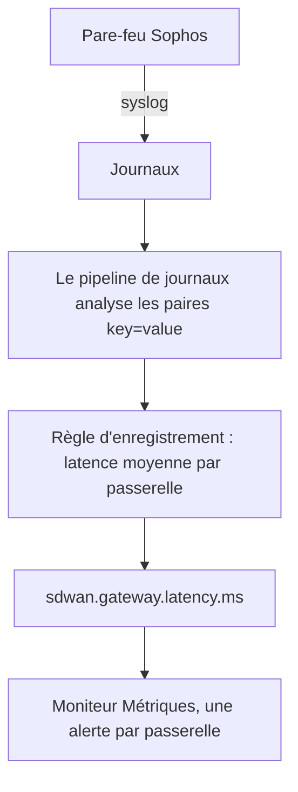

# Règles d'enregistrement de journaux

Une **Log Recording Rule** transforme des journaux en métrique. Chaque minute, elle prend les journaux auxquels son filtre correspond et écrit un nombre par minute dans le stockage des métriques : combien de journaux ont correspondu, ou la somme, la moyenne, le minimum, le maximum ou un centile d'un attribut numérique de ces journaux. Découpez le résultat selon jusqu'à cinq attributs de journal et vous obtenez une série par valeur : une par passerelle, par hôte, par client.

:::cards
- [Comment fonctionne une règle](#comment-fonctionne-une-règle): Compartiments, calendrier, rattrapage et trous.
- [Créer une règle](#créer-une-règle): Les champs de l'éditeur de règles.
- [Exemple : latence des passerelles SD-WAN](#exemple-latence-des-passerelles-sd-wan-dun-pare-feu-sophos): Du syslog d'un pare-feu à une alerte par passerelle.
- [Autorisations](#autorisations): Qui peut créer, modifier et lire les règles.
:::

## Vue d'ensemble

Le résultat est une métrique ordinaire. Affichez-la dans l'**Explorateur de métriques** et sur les tableaux de bord, et alertez dessus avec un moniteur **Métriques**, y compris une alerte par série avec **Regrouper par**.

Utilisez une règle d'enregistrement de journaux quand le nombre qui vous intéresse n'existe que dans vos journaux : les résumés SLA d'un pare-feu, un job batch qui journalise sa durée, les tailles de réponse d'un journal d'accès, ou simplement le nombre de journaux d'erreur qu'un service écrit chaque minute.

Les règles d'enregistrement de journaux se trouvent sous **Journaux → Paramètres → Règles d'enregistrement**. Leurs équivalents pour les métriques et les spans sont sous **Métriques → Paramètres → Règles d'enregistrement** et **Traces → Paramètres → Règles d'enregistrement**.

## Comment fonctionne une règle

```mermaid title="Ce que fait une règle d'enregistrement de journaux chaque minute"
flowchart TB
    logs["Journaux auxquels la règle correspond"] --> bucket["Compartiment d'une minute,<br/>selon l'horodatage du journal"]
    bucket --> groups["Un groupe par valeur de regroupement"]
    groups --> agg["Compter, ou agréger un attribut numérique"]
    agg --> points["Un point de métrique par série"]
    points --> explorer["Explorateur de métriques et tableaux de bord"]
    points --> monitor["Moniteurs Métriques"]
```

- **Un point par minute et par série.** Les journaux sont regroupés en compartiments d'une minute selon leur horodatage. Chaque compartiment produit un point pour chaque combinaison distincte des valeurs des attributs de regroupement.
- **Calculé 30 secondes après la fin de la minute.** Ce court délai permet aux journaux un peu en retard d'arriver encore dans leur minute. Un journal qui arrive plus tard n'est pas compté.
- **Pas de trous, pas de double comptage.** Chaque règle retient la dernière minute qu'elle a écrite (affichée comme **Computed Until** dans la liste des règles). Après un redémarrage du worker ou une autre interruption, elle rattrape les minutes manquées, jusqu'à 60 minutes en arrière, et n'écrit jamais deux fois la même minute.
- **Un comptage sans regroupement n'a jamais de trous.** Une minute sans journal correspondant est écrite comme `0`. Toute autre règle n'écrit rien pour une minute sans rien à agréger : les graphiques et les moniteurs voient une absence de données plutôt qu'un zéro inventé.
- **Écrit comme toute autre métrique dérivée.** Les points sont des points de données Gauge nommés d'après le **Nom de la métrique de sortie** de la règle, avec les attributs de regroupement et `oneuptime.derived.log_rule_id` (l'ID de la règle), et ils suivent la même rétention que les points des règles d'enregistrement de métriques et de traces : 15 jours.

Modifier la définition d'une règle s'applique à partir de la prochaine minute qu'elle écrit ; les points déjà écrits ne sont pas réécrits. Désactiver une règle l'arrête ; réactivée, elle rattrape les minutes manquées pendant sa désactivation, jusqu'aux mêmes 60 minutes.

## Créer une règle

:::steps
### Ouvrir les règles d'enregistrement

Allez dans **Journaux → Paramètres → Règles d'enregistrement** et choisissez **Créer : Log Recording Rule**.

### Nommer la règle

Saisissez un **Nom**. Le **Nom de la métrique de sortie** en dessous est formé à partir du nom pendant la saisie ; choisissez **Modifier** à côté pour saisir le vôtre.

### Choisir les journaux et ce qu'il faut calculer

Sous **Which Logs**, restreignez la règle avec des services de télémétrie, des gravités, un texte du corps et des filtres d'attribut. Choisissez une **Agrégation** et, pour tout sauf un comptage, le **Numeric Attribute** à agréger.

### Découper le résultat et enregistrer

Ajoutez éventuellement des attributs **Regrouper par** et une **Unit**. Vérifiez la ligne en bas de l'éditeur, puis enregistrez. En quelques minutes, la liste des règles affiche une heure **Computed Until**.
:::

| Champ | Rôle |
| --- | --- |
| Nom | Ce que calcule la règle, par exemple *SD-WAN gateway latency*. |
| Nom de la métrique de sortie | La métrique que la règle écrit. Formé à partir du nom (*SD-WAN gateway latency* écrit `sd_wan_gateway_latency`), sauf si vous choisissez **Modifier** et saisissez le vôtre. Il doit être unique parmi les règles d'enregistrement du projet. |
| Which Logs | Filtres facultatifs, tous combinés avec AND : services de télémétrie, gravités, texte contenu dans le corps et filtres d'attribut (un attribut égal à une valeur). |
| Agrégation | `Count of logs`, ou une agrégation d'un attribut numérique (voir ci-dessous). |
| Numeric Attribute | Pour toute agrégation sauf le comptage : l'attribut dont les valeurs sont agrégées, par exemple `latency`. |
| Regrouper par | Facultatif : jusqu'à 5 clés d'attribut. Une série par combinaison distincte de leurs valeurs. |
| Unit | Facultatif : l'unité de la métrique de sortie, par exemple `ms`. Affichée partout où la métrique est tracée. |
| Description | Sous **Plus de champs** : à quoi sert la règle. |
| Activé | Sous **Plus de champs** : activé par défaut. Seules les règles activées sont calculées. |

La ligne en bas de l'éditeur indique ce que la règle écrira, par exemple `avg(latency) by gw_name, profile_name`.

Une règle peut filtrer sur au plus 10 attributs et 100 services de télémétrie.

### Agrégations

| Agrégation | Le point de chaque minute |
| --- | --- |
| Count of logs | Combien de journaux ont correspondu au filtre. |
| Moyenne | La moyenne des valeurs de l'attribut numérique. |
| Somme | Les valeurs de l'attribut additionnées. |
| Minimum | La plus petite valeur. |
| Maximum | La plus grande valeur. |
| p50 (median) | La valeur médiane. |
| p75 | Le 75e centile. |
| p90 | Le 90e centile. |
| p95 | Le 95e centile. |
| p99 | Le 99e centile. |

### Attributs numériques

La valeur de l'attribut numérique doit être un nombre simple. Elle peut arriver comme nombre (`latency=11` analysé comme nombre) ou comme texte (`"11"`, `"11.5"`, `"1e3"`). Un journal dont la valeur manque ou n'est pas un nombre (`"11ms"`, `"n/a"`, une chaîne vide) est **ignoré**. Il n'est jamais compté comme `0` : un journal mal formé ne peut donc pas tirer une moyenne vers le bas.

### Clés d'attribut

Les clés des filtres d'attribut correspondent quelle que soit leur casse, comme les filtres de l'explorateur de journaux. L'attribut numérique et les clés de regroupement doivent être écrits exactement comme vos journaux les portent, y compris un éventuel préfixe ajouté par un pipeline de journaux. Les champs de clé proposent les clés que portent les journaux de votre projet : choisissez dans la liste plutôt que de taper une clé à la main.

Les clés peuvent contenir des lettres, des chiffres et `. _ : / -`.

### Regroupement et plafond de séries

Chaque clé de regroupement multiplie le nombre de séries qu'écrit une règle : regroupez donc par des attributs qui identifient une chose que vous voulez voir ou surveiller séparément (une passerelle, un hôte, un client), et non par des attributs qui changent à chaque journal, comme un ID de requête ou l'adresse IP d'un client.

Une règle écrit au plus 1 000 séries par minute. Au-delà, les séries qui ont le plus de journaux correspondants sont gardées et le reste de cette minute est abandonné. Un journal qui ne porte pas l'un des attributs de regroupement compte quand même ; sa série est écrite sans cet attribut.

## Exemple : latence des passerelles SD-WAN d'un pare-feu Sophos

Un pare-feu Sophos XGS avec la journalisation SD-WAN activée envoie toutes les quelques minutes un résumé SLA par profil SD-WAN et par passerelle :

```text
log_type="SD-WAN" log_component="SLA" profile_name="Branch-Internet" gw_name="WAN2" latency=11 jitter=2 packet_loss=0 gw_status="up" sla_status="SLA met"
```

Cet exemple transforme ces résumés en métrique de latence par passerelle, et alerte quand la latence d'une passerelle reste élevée.



:::steps
### Faire entrer les journaux, avec leurs champs en attributs

1. Envoyez le syslog du pare-feu à OneUptime : voir [Syslog](/docs/telemetry/syslog).
2. Sous **Journaux → Paramètres → Pipelines**, ajoutez un pipeline avec un processeur qui découpe les paires `key=value` du corps en attributs de journal, afin que chaque résumé porte `log_type`, `log_component`, `profile_name`, `gw_name`, `latency`, `jitter` et `packet_loss` comme attributs. Le [Key=Value Parser](/docs/telemetry/log-pipelines#keyvalue-parser) le fait.
3. Ouvrez l'explorateur **Journaux** et vérifiez les noms d'attributs sur un journal SLA. Si votre pipeline ajoute un préfixe, utilisez les noms préfixés ci-dessous.

### Créer la règle d'enregistrement

Sous **Journaux → Paramètres → Règles d'enregistrement**, créez une règle :

- **Nom :** SD-WAN gateway latency
- **Nom de la métrique de sortie :** choisissez **Modifier** et saisissez `sdwan.gateway.latency.ms`
- **Which Logs :** filtres d'attribut `log_type` = `SD-WAN` et `log_component` = `SLA`
- **Agrégation :** Moyenne, **Numeric Attribute :** `latency`
- **Regrouper par :** `gw_name` et `profile_name`
- **Unit :** `ms`

Via l'API, MCP ou Terraform, la **définition** de la même règle est :

```json
{
  "filter": {
    "attributeFilters": [
      { "key": "log_type", "value": "SD-WAN" },
      { "key": "log_component", "value": "SLA" }
    ]
  },
  "aggregationType": "Avg",
  "valueAttribute": "latency",
  "groupByAttributes": ["gw_name", "profile_name"],
  "unit": "ms"
}
```

Recommencez avec `jitter` (`sdwan.gateway.jitter.ms`, unité `ms`) et `packet_loss` (`sdwan.gateway.packet_loss.percent`, unité `%`) pour les deux autres mesures SLA. Une règle **Count of logs** filtrée sur `gw_status` = `down` et regroupée par `gw_name` compte les signalements de passerelle hors service par passerelle.

En quelques minutes, la liste des règles affiche une heure **Computed Until**, et `sdwan.gateway.latency.ms` apparaît dans l'explorateur de métriques : choisissez-la, regroupez par `gw_name`, et vous avez une courbe de latence par passerelle.

### Alerter quand la latence d'une passerelle reste élevée

Créez un moniteur **Métriques** (voir [Surveillance des métriques](/docs/monitor/metrics-monitor)) :

1. **Requête de métrique :** `sdwan.gateway.latency.ms`, agrégation **Moyenne**, **Regrouper par** `gw_name` et `profile_name`.
2. **Fenêtre de temps glissante :** Past 15 Minutes. Le pare-feu rapporte toutes les quelques minutes, la fenêtre contient donc plusieurs points par passerelle.
3. **Stratégie d'agrégation :** **All Values** : chaque point de la fenêtre doit dépasser le seuil, pour qu'un seul résumé lent n'alerte personne. Utilisez plutôt **Moyenne** pour alerter sur une moyenne élevée.
4. **Critères :** Metric value **Greater Than** `150` ouvre une alerte.
5. Utilisez éventuellement les valeurs de regroupement dans le titre de l'alerte, par exemple `SD-WAN latency high on {{gw_name}} ({{profile_name}})`.

Avec un regroupement défini, chaque passerelle est sa propre série : si WAN2 ralentit, une alerte s'ouvre pour WAN2 seule, et elle se résout d'elle-même quand WAN2 se rétablit. Voir [Alertes par série](/docs/monitor/metrics-monitor#alertes-par-série-group-by).
:::

## Bon à savoir

- **Les horodatages viennent des journaux.** Un journal tombe dans la minute de son propre horodatage. Un équipement dont l'horloge dérive de plus d'un petit peu range ses journaux dans la mauvaise minute, ou complètement hors de la fenêtre.
- **Pas de calcul rétroactif.** Une nouvelle règle commence par la minute qui précède sa première exécution ; les journaux plus anciens ne sont pas calculés.
- **Supprimer une règle** l'arrête. Les points déjà écrits restent jusqu'à leur expiration.
- **Les règles d'enregistrement voient tous les journaux du projet.** Quiconque peut lire la métrique de sortie voit des nombres calculés à partir de chaque journal auquel le filtre de la règle correspond : créer et modifier des règles d'enregistrement de journaux est donc réservé aux propriétaires et administrateurs du projet et aux autorisations **Create / Edit Log Recording Rule**.

## Autorisations

| Autorisation | Permet |
| --- | --- |
| Create Log Recording Rule | Créer des règles. |
| Edit Log Recording Rule | Modifier des règles et les désactiver. |
| Delete Log Recording Rule | Supprimer des règles. |
| Read Log Recording Rule | Voir les règles et ce qu'elles calculent. |

Les propriétaires et administrateurs du projet peuvent tout faire. Les membres du projet, les lecteurs et les rôles de télémétrie peuvent lire les règles.

## Étapes suivantes

:::cards
- [Surveillance des métriques](/docs/monitor/metrics-monitor): Alerter sur les métriques que vos règles écrivent.
- [Pipelines de journaux](/docs/telemetry/log-pipelines): Extraire les attributs qu'une règle agrège.
- [Syslog](/docs/telemetry/syslog): Envoyer les journaux des pare-feu et des serveurs à OneUptime.
:::
