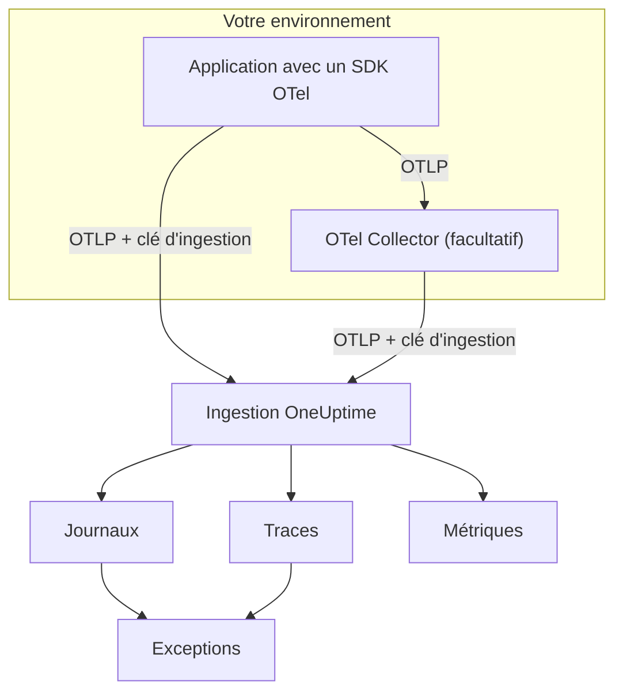

# OpenTelemetry

OneUptime ingère les logs, les métriques et les traces via le protocole OpenTelemetry (OTLP). Pointez n'importe quel SDK OpenTelemetry, ou un OpenTelemetry Collector, vers OneUptime avec une clé d'ingestion, et vos données apparaissent sous **Journaux**, **Traces**, **Métriques** et **Exceptions**. Cette page fait envoyer des données à un service en quelques minutes, puis couvre les points de terminaison, les limites et les erreurs à connaître en production.

:::cards
- [Démarrage rapide](#démarrage-rapide): Créer une clé, définir quatre variables d'environnement et ajouter le SDK.
- [Utiliser un Collector](#envoyer-via-un-opentelemetry-collector): Ajouter OneUptime comme exportateur à un collector que vous utilisez déjà.
- [Points de terminaison et limites](#points-de-terminaison-et-limites): URL, ports, encodages, limites de taille et codes de statut.
- [Dépannage](#dépannage): Que vérifier quand aucune donnée n'arrive.
:::

## Fonctionnement

Votre application exporte en OTLP directement vers OneUptime, ou vers un OpenTelemetry Collector qui transmet les données. Chaque requête porte votre clé d'ingestion dans l'en-tête `x-oneuptime-token`, et OneUptime utilise cette clé pour trouver votre projet.



- **Les services sont créés pour vous.** L'attribut de ressource `service.name` (défini par `OTEL_SERVICE_NAME`) nomme le service auquel appartiennent vos données. OneUptime crée le service au premier envoi et l'affiche sous **Produits → Services**.
- **Les erreurs deviennent des exceptions.** Les événements d'exception des spans, et les exceptions enregistrées dans les logs, sont regroupés en problèmes sous **Exceptions** — voir [Exceptions issues des logs](#exceptions-issues-des-logs).

## Avant de commencer

- Un projet OneUptime dans lequel vous pouvez créer des clés d'ingestion : les propriétaires et administrateurs du projet le peuvent, ainsi que toute personne disposant de la permission **Create Telemetry Ingestion Key**.
- Une application à laquelle vous pouvez ajouter un SDK OpenTelemetry, ou un OpenTelemetry Collector.
- Un accès HTTPS sortant (port 443) depuis votre application ou votre collector vers `oneuptime.com`, ou vers votre propre hôte OneUptime.

> [!NOTE]
> Sur OneUptime Cloud, la télémétrie est facturée par Go ingéré. Un projet du forfait Free a besoin d'un moyen de paiement avant de pouvoir envoyer de la télémétrie — la fenêtre qui crée la clé affiche les tarifs.

## Démarrage rapide

:::steps
### Créer une clé d'ingestion

1. Allez dans **Produits → Paramètres du projet**.
2. Dans le menu latéral, ouvrez **Télémétrie & APM** et sélectionnez **Clés d'ingestion**.
3. Cliquez sur **Créer une clé d'ingestion**. La fenêtre remplit un nom et choisit le type de clé **Serveur**, celui avec lequel une application ou un collector envoie. Renommez-la si vous le souhaitez, puis cliquez sur **Créer une clé d'ingestion**.


La nouvelle clé s'ouvre sur sa propre page. Copiez sa **Clé secrète** — c'est le jeton que vous envoyez dans `x-oneuptime-token`.


### Définir les variables d'environnement OpenTelemetry

Tous les SDK OpenTelemetry lisent les mêmes variables d'environnement standard, donc cette étape est identique dans tous les langages.

| Variable d'environnement | Valeur | Rôle |
| --- | --- | --- |
| `OTEL_EXPORTER_OTLP_ENDPOINT` | `https://oneuptime.com/otlp` | La destination. Le SDK ajoute lui-même `/v1/traces`, `/v1/metrics` et `/v1/logs`. |
| `OTEL_EXPORTER_OTLP_HEADERS` | `x-oneuptime-token=YOUR_ONEUPTIME_INGESTION_KEY` | Envoie votre clé d'ingestion avec chaque requête. |
| `OTEL_EXPORTER_OTLP_PROTOCOL` | `http/protobuf` | OTLP sur HTTP. Certains SDK utilisent gRPC par défaut, qui passe par un autre point de terminaison. |
| `OTEL_SERVICE_NAME` | `my-service` | Le service sous lequel vos données apparaissent dans OneUptime. |

```bash
export OTEL_EXPORTER_OTLP_ENDPOINT="https://oneuptime.com/otlp"
export OTEL_EXPORTER_OTLP_HEADERS="x-oneuptime-token=YOUR_ONEUPTIME_INGESTION_KEY"
export OTEL_EXPORTER_OTLP_PROTOCOL="http/protobuf"
export OTEL_SERVICE_NAME="my-service"
```

Auto-hébergé ? Remplacez `https://oneuptime.com` par l'URL de votre instance OneUptime, par exemple `https://oneuptime.example.com/otlp`. Pour étiqueter les exceptions avec un environnement, définissez aussi `OTEL_RESOURCE_ATTRIBUTES` à `deployment.environment=production`.

### Ajouter OpenTelemetry à votre application

Choisissez votre langage. Chaque configuration lit les variables d'environnement ci-dessus, donc aucun point de terminaison ni aucune clé n'apparaît dans votre code.

:::tabs
@tab Node.js
Installez le SDK, les instrumentations automatiques et les exportateurs OTLP/HTTP :

```bash
npm install @opentelemetry/sdk-node @opentelemetry/auto-instrumentations-node \
  @opentelemetry/exporter-trace-otlp-proto @opentelemetry/exporter-metrics-otlp-proto \
  @opentelemetry/exporter-logs-otlp-proto @opentelemetry/sdk-metrics @opentelemetry/sdk-logs
```

Créez le SDK dans un fichier à part :

```javascript title="instrumentation.js"
const { NodeSDK } = require("@opentelemetry/sdk-node");
const { getNodeAutoInstrumentations } = require("@opentelemetry/auto-instrumentations-node");
const { OTLPTraceExporter } = require("@opentelemetry/exporter-trace-otlp-proto");
const { OTLPMetricExporter } = require("@opentelemetry/exporter-metrics-otlp-proto");
const { OTLPLogExporter } = require("@opentelemetry/exporter-logs-otlp-proto");
const { PeriodicExportingMetricReader } = require("@opentelemetry/sdk-metrics");
const { BatchLogRecordProcessor } = require("@opentelemetry/sdk-logs");

// The exporters read OTEL_EXPORTER_OTLP_ENDPOINT and OTEL_EXPORTER_OTLP_HEADERS.
const sdk = new NodeSDK({
  traceExporter: new OTLPTraceExporter(),
  metricReader: new PeriodicExportingMetricReader({
    exporter: new OTLPMetricExporter(),
  }),
  logRecordProcessors: [new BatchLogRecordProcessor(new OTLPLogExporter())],
  instrumentations: [getNodeAutoInstrumentations()],
});

sdk.start();
```

Chargez-le avant le code de votre application :

```bash
node --require ./instrumentation.js app.js
```
@tab Python
Installez la distribution OpenTelemetry et l'exportateur, puis les instrumentations des bibliothèques qu'utilise votre application :

```bash
pip install opentelemetry-distro opentelemetry-exporter-otlp
opentelemetry-bootstrap -a install
```

Démarrez votre application via `opentelemetry-instrument`. Il exporte les traces, les métriques et les logs ; la variable de journalisation envoie aussi les enregistrements écrits avec le module `logging` de Python :

```bash
OTEL_PYTHON_LOGGING_AUTO_INSTRUMENTATION_ENABLED=true opentelemetry-instrument python app.py
```
@tab Go
Ajoutez le SDK et les exportateurs OTLP/HTTP :

```bash
go get go.opentelemetry.io/otel go.opentelemetry.io/otel/sdk go.opentelemetry.io/otel/sdk/metric \
  go.opentelemetry.io/otel/exporters/otlp/otlptrace/otlptracehttp \
  go.opentelemetry.io/otel/exporters/otlp/otlpmetric/otlpmetrichttp
```

Créez les fournisseurs de traceurs et de compteurs au démarrage du programme :

```go title="main.go"
package main

import (
	"context"
	"log"

	"go.opentelemetry.io/otel"
	"go.opentelemetry.io/otel/exporters/otlp/otlpmetric/otlpmetrichttp"
	"go.opentelemetry.io/otel/exporters/otlp/otlptrace/otlptracehttp"
	sdkmetric "go.opentelemetry.io/otel/sdk/metric"
	sdktrace "go.opentelemetry.io/otel/sdk/trace"
)

func main() {
	ctx := context.Background()

	// Both exporters read OTEL_EXPORTER_OTLP_ENDPOINT and OTEL_EXPORTER_OTLP_HEADERS.
	traceExporter, err := otlptracehttp.New(ctx)
	if err != nil {
		log.Fatal(err)
	}
	tracerProvider := sdktrace.NewTracerProvider(sdktrace.WithBatcher(traceExporter))
	defer tracerProvider.Shutdown(ctx)
	otel.SetTracerProvider(tracerProvider)

	metricExporter, err := otlpmetrichttp.New(ctx)
	if err != nil {
		log.Fatal(err)
	}
	meterProvider := sdkmetric.NewMeterProvider(
		sdkmetric.WithReader(sdkmetric.NewPeriodicReader(metricExporter)),
	)
	defer meterProvider.Shutdown(ctx)
	otel.SetMeterProvider(meterProvider)

	// Your application code.
}
```

Les fournisseurs prennent `OTEL_SERVICE_NAME` dans l'environnement. Pour les logs, ajoutez `otlploghttp` avec un pont de journalisation comme `otelslog` ; il lit les mêmes variables.
@tab Java
Téléchargez l'agent Java OpenTelemetry et attachez-le à votre application. Aucune modification du code n'est nécessaire :

```bash
curl -L -O https://github.com/open-telemetry/opentelemetry-java-instrumentation/releases/latest/download/opentelemetry-javaagent.jar
java -javaagent:opentelemetry-javaagent.jar -jar my-app.jar
```

L'agent instrumente les frameworks et bibliothèques courants, et exporte les traces, les métriques et les logs écrits via Logback ou Log4j.
@tab .NET
Ajoutez les paquets OpenTelemetry pour ASP.NET Core :

```bash
dotnet add package OpenTelemetry.Extensions.Hosting
dotnet add package OpenTelemetry.Exporter.OpenTelemetryProtocol
dotnet add package OpenTelemetry.Instrumentation.AspNetCore
dotnet add package OpenTelemetry.Instrumentation.Http
```

Enregistrez OpenTelemetry au démarrage. `UseOtlpExporter()` envoie les traces, les métriques et les logs, et lit les variables `OTEL_EXPORTER_OTLP_*` :

```csharp title="Program.cs"
using OpenTelemetry;
using OpenTelemetry.Metrics;
using OpenTelemetry.Trace;

var builder = WebApplication.CreateBuilder(args);

builder.Services.AddOpenTelemetry()
    .WithTracing(tracing => tracing
        .AddAspNetCoreInstrumentation()
        .AddHttpClientInstrumentation())
    .WithMetrics(metrics => metrics
        .AddAspNetCoreInstrumentation()
        .AddHttpClientInstrumentation())
    .WithLogging()
    .UseOtlpExporter();

var app = builder.Build();
app.Run();
```

Vous utilisez Serilog ? Consultez [Serilog](/docs/telemetry/serilog) pour envoyer ses logs à OneUptime.
:::

### Vérifier que les données arrivent

Demandez à OneUptime s'il accepte votre clé :

```bash
curl -i -H "x-oneuptime-token: YOUR_ONEUPTIME_INGESTION_KEY" \
  https://oneuptime.com/otlp/v1/validate
```

Une clé valide renvoie `200` avec `"valid": true`. Tout le reste renvoie `401` avec un message qui indique le problème — inconnue, désactivée ou expirée.

Lancez ensuite votre application et utilisez-la pendant une minute. Ouvrez **Produits → Services** : votre service y figure sous le nom défini dans `OTEL_SERVICE_NAME`, avec ses logs, traces, métriques et exceptions. **Produits → Journaux**, **Produits → Traces** et **Produits → Métriques** affichent les mêmes données pour tous les services.
:::

:::details Envoyer un log de test sans SDK
OTLP/HTTP accepte aussi le JSON, vous pouvez donc publier un log avec `curl`. La valeur `9` de `severityNumber` en fait un log d'information :

```bash
curl -i https://oneuptime.com/otlp/v1/logs \
  -H "Content-Type: application/json" \
  -H "x-oneuptime-token: YOUR_ONEUPTIME_INGESTION_KEY" \
  -d '{
    "resourceLogs": [{
      "resource": {
        "attributes": [
          { "key": "service.name", "value": { "stringValue": "my-service" } }
        ]
      },
      "scopeLogs": [{
        "logRecords": [{
          "severityNumber": 9,
          "body": { "stringValue": "Hello from curl" }
        }]
      }]
    }]
  }'
```

Un `200` signifie que le log a été accepté. Il apparaît sous **Produits → Journaux** en quelques secondes, dans le service `my-service`.
:::

## Envoyer via un OpenTelemetry Collector

Utilisez un collector si vous en avez déjà un, si vous voulez regrouper, filtrer ou enrichir les données en un seul endroit, ou pour garder la clé d'ingestion hors de vos applications. Vos applications exportent vers le collector, et seul le collector parle à OneUptime.

:::steps
### Ajouter OneUptime comme exportateur

Ajoutez un exportateur `otlphttp` qui pointe vers OneUptime, et faites passer chaque pipeline par lui :

```yaml title="otel-collector-config.yaml"
receivers:
  otlp:
    protocols:
      grpc:
        endpoint: 0.0.0.0:4317
      http:
        endpoint: 0.0.0.0:4318

processors:
  batch: {}

exporters:
  otlphttp:
    endpoint: https://oneuptime.com/otlp
    headers:
      x-oneuptime-token: YOUR_ONEUPTIME_INGESTION_KEY

service:
  pipelines:
    traces:
      receivers: [otlp]
      processors: [batch]
      exporters: [otlphttp]
    metrics:
      receivers: [otlp]
      processors: [batch]
      exporters: [otlphttp]
    logs:
      receivers: [otlp]
      processors: [batch]
      exporters: [otlphttp]
```

Gardez les valeurs par défaut de l'exportateur : il envoie du protobuf compressé avec gzip, et OneUptime accepte les deux. Ne définissez pas d'en-tête `Content-Type` sur l'exportateur — OneUptime choisit son décodeur d'après cet en-tête, donc un type de contenu JSON devant des octets protobuf casse l'ingestion.

### Lancer le collector

:::tabs
@tab Docker
```bash
docker run -d --name otel-collector \
  -p 4317:4317 -p 4318:4318 \
  -v "$(pwd)/otel-collector-config.yaml:/etc/otelcol-contrib/config.yaml" \
  otel/opentelemetry-collector-contrib:latest
```
@tab Linux
```bash
otelcol-contrib --config otel-collector-config.yaml
```
:::

Le collector écoute l'OTLP sur le port `4317` (gRPC) et `4318` (HTTP), les ports vers lesquels les SDK envoient par défaut.

### Pointer vos applications vers le collector

Dans vos applications, définissez `OTEL_EXPORTER_OTLP_ENDPOINT` vers le collector, par exemple `http://localhost:4318`, et supprimez `OTEL_EXPORTER_OTLP_HEADERS` — le collector ajoute la clé. Gardez `OTEL_SERVICE_NAME` dans chaque application.

Les données arrivent dans OneUptime exactement comme dans le démarrage rapide. Sinon, le journal du collector indique pourquoi — voir [Dépannage](#dépannage).
:::

Vous exportez déjà vers un autre fournisseur ? Ajoutez l'exportateur `otlphttp` à côté de l'existant et listez les deux dans les `exporters` de chaque pipeline pour envoyer aux deux le temps de comparer. Pour collecter aussi les métriques de l'hôte et les fichiers de logs, consultez le guide [Host OpenTelemetry Collector](/docs/telemetry/host-otel-collector).

## Points de terminaison et limites

| Paramètre | OTLP/HTTP (recommandé) | OTLP/gRPC |
| --- | --- | --- |
| Point de terminaison | `https://oneuptime.com/otlp` | `https://oneuptime.com:443` |
| Authentification | En-tête `x-oneuptime-token` | Métadonnée `x-oneuptime-token` |
| Encodage | Protobuf (`application/x-protobuf`) ou JSON (`application/json`) | Protobuf |
| Compression | Aucune, `gzip`, `deflate` ou `zstd` | Aucune ou `gzip` |
| Taille de requête | Jusqu'à 4 Mo par requête sur `/otlp` | Jusqu'à 4 Mo par message |

Sur HTTP, chaque signal a son propre chemin sous le point de terminaison. Les SDK et le collector l'ajoutent pour vous ; ne le définissez vous-même que lorsqu'un outil demande une URL complète.

| Signal | URL OTLP/HTTP |
| --- | --- |
| Traces | `https://oneuptime.com/otlp/v1/traces` |
| Métriques | `https://oneuptime.com/otlp/v1/metrics` |
| Logs | `https://oneuptime.com/otlp/v1/logs` |
| Profils | `https://oneuptime.com/otlp/v1/profiles` |

Pour le profilage continu, la plupart des profileurs envoient plutôt vers le point de terminaison compatible Pyroscope — voir [Profilage continu](/docs/telemetry/profiles). Un collector qui exporte des profils OTLP doit définir le `profiles_endpoint` de l'exportateur sur `https://oneuptime.com/otlp/v1/profiles`, car par défaut il envoie les profils vers un chemin de développement que OneUptime ne sert pas.

### OTLP sur gRPC

OneUptime sert OTLP/gRPC sur le même hôte que l'application web, sur le port 443 en TLS. Définissez `OTEL_EXPORTER_OTLP_PROTOCOL` à `grpc` et `OTEL_EXPORTER_OTLP_ENDPOINT` à `https://oneuptime.com:443`, et envoyez le même en-tête `x-oneuptime-token`. Dans un collector, utilisez l'exportateur `otlp` avec `endpoint: oneuptime.com:443` et les mêmes `headers`.

Sur une installation auto-hébergée, gRPC n'atteint OneUptime qu'en HTTPS : une connexion HTTP en clair (h2c) est refusée. Si votre instance est servie en HTTP simple, utilisez OTLP/HTTP.

Deux réglages d'une clé ne s'appliquent qu'à OTLP/HTTP : sa **Requests Per Minute Limit** et son **Pinned Service Name**. Les données envoyées en gRPC gardent le `service.name` avec lequel elles ont été envoyées et ne sont pas comptées dans la limite.

### Réponses

OneUptime répond à un export dès que les données sont en file d'attente, et les données apparaissent quelques secondes plus tard.

| Réponse | Statut gRPC | Signification | Que faire |
| --- | --- | --- | --- |
| `200` | `OK` | Accepté. | Rien. |
| `401` | `UNAUTHENTICATED` | La clé est absente, inconnue ou expirée. | Comparez la valeur de `x-oneuptime-token` à la **Clé secrète** de la clé. |
| `402` | `PERMISSION_DENIED` | OneUptime Cloud uniquement : le projet est sur le forfait Free et n'a pas de moyen de paiement. | Ajoutez-en un sous **Paramètres du projet → Facturation et factures → Facturation**. |
| `413` | — | La requête dépasse la limite de taille. | Envoyez des lots plus petits. |
| `415` | — | `Content-Encoding` non pris en charge. | Utilisez `gzip`, `deflate` ou `zstd`, ou aucune compression. |
| `422` | `PERMISSION_DENIED` | La clé est désactivée, ou c'est une clé Navigateur utilisée hors de ses origines autorisées. | Réactivez la clé, ou envoyez avec une clé Serveur. |
| `429` | — | La **Requests Per Minute Limit** de la clé est atteinte. | Rien au début : les exportateurs réessaient après le délai `Retry-After`. Augmentez la limite si cela se répète. |
| `503` | `UNAVAILABLE` | OneUptime démarre, ou la file d'ingestion est indisponible. | Rien : les exportateurs OTLP réessaient d'eux-mêmes après un `503`. |

`401`, `402`, `413`, `415` et `422` sont des erreurs définitives pour les exportateurs OTLP : l'exportateur abandonne le lot et journalise l'erreur au lieu de réessayer.

### Redémarrages et mises à niveau

Pendant que OneUptime redémarre ou est mis à niveau, il répond aux exports par `503` et `Retry-After: 5` jusqu'à ce qu'il soit prêt, et les exportateurs les renvoient. L'exportateur d'un collector réessaie par défaut pendant cinq minutes (`retry_on_failure`) et garde ce qu'il n'a pas pu envoyer dans sa `sending_queue` : laissez donc les deux activés. Le temps pendant lequel OneUptime ne recevait rien n'est jamais reproché à vos serveurs, hôtes ou autres ressources : voir [Quand OneUptime ne reçoit pas de données](/docs/monitor/when-oneuptime-is-not-receiving#au-démarrage).

### Clés d'ingestion

La page de chaque clé, sous **Paramètres du projet → Télémétrie & APM → Clés d'ingestion**, propose ces réglages :

| Réglage | Rôle |
| --- | --- |
| **Type de clé** | **Serveur** (par défaut) pour les applications, les collectors et les agents. **Navigateur** pour les clés livrées dans une page web : en écriture seule, et acceptées uniquement depuis leurs **Origines autorisées**. Il ne peut pas être modifié après la création de la clé. |
| **Origines autorisées** | Les origines web depuis lesquelles une clé Navigateur fonctionne, par exemple `https://app.example.com`. Ignoré sur une clé Serveur. |
| **Pinned Service Name** | Lorsqu'il est défini, remplace `service.name` sur tout ce qui est envoyé avec cette clé en OTLP/HTTP. |
| **Activé** | Désactivez-le pour cesser immédiatement d'accepter les données envoyées avec la clé, sans la supprimer. |
| **Expire le** | Après cette date, la clé est refusée. Vide signifie qu'elle n'expire jamais. |
| **Requests Per Minute Limit** | Le nombre maximal de requêtes OTLP/HTTP par minute acceptées avec la clé, pour l'ensemble des clients qui l'utilisent. Vide signifie aucune limite sur une clé Serveur, et 6 000 sur une clé Navigateur. |
| **Dernière utilisation le** | Quand des données ont été acceptées pour la dernière fois avec la clé. Utilisez-le pour repérer les clés que vous pouvez renouveler ou supprimer sans risque. |

**Réinitialiser la clé secrète** sur la page de la clé remplace le secret. Toute application et tout collector qui envoie avec l'ancien est refusé jusqu'à ce que vous le mettiez à jour.

## OneUptime auto-hébergé

Tout ce qui est sur cette page fonctionne de la même façon avec votre propre installation. Utilisez votre URL OneUptime partout où cette page indique `https://oneuptime.com` :

- `OTEL_EXPORTER_OTLP_ENDPOINT` vaut `https://YOUR-ONEUPTIME-HOST/otlp`, ou `http://YOUR-ONEUPTIME-HOST/otlp` si vous servez OneUptime en HTTP simple.
- L'ingress fourni accepte des requêtes jusqu'à 4 Mo sur `/otlp`. Un proxy que vous placez devant OneUptime peut avoir une limite plus basse — ingress-nginx fixe `proxy-body-size` à 1 Mo par défaut —, augmentez-la donc aussi pour `/otlp`, sinon les exportateurs reçoivent `413`.
- Si `DISABLE_TELEMETRY_INGESTION=true` est défini, OneUptime accepte chaque export et ne stocke rien. Vérifiez-le en premier quand une instance auto-hébergée n'affiche aucune donnée.

## Exceptions issues des logs

OneUptime trouve les exceptions dans vos **logs** et les regroupe dans la même vue **Exceptions** qu'alimentent les erreurs des traces. Chaque log appartient déjà à un service ou à un hôte, donc l'exception lui est attribuée. Les exceptions des logs et des traces partagent le même regroupement par empreinte, si bien qu'une erreur signalée à la fois par une trace et par un log devient un seul problème.

Un log devient une exception de deux façons :

| Détection | Logs concernés | Fonctionnement |
| --- | --- | --- |
| **Attributs d'exception** (recommandé) | Tous les logs | Un enregistrement de log portant l'attribut OpenTelemetry `exception.type`, `exception.message` ou `exception.stacktrace` devient directement une exception. La plupart des intégrations de journalisation les définissent lorsque vous journalisez une exception : appenders Logback et Log4j, Serilog, l'instrumentation de journalisation Python. C'est précis et cela fonctionne dans tous les langages. |
| **Trace de pile dans le corps** | Logs d'erreur et fatals qui ne portent ni ID de trace ni ID de span | OneUptime analyse les 16 premiers Ko du corps à la recherche d'une trace de pile JavaScript, Python, Java, Go, Ruby, C#/.NET ou PHP, et en extrait le type, le message et les frames. Un log écrit à l'intérieur d'un span est ignoré, car le span signale lui-même l'exception. |

L'analyse du corps convient aux logs en texte brut comme stdout, journald ou syslog lus par un collector. Une trace de pile sur plusieurs lignes doit arriver sous la forme d'un seul enregistrement de log : activez donc la recombinaison multiligne dans le collector — voir le guide [Host OpenTelemetry Collector](/docs/telemetry/host-otel-collector).

La détection est activée par défaut. Sur une installation auto-hébergée, désactivez-la en définissant `TELEMETRY_LOG_EXCEPTION_EXTRACTION_ENABLED=false` sur le service `app` — et aussi sur le `worker`, si vous utilisez le worker dédié du chart Helm.

## Dépannage

:::details Aucune donnée n'apparaît et l'exportateur journalise `401`
La clé est absente, inconnue ou expirée. Vérifiez que `OTEL_EXPORTER_OTLP_HEADERS` vaut `x-oneuptime-token=` suivi de la **Clé secrète** de la clé, sans guillemets ni espaces dans la valeur, et que la clé appartient au projet que vous consultez. La requête de validation de [Vérifier que les données arrivent](#vérifier-que-les-données-arrivent) indique de quel cas il s'agit.
:::

:::details L'exportateur journalise `422`
La clé est désactivée, ou c'est une clé Navigateur. Réactivez **Activé** dans les réglages de la clé, ou créez une clé **Serveur** : une clé Navigateur n'est acceptée que depuis une page web située sur l'une de ses origines autorisées.
:::

:::details L'exportateur journalise `402`
Le projet est sur le forfait Free de OneUptime Cloud et n'a pas de moyen de paiement, et la télémétrie est facturée à l'usage. Ajoutez un moyen de paiement sous **Paramètres du projet → Facturation et factures → Facturation**, et les exports sont de nouveau acceptés.
:::

:::details L'exportateur journalise `404`
Le SDK envoie vers le mauvais chemin. `OTEL_EXPORTER_OTLP_ENDPOINT` doit se terminer par `/otlp`, sans barre oblique finale ni `/v1/...` — le SDK l'ajoute. Si vous définissez une variable propre à un signal comme `OTEL_EXPORTER_OTLP_TRACES_ENDPOINT`, elle attend l'URL complète, par exemple `https://oneuptime.com/otlp/v1/traces`.
:::

:::details Rien ne se passe et le SDK journalise des erreurs de connexion
Le SDK exporte probablement en gRPC vers un point de terminaison HTTP, ou vers `localhost`. Définissez `OTEL_EXPORTER_OTLP_PROTOCOL=http/protobuf`, ou utilisez le point de terminaison gRPC décrit dans [OTLP sur gRPC](#otlp-sur-grpc). Vérifiez aussi que le processus voit bien les variables d'environnement — dans un conteneur, définissez-les sur le conteneur, pas dans votre shell.
:::

:::details Le collector journalise `Exporting failed` avec `413`
Un lot dépasse la limite de taille. Réduisez la taille des lots, par exemple avec `send_batch_max_size: 1000` sur le processeur `batch`. Si vous auto-hébergez derrière votre propre proxy, vérifiez aussi la limite de taille de corps de ce proxy.
:::

:::details Les données arrivent sous le mauvais service, ou sous Unknown Service
Le service vient de l'attribut de ressource `service.name`. Définissez `OTEL_SERVICE_NAME` dans chaque application. Si la clé a un **Pinned Service Name**, chaque export OTLP/HTTP avec cette clé est classé sous ce nom à la place.
:::

## Étapes suivantes

:::cards
- [Syntaxe de recherche](/docs/telemetry/search-syntax): Filtrer les logs, traces, métriques et exceptions dans les explorateurs.
- [Pipelines de logs](/docs/telemetry/log-pipelines): Analyser et enrichir les logs à leur arrivée.
- [Moniteur de logs](/docs/monitor/logs-monitor): Alerter quand des logs correspondants apparaissent.
- [Host OpenTelemetry Collector](/docs/telemetry/host-otel-collector): Collecter les métriques de l'hôte et les fichiers de logs avec un collector.
:::
