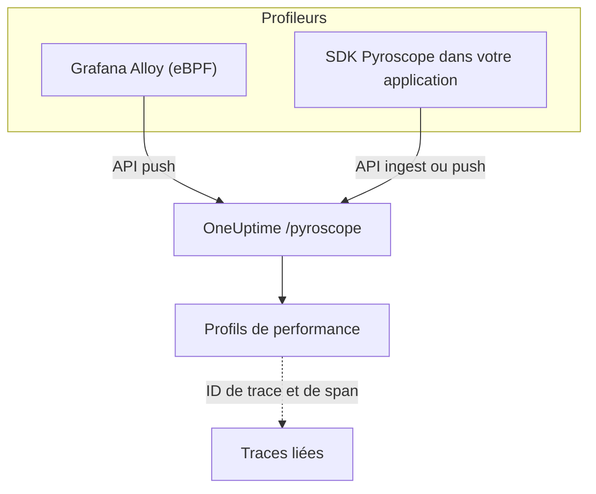

# Profilage continu

Le profilage continu montre comment votre application dépense son temps CPU et sa mémoire, fonction par fonction. OneUptime expose une **API d'ingestion compatible Pyroscope** : tout ce qui sait envoyer des données à un serveur Pyroscope (le profileur eBPF de Grafana Alloy ou un SDK Pyroscope pour votre langage) peut les envoyer à OneUptime, et vous lisez le résultat sous forme de graphiques en flammes à côté de vos journaux, métriques et traces.

:::cards
- [Envoyer des profils](#envoyer-des-profils): Grafana Alloy avec eBPF, ou un SDK Pyroscope dans votre application.
- [Point de terminaison d'ingestion](#point-de-terminaison-dingestion): L'URL de base et les trois façons de transmettre la clé.
- [Vérifier que tout fonctionne](#vérifier-que-tout-fonctionne): Contrôler la clé, la page et le statut d'envoi.
- [Explorer les profils](#explorer-les-profils-dans-oneuptime): Graphiques en flammes, fonctions principales, comparaisons et liens vers les traces.
:::

## Fonctionnement

Un profileur échantillonne vos processus et envoie un profil toutes les quelques secondes au point de terminaison `/pyroscope` de OneUptime, avec votre clé d'ingestion. OneUptime range chaque profil sous le service qu'il nomme et le dessine sous forme de graphique en flammes dans **Profils de performance**.



## Avant de commencer

Il vous faut une clé d'ingestion de télémétrie de type **Serveur**. Si vous n'en avez pas encore :

:::steps
### Ouvrir les clés d'ingestion

Allez dans **Produits → Paramètres du projet**, ouvrez **Télémétrie & APM** dans le menu latéral et sélectionnez **Clés d'ingestion**.


### Créer une clé

Cliquez sur **Créer une clé d'ingestion**. La boîte de dialogue a déjà le nom de la clé rempli et **Serveur** choisi (le type de clé avec lequel une application ou un collecteur envoie) : cliquez donc sur **Créer une clé d'ingestion** pour la créer, ou renommez-la d'abord.

### Copier le secret

La nouvelle clé s'ouvre sur sa propre page. Copiez sa **Clé secrète** : c'est le jeton d'ingestion que les exemples ci-dessous appellent `YOUR_ONEUPTIME_INGESTION_TOKEN`.


:::

## Point de terminaison d'ingestion

| Paramètre | Valeur |
| --- | --- |
| URL de base (adresse du serveur Pyroscope) | `https://oneuptime.com/pyroscope` |
| En-tête d'authentification | `x-oneuptime-token: YOUR_ONEUPTIME_INGESTION_TOKEN` |

Les clients ajoutent leur propre chemin à l'URL de base (`/ingest` pour la plupart des SDK Pyroscope, `/push.v1.PusherService/Push` pour Grafana Alloy et le SDK .NET à partir de v0.14) : vous ne configurez donc jamais que l'URL de base, sans barre oblique finale.

OneUptime lit le jeton d'ingestion depuis n'importe laquelle de ces sources ; utilisez celle que votre client prend en charge :

| Méthode | Quand l'utiliser |
| --- | --- |
| En-tête `x-oneuptime-token` | Les clients qui permettent d'ajouter des en-têtes personnalisés. |
| `Authorization: Bearer <token>` | Les SDK avec une option `authToken` / `auth_token` : c'est ce qu'ils envoient. |
| Authentification HTTP basic, avec le jeton comme **mot de passe** (n'importe quel nom d'utilisateur) | Les clients qui ne proposent qu'un utilisateur et un mot de passe basic. |

> [!NOTE]
> Vous hébergez OneUptime vous-même ? Remplacez `https://oneuptime.com` par votre propre hôte, par exemple `https://YOUR-ONEUPTIME-HOST/pyroscope`.

## Formats de profil pris en charge

| Format | Envoyé par | Pris en charge |
| --- | --- | --- |
| pprof (protobuf binaire, éventuellement compressé en gzip) | SDK Pyroscope Go, Node.js et .NET ; Grafana Alloy | Oui |
| Texte folded / collapsed | SDK Pyroscope Python, Ruby et Rust (leur format d'envoi par défaut) | Oui |
| JFR (Java Flight Recorder) | Agent Java Pyroscope | Pas encore : utilisez Grafana Alloy pour les services Java |

## Envoyer des profils

Grafana Alloy profile chaque processus d'un hôte sans modifier le code ; c'est la façon recommandée de commencer. Un SDK Pyroscope, lui, s'exécute dans votre application.

:::tabs
@tab Grafana Alloy
[Grafana Alloy](https://grafana.com/docs/alloy/latest/) collecte avec eBPF les profils CPU de chaque processus d'un hôte Linux : aucun agent dans votre application et aucune modification de code. Il fonctionne pour Go, Rust, C/C++, Java, Python, Ruby, PHP, Node.js et .NET.

Créez la configuration d'Alloy :

```hcl title="alloy-config.alloy"
discovery.process "all" {
  refresh_interval = "60s"
}

discovery.relabel "alloy_profiles" {
  targets = discovery.process.all.targets

  rule {
    action       = "replace"
    source_labels = ["__meta_process_exe"]
    target_label  = "service_name"
  }
}

pyroscope.ebpf "default" {
  targets    = discovery.relabel.alloy_profiles.output
  forward_to = [pyroscope.write.oneuptime.receiver]

  collect_interval = "15s"
  sample_rate      = 97
}

pyroscope.write "oneuptime" {
  endpoint {
    url = "https://oneuptime.com/pyroscope"
    headers = {
      "x-oneuptime-token" = "YOUR_ONEUPTIME_INGESTION_TOKEN",
    }
  }
}
```

Lancez-le avec Docker. eBPF a besoin d'un conteneur privilégié avec l'espace de noms PID de l'hôte :

```yaml title="docker-compose.yml"
services:
  alloy:
    image: grafana/alloy:latest
    privileged: true
    pid: host
    volumes:
      - ./alloy-config.alloy:/etc/alloy/config.alloy
      - /proc:/proc:ro
      - /sys:/sys:ro
    command:
      - run
      - /etc/alloy/config.alloy
```

Ou lancez-le directement sur l'hôte :

```bash
alloy run alloy-config.alloy
```

La règle de réétiquetage nomme le service de chaque profil d'après l'exécutable du processus.
@tab Go
Le SDK Go envoie du pprof. Pointez son adresse de serveur vers l'URL de base de OneUptime et passez votre jeton d'ingestion comme jeton d'authentification :

```go
import "github.com/grafana/pyroscope-go"

pyroscope.Start(pyroscope.Config{
    ApplicationName: "my-service",
    ServerAddress:   "https://oneuptime.com/pyroscope",
    AuthToken:       "YOUR_ONEUPTIME_INGESTION_TOKEN",
    ProfileTypes: []pyroscope.ProfileType{
        pyroscope.ProfileCPU,
        pyroscope.ProfileAllocObjects,
        pyroscope.ProfileAllocSpace,
        pyroscope.ProfileInuseObjects,
        pyroscope.ProfileInuseSpace,
        pyroscope.ProfileGoroutines,
    },
})
```
@tab Node.js
Le SDK Node.js envoie du pprof :

```javascript
const Pyroscope = require("@pyroscope/nodejs");

Pyroscope.init({
  serverAddress: "https://oneuptime.com/pyroscope",
  appName: "my-service",
  authToken: "YOUR_ONEUPTIME_INGESTION_TOKEN",
});

Pyroscope.start();
```
@tab Python
Le SDK Python envoie du texte folded :

```python
import pyroscope

pyroscope.configure(
    application_name="my-service",
    server_address="https://oneuptime.com/pyroscope",
    auth_token="YOUR_ONEUPTIME_INGESTION_TOKEN",
)
```
@tab .NET
Le profileur .NET de Pyroscope est un profileur CLR natif : il ne demande aucune modification de code et s'active entièrement par variables d'environnement. Téléchargez la version adaptée à votre image depuis [pyroscope-dotnet releases](https://github.com/grafana/pyroscope-dotnet/releases) (`glibc` ou `musl` pour Alpine, `x86_64` ou `aarch64`) et chargez-la dans le runtime :

```dockerfile title="Dockerfile"
FROM alpine:3.20 AS pyroscope-profiler
ARG PYROSCOPE_DOTNET_VERSION=1.5.1
ADD https://github.com/grafana/pyroscope-dotnet/releases/download/pyroscope-${PYROSCOPE_DOTNET_VERSION}/pyroscope.${PYROSCOPE_DOTNET_VERSION}-glibc-x86_64.tar.gz /tmp/pyroscope.tar.gz
RUN mkdir -p /pyroscope && tar -xzf /tmp/pyroscope.tar.gz -C /pyroscope

FROM mcr.microsoft.com/dotnet/aspnet:10.0
# ... your application ...
COPY --from=pyroscope-profiler /pyroscope /pyroscope
ENV CORECLR_ENABLE_PROFILING=1
ENV CORECLR_PROFILER={BD1A650D-AC5D-4896-B64F-D6FA25D6B26A}
ENV CORECLR_PROFILER_PATH=/pyroscope/Pyroscope.Profiler.Native.so
ENV LD_PRELOAD=/pyroscope/Pyroscope.Linux.ApiWrapper.x64.so
ENV LD_LIBRARY_PATH=/pyroscope
```

Pointez-le ensuite vers OneUptime, par exemple dans votre environnement Kubernetes / Helm :

```bash
PYROSCOPE_APPLICATION_NAME=my-service
PYROSCOPE_PROFILING_ENABLED=1
PYROSCOPE_SERVER_ADDRESS=https://oneuptime.com/pyroscope
PYROSCOPE_BASIC_AUTH_USER=oneuptime
PYROSCOPE_BASIC_AUTH_PASSWORD=YOUR_ONEUPTIME_INGESTION_TOKEN
```

Le jeton d'ingestion va dans le mot de passe basic. Le nom d'utilisateur peut être n'importe quelle valeur non vide, mais le profileur n'envoie aucun identifiant tant que les deux ne sont pas définis. Pour envoyer plutôt le jeton dans un en-tête, définissez `PYROSCOPE_HTTP_HEADERS={"x-oneuptime-token":"YOUR_ONEUPTIME_INGESTION_TOKEN"}`.

La façon de transmettre le jeton dépend de la version du profileur. Les versions 1.5 et ultérieures ignorent `PYROSCOPE_AUTH_TOKEN` : si vous mettez à niveau depuis une version plus ancienne en gardant ce réglage, chaque envoi est rejeté avec `401` :

| Version de pyroscope-dotnet | Envoie vers | Réglage du jeton |
| --- | --- | --- |
| v0.13 et antérieures | `/pyroscope/ingest` | `PYROSCOPE_AUTH_TOKEN` |
| v0.14 à 1.4 | `/pyroscope/push.v1.PusherService/Push` | `PYROSCOPE_AUTH_TOKEN` |
| 1.5 et ultérieures | `/pyroscope/push.v1.PusherService/Push` | `PYROSCOPE_BASIC_AUTH_USER=oneuptime` et `PYROSCOPE_BASIC_AUTH_PASSWORD=<token>` (les deux doivent être définis), ou `PYROSCOPE_HTTP_HEADERS={"x-oneuptime-token":"<token>"}` |

Les versions antérieures à 1.0 sont étiquetées `v<version>-pyroscope` au lieu de `pyroscope-<version>` (par exemple `https://github.com/grafana/pyroscope-dotnet/releases/download/v0.13.0-pyroscope/pyroscope.0.13.0-glibc-x86_64.tar.gz`) ; le GUID du profileur et les noms de fichiers sont les mêmes dans toutes les versions.

Le profilage CPU est actif par défaut. Les profilages wall-time, d'allocation, d'exceptions et de contention de verrous sont facultatifs : réglez `PYROSCOPE_PROFILING_WALLTIME_ENABLED`, `PYROSCOPE_PROFILING_ALLOCATION_ENABLED`, `PYROSCOPE_PROFILING_EXCEPTION_ENABLED` ou `PYROSCOPE_PROFILING_LOCK_ENABLED` sur `true`. Les étiquettes statiques vont dans `PYROSCOPE_LABELS` (`key:value,key:value`).

Le profileur envoie toutes les 15 secondes et ne compresse **pas** ses envois : un service chargé peut donc envoyer plusieurs Mo par envoi. L'ingress de OneUptime accepte jusqu'à 16 Mo sur `/pyroscope` ; si un autre proxy se trouve devant OneUptime (par exemple ingress-nginx, dont la valeur par défaut de `proxy-body-size` est de 1 Mo), relevez aussi sa limite de taille pour `/pyroscope`, sinon les gros envois sont rejetés avec `413` avant d'atteindre OneUptime.
@tab Java
L'agent Java de Pyroscope envoie des profils au format JFR, que OneUptime n'ingère pas encore. Profilez plutôt les services Java avec Grafana Alloy (l'onglet **Grafana Alloy**) : il capture les profils CPU de la JVM sans agent ni modification de code.
:::

**Ruby** et **Rust** fonctionnent comme Go, Node.js et Python : installez le [SDK Pyroscope de votre langage](https://grafana.com/docs/pyroscope/latest/configure-client/) et réglez l'adresse du serveur sur `https://oneuptime.com/pyroscope` avec votre jeton d'ingestion comme jeton d'authentification (ou, si votre version du SDK ne propose que l'authentification basic, comme mot de passe basic).

## Types de profil pris en charge

Un pprof peut déclarer plusieurs types d'échantillons ; chaque profil envoyé est stocké sous l'un d'eux : le temps CPU (`cpu` en nanosecondes) s'il l'a, sinon le wall-time, sinon les octets en cours d'utilisation puis alloués, sinon le premier type qu'il déclare. Tout type est stocké et consultable ; les types ci-dessous ont un regroupement, des unités et des libellés dédiés dans OneUptime :

| Type de profil | Affiché comme | Unité |
| --- | --- | --- |
| `cpu`, `samples` | Temps CPU | nanosecondes |
| `wall` | Temps réel écoulé | nanosecondes |
| `inuse_space`, `alloc_space`, `heap` | Mémoire (octets) | octets |
| `inuse_objects`, `alloc_objects` | Mémoire (nombre d'objets) | nombre |
| `mutex`, `contention`, `block` | Contention de verrou | nanosecondes |
| `goroutine` | Goroutines (Go) | nombre |

Tout le reste (par exemple un type d'échantillon personnalisé) apparaît sous « Autre » avec son nom brut.

## Vérifier que tout fonctionne

:::steps
### Vérifier votre jeton

Les points de terminaison d'ingestion répondent `401` à un jeton absent ou invalide, mais la plupart des profileurs ne l'affichent nulle part où vous le verriez (le profileur .NET, par exemple, ne journalise les réponses HTTP qu'au niveau debug). Interrogez directement le point de terminaison de validation :

```bash
curl -i -H "x-oneuptime-token: YOUR_ONEUPTIME_INGESTION_TOKEN" \
  https://oneuptime.com/otlp/v1/validate
```

Un jeton valide renvoie `200` avec `{"valid": true, ...}`, et son `keyType` doit être `Server` : une clé de type navigateur est aussi valide, mais ne peut pas envoyer de profils. Un jeton inconnu, révoqué, désactivé ou expiré renvoie `401`.

### Ouvrir la page des profils

Dans le tableau de bord OneUptime, allez dans **Produits → Profils de performance**. Avec l'intervalle de collecte de 15 secondes d'Alloy (ou l'intervalle d'envoi de 10 à 15 secondes des SDK), les premiers profils et leurs graphiques en flammes apparaissent dans la minute ou les deux minutes qui suivent le démarrage de l'agent.

### Vérifier le service

Les profils sont rattachés au service de télémétrie nommé par `application_name` / `appName` / `PYROSCOPE_APPLICATION_NAME` du SDK (ou par le nom de l'exécutable du processus avec la règle de réétiquetage d'Alloy ci-dessus).

### Toujours rien ? Regarder le statut d'envoi

Pour le profileur .NET, définissez `DD_TRACE_DEBUG=1` sur l'application pendant une minute : il journalise alors une ligne `PyroscopePprofSink <status>` pour chaque envoi. `200` signifie que OneUptime l'a accepté ; `401` vient du jeton ; `404` signifie en général que `PYROSCOPE_SERVER_ADDRESS` n'a pas le suffixe `/pyroscope` ; `413` signifie qu'un proxy devant OneUptime a rejeté l'envoi à cause de sa taille (voir l'onglet **.NET** sous [Envoyer des profils](#envoyer-des-profils)). Si vous hébergez OneUptime vous-même, le journal d'accès de l'ingress (nginx) enregistre le même statut pour chaque requête `/pyroscope`.
:::

## Explorer les profils dans OneUptime

**Produits → Profils de performance** ouvre une vue d'ensemble de l'endroit où passe le temps dans vos services, et **Tous les profils** liste chaque envoi. Choisissez ce que vous analysez : **Tout**, **Temps CPU**, **Mémoire** ou **Verrous**, ou un type précis comme **Temps réel écoulé** ou **Goroutines**.

La page d'un profil propose trois vues :

| Vue | Ce qu'elle montre |
| --- | --- |
| **Graphique en flammes** | Chaque barre est une fonction de la pile d'appels, et sa largeur est proportionnelle au temps ou aux ressources consommés. Cliquez sur une fonction pour zoomer et voir ses appelants et ses appelés. |
| **Top functions** | Les fonctions du profil, classées par temps propre ou total. **Only my code** masque les frames des bibliothèques. |
| **Diff vs. baseline** | Le profil comparé à une période antérieure (**vs il y a 1 heure**, **vs hier** ou **vs la semaine dernière**), avec les fonctions **Les plus dégradées** et **Les plus améliorées**. |

**Download pprof** enregistre le profil pour des outils locaux comme `go tool pprof`.

### Corrélation avec les traces

Quand un profil porte des ID de trace et de span (par exemple sous forme d'étiquettes d'échantillon `trace_id` / `span_id`), vous passez directement d'un span de trace lent au profil CPU ou mémoire correspondant pour comprendre exactement quel code s'exécutait, et **Open linked trace** fait le chemin inverse.

L'onglet **Profil** d'un span inclut aussi les échantillons liés aux spans imbriqués sous lui, car les profileurs attribuent souvent le temps CPU d'une requête à un span enfant plutôt qu'au span de la requête lui-même.

## Rétention des données

Les profils sont conservés pendant la rétention de télémétrie de votre projet : **Paramètres du projet → Télémétrie & APM → Rétention des données** fixe la **Conservation par défaut (jours)**, 15 jours si vous ne la changez pas. Les données sont supprimées automatiquement à la fin de la période de rétention. Les offres qui incluent des remplacements de rétention peuvent aussi garder les profils plus ou moins longtemps que les autres données de télémétrie, ou fixer la rétention par service sur la page **Paramètres** du service.

## Étapes suivantes

:::cards
- [Surveillance des profils](/docs/monitor/profiles-monitor): Alerter sur les profils que vos services envoient, par nombre et par type.
- [OpenTelemetry](/docs/telemetry/open-telemetry): Envoyer les traces auxquelles vos profils sont liés.
- [Agent Kubernetes](/docs/telemetry/kubernetes-agent): Profiler tout un cluster avec le profileur eBPF de l'agent.
:::
