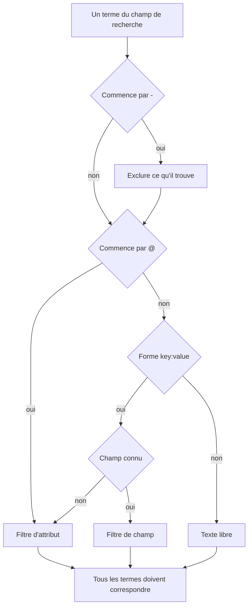

# Syntaxe de recherche

Le champ de recherche au-dessus des explorateurs de journaux, de traces, de métriques et d'exceptions parle un seul langage de requête. Une requête est une liste de filtres séparés par des espaces, et **chaque filtre doit correspondre** : il n'y a pas de OR implicite entre les filtres. Servez-vous de cette page comme référence pendant vos recherches.

:::cards
- [Les deux types de filtres](#les-deux-types-de-filtres): Champs intégrés, attributs et texte libre.
- [Faire correspondre des valeurs](#faire-correspondre-des-valeurs): Jokers, « contient », comparaisons et listes.
- [Exclure](#exclure): Inverser n'importe quel filtre avec un `-` initial.
- [Champs par signal](#champs-par-signal): Ce que vous pouvez filtrer dans chaque explorateur.
:::

## Comment une requête est lue

```text
severity:error @platform.team:a* -@http.method:GET timeout
```

Cela se lit ainsi : les journaux de niveau erreur dont l'attribut `platform.team` commence par `a`, dont l'attribut `http.method` n'est pas `GET` et dont le message mentionne `timeout`.

| Terme | Type | Correspond à |
| --- | --- | --- |
| `severity:error` | Champ | La gravité du journal est Error. |
| `@platform.team:a*` | Attribut | L'attribut `platform.team` commence par `a`. |
| `-@http.method:GET` | Attribut exclu | L'attribut `http.method` vaut tout sauf `GET`. |
| `timeout` | Texte libre | Le message contient `timeout`. |

Chaque terme séparé par un espace est lu seul, puis tous sont combinés avec AND :



## Les deux types de filtres

| Forme | Filtre | Exemple |
| --- | --- | --- |
| `field:value` | Un champ intégré du signal | `severity:error` |
| `@attribute:value` | Un attribut OpenTelemetry de la ligne | `@http.status_code:500` |
| mots seuls | Le message (journaux), le nom du span (traces), le nom de la métrique (métriques) ou le message de l'exception (exceptions) | `connection refused` |

Un `key:value` nu dont la clé n'est pas un champ connu est traité comme un attribut : `k8s.pod:api-0` et `@k8s.pod:api-0` veulent donc dire la même chose. Le préfixe `@` signifie toujours « chercher dans les attributs », avec une exception : dans l'explorateur des exceptions, `@type:`, `@service:`, `@env:` et `@class:` filtrent toujours ces champs.

Un texte qui contient simplement un deux-points reste du texte : `https://example.com` et `12:30` sont cherchés comme des mots, pas lus comme des filtres.

## Faire correspondre des valeurs

Tout ce tableau fonctionne sur n'importe quel attribut et sur la plupart des champs intégrés ; [Champs par signal](#champs-par-signal) signale les champs qui lisent une valeur plus simplement.

| Vous tapez | Correspond à |
| --- | --- |
| `@k:abc` | exactement `abc` |
| `@k:a*` | tout ce qui commence par `a` : `abc`, `alpha` |
| `@k:*c` | tout ce qui se termine par `c` |
| `@k:a*c` | commence par `a` et se termine par `c` |
| `@k:a?c` | `?` vaut exactement un caractère : `abc`, `axc`, mais pas `ac` |
| `@k:*` | l'attribut est présent et non vide |
| `@k:~abc` | contient `abc` n'importe où |
| `@k:!abc` | tout sauf `abc` |
| `@k:>100` | supérieur à 100. Aussi `>=`, `<`, `<=` |
| `@k:(a OR b)` | l'une ou l'autre valeur. `@k:[a, b]` revient au même |
| `@k:(a* OR b*)` | l'un ou l'autre motif |

Les correspondances par joker et par « contient » ignorent la casse ; la correspondance exacte non, car elle compare à la valeur exactement telle qu'elle a été stockée.

### Valeurs avec des espaces

Entourez la valeur de guillemets doubles :

```text
name:"SELECT wp_options"
@k8s.container.name:"my container"
```

Les guillemets protègent les **espaces**, pas les jokers : `@k:"a b*"` correspond toujours à tout ce qui commence par `a b`.

### `*`, `?` et autres signes pris littéralement

Une barre oblique inverse rend littéral le caractère suivant :

| Vous tapez | Correspond à |
| --- | --- |
| `@k:a\*b` | exactement `a*b` |
| `@k:\~abc` | exactement `~abc` |
| `@k:\>5` | exactement `>5` |

Les valeurs contenant `%` ou `_` n'ont pas besoin d'échappement : ces caractères sont toujours littéraux.

## Exclure

Un `-` initial inverse n'importe quel filtre, y compris ceux ci-dessus :

| Vous tapez | Correspond à |
| --- | --- |
| `-severity:debug` | tout sauf debug |
| `-@platform.team:a*` | tout ce dont `platform.team` ne commence **pas** par `a`, y compris les lignes sans aucun `platform.team` |
| `-@k:*` | l'attribut est absent ou vide |
| `-@k:(a OR b)` | aucune des deux valeurs |
| `-@k:>100` | 100 ou moins |
| `-@k:~abc` | ne contient pas `abc` |

Dans l'explorateur des traces, `-` n'exclut que des attributs. `-status:error` est lu comme un texte à chercher dans les noms de spans, et ne trouve rien ; demandez plutôt les valeurs voulues, par exemple `status:(ok OR unset)`.

## Champs par signal

Les noms de champs ne sont pas sensibles à la casse : `statusMessage:` et `statusmessage:` sont le même champ.

### Journaux

| Champ | Alias | Remarques |
| --- | --- | --- |
| `severity` | `level` | `fatal`, `error`, `warning` (ou `warn`), `info` (ou `information`), `debug`, `trace`, `unspecified`, dans n'importe quelle casse |
| `service` | | Nom du service, écrit en entier, dans n'importe quelle casse |
| `trace` | | ID de trace |
| `span` | | ID de span |
| `message` | `msg`, `log`, `body` | La ligne de journal. Les mots seuls la cherchent aussi |

### Traces

Les champs de trace acceptent une valeur simple ou une liste comme `status:(ok OR unset)`, et `duration` accepte aussi `>` et `<`. Les jokers, `~`, `!` et un `-` initial ne fonctionnent ici que sur les attributs.

| Champ | Remarques |
| --- | --- |
| `service` | Nom du service |
| `name` | Nom du span. Une valeur unique correspond à n'importe quelle partie du nom. Les mots seuls le cherchent aussi |
| `status` | `ok`, `error`, `unset` (unset = Aucun statut d'erreur défini, la valeur par défaut d'OpenTelemetry) |
| `kind` | `server`, `client`, `producer`, `consumer`, `internal` |
| `duration` | En millisecondes : `duration:>500`, `duration:<200` ou une valeur exacte |
| `statusMessage` | Texte du message de statut. Une valeur unique correspond à n'importe quelle partie du texte |
| `hasException` | `true` ou `false` |
| `trace`, `span` | ID |

### Métriques

| Champ | Remarques |
| --- | --- |
| `name` | Nom de la métrique. Une valeur simple correspond à n'importe quelle partie du nom : `name:http.server` trouve donc `http.server.request.duration`. Les mots seuls le cherchent aussi |
| `service` | Nom du service. Une valeur simple correspond à n'importe quelle partie du nom |

### Exceptions

| Champ | Alias | Remarques |
| --- | --- | --- |
| `type` | `exceptionType` | Type d'exception, par exemple `type:TypeError` |
| `env` | `environment` | Environnement, issu de l'attribut de ressource `deployment.environment` |
| `service` | | Nom du service. Une valeur simple correspond à n'importe quelle partie du nom |
| `class` | `errorClass` | À qui revient l'erreur : `code-fault`, `user-error`, `expected-denial`, `infrastructure` ou `unknown` |

Les mots seuls cherchent dans le message de l'exception.

L'explorateur **Événements de sécurité** utilise le même langage avec ses propres champs, comme `severity`, `tactic` et `user` : voir [Événements de sécurité](/docs/telemetry/security-events).

## Combiner des filtres

Les filtres sont combinés avec AND. Écrire `AND` entre eux est permis et ne change rien :

```text
severity:error service:api          # both must hold
severity:error AND service:api      # identical
```

Il n'y a ni OR ni NOT **entre** les filtres : les `OR` et `NOT` écrits à cet endroit sont ignorés, donc `NOT severity:debug` équivaut à `severity:debug`. Excluez avec un `-` initial (`-severity:debug`) et, pour accepter l'une de deux valeurs d'une même clé, utilisez la forme de liste :

```text
@http.method:(GET OR POST)
```

Deux filtres sur la même clé sont combinés avec AND ; c'est ainsi qu'on écrit une plage ou un motif à deux bornes :

```text
@http.status_code:>=500 @http.status_code:<=599
@k:a* @k:*z
```

## Les puces et le champ de recherche

Appuyer sur Entrée sur un terme `key:value` l'applique, en général sous forme de puce au-dessus des résultats. Une puce garde la valeur exactement telle que vous l'avez tapée : un joker reste donc un joker. Un terme qu'une puce ne peut pas porter, comme un `-key:value` exclu, reste dans le champ de recherche et filtre depuis là. Cliquer sur une valeur dans la barre latérale des facettes ajoute le même type de puce, avec sa valeur échappée : une valeur stockée qui contient `*` filtre sur cette valeur littérale, pas comme un motif.

Les puces font partie de la vue enregistrée et de l'URL de la page : un filtre survit donc à un rechargement, à un favori et à un lien partagé.

## Bon à savoir

- Les **clés** d'attribut sont comparées sans tenir compte de la casse pour les filtres par joker, « contient », préfixe et suffixe : inutile de vous rappeler si elle a été ingérée en `requestId` ou en `requestid`.
- Un filtre `-@k:...` correspond aussi aux lignes qui n'ont jamais eu l'attribut : une ligne sans aucun `platform.team` ne commence évidemment pas par `a`.
- Les comparaisons numériques fonctionnent sur des valeurs d'attribut stockées en texte ; une valeur qui n'est pas un nombre ne satisfait jamais une comparaison.

## Étapes suivantes

:::cards
- [Zoomer sur une plage temporelle](/docs/telemetry/charts-and-time-ranges): Restreindre les explorateurs au moment qui compte.
- [Pipelines de journaux](/docs/telemetry/log-pipelines): Transformer des parties d'une ligne de journal en attributs consultables.
- [Surveillance des journaux](/docs/monitor/logs-monitor): Alerter quand les journaux recherchés apparaissent.
- [OpenTelemetry](/docs/telemetry/open-telemetry): Envoyer des journaux, des métriques et des traces à rechercher.
:::
