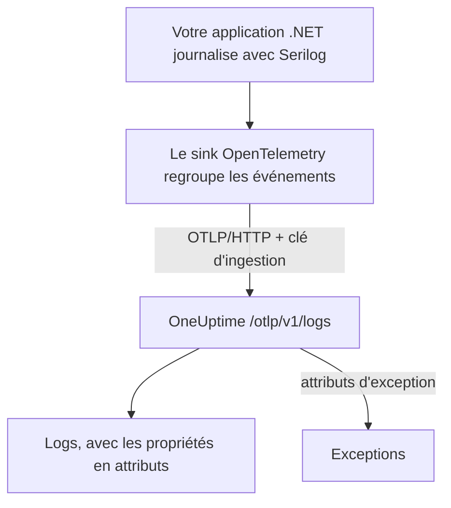

# Serilog (.NET)

[Serilog](https://serilog.net) est la bibliothèque de logs structurés la plus répandue pour .NET. Avec le sink officiel [`Serilog.Sinks.OpenTelemetry`](https://github.com/serilog/serilog-sinks-opentelemetry), chaque événement que votre application journalise via Serilog est envoyé à OneUptime par l'OpenTelemetry Protocol (OTLP), et devient consultable dans **Produits → Journaux** avec ses propriétés structurées, sa sévérité et sa corrélation avec les traces.

Aucun paquet propre à OneUptime n'est à installer : le sink parle au même point de terminaison OTLP que celui que OneUptime expose pour toutes les données OpenTelemetry. Cela fonctionne pour les applications console, les worker services, les applications ASP.NET Core et tout ce qui tourne sur .NET.

:::cards
- [Mettre en place le sink](#mettre-en-place-le-sink): Installer deux paquets et les configurer dans le code ou dans `appsettings.json`.
- [Exceptions](#exceptions): Les exceptions journalisées deviennent des problèmes dans Exceptions.
- [Dépannage](#dépannage): Que vérifier quand aucun log n'arrive.
:::

## Fonctionnement



Le sink regroupe les événements de log et les envoie en arrière-plan. Chaque propriété nommée devient un attribut du log, et une exception journalisée avec Serilog arrive avec les attributs dont OneUptime fait un problème.

## Avant de commencer

- Un projet OneUptime. Sur OneUptime Cloud, la télémétrie est facturée par Go ingéré — voir les [tarifs](https://oneuptime.com/pricing) — et un projet du forfait Free a besoin d'un moyen de paiement avant de pouvoir envoyer de la télémétrie.
- Une application .NET qui utilise Serilog, ou qui peut l'utiliser.
- Une clé d'ingestion de télémétrie pour authentifier vos logs. Si vous n'en avez pas :

:::steps
### Ouvrir les clés d'ingestion

Allez dans **Produits → Paramètres du projet**, ouvrez **Télémétrie & APM** dans le menu latéral et sélectionnez **Clés d'ingestion**.


### Créer une clé

Cliquez sur **Créer une clé d'ingestion**. La fenêtre a déjà rempli le nom de la clé et choisi **Serveur** — le type de clé avec lequel une application ou un collector envoie —, donc cliquez sur **Créer une clé d'ingestion** pour la créer, ou renommez-la d'abord.

### Copier le secret

La nouvelle clé s'ouvre sur sa propre page. Copiez sa **Clé secrète** : c'est le `YOUR_TELEMETRY_INGESTION_TOKEN` des exemples ci-dessous.


:::

## Ce qu'il vous faut de OneUptime

| Réglage | Valeur |
| ------------- | ------------------------------------------------------------ |
| Point de terminaison OTLP | `https://oneuptime.com/otlp` |
| En-tête d'authentification | `x-oneuptime-token: YOUR_TELEMETRY_INGESTION_TOKEN` |
| Nom du service | Le nom sous lequel votre service doit apparaître, par exemple `my-service` |

> [!NOTE]
> Vous hébergez OneUptime vous-même ? Remplacez `https://oneuptime.com/otlp` par `https://YOUR-ONEUPTIME-HOST/otlp` (ou `http://...` si vous ne terminez pas TLS). Tout le reste est identique.

Avec le protocole réglé sur `HttpProtobuf`, le sink ajoute le chemin `/v1/logs` au point de terminaison : l'URL finale à laquelle il envoie est donc `https://oneuptime.com/otlp/v1/logs`. Vous n'avez à fournir que le point de terminaison de base `/otlp`.

## Mettre en place le sink

:::steps
### Installer les paquets NuGet

Ajoutez Serilog et le sink OpenTelemetry à votre projet :

```bash
dotnet add package Serilog
dotnet add package Serilog.Sinks.OpenTelemetry
```

Si vous configurez le sink depuis `appsettings.json`, ajoutez aussi `Serilog.Settings.Configuration`. Pour les applications ASP.NET Core, ajoutez `Serilog.AspNetCore`, qui branche Serilog sur l'hôte et sur le pipeline des requêtes :

```bash
dotnet add package Serilog.Settings.Configuration
dotnet add package Serilog.AspNetCore
```

### Configurer le sink

Pointez le sink vers votre point de terminaison OTLP OneUptime, réglez le protocole sur `HttpProtobuf`, passez votre jeton d'ingestion en en-tête et étiquetez les logs avec un `service.name`. Configurez-le dans le code, dans `appsettings.json` ou dans l'hôte ASP.NET Core :

:::tabs
@tab Dans le code
```csharp title="Program.cs"
using Serilog;
using Serilog.Sinks.OpenTelemetry;

Log.Logger = new LoggerConfiguration()
    .MinimumLevel.Information()
    .Enrich.FromLogContext()
    .WriteTo.Console() // optional: keep local logs too
    .WriteTo.OpenTelemetry(options =>
    {
        // Base OTLP endpoint. The sink appends /v1/logs automatically.
        options.Endpoint = "https://oneuptime.com/otlp";
        options.Protocol = OtlpProtocol.HttpProtobuf;

        // Authenticate with your OneUptime telemetry ingestion token.
        options.Headers = new Dictionary<string, string>
        {
            ["x-oneuptime-token"] = "YOUR_TELEMETRY_INGESTION_TOKEN"
        };

        // Identify your service in OneUptime.
        options.ResourceAttributes = new Dictionary<string, object>
        {
            ["service.name"] = "my-service",
            ["deployment.environment"] = "production"
        };
    })
    .CreateLogger();

try
{
    Log.Information("Application starting up");
    // ... your application code ...
}
finally
{
    // Flush any buffered logs before the process exits.
    Log.CloseAndFlush();
}
```
@tab appsettings.json
Placez les réglages du sink dans `appsettings.json` :

```json title="appsettings.json"
{
  "Serilog": {
    "Using": ["Serilog.Sinks.OpenTelemetry"],
    "MinimumLevel": "Information",
    "WriteTo": [
      {
        "Name": "OpenTelemetry",
        "Args": {
          "endpoint": "https://oneuptime.com/otlp",
          "protocol": "HttpProtobuf",
          "headers": {
            "x-oneuptime-token": "YOUR_TELEMETRY_INGESTION_TOKEN"
          },
          "resourceAttributes": {
            "service.name": "my-service",
            "deployment.environment": "production"
          }
        }
      }
    ]
  }
}
```

Puis construisez le logger à partir de la configuration :

```csharp title="Program.cs"
using Serilog;
using Microsoft.Extensions.Configuration;

IConfiguration configuration = new ConfigurationBuilder()
    .AddJsonFile("appsettings.json")
    .Build();

Log.Logger = new LoggerConfiguration()
    .ReadFrom.Configuration(configuration)
    .CreateLogger();
```
@tab ASP.NET Core
Pour ASP.NET Core (hébergement minimal, .NET 6 et plus), utilisez `Serilog.AspNetCore` afin que Serilog remplace le logger par défaut et capture aussi les logs du framework et des requêtes :

```csharp title="Program.cs"
using Serilog;
using Serilog.Sinks.OpenTelemetry;

var builder = WebApplication.CreateBuilder(args);

builder.Host.UseSerilog((context, services, configuration) =>
{
    configuration
        .ReadFrom.Configuration(context.Configuration)
        .Enrich.FromLogContext()
        .WriteTo.OpenTelemetry(options =>
        {
            options.Endpoint = "https://oneuptime.com/otlp";
            options.Protocol = OtlpProtocol.HttpProtobuf;
            options.Headers = new Dictionary<string, string>
            {
                ["x-oneuptime-token"] = "YOUR_TELEMETRY_INGESTION_TOKEN"
            };
            options.ResourceAttributes = new Dictionary<string, object>
            {
                ["service.name"] = "my-service"
            };
        });
});

var app = builder.Build();

// Logs one summary event per HTTP request.
app.UseSerilogRequestLogging();

app.MapGet("/", () => "Hello World");
app.Run();
```
:::

> [!IMPORTANT]
> Le sink regroupe les événements de log et les envoie de façon asynchrone. Appelez toujours `Log.CloseAndFlush()` (ou libérez le logger) avant que votre application ne s'arrête, sinon le dernier lot de logs peut être perdu. Dans ASP.NET Core, `Serilog.AspNetCore` s'en charge pour vous lors d'un arrêt propre.

> [!TIP]
> Gardez le jeton hors du contrôle de version. Lisez-le depuis une variable d'environnement ou un coffre de secrets et injectez-le dans la configuration au démarrage, plutôt que de le committer dans `appsettings.json`.

### Écrire des logs

Utilisez Serilog comme d'habitude. Les propriétés structurées sont conservées et deviennent des attributs consultables dans OneUptime :

```csharp
Log.Information("Order {OrderId} placed by {CustomerId} for {Amount:C}",
    orderId, customerId, amount);

Log.Warning("Payment gateway slow: {LatencyMs}ms", latencyMs);
```

Chaque propriété nommée (`OrderId`, `CustomerId`, `Amount`, `LatencyMs`) est envoyée comme attribut du log : vous pouvez donc filtrer et chercher dessus dans l'explorateur **Produits → Journaux**.

### Vérifier que les logs arrivent

Lancez votre application et écrivez quelques événements de log. En quelques secondes, ils apparaissent sous **Produits → Journaux**, et sur la page de votre service sous **Produits → Services** — le service porte le nom du `service.name` que vous avez défini (`my-service`). Leurs propriétés structurées sont disponibles comme filtres.
:::

## Exceptions

Quand vous journalisez une exception avec Serilog, le sink attache au log les attributs OpenTelemetry `exception.type`, `exception.message` et `exception.stacktrace` :

```csharp
try
{
    ProcessPayment();
}
catch (Exception ex)
{
    Log.Error(ex, "Failed to process payment for order {OrderId}", orderId);
}
```

OneUptime détecte ces attributs et regroupe l'erreur en un problème sous **Exceptions**, par empreinte et rattaché au bon service. Une erreur signalée à la fois par une trace et par un log est fusionnée en un seul problème. Voir [Exceptions issues des logs](/docs/telemetry/open-telemetry#exceptions-issues-des-logs) pour le détail de la détection.

## Corrélation avec les traces

Si votre application est aussi instrumentée avec le SDK OpenTelemetry .NET pour les traces, les événements Serilog émis dans un span actif reçoivent automatiquement le `TraceId` et le `SpanId` courants (cela fait partie des `IncludedData` par défaut du sink). OneUptime peut ainsi relier une ligne de log directement à la trace où elle s'est produite, et vous passez d'un log à la requête qui l'entoure, et inversement.

Pour envoyer aussi des traces et des métriques, voir la configuration .NET dans le [démarrage rapide OpenTelemetry](/docs/telemetry/open-telemetry#démarrage-rapide).

## Dépannage

:::details Aucun log n'apparaît
Vérifiez la valeur de `x-oneuptime-token` et qu'elle appartient au projet que vous consultez. Vérifiez que le point de terminaison est `https://oneuptime.com/otlp` (le chemin de base seulement — n'ajoutez pas `/v1/logs` vous-même). Pour voir pourquoi le sink échoue, activez au démarrage la sortie d'erreurs propre à Serilog avec `Serilog.Debugging.SelfLog.Enable(Console.Error)` : elle affiche le code de statut renvoyé par OneUptime.
:::

:::details Les logs n'apparaissent qu'à l'arrêt de l'application, ou les derniers logs manquent
Assurez-vous que `Log.CloseAndFlush()` s'exécute à l'arrêt. Le sink regroupe les événements : les logs en mémoire tampon sont perdus si le processus est tué sans vidage.
:::

:::details 401 Unauthorized, et rien n'est ingéré
La clé est absente, inconnue ou expirée. Vérifiez que le nom de l'en-tête est exactement `x-oneuptime-token` et que sa valeur est la **Clé secrète** de la clé.
:::

:::details 402 ou 422, et rien n'est ingéré
`402` : sur OneUptime Cloud, le projet est sur le forfait Free et n'a pas de moyen de paiement. Ajoutez-en un sous **Paramètres du projet → Facturation et factures → Facturation**. `422` : la clé est désactivée, ou c'est une clé Navigateur. Réactivez **Activé** dans les réglages de la clé, ou créez une clé **Serveur**.
:::

:::details Les logs arrivent sous le mauvais nom de service
Définissez `service.name` dans `ResourceAttributes` (code) ou `resourceAttributes` (appsettings.json). Sans lui, vos logs sont rangés sous le nom provisoire que le sink envoie à la place, et non sous le nom de votre service.
:::

:::details Erreurs de connexion vers une instance auto-hébergée
Vérifiez que le protocole correspond au schéma de votre point de terminaison (`https://` ou `http://`) et que votre hôte OneUptime est joignable depuis l'application.
:::

Pour toute question ou si vous avez besoin d'aide, écrivez-nous à support@oneuptime.com.

## Étapes suivantes

:::cards
- [OpenTelemetry](/docs/telemetry/open-telemetry): Envoyer aussi des traces et des métriques depuis .NET.
- [Pipelines de journaux](/docs/telemetry/log-pipelines): Analyser et enrichir les logs à leur arrivée.
- [Surveillance des journaux](/docs/monitor/logs-monitor): Alerter quand des logs correspondants apparaissent.
- [Syntaxe de recherche](/docs/telemetry/search-syntax): Filtrer sur vos propriétés Serilog.
:::
