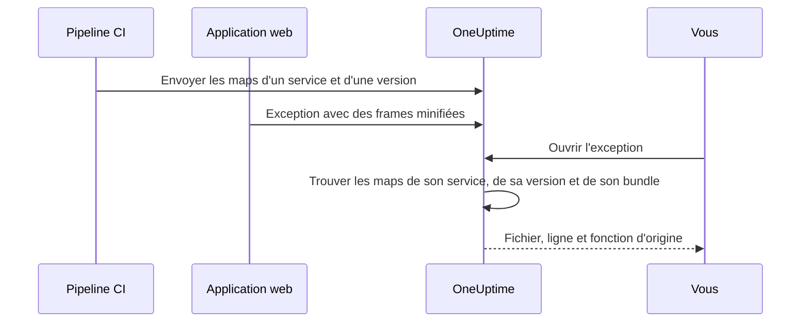

# Source maps

Envoyez les source maps de votre build front-end à OneUptime, et les exceptions du navigateur dans **Exceptions** affichent vos noms de fichiers, lignes et fonctions d'origine au lieu des noms minifiés. Cette page s'adresse aux développeurs front-end qui envoient déjà la télémétrie du navigateur à OneUptime.

:::cards
- [Comment fonctionne la correspondance](#comment-fonctionne-la-correspondance): Nom du service, version et fichier du bundle.
- [Envoyer les source maps](#envoyer-les-source-maps): Une seule requête `curl` depuis la CI.
- [Limites](#limites): Tailles, nombres et réglages pour l'auto-hébergement.
- [Consulter les traces de pile résolues](#consulter-les-traces-de-pile-résolues): À quoi ressemble une frame résolue.
:::

## Vue d'ensemble

Les bundles front-end de production sont minifiés : une exception du navigateur capturée par le SDK web OpenTelemetry arrive donc avec des frames de pile comme celles-ci :

```text
TypeError: Cannot read properties of undefined (reading 'id')
    at e.onSelect (https://app.example.com/assets/main.a8f1b2.js:1:48291)
```

Envoyez les source maps de votre build à OneUptime, et le tableau de bord des exceptions résout ces frames vers le fichier, la ligne et le nom de fonction d'origine, et, quand la map a été construite avec `sourcesContent`, vers les lignes voisines de votre code source d'origine.

Les maps sont envoyées à OneUptime par une API authentifiée et ne sont **jamais récupérées depuis votre site** : vous pouvez (et devriez) continuer à construire avec `hidden-source-map` (webpack) ou `sourcemap: 'hidden'` (Vite / Rollup) et ne jamais publier les fichiers `.map` à côté de vos bundles.



## Comment fonctionne la correspondance

Une source map est stockée sous trois clés :

| Clé | Doit correspondre à |
|---|---|
| Nom du service | L'attribut de ressource OpenTelemetry `service.name` avec lequel votre application web envoie sa télémétrie |
| Version du service | L'attribut de ressource `service.version` (votre identifiant de version) |
| Chemin du bundle | Le fichier minifié pour lequel la map a été générée, par exemple `main.a8f1b2.js` |

Quand vous ouvrez une exception, OneUptime cherche les maps envoyées pour le service et la version de cette exception, associe chaque frame de pile à un bundle par son nom de fichier (les suffixes de chemin conviennent : `main.a8f1b2.js` correspond à `https://app.example.com/assets/main.a8f1b2.js`) et résout la ligne et la colonne minifiées grâce à la map. La résolution se fait à la demande quand l'exception est consultée, jamais pendant l'ingestion : une map envoyée quelques minutes *après* la première erreur d'une nouvelle version s'applique donc rétroactivement.

## Avant de commencer

- Une clé d'ingestion de télémétrie de type **Serveur**, depuis **Paramètres du projet → Télémétrie & APM → Clés d'ingestion**. Voir [Créer une clé d'ingestion](/docs/telemetry/open-telemetry#créer-une-clé-dingestion).
- Une application web qui envoie déjà ses exceptions à OneUptime avec le SDK web OpenTelemetry : voir [Configuration navigateur](/docs/rum/browser-setup).
- Un build qui écrit des source maps, avec `sourcesContent` inclus (la valeur par défaut de la plupart des bundlers) si vous voulez des extraits de code autour de chaque frame.

## Envoyer les source maps

:::steps
### Envoyer `service.version` avec votre télémétrie

Votre application web doit envoyer `service.version`, et ce doit être la même chaîne que celle avec laquelle vous envoyez les maps :

```javascript
import { resourceFromAttributes } from "@opentelemetry/resources";

const resource = resourceFromAttributes({
  "service.name": "my-web-app",
  "service.version": "1.4.2", // same value you upload maps with
});
```

N'importe quel identifiant de version stable convient (une version sémantique, un SHA de commit git, un numéro de build), tant que le `serviceVersion` envoyé et l'attribut de ressource `service.version` sont la même chaîne.

### Envoyer les maps après chaque build de production

Envoyez depuis la CI, avec votre clé d'ingestion dans l'en-tête `x-oneuptime-token` :

```bash
curl --fail -X POST "https://oneuptime.com/source-maps/v1/upload" \
  -H "x-oneuptime-token: YOUR_TELEMETRY_INGESTION_KEY" \
  -F "serviceName=my-web-app" \
  -F "serviceVersion=1.4.2" \
  -F "sourcemap=@dist/assets/main.a8f1b2.js.map" \
  -F "sourcemap=@dist/assets/vendor.9c3d4e.js.map"
```

Pour les installations auto-hébergées, remplacez `oneuptime.com` par votre hôte OneUptime. `Authorization: Bearer YOUR_KEY` est accepté comme alternative à l'en-tête `x-oneuptime-token`.

### Vérifier l'envoi

Un envoi réussi renvoie un corps JSON qui liste les maps stockées, sur lequel la CI peut faire ses vérifications. Les maps sont aussi listées sur la page **Source Maps** du service dans OneUptime.
:::

Une étape CI typique envoie chaque map produite par le build :

```bash
VERSION="$(git rev-parse --short HEAD)"

find dist -name "*.js.map" -print0 | while IFS= read -r -d '' map; do
  curl --fail -X POST "https://oneuptime.com/source-maps/v1/upload" \
    -H "x-oneuptime-token: $ONEUPTIME_INGESTION_KEY" \
    -F "serviceName=my-web-app" \
    -F "serviceVersion=$VERSION" \
    -F "sourcemap=@$map"
done
```

### Règles d'envoi

- Le chemin de bundle de chaque fichier envoyé est son nom sans le `.map` final : `main.a8f1b2.js.map` devient `main.a8f1b2.js`. Si le nom de votre fichier de map ne suit pas cette convention, envoyez un fichier par requête et passez un champ `bundlePath` explicite.
- Renvoyer le même bundle pour le même service et la même version remplace la map précédente : les nouvelles tentatives de la CI sont donc sans risque.
- Les fichiers doivent être du JSON [source map v3](https://tc39.es/ecma426/) (ce que produit tout bundler moderne ; les maps indexées avec `sections` sont aussi prises en charge).
- Si l'opérateur de votre installation auto-hébergée a désactivé l'ingestion de télémétrie (`DISABLE_TELEMETRY_INGESTION`), les envois renvoient une réponse de succès vide et rien n'est stocké, comme pour tout point de terminaison d'ingestion de télémétrie dans ce mode. Un vrai envoi renvoie toujours un corps JSON listant les maps stockées : la CI peut ainsi distinguer les deux cas.

## Limites

Chaque fichier `.map` peut atteindre 50 Mo, mais l'ingress limite aussi le **corps entier de la requête** à 50 Mo : envoyez donc les grosses maps une par requête. Jusqu'à 50 fichiers sont acceptés par requête, et une version (service + version) peut contenir au plus 1 000 maps au total ; un envoi qui dépasserait ce nombre est rejeté avec un message qui nomme la limite. Un build qui produit plus de maps qu'une requête n'en accepte envoie simplement plusieurs requêtes : les envois pour une même version s'additionnent.

Les installations auto-hébergées peuvent changer ces valeurs. Les cinq sont de simples variables d'environnement, et le chart Helm les expose sous `sourceMaps` dans `values.yaml` :

| `values.yaml` | Variable d'environnement | Valeur par défaut |
| --- | --- | --- |
| `sourceMaps.maxMapsPerRelease` | `SOURCE_MAP_MAX_MAPS_PER_RELEASE` | `1000` |
| `sourceMaps.maxFilesPerRequest` | `SOURCE_MAP_MAX_FILES_PER_REQUEST` | `50` |
| `sourceMaps.maxFileSizeBytes` | `SOURCE_MAP_MAX_FILE_SIZE_BYTES` | `52428800` |
| `sourceMaps.maxBytesPerResolve` | `SOURCE_MAP_MAX_BYTES_PER_RESOLVE` | `536870912` |
| `sourceMaps.retentionDays` | `SOURCE_MAP_RETENTION_DAYS` | `90` |

`maxMapsPerRelease` est celle à relever si votre build dépasse la valeur par défaut ; c'est une limite de forme du stockage et rien de plus, car la résolution est bornée par `maxBytesPerResolve` et non par le nombre de maps d'une version. `maxFilesPerRequest` et `maxFileSizeBytes` ne peuvent qu'être **abaissées** : le corps multipart est analysé avant que la requête soit authentifiée, les plafonds partagés au-dessus d'elles s'appliquent donc à tout appelant non authentifié, et une valeur plus grande est réduite au lieu d'être appliquée.

## Consulter les traces de pile résolues

Ouvrez n'importe quelle exception sous **Exceptions** dans le tableau de bord. Les frames résolues par une source map affichent un badge **Source mapped** ainsi que le nom de fonction et l'emplacement de fichier d'origine ; déplier une frame montre l'extrait de code source d'origine (quand la map contient `sourcesContent`) à côté de l'emplacement minifié.

Les maps envoyées pour un service peuvent être consultées et supprimées sous **Produits → Services → votre service → Source Maps**, qui liste la version, le bundle, la taille et l'heure d'envoi de chaque map.

## Rétention

Les source maps sont conservées 90 jours après leur envoi, puis supprimées automatiquement. Une map n'est utile que tant que les exceptions de sa version restent dans votre fenêtre de rétention de télémétrie : cette durée dépasse donc largement celle des exceptions qu'elle déminifie. Renvoyez les maps d'une version si vous en avez à nouveau besoin.

## Sécurité

- Les maps sont envoyées par un point de terminaison authentifié et stockées dans votre projet OneUptime : elles ne sont jamais récupérées depuis votre site, et les source maps cachées restent cachées.
- Le contenu brut d'une map (qui inclut votre code source d'origine si elle est construite avec `sourcesContent`) ne peut être relu que par les propriétaires et administrateurs du projet, et par toute personne ayant l'autorisation **Read Telemetry Source Map**. Les autres membres de l'équipe ne voient que les frames résolues et les quelques lignes de code autour de chaque point de plantage des exceptions auxquelles ils ont déjà accès.
- Supprimer un service supprime ses source maps.

## Dépannage

:::details Les frames sont toujours minifiées
La version de l'exception n'a pas de maps correspondantes. Vérifiez que le `service.version` envoyé par votre application est exactement le `serviceVersion` utilisé pour l'envoi, que `serviceName` correspond à `service.name`, et qu'une map a été envoyée pour ce fichier de bundle : la page **Source Maps** du service liste la version et le bundle de chaque map.
:::

:::details L'envoi est rejeté parce qu'une map est trop grosse
Une map peut atteindre 50 Mo, et la requête entière aussi. Envoyez les grosses maps une par requête, comme le fait la boucle CI ci-dessus.
:::

## Étapes suivantes

:::cards
- [Configuration navigateur](/docs/rum/browser-setup): Envoyer les traces et exceptions du navigateur avec le SDK web OpenTelemetry.
- [Surveillance des exceptions](/docs/monitor/exceptions-monitor): Alerter quand de nouvelles exceptions apparaissent.
- [OpenTelemetry](/docs/telemetry/open-telemetry): Points de terminaison, clés et limites pour toute la télémétrie.
:::
