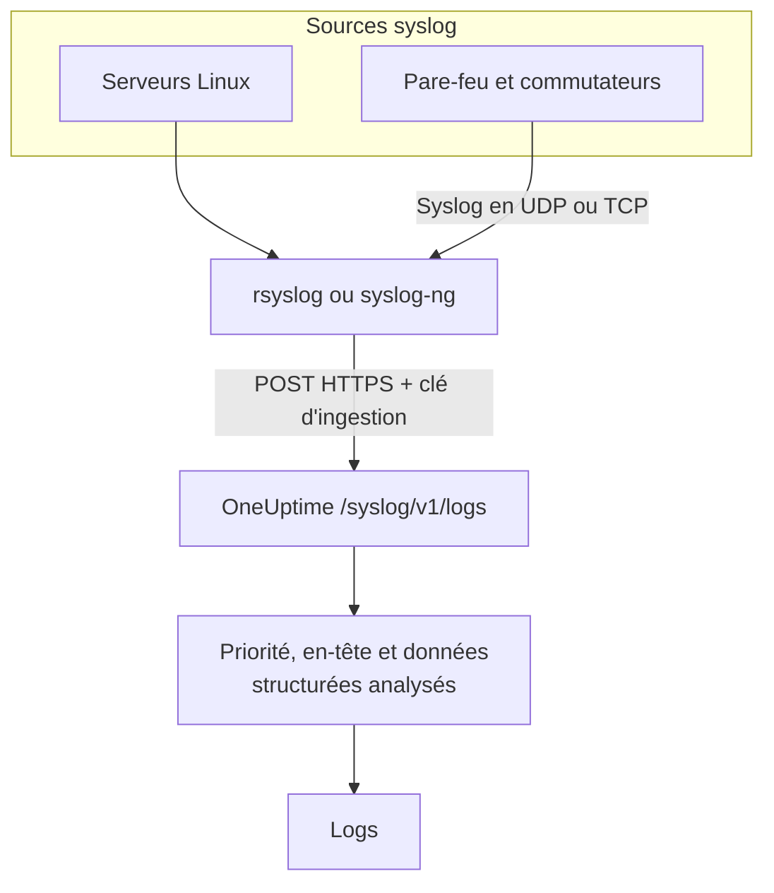

# Syslog

OneUptime accepte le syslog en HTTPS. Envoyez des messages RFC 5424 ou RFC 3164 à `/syslog/v1/logs` avec votre clé d'ingestion, et chacun devient un log consultable, avec sa priorité, sa facility, sa sévérité, son hôte, son application et ses données structurées en attributs. Utilisez-le pour transmettre depuis rsyslog, syslog-ng ou tout relais capable de faire des requêtes HTTP.

:::cards
- [Envoyer un message de test](#envoyer-un-message-de-test): Une seule requête `curl`.
- [Transmettre depuis rsyslog](#transmettre-depuis-rsyslog): Envoyer tout ce qu'un serveur ou un relais reçoit.
- [Attributs extraits](#attributs-extraits): Ce que OneUptime tire de chaque message.
- [Dépannage](#dépannage): Requêtes refusées et services inattendus.
:::

## Fonctionnement



OneUptime répond dès qu'il a lu les messages de la requête, puis les analyse et les stocke un instant plus tard. Le texte du message reste dans le corps du log ; tout le reste devient un attribut.

> [!TIP]
> Les équipements réseau que vous surveillez avec une sonde OneUptime peuvent envoyer leur syslog directement à la sonde en UDP, sans relais — les logs apparaissent alors sur l'équipement dans OneUptime. Voir [Guides par constructeur réseau](/docs/monitor/network-vendor-guides).

## Avant de commencer

- **Un projet OneUptime** – sur OneUptime Cloud, la télémétrie est facturée par Go ingéré, et un projet du forfait Free a besoin d'un moyen de paiement avant de pouvoir envoyer de la télémétrie.
- **Clé d'ingestion de télémétrie** – créez une clé **Serveur** sous **Produits → Paramètres du projet → Télémétrie & APM → Clés d'ingestion**, et copiez sa **Clé secrète**. Vous l'envoyez dans l'en-tête `x-oneuptime-token`.
- **Transmetteur syslog** – tout outil capable d'envoyer des requêtes HTTP POST (par exemple `curl`, `rsyslog` via `omhttp`, ou `syslog-ng` avec sa destination HTTP).
- **Nom du service (facultatif)** – définissez l'en-tête `x-oneuptime-service-name` pour regrouper les logs entrants sous un service de télémétrie précis. À défaut, OneUptime se rabat sur l'`APP-NAME` du syslog, le nom d'hôte ou `Syslog`.

## Point de terminaison

```http
POST https://oneuptime.com/syslog/v1/logs
```

| En-tête | Obligatoire | Valeur |
| --- | --- | --- |
| `x-oneuptime-token` | Oui | Votre clé d'ingestion. |
| `Content-Type` | Oui, pour les corps JSON | `application/json` |
| `x-oneuptime-service-name` | Non | Le service auquel appartiennent les logs. |
| `Content-Encoding` | Non | `gzip`, pour un corps compressé. |

Remplacez `oneuptime.com` par votre hôte si vous hébergez OneUptime vous-même.

## Corps de la requête

Envoyez une charge utile JSON avec un tableau `messages`. Les formats RFC 5424 et RFC 3164 (BSD) sont pris en charge, et vous pouvez les mélanger dans une même requête :

```json
{
  "messages": [
    "<34>1 2025-03-02T14:48:05.003Z web-01 nginx 7421 ID47 [env@32473 host=\"web-01\"] 502 on /api/login",
    "<13>Feb  5 17:32:18 db-01 postgres[2419]: connection received from 10.0.0.12"
  ]
}
```

### Formats de corps pris en charge

| Corps | Comment l'envoyer |
| --- | --- |
| Un objet JSON avec un tableau `messages` | `Content-Type: application/json` — recommandé. |
| Un tableau JSON de messages | `Content-Type: application/json`. |
| Un objet JSON avec un seul `message` | `Content-Type: application/json`. Une valeur sur plusieurs lignes est lue comme plusieurs messages. |
| Des messages séparés par des sauts de ligne | Compressés avec gzip, et envoyés avec `Content-Encoding: gzip`. |

Un corps en texte brut qui n'est pas compressé avec gzip n'est pas lu, et la requête est refusée avec `400`. Un corps compressé avec gzip est toujours lu comme des messages séparés par des sauts de ligne : ne compressez donc pas un corps JSON. Gardez chaque requête sous 1 Mo : l'ingress de OneUptime ne relève pas la limite par défaut de nginx sur la taille du corps pour ce point de terminaison.

## Envoyer un message de test

```bash
curl \
  -X POST https://oneuptime.com/syslog/v1/logs \
  -H "Content-Type: application/json" \
  -H "x-oneuptime-token: YOUR_TELEMETRY_KEY" \
  -H "x-oneuptime-service-name: production-web" \
  -d '{
    "messages": [
      "<34>1 2025-03-02T14:48:05.003Z web-01 nginx 7421 ID47 [env@32473 host=\"web-01\"] 502 on /api/login"
    ]
  }'
```

Un `200` signifie que le message a été accepté. Ouvrez **Produits → Journaux** : le log apparaît dans le service `production-web` avec le corps `502 on /api/login`, la sévérité `Error` et les attributs décrits dans [Attributs extraits](#attributs-extraits).

## Transmettre depuis rsyslog

rsyslog envoie à OneUptime avec son module de sortie HTTP, `omhttp`.

:::steps
### Vérifier que `omhttp` est disponible

La configuration ci-dessous le charge avec `module(load="omhttp")`. Si rsyslog indique qu'il ne peut pas charger le module, installez le paquet qui fournit `omhttp` pour votre distribution.

### Ajouter la destination OneUptime

Créez `/etc/rsyslog.d/oneuptime.conf`. Le modèle reconstruit chaque message en ligne RFC 5424 et l'enveloppe dans le corps JSON qu'attend OneUptime :

```text title="/etc/rsyslog.d/oneuptime.conf"
module(load="omhttp")

template(name="OneUptimeJson" type="string"
         string="{\"messages\":[\"<%PRI%>1 %TIMESTAMP:::date-rfc3339% %HOSTNAME% %APP-NAME% %PROCID% %MSGID% - %msg:::json%\"]}")

action(
  type="omhttp"
  server="oneuptime.com"
  serverport="443"
  usehttps="on"
  restpath="syslog/v1/logs"
  httpheaders=[
    "x-oneuptime-token: YOUR_TELEMETRY_KEY",
    "x-oneuptime-service-name: rsyslog-demo"
  ]
  template="OneUptimeJson"
)
```

`restpath` prend le chemin sans sa barre oblique initiale. `omhttp` envoie par défaut un `Content-Type` JSON, ce que produit justement ce modèle.

### Vérifier la configuration et redémarrer rsyslog

```bash
sudo rsyslogd -N1
sudo systemctl restart rsyslog
```

`rsyslogd -N1` valide la configuration sans démarrer rsyslog. Après le redémarrage, les nouveaux messages apparaissent sous **Produits → Journaux** dans le service `rsyslog-demo`.
:::

L'action transmet chaque message que rsyslog traite — les programmes locaux, le journal systemd quand rsyslog le lit, et tout ce qu'il reçoit du réseau.

### Relayer le syslog des équipements réseau

Les pare-feu, commutateurs et autres appliances n'envoient souvent le syslog qu'en UDP ou TCP. Pointez-les vers un relais rsyslog, et laissez le relais transmettre en HTTPS. Ajoutez un écouteur à la configuration du relais, avant l'`action` :

```text title="/etc/rsyslog.d/oneuptime.conf"
module(load="imudp")
input(type="imudp" port="514")
```

Réglez `x-oneuptime-service-name` sur un nom comme `perimeter-firewall`, ou retirez l'en-tête pour que les logs de chaque équipement soient regroupés par son nom d'hôte. Beaucoup d'appliances écrivent leur message sous forme de paires `key=value` ; un [Key=Value Parser](/docs/telemetry/log-pipelines#keyvalue-parser) les transforme en attributs.

:::details Envoyer par lots plutôt qu'une requête par message
rsyslog peut regrouper les messages et les compresser avec gzip, ce que OneUptime lit comme des messages séparés par des sauts de ligne. Remplacez le modèle et l'action par :

```text title="/etc/rsyslog.d/oneuptime.conf"
template(name="OneUptimeLine" type="string"
         string="<%PRI%>1 %TIMESTAMP:::date-rfc3339% %HOSTNAME% %APP-NAME% %PROCID% %MSGID% - %msg%")

action(
  type="omhttp"
  server="oneuptime.com"
  serverport="443"
  usehttps="on"
  restpath="syslog/v1/logs"
  httpheaders=["x-oneuptime-token: YOUR_TELEMETRY_KEY"]
  template="OneUptimeLine"
  batch="on"
  batch.format="newline"
  compress="on"
)
```

Gardez `compress="on"` : OneUptime ne lit des messages séparés par des sauts de ligne que dans un corps compressé avec gzip.
:::

### Autres transmetteurs

- **syslog-ng** – utilisez sa destination HTTP avec la même URL, les mêmes en-têtes et le même corps JSON.
- **Fluent Bit** – recevez le syslog avec l'entrée `syslog` de Fluent Bit et transmettez-le comme n'importe quel autre log. Voir [Fluent Bit](/docs/telemetry/fluentbit).

## Attributs extraits

OneUptime ajoute automatiquement les attributs suivants à chaque entrée de log :

| Attribut | Valeur | Pour le message de test |
| --- | --- | --- |
| `syslog.priority` | La priorité, `<PRI>` | `34` |
| `syslog.facility.code`, `syslog.facility.name` | La facility, déduite de la priorité | `4`, `security` |
| `syslog.severity.code`, `syslog.severity.name` | La sévérité, déduite de la priorité | `2`, `critical` |
| `syslog.version` | La version RFC 5424 | `1` |
| `syslog.hostname` | `HOSTNAME` | `web-01` |
| `syslog.appName` | `APP-NAME`, ou le tag RFC 3164 | `nginx` |
| `syslog.processId` | `PROCID` | `7421` |
| `syslog.messageId` | `MSGID` | `ID47` |
| `syslog.structured.raw` | Les données structurées RFC 5424, telles qu'envoyées | `[env@32473 host="web-01"]` |
| `syslog.structured.*` | Chaque paramètre des données structurées, aplati | `syslog.structured.env_32473.host` = `web-01` |
| `syslog.raw` | Le message d'origine, pour la traçabilité | la ligne entière |

Ces attributs deviennent consultables dans l'explorateur **Produits → Journaux** — par exemple `@syslog.severity.name:error` ou `@syslog.hostname:web-01`. Voir [Syntaxe de recherche](/docs/telemetry/search-syntax).

Le message lui-même reste dans le corps du log. Des pare-feu comme Sophos XGS et Fortinet FortiGate l'écrivent sous forme de paires `key=value` (`log_component="IPSec" con_name="HQ-Branch1" status="Terminated"`) ; ajoutez un processeur **Key=Value Parser** dans un [pipeline de journaux](/docs/telemetry/log-pipelines#keyvalue-parser) pour transformer aussi ces paires en attributs.

### Sévérité

| Sévérité syslog | Code | Sévérité OneUptime |
| --- | --- | --- |
| Emergency, Alert | `0`, `1` | `Fatal` |
| Critical, Error | `2`, `3` | `Error` |
| Warning | `4` | `Warning` |
| Notice, Informational | `5`, `6` | `Information` |
| Debug | `7` | `Debug` |
| Aucune priorité dans le message | — | `Unspecified` |

Un message sans horodatage est stocké avec l'heure à laquelle OneUptime l'a reçu.

### Service

Chaque log est rangé sous un service de télémétrie, que OneUptime crée au premier envoi. Le service est le premier disponible parmi :

1. l'en-tête `x-oneuptime-service-name` ;
2. l'`APP-NAME` (ou le tag) du message ;
3. le nom d'hôte du message ;
4. `Syslog`.

## Dépannage

:::details HTTP 401
La clé est absente, inconnue ou expirée. Vérifiez que l'en-tête `x-oneuptime-token` porte la **Clé secrète** d'une clé d'ingestion du projet qui doit recevoir les logs.
:::

:::details HTTP 402 ou 422
`402` : sur OneUptime Cloud, le projet est sur le forfait Free et n'a pas de moyen de paiement. Ajoutez-en un sous **Paramètres du projet → Facturation et factures → Facturation**. `422` : la clé est désactivée, ou c'est une clé Navigateur. Réactivez **Activé** dans les réglages de la clé, ou créez une clé **Serveur**.
:::

:::details HTTP 400, ou aucun log n'apparaît
Vérifiez que le corps de la requête contient bien des lignes syslog, en JSON avec `Content-Type: application/json`. Les corps vides — et les corps en texte brut non compressés avec gzip — sont refusés avec HTTP 400.
:::

:::details HTTP 413
La requête est plus grande que ce qu'accepte l'ingress. Envoyez moins de messages par requête.
:::

:::details Les logs arrivent sous un nom de service inattendu
Définissez `x-oneuptime-service-name` pour remplacer la détection par défaut, qui utilise l'`APP-NAME`, puis le nom d'hôte.
:::

## Étapes suivantes

:::cards
- [Pipelines de journaux](/docs/telemetry/log-pipelines): Transformer les messages `key=value` en attributs.
- [Règles d'enregistrement de journaux](/docs/telemetry/log-recording-rules): Faire des nombres de votre syslog des métriques.
- [Surveillance des journaux](/docs/monitor/logs-monitor): Alerter quand des messages syslog correspondants arrivent.
:::
