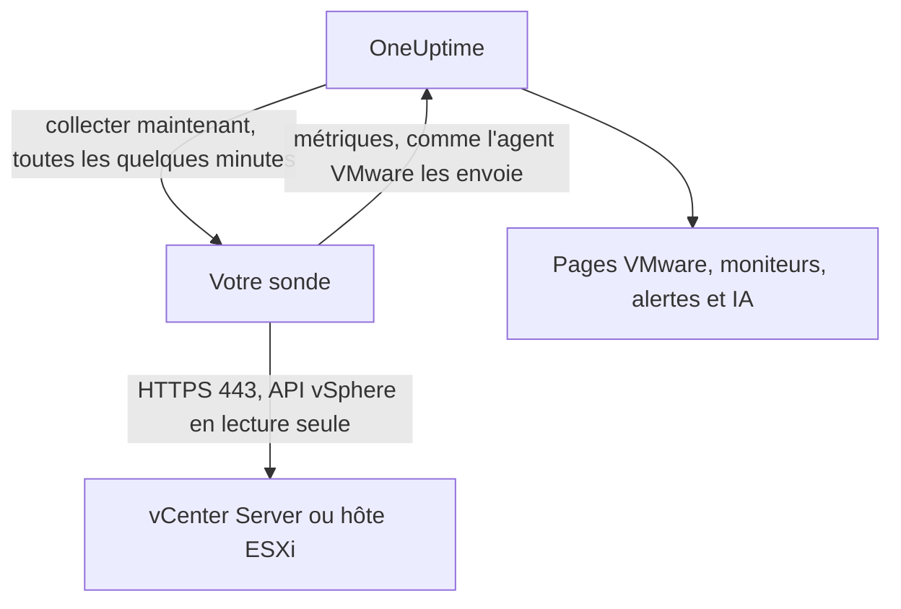

# VMware sans agent

Surveillez un vCenter Server, ou un hôte ESXi autonome, sans rien installer : saisissez dans OneUptime l'adresse de vCenter et un compte en lecture seule, choisissez la sonde qui peut le joindre, et la sonde collecte les mêmes données que l'[agent VMware](/docs/telemetry/vmware). Il n'y a aucun agent à installer, à mettre à jour ou à maintenir en marche, et aucune machine dédiée à provisionner.

:::cards
- [Avant de commencer](#avant-de-commencer) : Une sonde qui joint vCenter, et un compte en lecture seule.
- [Connecter un vCenter](#connecter-un-vcenter) : Quatre champs, un test et un nom.
- [Dépannage](#dépannage) : Ce que signifie chaque message et ce qui le corrige.
:::

## Fonctionnement

Toutes les quelques minutes, la sonde se connecte à vCenter avec le compte que vous avez enregistré, lit l'inventaire, les compteurs de performance et les statistiques vSAN, et les envoie à OneUptime. Elles arrivent exactement comme celles de l'agent VMware : chaque page VMware, chaque [moniteur VMware](/docs/monitor/vmware-monitor), chaque modèle d'alerte et OneUptime AI les lisent de la même façon. La sonde conserve sa session vCenter entre deux collectes, pour que le journal des événements de vCenter ne se remplisse pas de connexions.

## Sonde ou agent ?

| | Une sonde (cette page) | L'agent VMware |
|---|---|---|
| Ce que vous exécutez | Une sonde que vous exécutez déjà, ou une nouvelle | L'agent, sur une machine dédiée |
| Où le compte est conservé | Chiffré dans OneUptime, envoyé uniquement à la sonde | Dans le fichier `.env` de l'agent |
| Ce qu'il doit joindre | vCenter sur TCP 443, depuis la sonde | vCenter sur TCP 443, depuis l'agent |
| Plus grand vCenter | Environ 48 Mio de métriques par collecte | Aucune limite |
| Syslog ESXi et l'agent IA | Non inclus | Inclus |

Les deux envoient les mêmes données. Vous pouvez passer un vCenter de l'un à l'autre à tout moment, depuis sa page **Paramètres**.

## Avant de commencer

- **Une sonde qui peut joindre vCenter sur TCP 443.** C'est généralement une [sonde personnalisée](/docs/probe/custom-probe) dans le réseau de vCenter. Sur OneUptime Cloud, les sondes partagées ne reçoivent jamais de mot de passe vCenter : ajoutez donc une sonde à vous. Sur une instance auto-hébergée, les sondes propres à l'instance peuvent aussi collecter.
- **Un utilisateur vSphere doté du rôle Read-Only** sur l'objet vCenter de plus haut niveau, avec **Propagate to children** coché. Suivez [Créer l'utilisateur vSphere en lecture seule](/docs/telemetry/vmware#create-the-read-only-vsphere-user) : c'est le même compte que celui de l'agent.

> [!IMPORTANT]
> Sans **Propagate to children**, l'utilisateur se connecte mais ne voit rien, et la sonde indique que le compte ne peut pas lire l'inventaire de vCenter.

## Connecter un vCenter

:::steps
### Ouvrir les vCenter
Dans OneUptime, ouvrez **VMware → Tous les vCenter** et cliquez sur **Connecter vCenter**.

### Saisir l'adresse et le compte
Saisissez l'adresse à laquelle vous ouvrez le vSphere Client, comme `https://vcsa.example.com`, le nom d'utilisateur avec son domaine, comme `oneuptime@vsphere.local`, et son mot de passe. Choisissez la sonde qui joint vCenter.

### Tester la connexion
À l'étape suivante, cliquez sur **Tester la connexion**. La sonde se connecte, lit ce que le compte peut voir puis se déconnecte, et le résultat indique combien de centres de données, de clusters, d'hôtes, de machines virtuelles et de datastores elle a trouvés.

### Approuver le certificat de vCenter
Par défaut, vCenter utilise un certificat de sa propre autorité, auquel la sonde ne fait pas confiance. Le test affiche alors le certificat : comparez son empreinte à celle de vCenter, puis cliquez sur **Approuver ce certificat**.

### Le nommer et le connecter
Le nom est par défaut le nom d'hôte de vCenter. Cliquez sur **Connecter vCenter** pour enregistrer.
:::

La **Vue d'ensemble** du vCenter affiche une carte **Collecte des données**. Elle indique **Vérification** jusqu'à la première collecte, qui démarre dans la minute, puis **Collecte en cours**, et l'inventaire se remplit.

## Certificats

La sonde ne saute jamais la vérification des certificats. Chaque connexion effectue une poignée de main TLS complète, puis :

- si aucun certificat n'est approuvé, le certificat de vCenter doit provenir d'une autorité à laquelle la machine de la sonde fait confiance, pour l'adresse saisie ;
- si un certificat est approuvé, vCenter doit présenter exactement ce certificat, identifié par son empreinte SHA-256. Rien d'autre n'est accepté, pas même un certificat publiquement reconnu.

Pour vérifier une empreinte, ouvrez le vSphere Client dans **Administration → Certificates → Certificate Management**, ou exécutez `openssl s_client -connect vcsa.example.com:443 </dev/null | openssl x509 -noout -fingerprint -sha256` depuis la machine de la sonde.

Lorsque le certificat de vCenter est renouvelé, la collecte s'arrête avec **Le certificat de vCenter a changé** et le nouveau certificat est affiché. Rien n'est envoyé à vCenter tant que vous ne l'avez pas approuvé, depuis la page **Vue d'ensemble** ou **Paramètres** du vCenter.

## Le mot de passe enregistré

Le mot de passe est chiffré et en écriture seule : personne ne peut le relire, et l'API ne le renvoie jamais. Il est envoyé uniquement à la sonde qui collecte le vCenter, qui le garde en mémoire.

Un mot de passe enregistré n'est jamais envoyé qu'à l'adresse, par la sonde et au certificat pour lesquels il a été saisi. Modifier l'adresse, la sonde ou le certificat approuvé redemande le mot de passe : ainsi, personne qui peut modifier le vCenter ne peut l'envoyer ailleurs. Approuver le certificat que la sonde a trouvé à l'adresse enregistrée le conserve.

## Passer de l'agent à une sonde

Ouvrez la page **Paramètres** du vCenter. Sa carte **Collecte des données** propose **Collecter avec une sonde** pour un vCenter que l'agent envoie, et **Utiliser l'agent VMware** pour un vCenter qu'une sonde collecte. Passer à l'agent oublie le mot de passe enregistré.

> [!WARNING]
> Arrêtez l'agent VMware dès que la première collecte par la sonde réussit. Tant que les deux tournent, chaque métrique arrive deux fois.

## Référence

| Paramètre | Par défaut | Remarques |
|---|---|---|
| Collecter toutes les | 2 minutes | De 1 à 60 minutes. Collectez un grand vCenter moins souvent pour le ménager. |
| Collectes simultanées | 4 par sonde | Une collecte plus lente que son intervalle est sautée, jamais empilée. |
| Plus grande collecte | Environ 48 Mio | Les vCenter plus grands nécessitent l'agent VMware. |
| Test de connexion | 90 secondes pour démarrer | Un test qu'aucune sonde ne prend en charge à temps, ou qui dure plus de 2 minutes, est déclaré en échec. |

## Dépannage

:::details Le certificat de vCenter n'est pas approuvé
vCenter présente un certificat de sa propre autorité. Comparez l'empreinte affichée au certificat de vCenter, puis cliquez sur **Approuver ce certificat**.
:::

:::details vCenter a refusé la connexion
Utilisez le nom d'utilisateur complet avec son domaine, comme `oneuptime@vsphere.local`, et vérifiez le mot de passe et que le compte n'est pas verrouillé. Modifiez-les avec **Modifier la connexion** sur la page **Paramètres** du vCenter.
:::

:::details L'utilisateur ne peut pas lire l'inventaire de vCenter
Attribuez à l'utilisateur le rôle Read-Only sur l'objet vCenter de plus haut niveau, avec **Propagate to children** coché.
:::

:::details La sonde n'obtient aucune réponse de vCenter
Le réseau de la sonde ne peut pas joindre vCenter sur TCP 443. Autorisez ce trafic dans le pare-feu, ou choisissez une sonde dans le réseau de vCenter.
:::

:::details La sonde n'a pas pris cela en charge
La sonde est hors ligne, ou exécute une version de OneUptime antérieure à la collecte VMware. Vérifiez qu'elle est connectée dans le tableau **Sondes personnalisées**, et mettez-la à jour.
:::

:::details Ce vCenter est trop grand pour être collecté par une sonde
Ses métriques dépassent la taille d'un envoi d'une sonde. Utilisez l'[agent VMware](/docs/telemetry/vmware) pour ce vCenter.
:::

## Étapes suivantes

:::cards
- [Moniteur VMware](/docs/monitor/vmware-monitor) : Alertes sur les hôtes, les machines virtuelles, les datastores et les clusters.
- [Sonde personnalisée](/docs/probe/custom-probe) : Exécuter une sonde dans le réseau de vCenter.
- [Agent VMware](/docs/telemetry/vmware) : Collecter un vCenter avec l'agent à la place.
:::
