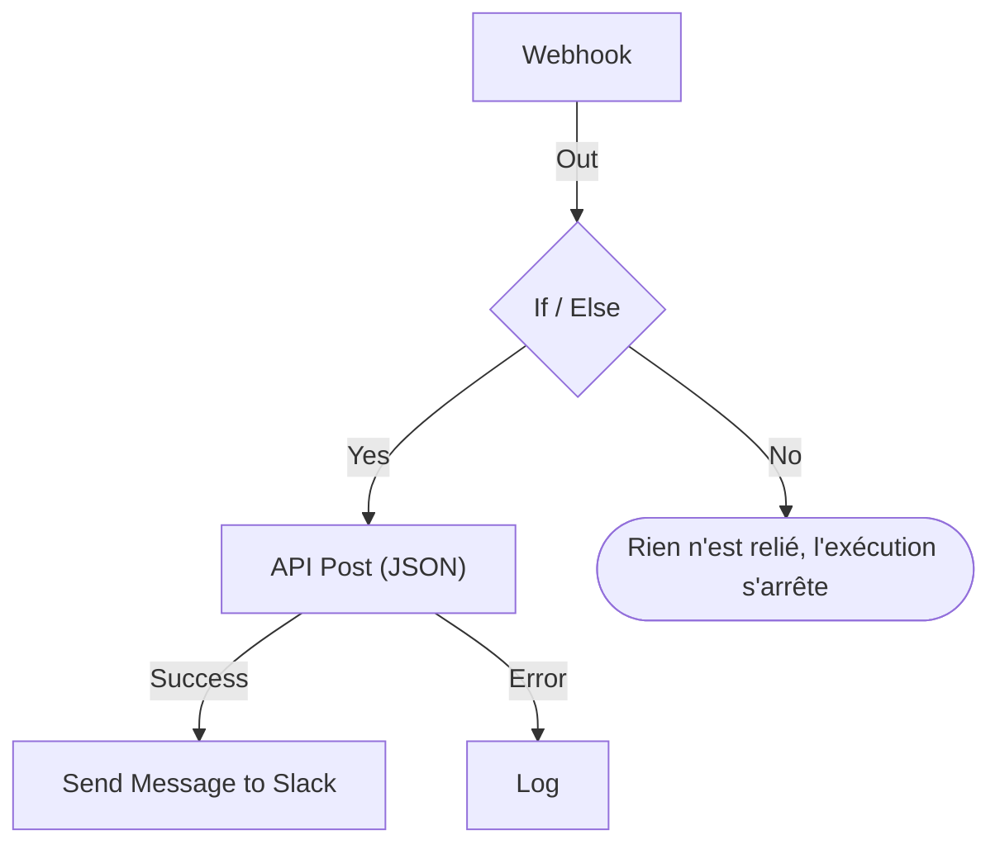

# Créer un workflow

Vous construisez un workflow dans son **Constructeur** : un canevas sur lequel vous ajoutez des blocs, les reliez et remplissez leurs paramètres. Cette page décrit la création d'un workflow, l'[ajout de blocs](#ajouter-des-blocs), leur [liaison](#relier-les-blocs) et leur [configuration](#configurer-un-bloc), le [passage de valeurs de l'un à l'autre](#utiliser-des-valeurs-des-blocs-précédents) et l'[activation du workflow](#lactiver).

Pour créer un workflow, ouvrez **Flux de travail** et cliquez sur **Créer un flux de travail**. La boîte de dialogue **Créer un flux de travail** vous demande d'abord comment commencer, puis un nom. Un modèle qui a besoin de paramètres propres, comme une URL de webhook Slack, vous les demande dans une étape de plus et les enregistre comme variables de workflow, pour que vous puissiez les changer plus tard sans modifier le workflow.

Choisissez comment commencer :

- **Partir de zéro**, en haut de la boîte de dialogue, vous donne un canevas vide. La plupart des workflows commencent ici.
- **Ou partir d'un modèle** liste quelques modèles **Recommandés**. Pour les autres, choisissez une catégorie à côté du champ de recherche, comme **Incidents**, **Moniteurs** ou **Jira**, ou **Tous les modèles**, ou tapez dans **Rechercher des modèles…**. Chaque mot que vous tapez doit correspondre.

Cliquez sur un modèle pour voir ce qu'il fait : son déclencheur, les blocs qui le composent et les paramètres qu'il vous demandera. Cliquez ensuite sur **Utiliser ce modèle**, ou double-cliquez sur le modèle. Dans le champ de recherche, les flèches choisissent un modèle et **Entrée** l'utilise. `/` vous ramène au champ de recherche.

Les workflows sont créés désactivés, si bien que rien ne s'exécute avant que vous les activiez. Un nouveau workflow s'ouvre dans le **Constructeur**, le canevas sur lequel vous le concevez.

## Le canevas

Un workflow parti de zéro s'ouvre avec un unique bloc en pointillés qui affiche **Choisissez ce qui démarre ce flux de travail**. Ce bloc est le point de départ : cliquez dessus pour choisir un déclencheur. Un workflow créé à partir d'un modèle s'ouvre avec ses blocs déjà en place.

Chaque workflow a exactement un **déclencheur**, en haut. Tout le reste est un **composant** qui fait quelque chose. Pour changer de déclencheur, supprimez-le : l'espace réservé en pointillés revient à sa place, et un clic dessus vous laisse en choisir un autre. Supprimer un bloc supprime aussi ses lignes ; reliez donc de nouveau le nouveau déclencheur au premier bloc.

Les modifications s'enregistrent automatiquement. Une pastille dans la barre d'outils le signale : **Enregistrement…** pendant que la modification part, puis **Enregistré**, ou **Impossible d'enregistrer** si cela n'a pas fonctionné. Le canevas n'a pas de bouton d'enregistrement ni d'étape de publication séparée.

## Ajouter des blocs

| Pour ajouter           | Cliquez sur                                                 | Panneau qui s'ouvre           |
| ---------------------- | ----------------------------------------------------------- | ----------------------------- |
| Le déclencheur         | Le bloc d'espace réservé en pointillés                      | **Add Trigger**               |
| Tout autre bloc        | **Ajouter un composant**, dans la barre d'outils au-dessus du canevas | **Ajouter un composant** |

Les deux panneaux s'ouvrent sur les blocs que la plupart des workflows utilisent, sous **Popular**, suivis des autres blocs intégrés. Sous **Ressources OneUptime**, cliquez sur une ressource comme **Incident** pour voir ce que vous pouvez en faire ; **Parcourir toutes les ressources** les liste toutes. Ou cherchez : tapez quelques mots, comme `create incident`, et la meilleure correspondance vient en premier. Appuyez sur `/` pour aller au champ de recherche, sur les flèches pour parcourir les résultats et sur **Entrée** pour ajouter le bloc en surbrillance. Un clic sur un bloc l'ajoute.

Un nouveau bloc se place sous le bloc le plus bas du canevas, et un nouveau déclencheur prend la place du bloc en pointillés, en haut. Le nouveau bloc est sélectionné et, s'il atterrit hors de la vue, le canevas défile juste assez pour l'afficher. Ses paramètres ne s'ouvrent pas d'eux-mêmes : cliquez sur le bloc quand vous êtes prêt à le configurer. Tant que ses paramètres obligatoires ne sont pas remplis, il affiche **Click to set up**.

Faites glisser les blocs où vous voulez ; le canevas les aligne sur une grille au passage. Les positions des blocs sont enregistrées, si bien que la personne suivante voit la disposition que vous avez laissée.

## Ce qu'il y a sur un bloc

| Champ                                | Ce qu'il fait                                                                                                                                                                                                                                                                                                                       |
| ------------------------------------ | ----------------------------------------------------------------------------------------------------------------------------------------------------------------------------------------------------------------------------------------------------------------------------------------------------------------------------------- |
| **Identifiant** (sous **ID**)        | L'ID court affiché sur le bloc, comme `log-1`. C'est par lui que les autres blocs se réfèrent à celui-ci : le renommer casse donc toutes les références `{{local.components.…}}` qui le visent. Le titre du bloc est le nom propre du composant et ne peut pas être changé.                                                         |
| **Paramètres**                       | Ce dont le bloc a besoin pour faire son travail — une URL, un canal Slack, le corps d'un message. Les champs facultatifs portent la mention **(Optionnel)** ; tout le reste est obligatoire. Un interrupteur marche/arrêt n'a ni l'un ni l'autre, car il a toujours une valeur. Les paramètres moins utilisés sont repliés sous **Plus de champs**, dont l'en-tête les nomme et montre ceux qui sont renseignés. |
| **Entrée**                           | Le point sur le bord supérieur, où arrivent les lignes des blocs précédents. Les déclencheurs n'en ont pas : rien ne s'exécute avant eux.                                                                                                                                                                                            |
| **Outputs**                          | Les points le long du bord inférieur, étiquetés juste au-dessus, d'où partent les lignes vers les blocs suivants. Beaucoup de blocs ont des sorties **Success** et **Error** séparées, pour que vous puissiez traiter les deux cas.                                                                                                  |

## Relier les blocs

Faites glisser depuis un point au bas d'un bloc jusqu'au point en haut du bloc suivant. La ligne que vous tracez décide de ce qui s'exécute ensuite.

- Si vous reliez depuis **Success**, le bloc suivant ne s'exécute que si le précédent a réussi.
- Si vous reliez depuis **Error**, le bloc suivant ne s'exécute que si le précédent a échoué.
- Si vous ne reliez pas une sortie, ce chemin s'arrête simplement.

Vous pouvez relier une sortie à plusieurs blocs. Tous s'exécutent — mais l'un après l'autre, dans une seule file, pas en parallèle. Ne comptez pas sur l'ordre entre les branches, ni sur le fait qu'elles se chevauchent dans le temps.

Chaque bloc s'exécute au plus une fois par exécution. Une ligne qui mène à un bloc déjà exécuté — en remontant le canevas, ou depuis une seconde branche après que la première l'a atteint — arrête l'exécution avec une erreur : un workflow ne peut donc pas boucler.

## Configurer un bloc

Cliquez sur un bloc pour ouvrir ses paramètres dans une boîte de dialogue, ou atteignez-le avec **Tab** et appuyez sur **Entrée**. Remplissez les paramètres et cliquez sur **Enregistrer**.

Chaque paramètre a le champ dont sa valeur a besoin :

| Le paramètre contient                           | Vous obtenez                                                                         |
| ----------------------------------------------- | ------------------------------------------------------------------------------------ |
| Du texte : un message, un prompt, une valeur à journaliser | Une zone qui s'agrandit pendant la saisie. **Entrée** commence une nouvelle ligne. |
| Une valeur courte : une URL, un ID, un objet d'e-mail | Une seule ligne.                                                                 |
| Du code ou du HTML                              | Un éditeur de code.                                                                  |
| Du JSON                                         | Un éditeur JSON.                                                                     |
| Marche ou arrêt                                 | Un interrupteur, avec son nom à côté. Cliquez sur l'interrupteur ou sur son nom pour le basculer. |

La boîte de dialogue s'ouvre sur ce pour quoi vous êtes le plus probablement venu. Pour un déclencheur **Webhook**, c'est son URL, avec un bouton **Copier l'URL**, les méthodes qu'il accepte et un exemple de requête. Pour un déclencheur **Manuel**, c'est la façon dont le workflow est lancé. Tout autre bloc s'ouvre sur ses paramètres. Un bloc sans paramètres n'a pas de section **Paramètres** du tout.

En dessous, de haut en bas :

- **ID**, **Entrées** et **Outputs**, côte à côte — l'identifiant du bloc, d'où on l'atteint et ce qui s'exécute après lui.
- **Returns** — les données que ce bloc transmet aux étapes suivantes. Chaque valeur montre la référence exacte qui la lit, avec un bouton pour la copier.
- **Mode d'emploi** — ce que fait le bloc en une phrase, les étapes pour le configurer, un exemple à copier et les erreurs les plus courantes. L'exemple est construit à partir de votre workflow : il utilise l'ID de ce bloc, et les valeurs du déclencheur là où il insère des données dans un message. **En savoir plus** ouvre l'explication détaillée, et les liens mènent au guide complet. Chaque bloc en a un, et le bouton **Mode d'emploi** en haut de la boîte de dialogue y mène directement.

Le pied de la boîte de dialogue contient :

- **Supprimer** — retirer ce bloc. La boîte de dialogue demande d'abord confirmation et nomme le bloc par son type et son identifiant, par exemple **Send Email (send-email-2)**, pour que vous sachiez lequel de plusieurs blocs semblables disparaît.
- **Run just this step** — exécuter ce seul bloc, sans le reste du workflow. Les valeurs qu'il aurait lues dans d'autres étapes arrivent vides, et tout ce qu'il envoie, écrit ou supprime se produit réellement. Il saute toutes les conditions placées avant le bloc : seules les personnes qui peuvent modifier le workflow peuvent donc l'utiliser.

### Utiliser des valeurs des blocs précédents

La plupart des paramètres peuvent utiliser une valeur d'un bloc précédent ou une variable — c'est ainsi que les données circulent d'un bloc au suivant. Chacun de ces paramètres a un bouton **{ }** à son extrémité. Il ouvre la liste des valeurs que vous pouvez utiliser : chaque bloc précédent sous son nom, avec chacune des valeurs qu'il renvoie — son nom, ce qu'elle contient et son type —, puis les variables de votre workflow et vos variables globales. Cherchez dans la liste, choisissez une valeur à la souris ou avec les flèches et **Entrée**, et la valeur s'insère là où se trouve votre curseur.

Dans le paramètre, une valeur apparaît comme une puce, par exemple **Webhook › Request Body**. Survolez-la pour voir la référence qu'elle représente, `{{local.components.webhook-1.returnValues.request-body}}`, qui est ce qui est enregistré. Le curseur franchit une puce d'un seul coup, **Backspace** la supprime entièrement, et la copier copie la référence. Si vous connaissez la syntaxe, tapez plutôt `{{` : la même liste s'ouvre sous le paramètre et se réduit au fil de la saisie.

- **Seules les valeurs qui existeront sont proposées.** Ce sont le déclencheur et les blocs qui s'exécutent avant celui-ci. Un bloc qui s'exécute plus tard n'a pas encore de sortie. Tant qu'un bloc n'est pas relié, seules les valeurs du déclencheur sont listées, et la liste le précise.
- **Un enregistrement s'ouvre sur ses champs.** Un bloc Find One ou On Create renvoie un enregistrement entier. Choisissez-le pour voir ses champs, en commençant par ceux que lit le **Select Fields** du bloc. Une valeur JSON ou un ensemble d'en-têtes s'ouvre sur une zone où vous tapez un chemin, comme `title` ou `alerts[0].status`.
- **Une fois qu'un bloc s'est exécuté, la liste sait ce que contiennent ses valeurs.** Chaque valeur indique ce qu'elle contenait lors de la dernière exécution — `"production"`, ou `3 fields` —, et une valeur JSON ou un ensemble d'en-têtes s'ouvre sur les champs qu'il avait, chacun avec son contenu. Depuis le **Request Body** d'un Webhook, vous choisissez ainsi **incident.title** au lieu de taper un chemin. La recherche trouve aussi ces champs : tapez `title`, ou `{{` et le début d'un chemin. Les champs d'un enregistrement montrent aussi ce qu'ils contenaient. Les champs viennent de la dernière exécution : un champ qu'une requête ultérieure omet est donc vide dans cette exécution-là. Une valeur qui ressemble à un secret, comme un en-tête `Authorization`, un jeton ou un mot de passe, est listée sans ce qu'elle contenait.
- **Un Webhook qui n'a encore reçu aucune requête le dit** en haut de ses valeurs, avec **Copy test request** : une commande `curl` qui envoie `{"message": "Hello"}` à l'URL de webhook du workflow. Lancez-la dans un terminal pendant que la liste est ouverte : les champs de la requête y apparaissent dès que l'exécution qu'elle déclenche est terminée, en général en quelques secondes. Le workflow doit être activé, sinon la requête est refusée. Seules les personnes qui peuvent voir l'URL du webhook ont ce bouton. Un déclencheur Incoming Email qui n'a encore reçu aucun e-mail le dit au même endroit ; envoyez un e-mail à son adresse, et ses en-têtes et ses pièces jointes apparaissent de la même façon.
- **Les éditeurs de code ont Insert value dans leur barre d'outils.** En JSON, il ajoute les guillemets dont une valeur a besoin à l'intérieur d'un document. **Run Custom JavaScript** lit les valeurs via ses **Arguments** : son code n'a donc pas de sélecteur.
- **Les nombres, mots de passe, interrupteurs et dates gardent leur propre contrôle,** avec **{ }** à côté. Une valeur choisie remplace le contrôle, et **abc** revient à la saisie.

Une puce devient orange quand ce qu'elle lit n'existe pas : un bloc renommé ou supprimé, une valeur que le bloc ne renvoie pas, un bloc qui s'exécute plus tard, ou une variable qui n'existe pas. Son info-bulle dit de quoi il s'agit. La syntaxe des références est décrite dans [Variables](/docs/workflows/variables).

## Vérifications pendant la construction

Le Constructeur vérifie tout le graphe à chaque modification et signale ce qu'il trouve dans une pastille de la barre d'outils. Cliquez sur la pastille pour ouvrir **Problems with this workflow**, qui liste chaque problème et vous amène au bloc concerné. Sur le canevas, un bloc dont les paramètres obligatoires sont encore vides affiche **Click to set up**, et un bloc qui a un autre problème porte un badge dans son coin : rouge pour une erreur, orange pour un avertissement. Survolez le badge pour lire ce qui ne va pas.

Il repère les erreurs qui restent sinon invisibles jusqu'à ce qu'une exécution tourne mal :

- un workflow sans déclencheur ;
- deux blocs avec le même ID, ou un ID qui contient un point ;
- un bloc auquel rien n'est relié ;
- un paramètre obligatoire laissé vide ;
- du JSON mal formé ;
- des espaces à l'intérieur de `{{ }}` ;
- des références à une étape ou à une valeur de retour qui n'existe pas.

Une chose lui échappe : savoir si un nom de variable existe. Les paramètres d'un bloc, eux, le peuvent — une référence à une variable qui n'existe pas y apparaît comme une puce orange. Partout ailleurs, une variable renommée ne se voit que dans le journal de l'exécution.

## Votre premier workflow

Le plus rapide pour prendre le canevas en main est un workflow de deux blocs que vous lancez à la main :

:::steps
1. Cliquez sur le bloc d'espace réservé en pointillés, puis sur **Manuel** dans le panneau **Add Trigger**.
2. Cliquez sur **Ajouter un composant**, puis sur **Journal** sous **Popular**. Le nouveau bloc se place sous le déclencheur. Reliez le point **Execute** du déclencheur au point d'entrée du bloc Log, en dessous.
3. Cliquez sur le bloc Log, qui affiche **Click to set up**, et tapez `Hello from ` dans sa **Value**. Cliquez sur **{ }**, puis sur **JSON** sous **Manuel**. Le paramètre affiche **Manual › JSON** et enregistre `{{local.components.manual-1.returnValues.value}}`. `manual-1` est l'**Identifiant** du déclencheur, affiché sur le bloc déclencheur. Cliquez sur **Enregistrer**.
4. Basculez **Activé**, en haut du Constructeur. Un workflow désactivé ne peut pas être exécuté du tout, pas même à la main ; si vous sautez cette étape, **Exécuter le flux de travail** vous demande d'abord de l'activer.
5. De retour dans le **Constructeur**, cliquez sur **Exécuter le flux de travail**, mettez `{ "name": "Ada" }` dans le champ **JSON**, cliquez sur **Run Workflow Manually** et confirmez avec **Run**.
6. Un panneau **Exécution du flux de travail** s'ouvre de lui-même et suit l'exécution. Le journal affiche `Value:` suivi de `Hello from { "name": "Ada" }`.
:::

Ce cycle — ajouter, relier, configurer, exécuter, lire le journal — est la façon dont vous construirez chaque workflow.

> [!TIP]
> Le JSON saisi dans **Exécuter le flux de travail** arrive au déclencheur Manual sous la forme du texte que vous avez tapé. Pour en lire un champ, comme `name`, ajoutez un bloc **Text to JSON**, mettez le **JSON** du déclencheur dans son **Text**, et lisez le champ dans le **JSON** de ce bloc : `{{local.components.text-to-json-1.returnValues.json.name}}`.

## L'activer

Les nouveaux workflows démarrent désactivés, tout comme les workflows que vous dupliquez ou importez. Tant qu'un workflow est désactivé, le Constructeur l'indique au-dessus du canevas, avec un bouton **Activer le flux de travail**.

L'interrupteur **Activé** se trouve en haut du **Constructeur**, à côté de **Ajouter un composant** et de **Exécuter le flux de travail**. Il figure aussi sur la page **Vue d'ensemble** du workflow, dont la carte **Détails du flux de travail** montre l'état actuel par une pastille verte **Activé** ou rouge **Désactivé** : cliquez sur **Modifier le flux de travail** et ouvrez **Plus de champs**. Seules les personnes qui peuvent modifier le workflow peuvent l'activer ou le désactiver ; les autres voient l'interrupteur grisé.

Un workflow désactivé ne peut pas s'exécuter du tout, quelle que soit la façon dont on le lance :

| Lancé par                                                | Tant que le workflow est désactivé                                                                                                                                                         |
| -------------------------------------------------------- | ------------------------------------------------------------------------------------------------------------------------------------------------------------------------------------------ |
| Son déclencheur : une planification, un événement OneUptime ou un e-mail | Ignoré.                                                                                                                                                                      |
| **Exécuter le flux de travail** ou **Run just this step** | Le Constructeur demande plutôt **Activer ce flux de travail ?**. **Activer et exécuter** (ou **Activer et exécuter l'étape**) active le workflow puis exécute ce que vous avez demandé, avec les valeurs que vous avez données. |
| Un appel à son URL de webhook                            | Refusé avec HTTP 400 et "This workflow is turned off, so it can't run. Turn it on with the Enabled switch at the top of its Builder, then try again."                                        |
| Le bloc **Execute Workflow** d'un autre workflow          | Ce bloc prend son chemin **Error**, et l'erreur nomme le workflow qu'il a appelé.                                                                                                           |

L'ordre est donc : le construire, le tester avec **Exécuter le flux de travail**, lire le journal de l'exécution, et rebasculer **Activé** sur arrêt si vous n'êtes pas prêt à ce que son déclencheur se produise. Pour tester un seul bloc sans exécuter l'ensemble, utilisez **Run just this step** dans les paramètres de ce bloc.

Pour mettre un workflow en pause sans le supprimer, désactivez **Activé**. Aucune nouvelle exécution ne démarre. Une exécution en cours se termine, mais une exécution en attente sur un bloc **Sleep** est annulée à son réveil et enregistrée comme une erreur.

## Mettre de l'ordre

- Faites glisser les blocs pour les déplacer. La disposition est enregistrée.
- Pour supprimer une ligne, faites glisser l'une de ses extrémités hors du point et déposez-la sur une zone vide du canevas.
- Pour supprimer un bloc, cliquez dessus et utilisez **Supprimer** au bas de sa boîte de dialogue de paramètres. Sélectionner un bloc ou une ligne et appuyer sur Retour arrière le supprime aussi.
- Impossible de dupliquer un seul bloc. **Dupliquer : Flux de travail** sur la page **Paramètres** du workflow copie l'ensemble. Le nom de la copie est prérempli, numéroté au-delà des workflows du projet ("Nightly Sync" est copié en "Nightly Sync 2"), et la copie s'ouvre, désactivée.
- Empilez les blocs de haut en bas pour qu'ils se lisent dans le sens où ils s'exécutent — les entrées sont sur le bord supérieur, les sorties sur le bord inférieur, si bien que le flux descend naturellement.

## Étapes suivantes

:::cards
- [Déclencheurs](/docs/workflows/triggers): Les cinq façons dont un workflow peut démarrer.
- [Composants](/docs/workflows/components): Tous les blocs que vous pouvez ajouter, avec leurs paramètres et leurs sorties.
- [Variables](/docs/workflows/variables): Faites circuler les données entre les blocs et gardez-en les secrets à l'écart.
- [Exécutions](/docs/workflows/runs-and-logs): Vérifiez ce que chaque exécution a fait, étape par étape.
:::
