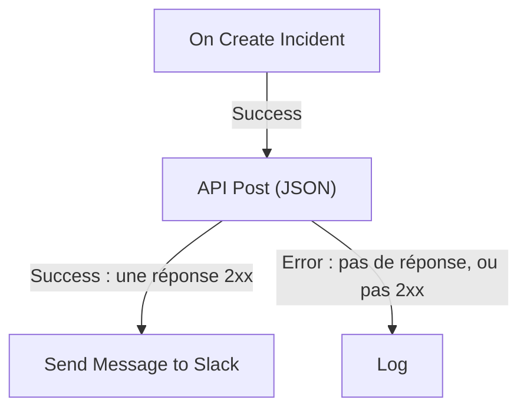

# Composants de workflow

Les composants sont les blocs que vous ajoutez après le déclencheur. Chacun fait une seule chose — envoie un message, appelle une API, vérifie une condition, modifie un enregistrement OneUptime — puis prend l'une de ses sorties vers les blocs qui y sont reliés. Cette page est le catalogue : ce dont chaque bloc a besoin, ce qu'il renvoie et quand il prend chaque sortie.

Vous aurez rarement besoin de l'ouvrir pendant la construction. Les paramètres de chaque bloc se terminent par **Mode d'emploi** : ce que fait le bloc, les étapes pour le configurer, un exemple construit à partir de votre propre workflow et les erreurs les plus courantes. Pour ajouter et relier des blocs, voir [Créer un workflow](/docs/workflows/authoring).

:::cards
- [Envoyer un message](#slack): Slack, Microsoft Teams, Discord, Telegram, IRC et e-mail.
- [Appeler une API](#api): Envoyez une requête à n'importe quelle API HTTP et lisez la réponse.
- [Ajouter de la logique](#conditions): Créez un embranchement selon une valeur, transformez des données, attendez ou journalisez.
- [Travailler avec les enregistrements OneUptime](#composants-de-données-oneuptime): Trouvez, créez, modifiez et supprimez des moniteurs, des incidents et plus encore.
:::

## Quel composant utiliser ?

| Pour…                                                         | Utilisez                                                          |
| ------------------------------------------------------------- | ----------------------------------------------------------------- |
| Publier dans un outil de discussion                           | [Slack](#slack), [Microsoft Teams](#microsoft-teams), [Discord](#discord), [Telegram](#telegram) ou [IRC](#irc) |
| Envoyer un e-mail via votre propre serveur de messagerie      | [Email](#email)                                                   |
| Appeler toute autre API, ou votre propre service              | [API](#api)                                                       |
| Résumer, classer ou rédiger du texte                          | [Generate Text with AI](#generate-text-with-ai)                   |
| Prendre un chemin ou un autre selon une valeur                | [Conditions](#conditions)                                         |
| Transformer des données entre deux blocs                      | [JSON](#json) ou [Custom Code](#custom-code)                      |
| Attendre avant le bloc suivant                                | [Sleep](#sleep)                                                   |
| Démarrer un autre workflow                                    | [Execute Workflow](#execute-workflow)                             |
| Lire ou modifier des incidents, des moniteurs et d'autres enregistrements | [Composants de données OneUptime](#composants-de-données-oneuptime) |

Un bloc dédié vaut mieux qu'un bloc générique : le bloc Slack connaît les limites de Slack, et un bloc d'enregistrement connaît les champs de l'enregistrement, si bien que vous obtenez des erreurs et des journaux plus clairs qu'avec un bloc **API** qui ferait le même travail.

## Comment fonctionne chaque bloc

Un bloc s'exécute quand le bloc qui le précède prend la sortie qui lui est reliée. Il lit ses paramètres, fait son travail, puis prend l'une de ses sorties. Seuls les blocs reliés à cette sortie s'exécutent ensuite.



- Les **Paramètres** sont ce que vous remplissez. Les paramètres marqués **(Optionnel)** peuvent rester vides. Les paramètres moins utilisés sont repliés sous **Plus de champs**.
- Les **Outputs** sont les points du bord inférieur. La plupart des blocs ont **Success** et **Error** ; [Conditions](#conditions) a **Yes** et **No**.
- Les **Returns** sont les valeurs qu'un bloc transmet aux blocs suivants, comme le **Response Body** d'une API. Un bloc suivant en lit une avec `{{local.components.<block ID>.returnValues.<value ID>}}` ; le bouton **{ }** d'un paramètre l'insère pour vous. Voir [Variables](/docs/workflows/variables#sorties-des-composants-données-des-blocs-précédents).

Un bloc qui prend **Error** ne fait pas échouer l'exécution : l'exécution suit le chemin **Error**, ou s'arrête là si rien n'y est relié. Un paramètre obligatoire laissé vide, ou un paramètre qui ne peut jamais fonctionner, arrête au contraire l'exécution avec une erreur.

## API

Faites une requête HTTP vers n'importe quelle URL. Il y a un bloc par méthode : **API Get (JSON)**, **API Post (JSON)**, **API Put (JSON)**, **API Patch (JSON)** et **API Delete (JSON)**.

| Paramètre           | Ce qu'il fait                                                                                                                        |
| ------------------- | ------------------------------------------------------------------------------------------------------------------------------------ |
| **URL**             | L'adresse à appeler, en `http` ou `https`.                                                                                           |
| **Request Body**    | Le JSON à envoyer. En général, seules les requêtes `POST`, `PUT` et `PATCH` en ont besoin.                                           |
| **Request Headers** | Les en-têtes à envoyer, comme une clé d'API. Sous **Plus de champs**. Leurs valeurs sont masquées dans le journal de l'exécution.    |

| Sortie      | Quand                                                                                          |
| ----------- | ---------------------------------------------------------------------------------------------- |
| **Success** | Le serveur a répondu avec un statut 2xx.                                                       |
| **Error**   | La requête a échoué : le serveur était injoignable, ou il a répondu avec un autre statut.      |

Dans les deux cas, le bloc renvoie **Response Status**, **Response Headers** et **Response Body**, plus **Error** avec la raison en cas d'échec. Lisez un champ d'une réponse JSON en ajoutant son nom à la référence, comme dans `{{local.components.api-get-1.returnValues.response-body.id}}`.

Les redirections ne sont pas suivies : pointez donc le bloc vers l'adresse qui répond. Les requêtes partent de OneUptime : une URL qui se résout vers une adresse de réseau privé est refusée, sauf si un administrateur auto-hébergé l'autorise, et l'exécution s'arrête avec la raison. Voir [Accès réseau sortant](/docs/workflows/configuration#accès-réseau-sortant).

## AI

### Generate Text with AI

Générez une réponse textuelle à partir d'un prompt et d'un contexte JSON facultatif. Le bloc utilise le fournisseur LLM par défaut du projet, ou le fournisseur global de l'installation quand le projet n'en a pas. Les fournisseurs se configurent de façon centralisée sous **Paramètres du projet → IA → Fournisseurs LLM** ; leurs clés et leurs points de terminaison ne sont jamais des paramètres du bloc.

| Paramètre                 | Ce qu'il fait                                                                                                                                                     |
| ------------------------- | ----------------------------------------------------------------------------------------------------------------------------------------------------------------- |
| **System Instructions**   | Des consignes facultatives sur le rôle, le ton et les contraintes du modèle.                                                                                     |
| **Prompt**                | La tâche. Elle est envoyée exactement comme vous la tapez : le Markdown convient, et elle peut inclure des variables et des valeurs des blocs précédents.        |
| **Context**               | Du JSON facultatif que vous envoyez délibérément. Il est ajouté après un marqueur explicite de fin de message et traité comme des données non fiables.            |
| **Temperature**           | Sous **Plus de champs**. La variation, de `0` à `1` ; la valeur par défaut est `0.2`, pour une automatisation prévisible. Les modèles Claude actuels, Opus 4.7 et ultérieurs ainsi que tous les modèles Claude 5, choisissent leur propre échantillonnage : OneUptime retire **Temperature** de leurs requêtes, qui n'a donc aucun effet sur eux. |
| **Maximum Output Tokens** | Sous **Plus de champs**. De `1` à `4096` ; la valeur par défaut est `1024`.                                                                                      |

System Instructions, Prompt et le Context sérialisé sont limités ensemble à 50 000 caractères. Une image incorporée en base64, comme la capture d'écran d'un moniteur synthétique dans la description d'un incident, est remplacée par une courte note comme `[image omitted: PNG, 340 KB]` avant la mesure, car le modèle lit du texte, pas des images. Le journal de l'exécution indique ce qui a été omis. La requête au fournisseur dure au plus 60 secondes et n'est tentée qu'une fois. Au plus trois requêtes d'IA de workflow peuvent s'exécuter en même temps par projet.

Il renvoie **Response** (le texte généré), **Provider** et **Model** (ce qui a répondu), **Total Tokens** et **Completion Tokens** (l'utilisation déclarée par le fournisseur), **LLM Log ID** (l'entrée de l'appel dans les journaux IA) et **Error**.

Reliez **Success** aux blocs qui utilisent la réponse, et **Error** à une solution de repli : les échecs de validation, d'accès, de fournisseur, de budget, de facturation et de délai le prennent tous. Le bloc n'envoie aucun outil : le modèle ne peut donc pas interroger OneUptime, appeler des API ni modifier des données de lui-même.

> [!WARNING]
> La sortie du modèle est du texte non fiable. Relisez-la avant qu'elle n'atteigne des clients, et ne laissez jamais du texte libre généré par l'IA décider seul d'une action destructrice. Voir [Composants IA](/docs/workflows/configuration#composants-ia) pour ce qui est envoyé au fournisseur, ce qui est journalisé et ce que cela coûte.

## Slack

Publiez un message dans un canal Slack via un webhook entrant.

| Paramètre                      | Ce qu'il fait                                                                                                                                                                                                 |
| ------------------------------ | ------------------------------------------------------------------------------------------------------------------------------------------------------------------------------------------------------------- |
| **Slack Incoming Webhook URL** | Le webhook du canal dans lequel publier. Il doit commencer par `https://hooks.slack.com/services/`. Le guide de Slack pour [en créer un](https://api.slack.com/messaging/webhooks) prend quelques minutes.      |
| **Message Text**               | Le texte à envoyer. Il est envoyé exactement comme vous le tapez : utilisez donc la mise en forme propre à Slack, `*bold*`, `_italic_`, `~strikethrough~` et `<https://example.com|a link>`. Un texte plus long qu'une section Slack (3 000 caractères) part en plusieurs sections ; au-delà de dix sections, il est coupé et se termine par "… (truncated — see OneUptime for the full text)". |

**Success** se produit quand Slack a accepté le message et **Error** quand il l'a refusé, avec la raison donnée par Slack dans **Error**. Ces blocs publient via le webhook indiqué dans leurs paramètres, et non via la connexion Slack de votre projet.

## Microsoft Teams

Publiez un message dans un canal Microsoft Teams. Le bloc s'appelle **Send Message to Teams**.

| Paramètre                      | Ce qu'il fait                                                                                                                                                                                                                                   |
| ------------------------------ | ----------------------------------------------------------------------------------------------------------------------------------------------------------------------------------------------------------------------------------------------- |
| **Teams Incoming Webhook URL** | Le webhook du canal dans lequel publier, une URL `https` sur `office.com`, `office365.com`, `logic.azure.com` ou `environment.api.powerplatform.com`. Le guide de Microsoft montre comment [en créer un avec les Workflows de Teams](https://support.microsoft.com/en-us/teams/apps-service/create-incoming-webhooks-with-workflows-for-microsoft-teams). |
| **Message Text**               | Le texte à envoyer. Un message plus grand que ce qu'accepte un webhook entrant (environ 12 000 caractères, mesurés tels qu'envoyés) est coupé et se termine par "… (truncated — see OneUptime for the full text)".                              |

## Discord

Publiez un message dans un canal Discord via un webhook entrant.

| Paramètre                        | Ce qu'il fait                                                                                                                                       |
| -------------------------------- | --------------------------------------------------------------------------------------------------------------------------------------------------- |
| **Discord Incoming Webhook URL** | Le webhook du canal, une URL `https` sur `discord.com` ou `discordapp.com`.                                                                         |
| **Message Text**                 | Le texte à envoyer. Un message de plus de 2 000 caractères, la limite de Discord, est coupé et se termine par "… (truncated — see OneUptime for the full text)". |

## Telegram

Envoyez un message dans une conversation Telegram avec un bot.

| Paramètre              | Ce qu'il fait                                                                                                                                          |
| ---------------------- | ------------------------------------------------------------------------------------------------------------------------------------------------------ |
| **Telegram Bot Token** | Le jeton que BotFather a donné à votre bot, comme `123456789:ABCdef…`. Un jeton d'une autre forme arrête l'exécution, sans que le jeton soit écrit dans le journal. |
| **Chat ID**            | La conversation où publier : son ID, ou le `@username` d'un canal. Ajoutez d'abord le bot au groupe ou au canal. Pour écrire à une personne, celle-ci doit avoir démarré une conversation avec le bot. |
| **Message Text**       | Le texte à envoyer. Un message de plus de 4 096 caractères, la limite de Telegram, est coupé et se termine par "… (truncated — see OneUptime for the full text)". |

Quand Telegram refuse le message, **Error** se produit avec la raison donnée par Telegram.

## IRC

Publiez un message dans un canal IRC, sur n'importe quel réseau IRC : Libera.Chat, OFTC ou un serveur à vous. IRC n'a pas de webhooks : le bloc se connecte donc lui-même au serveur, rejoint le canal, envoie le message et repart.

| Paramètre        | Ce qu'il fait                                                                                                                                                                                                                                      |
| ---------------- | -------------------------------------------------------------------------------------------------------------------------------------------------------------------------------------------------------------------------------------------------- |
| **IRC Server**   | Le nom d'hôte du serveur, comme `irc.libera.chat`. Juste le nom : pas de `ircs://`, ni de port.                                                                                                                                                    |
| **Channel**      | Le canal où publier, comme `#ops`. Ce doit être un canal : un pseudonyme saisi ici est refusé plutôt que de recevoir un message privé.                                                                                                              |
| **Message Text** | Le texte à envoyer. Chaque ligne part comme un message IRC distinct, et une ligne trop longue est découpée pour tenir. Un message est envoyé en 15 lignes IRC au plus : un message plus long est raccourci, et sa dernière ligne le signale. IRC n'a pas de Markdown, le texte est donc envoyé tel quel ; les codes de mise en forme propres à IRC, comme le gras et les couleurs, fonctionnent. |

Sous **Plus de champs** :

| Paramètre                                | Ce qu'il fait                                                                                                                                                                                                      |
| ---------------------------------------- | ------------------------------------------------------------------------------------------------------------------------------------------------------------------------------------------------------------------ |
| **Nickname**                             | Le nom sous lequel le message est envoyé. Par défaut `OneUptime`. Si le pseudonyme est pris, le bloc l'essaie avec un tiret bas ou un chiffre ajouté, puis avec l'un d'eux à la place de ses derniers caractères, pour un serveur qui n'accepte pas de pseudonyme plus long. |
| **Port**                                 | Le port du serveur. Par défaut `6697`, ou `6667` avec **Disable TLS** activé.                                                                                                                                      |
| **Disable TLS**                          | Le bloc se connecte en TLS et vérifie le certificat du serveur. N'activez ce paramètre que pour un serveur qui ne propose pas TLS ; tout mot de passe est alors envoyé en clair. Pour faire confiance à un certificat émis par votre propre autorité de certification, une installation auto-hébergée définit plutôt `NODE_EXTRA_CA_CERTS`. |
| **Channel Key**                          | La clé d'un canal qui en a une (mode `+k`).                                                                                                                                                                        |
| **Send Without Joining**                 | Publie sans rejoindre le canal, pour que le canal ne voie pas le bloc arriver et repartir. Ne fonctionne que là où le canal accepte des messages de l'extérieur (pas de mode `+n`).                                 |
| **Server Password**                      | Un mot de passe que le serveur ou votre bouncer demande à la connexion.                                                                                                                                           |
| **SASL Username** et **SASL Password**   | Connectez-vous à votre compte sur les réseaux qui utilisent SASL, comme Libera.Chat, qui l'exige pour les connexions depuis certaines adresses de cloud et de VPN. Remplissez les deux ou aucun.                    |

**Success** se produit une fois que le serveur a accepté chaque ligne. Le bloc le vérifie en demandant au serveur de répondre à un ping après la dernière ligne : un serveur répond dans l'ordre, si bien que tout refus du message arrive avant. Un bouncer comme ZNC répond lui-même au ping : le bloc écoute donc une seconde de plus pour recevoir la réponse du réseau qui se trouve derrière.

**Error** se produit quand le serveur est injoignable, refuse la connexion, le pseudonyme, un mot de passe ou le canal, ou refuse le message. Il transmet la raison, dans les propres termes du serveur quand celui-ci en a donné. Un **IRC Server**, un **Channel** ou un **Message Text** manquant, ou un paramètre qui ne pourrait jamais fonctionner, arrête au contraire l'exécution.

Chaque exécution du bloc ouvre sa propre connexion, et les réseaux IRC limitent la fréquence à laquelle une même adresse peut se connecter : une rafale de messages peut être refusée avec une raison comme "Reconnecting too fast", et prend **Error** comme tout autre refus. Pour un workflow qui peut se produire plusieurs fois par minute, regroupez ce qu'il a à dire en un seul message, ou envoyez-le via un serveur à vous.

Gardez les mots de passe dans des [variables globales secrètes](/docs/workflows/variables#variables-globales) et utilisez la variable dans le paramètre ; ils sont masqués dans les journaux d'exécution dans tous les cas. Les connexions vers les adresses de bouclage (`localhost`, `127.0.0.1`), de lien local et de métadonnées cloud sont refusées. Sur OneUptime Cloud, un serveur situé sur une adresse de réseau privé, ou un nom qui se résout vers une telle adresse, est également refusé. Les installations auto-hébergées peuvent atteindre un serveur IRC sur leur propre réseau, sauf si `DATA_SOURCE_BLOCK_PRIVATE_ADDRESSES` est défini sur `true`.

## Email

Envoyez un e-mail via un serveur SMTP que vous indiquez sur le bloc. Le bloc s'appelle **Send Email**.

| Paramètre                               | Ce qu'il fait                                                                                         |
| --------------------------------------- | ----------------------------------------------------------------------------------------------------- |
| **From Email**                          | L'expéditeur, par exemple `Alerts <alerts@company.com>`.                                              |
| **To Email**                            | L'adresse du destinataire. Séparez plusieurs adresses par des virgules ou des points-virgules.       |
| **Subject**                             | La ligne d'objet.                                                                                     |
| **Email Body**                          | Le message, envoyé en HTML.                                                                           |
| **SMTP HOST** et **SMTP Port**          | Le serveur de messagerie auquel se connecter.                                                         |
| **SMTP Username** et **SMTP Password**  | Facultatifs. Remplissez les deux ou aucun.                                                            |
| **Use Implicit TLS**                    | Activez-le pour le TLS implicite, en général sur le port 465. Laissez-le désactivé pour STARTTLS, en général sur le port 587. |

**Success** se produit quand le serveur SMTP a accepté le message. **Error** se produit quand l'hôte SMTP est refusé, que le serveur est injoignable ou qu'il rejette le message, et transmet le message d'erreur. Un **To Email**, un **From Email**, un **SMTP HOST** ou un **SMTP Port** manquant arrête au contraire l'exécution.

Le bloc se connecte directement au serveur indiqué dans ses paramètres. Il n'utilise ni les paramètres [SMTP](/docs/emails/smtp) de votre projet ni le serveur de messagerie de OneUptime, et les e-mails qu'il envoie n'apparaissent pas dans les journaux de notifications. Pour vérifier ce qu'il a fait, consultez les [Exécutions](/docs/workflows/runs-and-logs) du workflow.

Les connexions vers les adresses de bouclage (`localhost`, `127.0.0.1`), de lien local et de métadonnées cloud sont refusées. Sur OneUptime Cloud, un hôte SMTP situé sur une adresse de réseau privé, ou un nom qui se résout vers une telle adresse, est également refusé. Les installations auto-hébergées peuvent atteindre un serveur de messagerie sur leur propre réseau, sauf si `DATA_SOURCE_BLOCK_PRIVATE_ADDRESSES` est défini sur `true`. Un hôte refusé prend la sortie **Error**, et rien n'est envoyé.

## Custom Code

Exécutez quelques lignes de JavaScript quand les autres blocs ne peuvent pas faire ce dont vous avez besoin. Le bloc s'appelle **Run Custom JavaScript**.

| Paramètre           | Ce qu'il fait                                                                                                                        |
| ------------------- | ------------------------------------------------------------------------------------------------------------------------------------ |
| **JavaScript Code** | Votre code. Ce qu'il renvoie avec `return` devient la **Value** du bloc. Il peut utiliser `await`.                                  |
| **Arguments**       | Un objet JSON de valeurs à transmettre au code, qui les lit comme `args`. Mettez-y les variables et les valeurs des blocs précédents ; le code lui-même ne peut pas les lire. |

```json title="Arguments"
{ "title": "{{local.components.incident-on-create-1.returnValues.model.title}}" }
```

```javascript title="JavaScript Code"
const words = args.title.split(" ");

return {
  shortTitle: words.slice(0, 5).join(" "),
  wordCount: words.length,
};
```

Un bloc suivant lit le titre court comme `{{local.components.javascript-1.returnValues.returnValue.shortTitle}}`.

Le code s'exécute dans un bac à sable avec `args`, `console.log` (écrit dans le journal de l'exécution), `axios` pour les requêtes HTTP, `crypto` et `sleep`. Il n'a ni système de fichiers ni processus, et ses requêtes sont soumises aux mêmes règles d'adresses que le bloc API. Il dispose de 5 secondes par défaut ; une installation auto-hébergée modifie cette durée avec `WORKFLOW_SCRIPT_TIMEOUT_IN_MS`.

**Success** se produit avec la **Value** renvoyée, et **Error** quand le code lève une exception ou manque de temps, avec le message dans **Error**. Pour des scripts plus lourds, utilisez plutôt un [Runbook](/docs/runbooks/index).

## JSON

Convertissez entre texte et JSON, ou combinez deux objets JSON.

| Bloc             | Prend                                       | Renvoie                                                                                                       |
| ---------------- | ------------------------------------------- | ------------------------------------------------------------------------------------------------------------- |
| **JSON to Text** | **JSON**, un objet                          | **Text** : l'objet sous forme de chaîne. Utile quand le bloc suivant attend du texte.                         |
| **Text to JSON** | **Text**, qui peut tenir sur plusieurs lignes | **JSON** : l'objet analysé, pour que vous puissiez lire ses champs. À utiliser sur du JSON arrivé sous forme de texte. |
| **Merge JSON**   | **JSON 1** et **JSON 2**                    | **JSON** : un seul objet avec les clés des deux. Quand les deux ont une même clé, **JSON 2** l'emporte.       |

**Text to JSON** prend **Error** quand le texte n'est pas du JSON. Une entrée manquante, ou une entrée de **Merge JSON** qui n'est pas un objet, arrête l'exécution.

## Conditions

Créez un embranchement à partir d'une comparaison. Dans le panneau **Ajouter un composant**, ce bloc s'appelle **If / Else**, sous **Popular**.

Ses paramètres se lisent comme une phrase : **Si** *valeur à vérifier* *comparaison* *valeur de comparaison*, continuer sur **Yes**, sinon sur **No**. Sous les paramètres, la condition est relue en toutes lettres, pour que vous puissiez vérifier qu'elle dit ce que vous voulez. Sur le canevas, le bloc affiche aussi sa condition, par exemple *Si environment is equal to “production”*.

| Paramètre          | Ce qu'il fait                                                                                                                              |
| ------------------ | ------------------------------------------------------------------------------------------------------------------------------------------ |
| **Value to check** | En général une valeur d'un bloc précédent. Appuyez sur **{ }** dans la zone pour en choisir une, ou tapez `{{`.                            |
| **Comparison**     | Comment comparer, en toutes lettres. Les comparaisons sont listées ci-dessous.                                                             |
| **Compare with**   | Ce à quoi comparer, saisi ou choisi de la même façon. **est vide**, **n'est pas vide**, **is true** et **is false** ne l'utilisent pas.    |
| **Compare as**     | Replié sous la comparaison : **Text**, **Nombre** ou **True / False**. Choisissez **Text** pour ordonner des dates écrites `2026-10-01`, ou **Nombre** pour que `200` et `200.0` soient égaux. |

Les comparaisons :

- **is equal to** et **is not equal to** ;
- pour le texte : **contient**, **ne contient pas**, **commence par** et **se termine par** ;
- pour les nombres : **est supérieur à**, **is greater than or equal to**, **est inférieur à** et **is less than or equal to** ;
- **est vide** et **n'est pas vide**, qui vérifient si la valeur est présente ;
- **is true** et **is false**.

Les comparaisons de nombres comparent des nombres et les comparaisons de texte comparent du texte : vous avez donc rarement besoin de **Compare as**. Comment les valeurs sont comparées :

- En texte, les majuscules comptent : `Error` n'est pas `error`.
- En nombres, un texte qui n'est pas un nombre compte comme `0`. Les paramètres signalent une valeur saisie de ce genre.
- En vrai ou faux, seul `true` compte comme vrai.
- **est vide** est satisfait par l'absence de toute valeur, un texte vide, une liste ou un objet vide, ou une valeur que le bloc précédent n'avait pas, comme un champ que le webhook n'a pas envoyé. `0` et `false` sont des valeurs : ils ne sont donc pas vides.

**Yes** s'exécute quand la condition est remplie et **No** quand elle ne l'est pas. Les blocs configurés avant que les paramètres portent ces noms s'exécutent exactement comme avant. Un ancien choix n'est plus proposé : comparer une valeur en tant que **Null** ou **Undefined**, ce qui ignorait ce que contenait la valeur. Un bloc qui l'utilise encore le signale quand vous l'ouvrez ; choisissez **est vide** pour vérifier qu'une valeur manque.

## Sleep

Mettez l'exécution en pause avant le bloc suivant, pour laisser à un autre système le temps de se mettre à jour, ou pour faire un suivi plus tard.

**Days**, **Hours**, **Minutes** et **Seconds** s'additionnent. L'attente la plus longue est de 30 jours : une attente plus longue est ramenée à 30 jours, et le journal de l'exécution le signale.

Pendant l'attente, l'exécution est mise de côté avec le statut **En attente** et reprise quand le temps est écoulé : une longue attente ne bloque donc rien. Une exécution dont le workflow a été désactivé ou archivé entre-temps est annulée à son réveil.

## Log

Écrivez une valeur dans le journal de l'exécution. Le bloc ne modifie rien d'autre, ce qui en fait le moyen le plus simple de voir ce que contenait une valeur.

**Value** est ce qu'il faut écrire. Elle peut tenir sur plusieurs lignes et inclure des valeurs des blocs précédents, comme `{{local.components.webhook-1.returnValues.request-body}}`. Le bloc prend **Out** quand il a terminé.

## Execute Workflow

Démarrez un autre workflow du même projet. Votre workflow continue sans attendre que l'autre se termine.

| Paramètre     | Ce qu'il fait                                                                                                                                  |
| ------------- | ---------------------------------------------------------------------------------------------------------------------------------------------- |
| **Workflow**  | Le workflow à démarrer. Il doit être activé et, pour recevoir des arguments, avoir un déclencheur **Manual**.                                 |
| **Arguments** | Le JSON à transmettre. Le déclencheur Manual de l'autre workflow transmet chaque clé comme une valeur à part entière : avec `{"customerId": "42"}`, il lit `{{local.components.manual-1.returnValues.customerId}}`. |

**Out** se produit dès que l'autre workflow est mis en file. **Error** se produit quand il ne peut pas l'être : il est introuvable, il est désactivé ou archivé, ou le démarrer créerait une boucle.

Utilisez-le pour partager une logique commune : construisez une fois un workflow « publier dans le canal de l'incident », et démarrez-le depuis chaque workflow qui en a besoin. Une chaîne de workflows qui se démarrent les uns les autres ne peut pas boucler sur elle-même et compte au plus 10 niveaux. Voir [Configuration et sécurité](/docs/workflows/configuration#limite-dappels-entre-workflows).

## Composants de données OneUptime

Pour chaque type d'enregistrement de OneUptime (moniteurs, incidents, alertes, pages de statut, politiques d'astreinte et bien d'autres), le panneau **Ajouter un composant** propose ces composants : sous **Ressources OneUptime**, cliquez sur le type d'enregistrement (**Parcourir toutes les ressources** contient ceux qui ne sont pas affichés), ou cherchez par le nom du type. Chaque titre est généré à partir du type d'enregistrement ; l'ensemble pour Monitor se lit donc ainsi :

| Composant                | Ce qu'il fait                                                                  |
| ------------------------ | ------------------------------------------------------------------------------ |
| **Find One Monitor**     | Lit un enregistrement qui correspond à la requête.                             |
| **Find Many Monitors**   | Lit une liste d'enregistrements qui correspondent à la requête.                |
| **Create One Monitor**   | Ajoute un enregistrement à partir d'un objet JSON.                             |
| **Create Many Monitors** | Ajoute plusieurs enregistrements à partir d'un tableau JSON.                   |
| **Update One Monitor**   | Applique les données à écrire à un enregistrement correspondant.               |
| **Update Many Monitors** | Applique les données à écrire aux enregistrements correspondants, jusqu'à **Limit**. |
| **Delete One Monitor**   | Supprime un enregistrement correspondant.                                      |
| **Delete Many Monitors** | Supprime les enregistrements correspondants, jusqu'à **Limit**.                |

Le même ensemble vous donne trois déclencheurs — **On Create Monitor**, **On Update Monitor** et **On Delete Monitor**. Voir [Déclencheurs](/docs/workflows/triggers#déclencheurs-dévénements-oneuptime).

Un type ne propose que les composants que son modèle autorise. Un type en lecture seule n'a que les deux composants Find : si vous ne trouvez pas **Delete One Monitor** dans le panneau, c'est que ce type ne le permet pas.

C'est ainsi qu'un workflow lit et modifie les données de OneUptime. Par exemple, un webhook de votre outil de CI peut utiliser **Create One Incident** pour ouvrir un incident avec les détails de l'échec.

Ces composants agissent en tant que Project Admin du projet du workflow : ce qu'un Project Admin n'a pas le droit de faire, ou ce que votre forfait n'inclut pas, est refusé, et le journal de l'exécution dit pourquoi. Voir [Ce que les étapes d'un workflow peuvent faire](/docs/workflows/configuration#ce-que-les-étapes-dun-workflow-peuvent-faire).

### Déclarer un incident à partir d'un modèle

**Create One Incident** peut déclarer l'incident à partir de l'un de vos [modèles d'incident](/docs/incidents/settings#modèles-dincident) : choisissez-le sous **Incident Template**, le premier paramètre de l'étape. Le modèle remplit tous les champs que **JSON Object** laisse de côté — le titre, la description, la gravité, l'état initial, les moniteurs et autres ressources, les politiques d'astreinte, les étiquettes, les pages de statut et les champs personnalisés — et ses propriétaires deviennent les propriétaires de l'incident. Tout ce que vous définissez dans **JSON Object** l'emporte sur le modèle, état compris : avec un modèle choisi, **JSON Object** n'a besoin que de ce qui doit différer, et peut rester vide.

L'incident enregistre le modèle dont il a été déclaré dans `createdIncidentTemplateId`. Cette colonne est réservée à OneUptime : une étape qui l'envoie dans **JSON Object** est refusée, et son journal d'exécution vous renvoie vers **Incident Template**. Un modèle d'un autre projet, ou un modèle supprimé, fait prendre à l'étape sa sortie **Error**, et sur un forfait qui n'inclut pas les modèles d'incident, l'étape est refusée avec le forfait nécessaire. Voir [Comment un modèle s'applique](/docs/incidents/settings#comment-un-modèle-est-appliqué).

## Travailler avec les enregistrements

Chaque champ d'un composant de données se réfère aux noms de **colonnes** de l'enregistrement — les mêmes noms que ceux de l'API, et non les libellés du formulaire du tableau de bord. La colonne d'ID est `_id`. L'orthographe `id` est acceptée comme alias partout où vous pouvez taper un nom de colonne, mais c'est `_id` qu'un enregistrement renvoie : c'est donc lui qu'il faut lire en sortie :

```json
{ "_id": "00000000-0000-0000-0000-000000000000" }
```

**Query** décide des enregistrements sur lesquels le composant agit. Les clés sont des colonnes, les valeurs ce qu'il faut faire correspondre :

```json
{ "monitorType": "Website", "isEnabled": true }
```

Une requête est toujours limitée au projet dans lequel le workflow s'exécute. Vous ne pouvez pas atteindre les enregistrements d'un autre projet, et vous n'avez pas besoin d'ajouter vous-même le projet à la requête.

**JSON Object** sur Create One, **JSON Array** sur Create Many et **Data (JSON Object)** sur les composants Update portent les champs à écrire, avec les mêmes clés :

```json
{ "name": "Checkout API", "monitorType": "Website" }
```

Une clé qui n'est pas une colonne est ignorée plutôt que rejetée — le journal de l'exécution nomme celles qu'il a écartées : regardez-y quand un champ n'arrive pas. **Select Fields**, sur les composants Find et les déclencheurs, utilise les mêmes clés de colonnes avec des valeurs `true` : `{"_id": true, "name": true}`.

Les **champs personnalisés** forment une seule colonne, `customFields`, qui contient la valeur de chaque champ personnalisé sous le nom du champ. Les composants Update ne modifient que les champs personnalisés que vous nommez, et tous les autres gardent leur valeur :

```json
{ "customFields": { "Notification Count": 1 } }
```

définit **Notification Count** et laisse les autres champs personnalisés de l'enregistrement tels quels. Mettez un champ personnalisé à `null` pour le vider, ou mettez `customFields` lui-même à `null` pour les vider tous. Deux workflows qui modifient au même moment des champs personnalisés différents du même enregistrement aboutissent tous les deux. Cela ne vaut que pour les composants Update : l'API OneUptime écrit `customFields` en entier, si bien qu'une requête vers elle doit contenir chaque champ personnalisé que vous voulez conserver.

Vous tapez rarement ces clés vous-même. Dans les paramètres du composant, **Add a field** (ou **Add a condition** sur une requête) liste les colonnes du modèle par leur nom, avec le type de valeur que chacune accepte. Cherchez-y par nom, par clé de colonne ou par ce que fait le champ, puis appuyez sur **Entrée** pour ajouter la meilleure correspondance. Lors d'une création, les champs sans lesquels l'enregistrement ne peut pas être créé viennent en premier, puis les champs principaux du modèle (ceux qu'il remplit pour vous si vous les omettez), puis tout le reste.

Les champs que OneUptime remplit lui-même ne sont pas proposés quand vous écrivez un enregistrement : le `_id` de l'enregistrement, **Créé le**, **Mis à jour le**, **Créé par l'utilisateur**, les slugs, les numéros d'enregistrement et les statuts de notification. Qui a créé, archivé ou résolu un enregistrement, et quand, n'est jamais à un workflow de le définir : un enregistrement créé par un workflow n'a pas de créateur, une valeur qu'un workflow envoie pour l'un de ces champs à côté d'autres champs est ignorée, et un Update qui n'envoie rien d'autre échoue avec un message qui les nomme. Une modification ne propose que les champs qui peuvent changer après la création d'un enregistrement. Une requête propose quand même l'ID, les horodatages et **Créé par l'utilisateur**, car ils sont utiles pour filtrer. **Supprimé le** n'est proposé nulle part : les enregistrements sont supprimés pour de bon, ce champ est donc toujours vide.

**Skip** et **Limit** sont deux champs numériques sur Find Many, Update Many et Delete Many, sous **Plus de champs** — `Skip: 0` avec `Limit: 100` prend les cent premières correspondances. **Limit** vaut `10` par défaut, et sur Update Many et Delete Many il plafonne le nombre d'enregistrements réellement écrits, pas seulement le nombre de résultats renvoyés. Ainsi, `Items Deleted: 10` signifie que dix enregistrements ont été supprimés, pas que dix correspondaient. Augmentez **Limit** quand vous voulez en modifier plus de dix.

**Success** et **Error** indiquent si la requête s'est exécutée, pas ce qu'elle a trouvé. Une requête qui ne correspond à rien renvoie `0` et sort quand même par **Success** — ce n'est pas un échec. Pour créer un embranchement selon qu'il y a eu des correspondances, lisez le décompte renvoyé dans un bloc **If / Else**.

## Étapes suivantes

:::cards
- [Variables](/docs/workflows/variables): Transmettez des valeurs entre les blocs, et gardez-en les secrets à l'écart.
- [Exécutions](/docs/workflows/runs-and-logs): Voyez ce que chaque bloc a reçu et renvoyé lors d'une exécution.
- [Configuration et sécurité](/docs/workflows/configuration): Limites, autorisations et ce que les étapes peuvent faire.
:::
