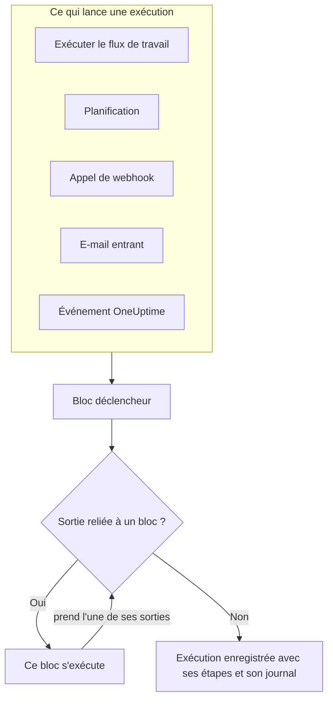
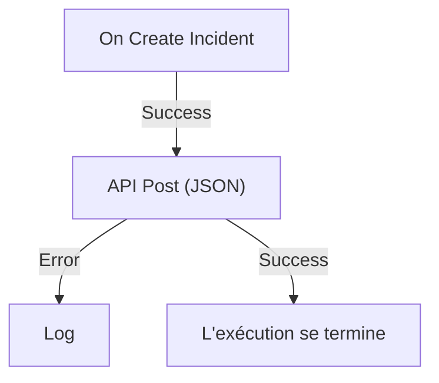

# Présentation des workflows

Les workflows automatisent le travail dans OneUptime sans code. Vous posez des blocs sur un canevas, vous les reliez, et le workflow s'exécute tout seul dès que son déclencheur se produit : un incident est créé, une planification arrive à échéance, un autre outil appelle une URL ou un e-mail arrive. Servez-vous-en pour relier OneUptime au reste de votre infrastructure et pour prendre en charge le suivi de routine pendant que vous traitez le problème lui-même.

:::cards
- [Créer un workflow](/docs/workflows/authoring): Créez un workflow, puis ajoutez, reliez et configurez ses blocs sur le canevas.
- [Déclencheurs](/docs/workflows/triggers): Démarrez un workflow à la main, selon une planification, depuis un webhook, un e-mail ou un événement OneUptime.
- [Composants](/docs/workflows/components): Tous les blocs que vous pouvez ajouter, des appels d'API aux enregistrements OneUptime.
- [Exécutions](/docs/workflows/runs-and-logs): Voyez ce que chaque exécution a fait, étape par étape.
:::

## Comment fonctionne un workflow

Tout workflow comporte trois parties :

1. **Un déclencheur** — ce qui démarre le workflow : une exécution à la main, une planification, un appel de webhook, un e-mail entrant ou un événement dans OneUptime, comme un nouvel incident. Chaque workflow en a exactement un.
2. **Des composants** — ce que fait le workflow : envoyer un message, appeler une API, vérifier une condition, créer ou modifier un enregistrement OneUptime.
3. **Des liaisons** — les lignes que vous tracez d'un bloc au suivant. Elles décident de ce qui s'exécute après quoi.

Quand le déclencheur se produit, OneUptime lance une **exécution**. Chaque bloc se termine en prenant l'une de ses sorties, par exemple **Success** ou **Error**, **Yes** ou **No**, et seuls les blocs reliés à cette sortie s'exécutent ensuite. Quand aucun bloc n'est relié à la sortie prise, ce chemin s'arrête là. L'exécution est enregistrée avec son statut, le chemin suivi et ce que chaque bloc a reçu et renvoyé.



Vous construisez tout cela visuellement, sur un canevas. La plupart des workflows ne demandent aucun code ; quand il en faut, un bloc **Run Custom JavaScript** exécute quelques lignes de JavaScript.

## Ce que vous pouvez faire avec les workflows

- **Relier OneUptime à vos autres outils** — publier dans Slack, Microsoft Teams, Discord, Telegram ou IRC, créer des tickets Jira, ou envoyer une requête à n'importe quelle API de votre infrastructure.
- **Réagir à ce qui se passe dans OneUptime** — à la création d'un incident, prévenir le bon canal et ouvrir un ticket automatiquement.
- **Exécuter des tâches selon une planification** — toutes les cinq minutes, chaque nuit, chaque lundi matin.
- **Recevoir des données de l'extérieur** — laisser d'autres systèmes démarrer un workflow en appelant son URL ou en écrivant à son adresse e-mail.
- **Réutiliser les automatisations courantes** — construisez-la une fois, puis démarrez-la depuis n'importe quel autre workflow avec un bloc **Execute Workflow**.

## Termes clés

| Terme                   | Ce que cela désigne                                                                                                  |
| ----------------------- | -------------------------------------------------------------------------------------------------------------------- |
| **Workflow**            | L'automatisation dans son ensemble : un nom, un canevas de blocs et un interrupteur pour l'activer ou la désactiver. |
| **Déclencheur**         | Le premier bloc. Il décide quand le workflow s'exécute. Chaque workflow en a exactement un.                          |
| **Composant**           | Tout autre bloc : il envoie un message, lance une requête, vérifie une condition ou modifie un enregistrement.        |
| **Sortie**              | Un point au bas d'un bloc, comme **Success** ou **Error**. Les lignes qui en partent mènent aux blocs suivants.       |
| **Exécution**           | Un passage du workflow, enregistré avec son statut, ses horodatages et ce que chaque bloc a fait.                    |
| **Variable globale**    | Une valeur, comme une clé d'API, que vous enregistrez une fois et utilisez dans n'importe quel workflow du projet.   |

## Avant de commencer

- **Un forfait qui inclut les workflows.** Sur OneUptime Cloud, les workflows demandent le forfait **Growth** ou supérieur, et chaque forfait autorise un certain nombre d'exécutions tous les 30 jours — voir [Limites du forfait](/docs/workflows/configuration#limites-du-forfait). Les installations auto-hébergées sans facturation n'ont aucune de ces limites.
- **L'autorisation de construire.** Créer et modifier des workflows demande **Workflow Admin**, **Project Admin** ou **Project Owner**, ou un rôle personnalisé avec les autorisations correspondantes. Un **Workflow Member** peut ouvrir les workflows et les exécuter à la main, mais pas les modifier. Voir [Autorisations](/docs/workflows/configuration#autorisations).

## Où trouver les workflows dans OneUptime

Ouvrez **Produits** dans la barre du haut et choisissez **Flux de travail**, sous **Tableaux de bord et automatisation**. Son menu contient :

- **Flux de travail** — la liste de vos workflows. Créez-en un ou ouvrez un workflow existant.
- **Variables globales** — les valeurs partagées par tous vos workflows.
- **Journaux → Exécutions** — l'historique des exécutions de tous les workflows de votre projet.
- **Paramètres → Règles d'étiquettes** et **Règles de propriétaire** — étiqueter les nouveaux workflows et leur attribuer des propriétaires automatiquement.
- **Avancé → Archivé** — les workflows que vous avez archivés. Ils ne s'exécutent jamais et n'apparaissent pas dans la liste ; désarchivez-les d'ici. Voir [Archiver un workflow](/docs/workflows/configuration#archiver-un-workflow).
- **Développeurs** — comment gérer les workflows avec Terraform, l'API ou un assistant IA.

Ouvrez un workflow en particulier, et son propre menu contient :

- **Vue d'ensemble** — le nom, la description, les étiquettes et l'interrupteur **Activé**.
- **Constructeur** — le canevas sur lequel vous concevez le workflow, avec l'interrupteur **Activé** en haut.
- **Variables de flux de travail** — les valeurs propres à ce seul workflow.
- **Journaux → Exécutions** — chaque exécution de ce workflow, avec ses détails.
- **Propriétaires** — les personnes et les équipes responsables du workflow.
- **Développeurs** — comment gérer ce workflow avec Terraform, l'API ou un assistant IA.
- **Paramètres** — dupliquer, exporter et archiver.

**Paramètres** se trouve dans la section **Avancé** du menu, avec **Journaux d'audit** et **Supprimer le flux de travail**. **Avancé** et **Développeurs** sont repliés au départ, dans ce menu comme dans tous les autres, pour que les pages que vous utilisez chaque jour viennent en premier. Cliquez sur le nom d'une section pour afficher ses pages. Elle s'ouvre d'elle-même dès que vous êtes sur l'une d'elles.

## Construire votre premier workflow

Tout workflow se construit de la même façon :

:::steps
1. **Créer** — choisissez un point de départ, puis donnez un nom à votre workflow. Voir [Créer un workflow](/docs/workflows/authoring).
2. **Choisir un déclencheur** — manuel, planifié, webhook, e-mail entrant ou événement OneUptime. Voir [Déclencheurs](/docs/workflows/triggers).
3. **Ajouter des composants** — posez des actions sur le canevas et reliez-les. Voir [Composants](/docs/workflows/components).
4. **L'activer** — basculez **Activé** en haut du **Constructeur**. Un workflow désactivé ne peut pas s'exécuter du tout, pas même à la main.
5. **Tester** — cliquez sur **Exécuter le flux de travail** dans le **Constructeur** et suivez l'exécution en direct.
:::

L'exemple ci-dessous suit ces étapes pour un vrai workflow.

## Exemple : envoyer les nouveaux incidents à un webhook

Ce workflow envoie un résumé JSON de chaque nouvel incident à une URL de votre choix — un outil de tickets, un entrepôt de données, tout ce qui accepte un webhook — et écrit la raison dans le journal de l'exécution quand la requête échoue.



> [!TIP]
> Le modèle **Forward new incidents to another system** construit ce même workflow pour vous. Vous le trouverez sous **Incidents** quand vous créez un workflow.

:::steps
### Créer le workflow

Ouvrez **Flux de travail** et cliquez sur **Créer un flux de travail**. Cliquez sur **Partir de zéro**, nommez le workflow `Send new incidents to a webhook`, puis cliquez sur **Créer un flux de travail**.

Le nouveau workflow s'ouvre dans le **Constructeur**, désactivé.

### Ajouter le déclencheur

Cliquez sur le bloc en pointillés **Choisissez ce qui démarre ce flux de travail**, puis cliquez sur **On Create Incident** sous **Popular** dans le panneau **Add Trigger**.

Le déclencheur prend la place du bloc en pointillés. L'ID qui y figure, `incident-on-create-1`, est le nom par lequel les blocs suivants s'y réfèrent.

### Choisir les champs de l'incident

Cliquez sur le déclencheur. Dans **Select Fields**, cochez les champs que la requête doit transporter, comme le titre et la description, puis cliquez sur **Enregistrer**.

Le déclencheur transmet le nouvel incident avec ces champs. Un champ que vous ne sélectionnez pas arrive vide.

### Ajouter le bloc API

Cliquez sur **Ajouter un composant**, puis sur **API Post (JSON)** sous **Popular**. Faites glisser depuis le point **Success** du déclencheur jusqu'au point supérieur du nouveau bloc.

### Remplir la requête

Cliquez sur le bloc API, qui affiche **Click to set up**. Saisissez votre point de terminaison dans **URL**. Dans **Request Body**, écrivez le JSON à envoyer, en utilisant **{ }** pour insérer les champs de l'incident là où vous en avez besoin, puis cliquez sur **Enregistrer**.

```json title="Request Body"
{
  "id": "{{local.components.incident-on-create-1.returnValues.model._id}}",
  "title": "{{local.components.incident-on-create-1.returnValues.model.title}}",
  "description": "{{local.components.incident-on-create-1.returnValues.model.description}}"
}
```

Chaque référence `{{…}}` est remplacée par la valeur de l'incident quand le workflow s'exécute. La syntaxe est décrite dans [Variables](/docs/workflows/variables).

### Intercepter les échecs

Cliquez sur **Ajouter un composant**, puis sur **Journal**. Reliez-y le point **Error** du bloc API, puis réglez la **Value** du bloc Log sur `Could not send the incident: {{local.components.api-post-1.returnValues.error}}`.

Une requête qui échoue — une URL injoignable, ou une réponse qui n'est pas en 2xx — prend désormais ce chemin, et le journal de l'exécution dit pourquoi.

### L'activer

Basculez **Activé** en haut du **Constructeur**.

### Le tester

Cliquez sur **Exécuter le flux de travail**, saisissez l'**ID d'incident** d'un incident de ce projet, cliquez sur **Run Workflow Manually** et confirmez avec **Run**.

Un panneau **Exécution du flux de travail** s'ouvre et suit l'exécution. Ouvrez l'étape **API Post (JSON)** pour voir le corps qu'elle a envoyé et la réponse qu'elle a reçue.
:::

Désormais, chaque nouvel incident du projet lance une exécution. Vous les retrouvez toutes dans les [Exécutions](/docs/workflows/runs-and-logs) du workflow.

> [!NOTE]
> La requête part de OneUptime. Sur OneUptime Cloud, l'URL doit être joignable depuis Internet. Une installation auto-hébergée refuse les adresses de réseau privé, sauf si un administrateur les autorise — voir [Accès réseau sortant](/docs/workflows/configuration#accès-réseau-sortant).

## Comment les workflows s'intègrent au reste de OneUptime

- Les **moniteurs** repèrent le problème. Les **incidents** et les **alertes** l'enregistrent. Les **workflows** y réagissent.
- Les **runbooks** sont des procédures de réponse que votre équipe déroule lors d'un incident, d'une alerte ou d'une maintenance : étapes manuelles, approbations et scripts, avec des personnes dans la boucle. Les workflows s'exécutent sans surveillance. Utilisez un [runbook](/docs/runbooks/index) quand une personne doit prendre des décisions en cours de route, et un workflow quand chaque étape est automatique.
- Les **connexions d'espace de travail** relient un projet à Slack et à Microsoft Teams pour les canaux d'incident et les notifications. Les blocs Slack et Microsoft Teams des workflows ne s'en servent pas : chaque bloc publie via sa propre URL de webhook entrant.

## Étapes suivantes

:::cards
- [Créer un workflow](/docs/workflows/authoring): Travaillez avec le canevas, les blocs et leurs paramètres.
- [Variables](/docs/workflows/variables): Transmettez des données entre les blocs et gardez les secrets hors de vos workflows.
- [Configuration et sécurité](/docs/workflows/configuration): Autorisations, limites et sécurité avant la mise en production.
:::
