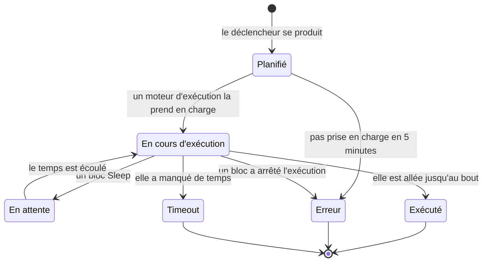

# Exécutions de workflow

Chaque fois qu'un workflow s'exécute, OneUptime enregistre ce qui s'est passé — quand il s'est exécuté, s'il a réussi, et ce que chaque bloc a reçu et renvoyé. Cet enregistrement s'appelle une **exécution**. Les exécutions vous permettent de confirmer qu'un workflow a fonctionné, de déboguer celui qui n'a pas fonctionné et de revenir sur l'activité passée.

:::cards
- [Statuts d'exécution](#statuts-dexécution): Ce que signifient Planifié, En attente, Exécuté et les autres statuts.
- [Lire une exécution](#lire-une-exécution): Suivez le chemin pris par une exécution, bloc par bloc.
- [Dépannage](#dépannage): Un workflow qui ne s'est pas exécuté, un bloc qui n'a jamais tourné, une valeur arrivée vide.
:::

## Où les trouver

| Page                                                 | Ce que vous voyez                                                                                          |
| ---------------------------------------------------- | ---------------------------------------------------------------------------------------------------------- |
| **Flux de travail → Journaux → Exécutions** (menu Flux de travail) | Chaque exécution de chaque workflow du projet. Filtrez par nom de workflow, statut et date.  |
| **Flux de travail → Journaux → Exécutions** (menu d'un workflow) | Uniquement les exécutions de ce workflow. Celle-ci a un filtre **ID d'exécution** au lieu d'un filtre de workflow. |
| **Une exécution précise**                            | Ouverte avec le bouton **Voir les journaux** sur la ligne d'une exécution — les lignes elles-mêmes ne sont pas cliquables. |

Lancer une exécution depuis le **Constructeur** ouvre la même vue **Exécution du flux de travail**, qui suit déjà l'exécution : vous la regardez se dérouler au lieu de la chercher ensuite.

## Statuts d'exécution

| Statut                              | Ce que cela signifie                                                                                                                                                                                                                                                  |
| ----------------------------------- | --------------------------------------------------------------------------------------------------------------------------------------------------------------------------------------------------------------------------------------------------------------------- |
| **Planifié**                        | Le déclencheur s'est produit et l'exécution attend un moteur d'exécution dans la file. En général une fraction de seconde. Une exécution toujours planifiée au bout de 5 minutes échoue : rien ne l'a prise en charge.                                                |
| **En cours d'exécution**            | Le workflow est en cours.                                                                                                                                                                                                                                             |
| **En attente**                      | L'exécution est garée sur un bloc **Sleep** et reprendra d'elle-même. Elle n'occupe aucun worker pendant l'attente.                                                                                                                                                   |
| **Exécuté**                         | L'exécution est allée jusqu'au bout sans échouer. C'est le statut de réussite : la pastille indique **Exécuté**, pas « Réussite ».                                                                                                                                    |
| **Erreur**                          | Un bloc a arrêté l'exécution. Ce statut sert aussi quand une exécution en file n'est jamais prise en charge, quand la reprise d'une exécution endormie se perd, quand une expression de planification ne peut pas être résolue, et quand le workflow a été désactivé ou archivé pendant que l'exécution attendait sur un bloc **Sleep**. |
| **Timeout**                         | L'exécution a duré plus longtemps que permis : 2 minutes par défaut. Voir [Combien de temps peut durer une exécution](/docs/workflows/configuration#combien-de-temps-peut-durer-une-exécution).                                                                                          |
| **Execution Exceeded Current Plan** | Le projet a utilisé toutes ses exécutions de workflow des 30 derniers jours, ou l'abonnement est impayé. L'exécution est enregistrée mais pas exécutée. OneUptime Cloud uniquement.                                                                                  |

Un bloc qui prend sa sortie **Error** — un bloc API qui a reçu une réponse 4xx, par exemple — ne fait pas échouer l'exécution. Les blocs reliés à **Error** s'exécutent, et l'exécution se termine quand même avec **Exécuté**. L'étape elle-même est dessinée en rouge, pour que vous la trouviez.

## Lire une exécution

Cliquez sur **Voir les journaux** sur une exécution pour l'ouvrir. La vue **Exécution du flux de travail** a deux onglets, **Étapes** et **Full Log**.

### L'onglet Étapes

Le chemin suivi par l'exécution, une carte numérotée par bloc, dans l'ordre où ils se sont exécutés. Sans rien ouvrir, chaque carte montre :

- Le titre et l'ID du bloc, s'il a **Réussi** ou est en **Échec**, et combien de temps il a pris.
- La sortie qu'il a prise, nommée comme sur le canevas, et où elle a mené : le numéro et le nom de l'étape suivante, ou une note indiquant que rien n'y est relié, si bien que l'exécution ou cette branche s'est arrêtée là. Une étape vers laquelle elle a mené mais qui ne s'est jamais exécutée indique **(did not run)**. La sortie Error est dessinée en rouge ; Yes et No indiquent simplement le chemin suivi. Survolez le nom de la sortie pour savoir ce qu'il signifie.
- L'erreur de l'étape, si elle a échoué, et tout avertissement la concernant — par exemple une référence `{{…}}` qui ne s'est résolue en rien.

Ouvrez une carte pour deux blocs de détails :

| Bloc         | Ce qu'il montre                                                                                                                                                                                                 |
| ------------ | --------------------------------------------------------------------------------------------------------------------------------------------------------------------------------------------------------------- |
| **Received** | Les paramètres que le bloc a reçus, par nom et dans l'ordre de sa liste de paramètres, après le remplissage de toutes les variables. Un paramètre qui fait référence à une autre étape ou à une variable montre la référence à côté de la valeur qu'elle est devenue, et **Non résolu** quand elle n'est devenue rien. |
| **Returned** | Ce qu'il a produit, avec l'ID de chaque valeur (la dernière partie d'une référence `returnValues`). Les listes et les objets sont affichés en retrait.                                                         |

Les étapes en échec, les étapes avec un avertissement et l'unique étape d'une exécution sont ouvertes d'emblée. Le compteur de l'onglet **Étapes** devient rouge quand quelque chose a échoué et orange quand une étape a un avertissement.

Quelques exécutions se lisent différemment :

- **Un test d'une seule étape.** Une exécution lancée avec **Run just this step** indique **Seule cette étape s'est exécutée** en haut. Les étapes précédentes ne se sont pas exécutées : les valeurs qu'elle y lit manquent donc (attendez-vous à un avertissement **Non résolu** pour celles-ci), et les étapes suivantes indiquent **(not run in this test)**. Utilisez **Exécuter le flux de travail** pour essayer tout le chemin.
- **Une exécution arrêtée entre deux étapes.** Si l'exécution s'est arrêtée pour une raison qu'aucune étape n'explique — elle a dépassé son délai entre deux étapes, ou a échoué avant sa première étape —, le chemin se termine par **The run stopped here** et la raison.
- **Une exécution endormie.** Une exécution qui attend sur un bloc **Sleep** se termine par **Sleeping** et l'heure à laquelle elle reprendra d'elle-même ; les étapes après le Sleep indiquent **(not run yet)**.

L'ID sous le titre de chaque étape est exactement ce qui va dans une référence `{{local.components.<id>.returnValues.…}}`, ce qui en fait le moyen le plus rapide d'écrire une référence correcte.

Les valeurs affichées sont ce que le bloc a reçu, après le remplissage des variables et avant que le bloc en fasse quoi que ce soit, avec deux exceptions : les secrets et les champs que le bloc marque comme sensibles sont masqués, et une valeur de plus de 4 000 caractères est raccourcie avec "… (truncated)". Une exécution garde ses 100 dernières étapes ; une exécution longue ou souvent reprise affiche une note orange là où les plus anciennes ont été retirées. Les exécutions enregistrées avant que les noms des sorties soient conservés montrent la sortie par son ID, sans indiquer où elle a mené.

### L'onglet Full Log

Le journal brut, ligne par ligne, écrit par le moteur d'exécution, y compris tout ce que les blocs ont journalisé eux-mêmes, comme la valeur d'un bloc **Log** ou le `console.log` d'un script. Utilisez-le quand l'onglet Étapes n'explique pas l'échec.

## Copier et télécharger une exécution

En haut de la vue **Exécution du flux de travail**, à côté de son bouton de fermeture, **Copier le journal** place tout le **Full Log** dans votre presse-papiers, prêt à être collé dans une discussion ou un ticket. **Télécharger** enregistre l'exécution dans un fichier :

| Téléchargement                     | Ce que vous obtenez                                                                                                                                                                                                                    |
| ---------------------------------- | -------------------------------------------------------------------------------------------------------------------------------------------------------------------------------------------------------------------------------------- |
| **Télécharger le journal**         | Un fichier `.txt` avec le journal complet exactement tel que le moteur d'exécution l'a écrit, quelle que soit sa longueur, sous un court en-tête : le nom et l'ID du workflow, l'ID de l'exécution, son statut, et les moments où elle a été planifiée, a démarré et s'est terminée. |
| **Télécharger l'exécution en JSON** | Un fichier `.json` avec les mêmes informations sous forme de données, les étapes que montre l'onglet **Étapes** (ce que chacune a reçu et renvoyé, et la sortie qu'elle a prise), et le journal sous forme de liste de lignes. Les étapes ont la même forme que le `stepTrace` d'une exécution renvoyé par l'API et, comme l'onglet **Étapes**, ce sont les 100 dernières de l'exécution. Le journal est toujours complet. |

Les deux mêmes téléchargements se trouvent dans le menu **⋯** de chaque exécution, dans les deux listes d'exécutions : vous pouvez donc enregistrer une exécution sans l'ouvrir. Une exécution lancée depuis le **Constructeur** peut être copiée ou téléchargée pendant qu'elle est encore en cours ; vous obtenez ce qu'elle a journalisé jusque-là.

Les fichiers portent le nom du workflow, de l'exécution et de son heure de début, en UTC, si bien qu'un dossier de ces fichiers se trie par workflow puis par heure : `nightly-sync-run-<run id>-2026-09-30T10-00-01.txt`.

Un téléchargement ne contient rien que vous ne pourriez déjà lire dans l'exécution. Les secrets et les champs qu'un bloc marque comme sensibles sont masqués au moment où l'exécution est enregistrée : ils le sont donc aussi dans le fichier, et toute personne qui peut ouvrir une exécution peut la télécharger.

## Dépannage

:::details Mon workflow ne s'est pas exécuté
1. Assurez-vous que le workflow est **Activé** : l'interrupteur se trouve en haut de son **Constructeur**, qui l'indique au-dessus du canevas quand le workflow est désactivé. Les nouveaux workflows démarrent désactivés, et un workflow désactivé refuse toutes les exécutions — y compris manuelles. Un appel de webhook vers lui reçoit HTTP 400 avec un message expliquant comment l'activer.
2. Pour un déclencheur d'événement OneUptime, vérifiez que l'événement a bien eu lieu : ouvrez l'enregistrement et consultez son historique. Un déclencheur **On Update** avec **Listen on** ne se produit que si l'un de ces champs a changé.
3. Pour un déclencheur webhook, vérifiez que l'autre système envoie bien vers la bonne URL. La plupart des outils journalisent l'envoi d'un webhook — regardez-y.
4. Pour un déclencheur de planification, vérifiez que l'expression cron correspond à l'heure attendue. Les planifications s'exécutent en UTC.

Si l'exécution apparaît, avec le statut **Execution Exceeded Current Plan**, le projet a utilisé toutes ses exécutions de workflow des 30 derniers jours, ou l'abonnement est impayé. Le journal de l'exécution indique le décompte et la limite de votre forfait. Cela ne concerne que OneUptime Cloud.
:::

:::details Un bloc suivant ne s'est jamais exécuté
Un bloc qui ne s'exécute pas révèle en général un problème de liaison. Ouvrez le **Constructeur** et vérifiez :

- La sortie du bloc précédent est-elle reliée à l'entrée de ce bloc ?
- Le bloc précédent a-t-il pris une autre sortie que celle attendue — **Error** au lieu de **Success**, ou **No** au lieu de **Yes** ? L'onglet **Étapes** indique quelle sortie il a prise et où elle a mené, ou que rien n'y est relié.
:::

:::details Une valeur est arrivée vide, ou sous forme de texte {{…}}
Ouvrez l'exécution et regardez l'étape. Une référence qui ne s'est pas résolue est signalée sur l'étape elle-même par un avertissement, et son paramètre dans le bloc **Received** est marqué **Non résolu**.

- Si vous voyez le texte littéral `{{local.components.…}}`, la référence ne s'est pas résolue. C'est en général une faute de frappe dans l'ID du composant ou dans l'ID de la valeur de retour — rappelez-vous qu'il s'agit de l'**Identifiant** du bloc, pas du nom affiché dessus. Vérifiez aussi l'orthographe de `local.components` lui-même : `{{local.componets.api-get-1.returnValues.response-body}}` est envoyé comme texte littéral et l'exécution indique quand même **Exécuté**. Si l'exécution était un test **Run just this step**, le bloc précédent ne s'est pas exécuté du tout — exécutez plutôt tout le workflow.
- Si vous voyez **Texte vide**, le bloc précédent s'est exécuté mais n'a pas produit ce champ.

Le même avertissement figure dans l'onglet **Full Log**, sur une ligne qui commence par `Warning:`.
:::

:::details Ça fonctionne quand je l'exécute à la main, mais pas depuis le déclencheur
Ouvrez le **Constructeur**, cliquez sur **Exécuter le flux de travail** et remplissez les champs du déclencheur avec des valeurs qui ressemblent à ce qu'envoie le vrai déclencheur. Comparez ensuite les valeurs **Received** de cette exécution avec celles de la vraie exécution, côte à côte. La différence tient en général à un seul nom ou type de champ.
:::

## Réexécuter un workflow

Il n'y a pas de bouton « réessayer cette exécution ». Les anciennes exécutions ne sont jamais réexécutées automatiquement, car leurs effets de bord — messages Slack, appels d'API, tickets — ne sont pas forcément sûrs à répéter. Pour refaire le travail, corrigez le workflow et laissez le prochain vrai déclencheur le lancer, ou ouvrez le **Constructeur** et cliquez sur **Exécuter le flux de travail** avec les mêmes valeurs.

## Combien de temps les exécutions sont-elles conservées ?

Sur OneUptime Cloud, les exécutions sont conservées **30 jours** puis supprimées — c'est pourquoi les deux listes d'exécutions indiquent qu'elles couvrent les 30 derniers jours. Les installations auto-hébergées conservent les exécutions jusqu'à ce que vous les supprimiez ; si un workflow s'exécute très souvent et encombre votre historique, désactivez-le ou supprimez-le.

Les exécutions enregistrées avant l'ajout du suivi des étapes n'ont pas de contenu dans **Étapes** et ne montrent que leur **Full Log**.

## Étapes suivantes

:::cards
- [Configuration et sécurité](/docs/workflows/configuration): Délais, limites du forfait et ce qui est masqué dans les journaux.
- [Variables](/docs/workflows/variables): La syntaxe des références qu'utilisent vos blocs.
- [Composants](/docs/workflows/components): Ce que renvoie chaque bloc et quand il prend chaque sortie.
:::
