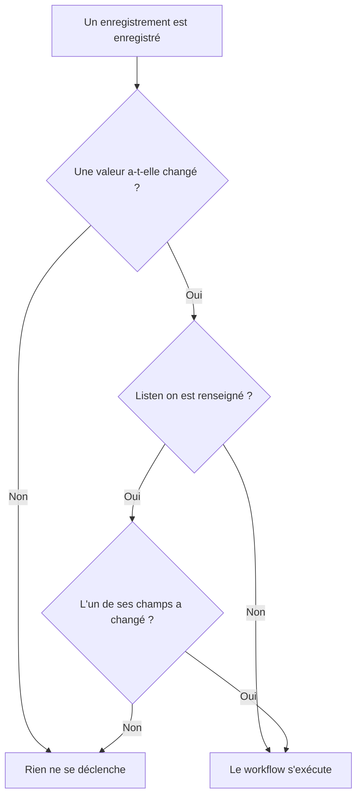

# Déclencheurs de workflow

Un déclencheur est le premier bloc d'un workflow : il décide quand le workflow s'exécute. Chaque workflow a exactement un déclencheur. Vous avez le choix entre cinq types.

:::cards
- [Manuel](#manual): Démarrez le workflow depuis le Constructeur, ou depuis un autre workflow.
- [Planification](#schedule): Exécutez-le selon une planification récurrente, écrite sous forme d'expression cron.
- [Webhook](#webhook): Laissez un autre système le démarrer en appelant une URL.
- [E-mail entrant](#incoming-email): Démarrez-le à chaque e-mail envoyé à sa propre adresse.
- [Déclencheurs d'événements OneUptime](#déclencheurs-dévénements-oneuptime): Réagissez quand un enregistrement est créé, modifié ou supprimé.
:::

Pour ajouter le déclencheur, cliquez sur le bloc en pointillés **Choisissez ce qui démarre ce flux de travail** sur le canevas d'un nouveau workflow. Pour le changer, supprimez le bloc déclencheur : le bloc en pointillés revient. Voir [Créer un workflow](/docs/workflows/authoring#ajouter-des-blocs).

## Quel déclencheur choisir ?

| Si vous voulez…                               | Choisissez                  |
| --------------------------------------------- | --------------------------- |
| Cliquer sur un bouton pour exécuter le workflow | **Manuel**                |
| L'exécuter selon une planification récurrente | **Planification**           |
| Qu'un autre système y envoie des données      | **Webhook**                 |
| Le démarrer à partir d'un e-mail              | **Incoming Email**          |
| Réagir à quelque chose dans OneUptime         | **Événement OneUptime**     |

Un workflow ne peut avoir qu'un seul déclencheur. S'il vous faut deux façons de démarrer la même automatisation, construisez la logique commune dans un workflow avec un déclencheur **Manuel**, et démarrez-la depuis deux workflows « enveloppes » légers avec un bloc **Execute Workflow**.

## Manual

Exécutez le workflow à la demande : cliquez sur **Exécuter le flux de travail** sur la page **Constructeur**, remplissez le **JSON** du déclencheur, cliquez sur **Run Workflow Manually** et confirmez avec **Run**. Un autre workflow peut aussi le démarrer, avec un bloc **Execute Workflow**.

Idéal pour : les automatisations en un clic pour lesquelles vous voulez un bouton, comme « faire tourner cette clé » ou « envoyer une alerte de test », et la logique que vous partagez entre workflows.

**Returns** : **JSON** — ce avec quoi l'exécution a été lancée.

- Depuis **Exécuter le flux de travail**, c'est le JSON que vous avez tapé, sous forme de texte. Pour en lire un champ, faites-le d'abord passer par un bloc **Text to JSON**.
- Depuis un bloc **Execute Workflow**, chaque clé des **Arguments** du bloc devient une valeur à part entière. Avec `{"customerId": "42"}`, un bloc suivant lit `{{local.components.manual-1.returnValues.customerId}}`, où `manual-1` est l'ID du déclencheur Manual.

## Schedule

Exécutez le workflow selon une planification récurrente. Indiquez la fréquence dans **Schedule at** : choisissez l'une des **Planifications courantes**, écrivez une expression **Cron personnalisé**, ou choisissez une **Variable** qui en contient une. Sous le champ, la planification est décrite en toutes lettres avec ses **Prochaines exécutions**.

Idéal pour : le nettoyage nocturne, la synchronisation horaire, les rapports hebdomadaires.

Les heures sont en UTC : convertissez depuis votre propre fuseau horaire quand vous choisissez l'heure. Les cinq parties d'une expression cron sont la minute, l'heure, le jour du mois, le mois et le jour de la semaine :

| Expression    | S'exécute                              |
| ------------- | -------------------------------------- |
| `*/5 * * * *` | Toutes les 5 minutes.                  |
| `0 * * * *`   | Toutes les heures, à l'heure pile.     |
| `0 0 * * *`   | Tous les jours à minuit UTC.           |
| `0 9 * * 1-5` | Tous les jours ouvrés à 9:00 UTC.      |
| `0 9 * * 1`   | Tous les lundis à 9:00 UTC.            |

Rien n'est planifié tant que le workflow est désactivé. Une planification **Variable** lit une variable de workflow ou une variable globale, comme `{{local.variables.schedule}}`. Si elle ne donne pas une expression cron valide, le workflow n'est pas planifié, et une exécution en échec dans sa liste d'exécutions explique pourquoi.

Pour tester le workflow sans attendre la planification, cliquez sur **Exécuter le flux de travail** dans le **Constructeur** : une exécution démarre aussitôt.

## Webhook

OneUptime donne au workflow une URL qui lui est propre. Tout ce qui appelle cette URL démarre le workflow, en lui transmettant les en-têtes, les paramètres de requête et le corps de la requête.

Idéal pour : recevoir dans OneUptime des données d'un autre outil — les rappels de CI/CD, les alertes d'une autre supervision, les inscriptions de votre CRM.

Pour obtenir l'URL, cliquez sur le déclencheur Webhook sur le canevas. L'URL figure en haut de ses paramètres, avec un bouton **Copier l'URL**, les méthodes qu'elle accepte et une commande `curl` à coller dans un terminal pour l'essayer :

```bash
curl -X POST "https://oneuptime.example.com/workflow/trigger/<secret key>" \
  -H "Content-Type: application/json" \
  -d '{"message": "Hello"}'
```

L'URL accepte à la fois `GET` et `POST`. L'appelant reçoit un accusé de réception immédiat, `{"status": "Scheduled"}` — le workflow lui-même s'exécute en arrière-plan, si bien que l'appelant ne voit jamais ce qu'il fait. Un appel à un workflow désactivé ou archivé est refusé avec HTTP 400 et la raison.

```mermaid title="Ce qui se passe quand quelque chose appelle l'URL du webhook"
sequenceDiagram
    participant Caller as Votre outil
    participant OneUptime
    participant Runner as Moteur d'exécution des workflows
    Caller->>OneUptime: GET ou POST vers l'URL du webhook
    alt Le workflow est activé
        OneUptime-->>Caller: 200, statut Scheduled
        OneUptime->>Runner: Met en file une exécution avec en-têtes, requête et corps
        Runner->>Runner: Exécute les blocs qui suivent le déclencheur
    else Le workflow est désactivé ou archivé
        OneUptime-->>Caller: 400 avec la raison
    end
```

**Returns** :

| Valeur                   | Ce qu'elle contient                                                                                                     |
| ------------------------ | ----------------------------------------------------------------------------------------------------------------------- |
| **Request Headers**      | Chaque en-tête de la requête, par son nom en minuscules, comme `content-type`.                                          |
| **Request Query Params** | Les paramètres de la chaîne de requête de l'URL, par leur nom.                                                          |
| **Request Body**         | Le corps envoyé par l'appelant. Un corps JSON, envoyé avec `Content-Type: application/json`, se lit champ par champ.   |

Lisez un champ en ajoutant son nom à la référence, comme dans `{{local.components.webhook-1.returnValues.request-body.message}}`.

Une fois qu'une requête est arrivée, le sélecteur de valeurs de chaque bloc qui suit le déclencheur sait ce qu'elle contenait : il liste les champs du corps, les en-têtes et les paramètres de requête, chacun avec son contenu, pour que vous puissiez choisir `incident.title` au lieu de taper un chemin. D'ici là, il indique qu'aucune requête n'est arrivée et propose **Copy test request**, une commande `curl` pour l'URL ; les champs apparaissent dès que l'exécution lancée par cette requête est terminée. Voir [Utiliser des valeurs des blocs précédents](/docs/workflows/authoring#utiliser-des-valeurs-des-blocs-précédents).

Pour tester le workflow sans l'autre outil, cliquez sur **Exécuter le flux de travail** dans le **Constructeur** et saisissez des en-têtes, des paramètres de requête et un corps.

### Gardez l'URL privée

La dernière partie de l'URL est la clé secrète du workflow, et quiconque possède l'URL peut démarrer le workflow. La clé est donc masquée tant que vous ne cliquez pas sur **Afficher**, et **Copier l'URL** copie l'URL complète sans l'afficher.

Si l'URL fuite, cliquez sur **Réinitialiser l'URL** au même endroit : le workflow reçoit une nouvelle URL et l'ancienne cesse de fonctionner immédiatement ; mettez donc à jour tout ce qui l'appelle. Seules les personnes qui peuvent modifier le workflow peuvent voir ou réinitialiser son URL — voir [Sécurité des webhooks](/docs/workflows/configuration#sécurité-des-webhooks).

> [!WARNING]
> Traitez l'URL comme un mot de passe. Quiconque la possède peut démarrer votre workflow, sans se connecter.

## Incoming Email

OneUptime donne au workflow une adresse e-mail qui lui est propre. Chaque e-mail envoyé à cette adresse démarre le workflow, en lui transmettant l'e-mail : qui l'a envoyé, à qui il était destiné, l'objet, le texte et le HTML, les en-têtes et le nom des pièces jointes.

Idéal pour : agir sur les e-mails de systèmes qui ne savent pas appeler un webhook — les alertes d'anciens outils de supervision, les avis d'état d'un fournisseur, le rapport qu'une tâche nocturne envoie par e-mail.

Pour obtenir l'adresse, cliquez sur le déclencheur Incoming Email sur le canevas. L'adresse figure en haut de ses paramètres, avec un bouton **Copier l'adresse**. Donnez-la à ce qui doit démarrer le workflow : un outil qui ne sait qu'envoyer des e-mails, les paramètres de notification d'un fournisseur, ou une règle de transfert dans votre propre boîte aux lettres.

Chaque e-mail lance sa propre exécution. L'e-mail atteint le workflow que l'adresse figure en À ou en Cc, en copie cachée, ou qu'il passe par une règle de transfert. Un e-mail qui nomme l'adresse deux fois lance une seule exécution.

**Returns** :

| Valeur          | Ce qu'elle contient                                                                                      |
| --------------- | -------------------------------------------------------------------------------------------------------- |
| **From**        | L'adresse de l'expéditeur.                                                                               |
| **To**          | Tous les destinataires de l'e-mail, sur une seule ligne, comme `ops@example.com, oncall@example.com`.    |
| **CC**          | Tous les destinataires en copie, sur une seule ligne.                                                    |
| **Subject**     | La ligne d'objet.                                                                                        |
| **Body**        | Le texte brut de l'e-mail.                                                                               |
| **HTML Body**   | Le HTML de l'e-mail, s'il en a. Body et HTML Body sont chacun coupés à 1 MB.                             |
| **Headers**     | Chaque en-tête de l'e-mail, par son nom en minuscules, comme `message-id`.                               |
| **Attachments** | Le nom, le type et la taille de chaque fichier joint. Les fichiers eux-mêmes ne sont pas conservés.      |
| **Received At** | Le moment où OneUptime a reçu l'e-mail.                                                                  |

Une fois qu'un e-mail est arrivé, le sélecteur de valeurs de chaque bloc qui suit le déclencheur sait ce qu'il contenait : il liste chaque en-tête et chaque pièce jointe de l'e-mail, avec son contenu, pour que vous puissiez choisir `headers.message-id` au lieu de taper un chemin. D'ici là, il indique qu'aucun e-mail n'a encore atteint l'adresse. Voir [Utiliser des valeurs des blocs précédents](/docs/workflows/authoring#utiliser-des-valeurs-des-blocs-précédents).

Pour essayer le workflow sans envoyer d'e-mail, cliquez sur **Exécuter le flux de travail** sur la page **Constructeur** et renseignez un expéditeur, un objet et un corps. Les valeurs que vous laissez de côté arrivent vides.

Les e-mails ne démarrent le workflow que s'il est activé. Un e-mail adressé à un workflow désactivé est ignoré, de même qu'un e-mail adressé à un workflow dont le déclencheur n'est plus Incoming Email.

### Gardez l'adresse privée

La partie de l'adresse avant le `@` contient la clé secrète du workflow, et quiconque possède l'adresse peut démarrer le workflow. La clé est donc masquée tant que vous ne cliquez pas sur **Afficher**, et **Copier l'adresse** copie l'adresse complète sans l'afficher.

Si l'adresse fuite, cliquez sur **Réinitialiser l'adresse** au même endroit : le workflow reçoit une nouvelle adresse, et les e-mails envoyés à l'ancienne sont ignorés à partir de ce moment ; donnez donc la nouvelle à tout ce qui écrit au workflow. Seules les personnes qui peuvent modifier le workflow peuvent voir ou réinitialiser son adresse — voir [Sécurité des e-mails entrants](/docs/workflows/configuration#sécurité-des-e-mails-entrants).

> [!WARNING]
> N'importe qui peut mettre n'importe quel expéditeur sur un e-mail : **From** ne prouve donc pas qui l'a envoyé. Vérifiez une information que seul le véritable expéditeur connaît avant qu'une étape fasse quoi que ce soit d'important.

> [!NOTE]
> Sur une installation auto-hébergée, OneUptime reçoit les e-mails via un fournisseur d'e-mails entrants que votre administrateur configure — voir [E-mails entrants SendGrid](/docs/self-hosted/sendgrid-inbound-email). D'ici là, le déclencheur n'a pas d'adresse, et ses paramètres l'indiquent.

## Déclencheurs d'événements OneUptime

Presque tout ce qui existe dans OneUptime — moniteurs, incidents, alertes, événements de maintenance planifiée, pages de statut, politiques d'astreinte, équipes — peut déclencher un workflow. Chacun propose jusqu'à trois événements :

- **On Create** — se produit quand un nouvel élément est ajouté.
- **On Update** — se produit quand un élément est modifié. Enregistrer un enregistrement avec les valeurs qu'il a déjà, comme un formulaire enregistré sans modification ou un interrupteur envoyé dans la position où il est déjà, n'est pas un changement et ne le déclenche pas.
- **On Delete** — se produit quand un élément est supprimé.

C'est ainsi que vous construisez « quand X se produit dans OneUptime, faire Y » sans avoir à vérifier en boucle.

**On Update** peut être restreint à certains champs avec **Listen on** : il ne se produit alors que lorsqu'une modification change l'un d'eux, vers n'importe quelle valeur — désactiver un interrupteur ou vider un champ compte.



**On Create** et **On Update** transmettent l'enregistrement au bloc suivant, avec les champs que vous choisissez dans le **Select Fields** du déclencheur. Par exemple, le déclencheur **Incident → On Create** transmet le nouvel incident : le bloc suivant peut lire son titre, sa description, sa gravité ou tout autre champ sélectionné, comme `{{local.components.incident-on-create-1.returnValues.model.title}}`. Un champ que vous n'avez pas sélectionné arrive vide.

**On Delete** ne transmet que l'ID de l'enregistrement supprimé : l'enregistrement n'existe plus quand le workflow s'exécute, ses autres champs ne peuvent donc pas être lus.

Pour tester un déclencheur d'événement sans attendre l'événement, cliquez sur **Exécuter le flux de travail** dans le **Constructeur** et saisissez l'ID d'un enregistrement existant, comme un **ID d'incident**. L'exécution lit cet enregistrement avec les champs que vous avez sélectionnés.

### Les événements les plus utilisés

| Ressource                                  | Ce que les équipes en font                                                                  |
| ------------------------------------------ | ------------------------------------------------------------------------------------------- |
| **Incident**                               | Réagir quand un incident est déclaré, modifié (pris en compte, résolu) ou supprimé.         |
| **Alerte**                                 | Les trois mêmes événements, pour les alertes.                                               |
| **Moniteur**                               | Réagir quand un moniteur est ajouté, modifié ou retiré.                                     |
| **Événement de maintenance planifiée**     | Annoncer automatiquement une fenêtre de maintenance dès qu'elle est planifiée.              |
| **Abonné à la page de statut**             | Souhaiter la bienvenue à quelqu'un qui s'abonne à une page de statut.                       |
| **Politique d'astreinte**                  | Synchroniser les modifications de politique avec un autre système de planning.              |

Dans le panneau **Add Trigger**, ils se trouvent sous **Ressources OneUptime** : cliquez sur la ressource, puis sur le déclencheur. **Parcourir toutes les ressources** les contient tous, et le champ de recherche trouve un déclencheur à partir de quelques mots, comme `incident created`.

## Étapes suivantes

:::cards
- [Composants](/docs/workflows/components): Les actions que vous ajoutez après le déclencheur.
- [Variables](/docs/workflows/variables): Lisez dans les blocs suivants ce que le déclencheur a transmis.
- [Exécutions](/docs/workflows/runs-and-logs): Vérifiez que votre déclencheur s'est produit, et ce qu'il a apporté.
:::
